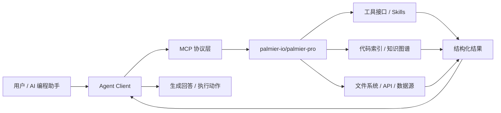
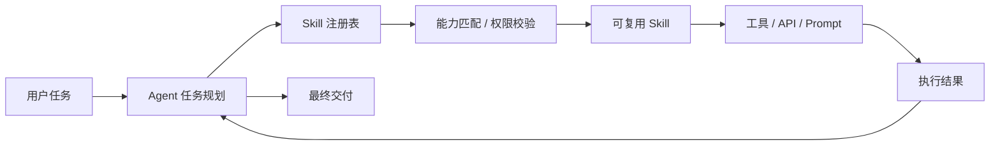
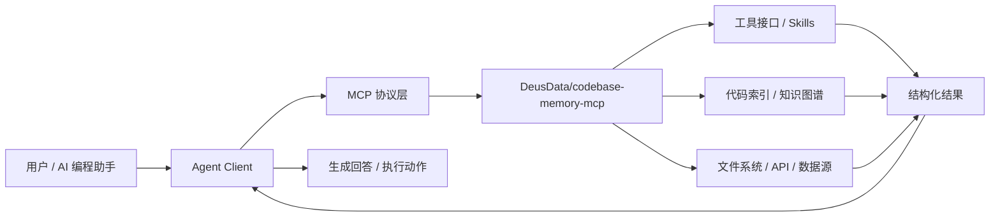
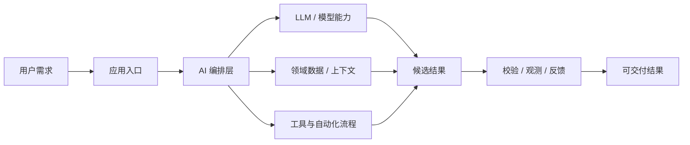

# GitHub AI Daily Trending Top 5

更新时间：2026-06-21T07:15:07Z

筛选范围：仓库名称或描述包含 AI 相关关键词。关键词：ai, agent, agents, agentic, llm, llms, skill, skills, mcp, model context protocol, chatgpt, openai, claude, gemini, copilot, deepseek, rag, embedding, embeddings, transformer, diffusion, machine learning, ml, deep learning, neural, inference, prompt, prompts。

网页版本：由 GitHub Pages 自动发布。

## 1. [palmier-io/palmier-pro](https://github.com/palmier-io/palmier-pro)

- 语言：Swift
- Stars：3,789
- 主题：ai-video, claude, macos, mcp, seedance2, swift, video-editor
- Star 趋势：

- 作用 / 解决的问题：macOS video editor built for AI
- 适用场景：
  - 适合快速评估 GitHub AI 热榜中新出现或重新升温的技术方向，因为该仓库已获得短期社区关注。
  - 适合需要把外部工具、代码库、数据源接入 AI Agent 的场景，因为 MCP 能把能力封装成标准工具接口。
- 架构思想：
  - 它成为热榜的核心原因通常不是单点功能，而是把模型能力、工具、数据和工作流组织成更容易落地的工程结构。
  - 当前 Stars 为 3,789，说明它不只是概念验证，还积累了可观的社区验证和传播势能。
  - 相比只提供单一脚本的仓库，它用 ai-video, claude, macos, mcp, seedance2, swift, video-editor 等 topics 明确了能力边界，更容易被目标用户检索和采用。
  - 使用 Swift 作为主要实现语言，降低了对应生态开发者集成、扩展和二次开发的成本。
  - 它的稀缺性在于把热门 AI 能力包装成可运行、可组合、可观察的工程入口，而不是停留在论文、提示词或孤立 Demo。
- 原理 / 实现思路：
  - Palmier Pro is an open source video editor for Mac. You and your agent can generate and edit videos together inside the timeline.
  - We built Palmier Pro from scratch with Swift. The north star is Premiere Pro, with our take on integrating AI into the workflow.
  - Generate videos and images with SOTA models like Seedance, Kling, Nano Banana Pro inside the timeline editor.
  - 以上内容由 GitHub 公开 README 自动摘取和归纳，适合作为快速了解入口，深入实现仍以仓库源码和文档为准。

## 2. [calesthio/OpenMontage](https://github.com/calesthio/OpenMontage)

- 语言：Python
- Stars：7,290
- 主题：agent, agentic-ai, ai, claude, copilot, cursor, elevenlabs, ffmpeg, flux, image-generation, open-source, openai, python, remotion, stable-diffusion, text-to-speech, text-to-video, video-generation, video-production
- Star 趋势：

- 作用 / 解决的问题：World's first open-source, agentic video production system. 12 pipelines, 52 tools, 500+ agent skills. Turn your AI coding assistant into a full video production studio.
- 适用场景：
  - 适合快速评估 GitHub AI 热榜中新出现或重新升温的技术方向，因为该仓库已获得短期社区关注。
  - 适合多步骤自动化、工具调用和复杂任务编排场景，因为 Agent 模式能把规划、执行、观察和修正串起来。
  - 适合团队沉淀可复用 AI 能力的场景，因为 Skill 把提示词、工具和流程封装成可发现、可组合的单元。
- 架构思想：
  - 它成为热榜的核心原因通常不是单点功能，而是把模型能力、工具、数据和工作流组织成更容易落地的工程结构。
  - 当前 Stars 为 7,290，说明它不只是概念验证，还积累了可观的社区验证和传播势能。
  - 相比只提供单一脚本的仓库，它用 agent, agentic-ai, ai, claude, copilot, cursor, elevenlabs, ffmpeg, flux, image-generation, open-source, openai, python, remotion, stable-diffusion, text-to-speech, text-to-video, video-generation, video-production 等 topics 明确了能力边界，更容易被目标用户检索和采用。
  - 使用 Python 作为主要实现语言，降低了对应生态开发者集成、扩展和二次开发的成本。
  - 它的稀缺性在于把热门 AI 能力包装成可运行、可组合、可观察的工程入口，而不是停留在论文、提示词或孤立 Demo。
- 原理 / 实现思路：
  - Turn your AI coding assistant into a full video production studio. Describe what you want in plain language — your agent handles research, scripting, asset generation, editing, and final composition.
  - Important distinction: OpenMontage can make image-based videos, but it can also make a real video video for free/open-source workflows: the agent builds a corpus from free stock footage and open archives, retrieves actual motion clips, edits them into a timeli...
  - "SIGNAL FROM TOMORROW" — a cinematic sci-fi trailer fully produced through OpenMontage: concept, script, scene plan, Veo-generated motion clips, soundtrack, and Remotion composition.
  - 以上内容由 GitHub 公开 README 自动摘取和归纳，适合作为快速了解入口，深入实现仍以仓库源码和文档为准。

## 3. [DeusData/codebase-memory-mcp](https://github.com/DeusData/codebase-memory-mcp)

- 语言：C
- Stars：9,603
- 主题：aider, ast, claude-code, code-analysis, code-intelligence, codex, cursor, cypher, developer-tools, gemini-cli, graph-visualization, kilocode, knowledge-graph, mcp, mcp-server, model-context-protocol, opencode, sqlite, tree-sitter, windsurf
- Star 趋势：

- 作用 / 解决的问题：High-performance code intelligence MCP server. Indexes codebases into a persistent knowledge graph — average repo in milliseconds. 158 languages, sub-ms queries, 99% fewer tokens. Single static binary, zero dependencies.
- 适用场景：
  - 适合快速评估 GitHub AI 热榜中新出现或重新升温的技术方向，因为该仓库已获得短期社区关注。
  - 适合需要把外部工具、代码库、数据源接入 AI Agent 的场景，因为 MCP 能把能力封装成标准工具接口。
  - 适合知识库问答、文档检索和企业内部搜索场景，因为 RAG 能把私有数据补充进 LLM 上下文。
- 架构思想：
  - 它成为热榜的核心原因通常不是单点功能，而是把模型能力、工具、数据和工作流组织成更容易落地的工程结构。
  - 当前 Stars 为 9,603，说明它不只是概念验证，还积累了可观的社区验证和传播势能。
  - 相比只提供单一脚本的仓库，它用 aider, ast, claude-code, code-analysis, code-intelligence, codex, cursor, cypher, developer-tools, gemini-cli, graph-visualization, kilocode, knowledge-graph, mcp, mcp-server, model-context-protocol, opencode, sqlite, tree-sitter, windsurf 等 topics 明确了能力边界，更容易被目标用户检索和采用。
  - 使用 C 作为主要实现语言，降低了对应生态开发者集成、扩展和二次开发的成本。
  - 它的稀缺性在于把热门 AI 能力包装成可运行、可组合、可观察的工程入口，而不是停留在论文、提示词或孤立 Demo。
- 原理 / 实现思路：
  - The fastest and most efficient code intelligence engine for AI coding agents. Full-indexes an average repository in milliseconds, the Linux kernel (28M LOC, 75K files) in 3 minutes. Answers structural queries in under 1ms. Ships as a single static binary for m...
  - Extreme indexing speed — Linux kernel (28M LOC, 75K files) in 3 minutes. RAM-first pipeline: LZ4 compression, in-memory SQLite, fused Aho-Corasick pattern matching. Memory released after indexing.
  - Plug and play — single static binary for macOS (arm64/amd64), Linux (arm64/amd64), and Windows (amd64). No Docker, no runtime dependencies, no API keys. Download → install → restart agent → done.
  - 以上内容由 GitHub 公开 README 自动摘取和归纳，适合作为快速了解入口，深入实现仍以仓库源码和文档为准。

## 4. [twentyhq/twenty](https://github.com/twentyhq/twenty)

- 语言：TypeScript
- Stars：50,942
- 主题：crm, crm-system, customer, good-first-issue, graphql, hacktoberfest, javascript, marketing, monorepo, nestjs, open-source, postgresql, react, reactjs, sales, typescript, web
- Star 趋势：

- 作用 / 解决的问题：The open alternative to Salesforce, designed for AI.
- 适用场景：
  - 适合快速评估 GitHub AI 热榜中新出现或重新升温的技术方向，因为该仓库已获得短期社区关注。
  - 适合围绕 crm, crm-system, customer, good-first-issue, graphql, hacktoberfest, javascript, marketing, monorepo, nestjs, open-source, postgresql, react, reactjs, sales, typescript, web 做技术调研、竞品分析或原型验证，因为仓库主题与当前 AI 热点高度相关。
- 架构思想：
  - 它成为热榜的核心原因通常不是单点功能，而是把模型能力、工具、数据和工作流组织成更容易落地的工程结构。
  - 当前 Stars 为 50,942，说明它不只是概念验证，还积累了可观的社区验证和传播势能。
  - 相比只提供单一脚本的仓库，它用 crm, crm-system, customer, good-first-issue, graphql, hacktoberfest, javascript, marketing, monorepo, nestjs, open-source, postgresql, react, reactjs, sales, typescript, web 等 topics 明确了能力边界，更容易被目标用户检索和采用。
  - 使用 TypeScript 作为主要实现语言，降低了对应生态开发者集成、扩展和二次开发的成本。
  - 它的稀缺性在于把热门 AI 能力包装成可运行、可组合、可观察的工程入口，而不是停留在论文、提示词或孤立 Demo。
- 原理 / 实现思路：
  - Twenty gives technical teams the building blocks for a custom CRM that meets complex business needs and quickly adapts as the business evolves. Twenty is the CRM you build, ship, and version like the rest of your stack.
  - Twenty gives you the building blocks of a modern CRM (objects, views, workflows, and agents) and lets you extend them as code. Here's a tour of what's in the box.
  - Thanks to these amazing services that we use and recommend for code review (Greptile), catching bugs (Sentry) and translating (Crowdin).
  - 以上内容由 GitHub 公开 README 自动摘取和归纳，适合作为快速了解入口，深入实现仍以仓库源码和文档为准。

## 5. [chopratejas/headroom](https://github.com/chopratejas/headroom)

- 语言：Python
- Stars：42,390
- 主题：agent, ai, anthropic, claude-code, compression, context-engineering, context-window, cursor, fastapi, langchain, llm, mcp, openai, prompt-engineering, proxy, python, rag, token-optimization, tokens, typescript
- Star 趋势：

- 作用 / 解决的问题：Compress tool outputs, logs, files, and RAG chunks before they reach the LLM. 60-95% fewer tokens, same answers. Library, proxy, MCP server.
- 适用场景：
  - 适合快速评估 GitHub AI 热榜中新出现或重新升温的技术方向，因为该仓库已获得短期社区关注。
  - 适合需要把外部工具、代码库、数据源接入 AI Agent 的场景，因为 MCP 能把能力封装成标准工具接口。
  - 适合知识库问答、文档检索和企业内部搜索场景，因为 RAG 能把私有数据补充进 LLM 上下文。
  - 适合多步骤自动化、工具调用和复杂任务编排场景，因为 Agent 模式能把规划、执行、观察和修正串起来。
- 架构思想：
  - 它成为热榜的核心原因通常不是单点功能，而是把模型能力、工具、数据和工作流组织成更容易落地的工程结构。
  - 当前 Stars 为 42,390，说明它不只是概念验证，还积累了可观的社区验证和传播势能。
  - 相比只提供单一脚本的仓库，它用 agent, ai, anthropic, claude-code, compression, context-engineering, context-window, cursor, fastapi, langchain, llm, mcp, openai, prompt-engineering, proxy, python, rag, token-optimization, tokens, typescript 等 topics 明确了能力边界，更容易被目标用户检索和采用。
  - 使用 Python 作为主要实现语言，降低了对应生态开发者集成、扩展和二次开发的成本。
  - 它的稀缺性在于把热门 AI 能力包装成可运行、可组合、可观察的工程入口，而不是停留在论文、提示词或孤立 Demo。
- 原理 / 实现思路：
  - Headroom compresses everything your AI agent reads — tool outputs, logs, RAG chunks, files, and conversation history — before it reaches the LLM. Same answers, fraction of the tokens.
  - Library — compress(messages) in Python or TypeScript, inline in any app
  - Proxy — headroom proxy --port 8787, zero code changes, any language
  - 以上内容由 GitHub 公开 README 自动摘取和归纳，适合作为快速了解入口，深入实现仍以仓库源码和文档为准。

