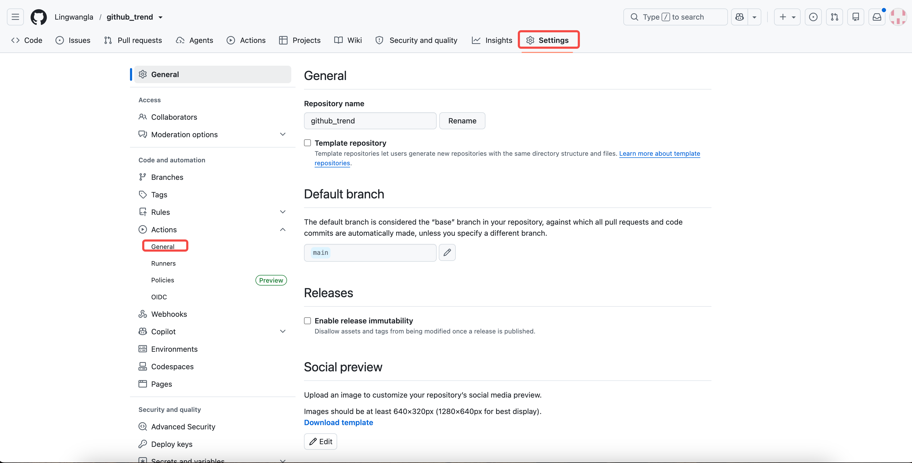
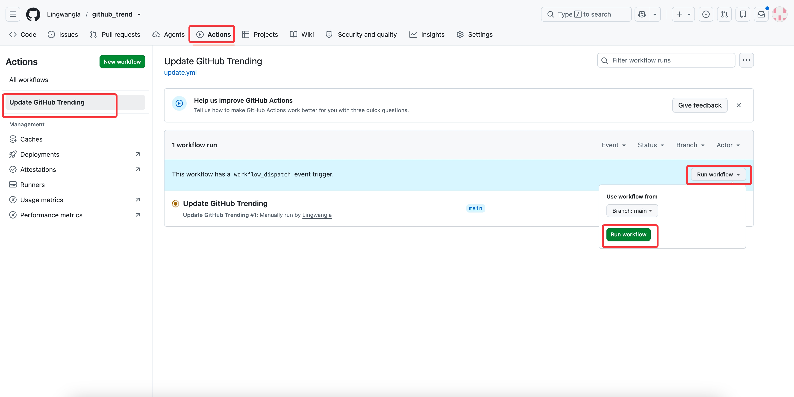

# GitHub Trend Pages

GitHub Trend Pages 是一个用 Go 编写的 GitHub Daily Trending 静态榜单生成器。它会抓取 GitHub 每日 Trending 页面，根据可配置的主题关键词筛选 Top 5 仓库，补充仓库 topics 和 README 摘要，并生成 GitHub Pages 可直接发布的静态页面。

当前默认主题是 AI，默认关键词覆盖 AI、Agent、LLM、MCP、RAG、Embedding、Transformer、Prompt 等方向。主题名称和关键词都可以通过环境变量定制。

## 功能

- 抓取 GitHub Daily Trending。
- 按主题关键词筛选目标仓库。
- 通过 GitHub API 补充仓库 topics 和 README 摘要。
- 生成 `TRENDING.md` Markdown 榜单。
- 生成 `index.html` GitHub Pages 首页。
- 更新首页前将旧 `index.html` 归档到 `history_daily_trending/`。
- 支持 GitHub Actions 定时更新、提交产物并部署 GitHub Pages。
- 支持部署完成后发送飞书文本通知。
- 支持 mock 数据模式，便于本地预览页面效果。

## 技术栈

- Go 1.22
- goquery
- GitHub Actions
- GitHub Pages
- 飞书开放平台消息 API

## 目录结构

```text
.
├── .github/workflows/update.yml   # 定时更新、提交生成产物、部署 Pages、发送飞书通知
├── cmd/trending/main.go           # 抓取、筛选、页面生成、历史归档主流程
├── cmd/trending/feishu.go         # 飞书通知逻辑
├── history_daily_trending/        # 历史首页归档目录，文件名格式为 YYYY-MM-DD.index
├── go.mod                         # Go module 和依赖声明
├── go.sum                         # Go 依赖锁定文件
├── README.md                      # 当前项目说明文档
├── TRENDING.md                    # 自动生成的 Trending Markdown 榜单
└── index.html                     # 自动生成的 GitHub Pages 首页
```

## 本地运行

环境要求：

- Go 1.22 或更高版本
- 可以访问 `github.com` 和 `api.github.com`

安装依赖：

```bash
go mod download
```

抓取真实 GitHub Trending 并生成产物：

```bash
go run ./cmd/trending
```

运行后会更新：

- `TRENDING.md`
- `index.html`
- `history_daily_trending/YYYY-MM-DD.index`，仅当运行前已有 `index.html` 时生成

使用 mock 数据本地预览：

```bash
TREND_USE_MOCK=1 go run ./cmd/trending
```

本地预览 GitHub Pages 首页：

```bash
python3 -m http.server 8000
```

然后访问 `http://localhost:8000/index.html`。

## 部署到 GitHub Pages

你可以直接fork当前仓库，本仓库已经内置部署工作流：`.github/workflows/update.yml`。使用当前仓库部署 GitHub Pages 只需要完成以下配置：

1. 进入仓库 `Settings -> Pages`，将 `Build and deployment -> Source` 设置为 `GitHub Actions`。

   
2. 进入 `Settings -> Actions -> General`，确认 Actions 已启用，并允许工作流读写仓库内容。
3. 如需自定义榜单主题，在 `Settings -> Secrets and variables -> Actions -> Repository Variables` 中配置 `TREND_TOPIC_NAME`、`TREND_KEYWORDS` 或 `TREND_EXTRA_KEYWORDS`。
4. 如需部署后发送飞书通知，在飞书机器人助手中创建 Webhook 触发器，并在 `Secrets` 中配置 `FEISHU_WEBHOOK_URL`。
   如何获取 `FEISHU_WEBHOOK_URL` 链接？参考 [飞书开放平台 Webhook 触发器](https://www.feishu.cn/hc/zh-CN/articles/807992406756-webhook-%E8%A7%A6%E5%8F%91%E5%99%A8)
   <br />
5. 进入 `Actions -> Update GitHub Trending`，点击 `Run workflow` 手动触发一次部署。

   

部署成功后，工作流会生成并提交 `TRENDING.md`、`index.html` 和 `history_daily_trending/`，然后发布到 GitHub Pages。之后仓库会在每天 UTC 00:00 自动更新一次。

<br />

## 环境变量

### 榜单生成

| 环境变量                   | 是否必填 | 默认值  | 说明                                               |
| ---------------------- | ---- | ---- | ------------------------------------------------ |
| `TREND_USE_MOCK`       | 否    | 空    | 值为 `1` 时使用内置 mock 数据，不请求 GitHub Trending。        |
| `TREND_TOPIC_NAME`     | 否    | `AI` | 榜单主题名称，会展示在 `TRENDING.md` 和 `index.html` 的筛选说明中。 |
| `TREND_KEYWORDS`       | 否    | 空    | 覆盖默认主题关键词。配置后只使用该变量中的关键词。                        |
| `TREND_EXTRA_KEYWORDS` | 否    | 空    | 在默认主题关键词基础上追加关键词。                                |

关键词变量支持**用英文逗号、中文逗号、分号、中文分号、顿号、换行、回车或 tab 分隔**，程序会统一转为小写并去重。

覆盖默认关键词示例：

```bash
TREND_TOPIC_NAME=Database \
TREND_KEYWORDS="database,postgres,mysql,redis,sqlite" \
go run ./cmd/trending
```

中文关键词示例：

```bash
TREND_TOPIC_NAME=股票 \
TREND_KEYWORDS="股票，基金，炒股，量化交易" \
go run ./cmd/trending
```

追加默认关键词示例：

```bash
TREND_EXTRA_KEYWORDS="workflow,automation" go run ./cmd/trending
```

### 飞书通知

| 环境变量                 | 是否必填 | 默认值 | 说明                                                                                                                                                                                                         |
| -------------------- | ---- | --- | ---------------------------------------------------------------------------------------------------------------------------------------------------------------------------------------------------------- |
| `TREND_NOTIFY_ONLY`  | 否    | 空   | 值为 `1` 时进入通知模式，只读取 `TRENDING.md` 并发送飞书通知，不重新抓取或生成页面。                                                                                                                                                       |
| `FEISHU_WEBHOOK_URL` | 否    | 空   | 飞书机器人助手 Webhook 触发器地址。配置后，GitHub Actions 部署完成会发送通知；未配置时自动跳过。 |

仅发送飞书通知示例：

```bash
TREND_NOTIFY_ONLY=1 \
FEISHU_WEBHOOK_URL=https://open.feishu.cn/xxx \
go run ./cmd/trending
```

## Actions 配置示例

Variables：

```text
TREND_TOPIC_NAME=AI
TREND_EXTRA_KEYWORDS=workflow,automation
```

Secrets：

```text
FEISHU_WEBHOOK_URL=https://open.feishu.cn/xxx
```

## 产物说明

- `README.md` 是项目说明文档，不会被生成器覆盖。
- `TRENDING.md` 是每日 Trending Markdown 榜单。
- `index.html` 是当前 GitHub Pages 首页。
- `history_daily_trending/YYYY-MM-DD.index` 是运行时归档的上一版首页。

## 注意事项

- 当前 GitHub API 请求未配置 token，频繁运行可能触发 GitHub 未认证请求限流。
- GitHub Trending 页面结构变化时，`cmd/trending/main.go` 中的解析选择器可能需要同步调整。
- 历史归档使用当前更新时间的前一天作为文件名，首次运行或不存在旧 `index.html` 时不会生成归档文件。
- 飞书通知依赖飞书机器人助手 Webhook 触发器，失败原因会输出到 Actions 日志。

## 触发方式：

- 每天 UTC 00:00 自动执行。
- 在 GitHub Actions 页面手动触发 `workflow_dispatch`。
