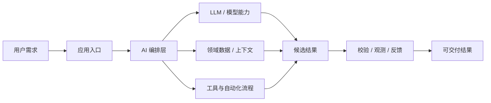

# GitHub 股票 Daily Trending Top 5

更新时间：2026-06-21T11:50:03Z

筛选范围：仓库名称或描述包含 股票 相关关键词。关键词：股票, 基金, 炒股, 量化交易。

网页版本：由 GitHub Pages 自动发布。

## 1. [ZhuLinsen/daily_stock_analysis](https://github.com/ZhuLinsen/daily_stock_analysis)

- 语言：Python
- Stars：43,866
- 主题：a-stock, ai-agent, aigc, llm, quant, quantitative-finance, quantitative-trading
- Star 趋势：

- 作用 / 解决的问题：LLM 驱动的多市场股票智能分析系统：多源行情、实时新闻、决策看板与自动推送，支持零成本定时运行。 LLM-powered multi-market stock analysis system with multi-source market data, real-time news, decision dashboard, automated notifications, and cost-free scheduled runs.
- 适用场景：
  - 适合快速评估 GitHub AI 热榜中新出现或重新升温的技术方向，因为该仓库已获得短期社区关注。
  - 适合围绕 a-stock, ai-agent, aigc, llm, quant, quantitative-finance, quantitative-trading 做技术调研、竞品分析或原型验证，因为仓库主题与当前 股票 热点高度相关。
- 架构思想：
  - 它成为热榜的核心原因通常不是单点功能，而是把模型能力、工具、数据和工作流组织成更容易落地的工程结构。
  - 当前 Stars 为 43,866，说明它不只是概念验证，还积累了可观的社区验证和传播势能。
  - 相比只提供单一脚本的仓库，它用 a-stock, ai-agent, aigc, llm, quant, quantitative-finance, quantitative-trading 等 topics 明确了能力边界，更容易被目标用户检索和采用。
  - 使用 Python 作为主要实现语言，降低了对应生态开发者集成、扩展和二次开发的成本。
  - 它的稀缺性在于把热门 股票 能力包装成可运行、可组合、可观察的工程入口，而不是停留在论文、提示词或孤立 Demo。
- 原理 / 实现思路：
  - 🤖 基于 AI 大模型的 A股/港股/美股/日股/韩股自选股智能分析系统，每日自动分析并推送「决策仪表盘」到企业微信/飞书/Telegram/Discord/Slack/邮箱
  - [产品预览](#-产品预览) · [功能特性](#-功能特性) · [快速开始](#-快速开始) · [推送效果](#-推送效果) · [文档中心](docs/INDEX.md) · [完整指南](docs/full-guide.md)
  - 简体中文 \| [English](docs/README_EN.md) \| [繁體中文](docs/README_CHT.md)
  - 以上内容由 GitHub 公开 README 自动摘取和归纳，适合作为快速了解入口，深入实现仍以仓库源码和文档为准。

