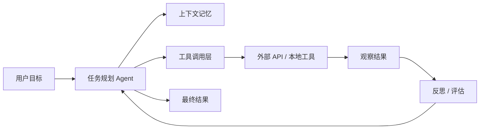
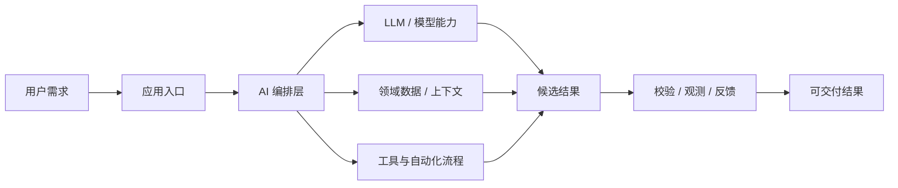
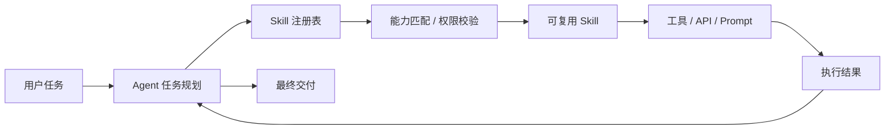
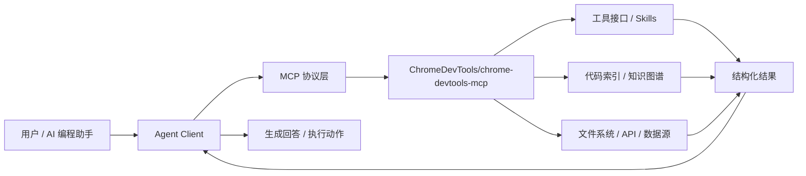

# GitHub AI Daily Trending Top 5

更新时间：2026-07-04T02:32:12Z

筛选范围：仓库名称或描述包含 AI 相关关键词。关键词：ai, agent, agents, agentic, llm, llms, skill, skills, mcp, model context protocol, chatgpt, openai, claude, gemini, copilot, deepseek, rag, embedding, embeddings, transformer, diffusion, machine learning, ml, deep learning, neural, inference, prompt, prompts。

网页版本：由 GitHub Pages 自动发布。

## 1. [usestrix/strix](https://github.com/usestrix/strix)

- 语言：Python
- Stars：34,742
- 主题：agents, ai-hacking, ai-penetration-testing, ai-pentesting, ai-security, artificial-intelligence, bug-bounty, code-quality, ctf-tools, cybersecurity, cybersecurity-tools, ethical-hacking, hacking, llm-security, offensive-security, penetration-testing, pentesting-tools, red-teaming, security, security-automation
- Star 趋势：

- 作用 / 解决的问题：Open-source AI penetration testing tool to find and fix your app’s vulnerabilities.
- 适用场景：
  - 适合快速评估 GitHub AI 热榜中新出现或重新升温的技术方向，因为该仓库已获得短期社区关注。
  - 适合多步骤自动化、工具调用和复杂任务编排场景，因为 Agent 模式能把规划、执行、观察和修正串起来。
- 架构思想：
  - 它成为热榜的核心原因通常不是单点功能，而是把模型能力、工具、数据和工作流组织成更容易落地的工程结构。
  - 当前 Stars 为 34,742，说明它不只是概念验证，还积累了可观的社区验证和传播势能。
  - 相比只提供单一脚本的仓库，它用 agents, ai-hacking, ai-penetration-testing, ai-pentesting, ai-security, artificial-intelligence, bug-bounty, code-quality, ctf-tools, cybersecurity, cybersecurity-tools, ethical-hacking, hacking, llm-security, offensive-security, penetration-testing, pentesting-tools, red-teaming, security, security-automation 等 topics 明确了能力边界，更容易被目标用户检索和采用。
  - 使用 Python 作为主要实现语言，降低了对应生态开发者集成、扩展和二次开发的成本。
  - 它的稀缺性在于把热门 AI 能力包装成可运行、可组合、可观察的工程入口，而不是停留在论文、提示词或孤立 Demo。
- 原理 / 实现思路：
  - The open-source AI pentesting tool. Autonomous AI hackers that find and fix your app’s vulnerabilities.
  - Strix are autonomous AI penetration testing agents that act just like real hackers - they run your code dynamically, find vulnerabilities, and validate them through actual proofs-of-concept. Built for developers and security teams who need fast, accurate secur...
  - Full pentesting toolkit - reconnaissance, exploitation, and validation out of the box
  - 以上内容由 GitHub 公开 README 自动摘取和归纳，适合作为快速了解入口，深入实现仍以仓库源码和文档为准。

## 2. [openai/codex-plugin-cc](https://github.com/openai/codex-plugin-cc)

- 语言：JavaScript
- Stars：23,261
- 主题：未在 GitHub API 中公开 topics
- Star 趋势：

- 作用 / 解决的问题：Use Codex from Claude Code to review code or delegate tasks.
- 适用场景：
  - 适合快速评估 GitHub AI 热榜中新出现或重新升温的技术方向，因为该仓库已获得短期社区关注。
  - 适合围绕 未在 GitHub API 中公开 topics 做技术调研、竞品分析或原型验证，因为仓库主题与当前 AI 热点高度相关。
- 架构思想：
  - 它成为热榜的核心原因通常不是单点功能，而是把模型能力、工具、数据和工作流组织成更容易落地的工程结构。
  - 当前 Stars 为 23,261，说明它不只是概念验证，还积累了可观的社区验证和传播势能。
  - 使用 JavaScript 作为主要实现语言，降低了对应生态开发者集成、扩展和二次开发的成本。
  - 它的稀缺性在于把热门 AI 能力包装成可运行、可组合、可观察的工程入口，而不是停留在论文、提示词或孤立 Demo。
- 原理 / 实现思路：
  - Use Codex from inside Claude Code for code reviews or to delegate tasks to Codex.
  - This plugin is for Claude Code users who want an easy way to start using Codex from the workflow
  - /codex:adversarial-review for a steerable challenge review
  - 以上内容由 GitHub 公开 README 自动摘取和归纳，适合作为快速了解入口，深入实现仍以仓库源码和文档为准。

## 3. [JuliusBrussee/caveman](https://github.com/JuliusBrussee/caveman)

- 语言：JavaScript
- Stars：83,000
- 主题：ai, anthropic, caveman, claude, claude-code, llm, meme, prompt-engineering, skill, tokens
- Star 趋势：

- 作用 / 解决的问题：🪨 why use many token when few token do trick — Claude Code skill that cuts 65% of tokens by talking like caveman
- 适用场景：
  - 适合快速评估 GitHub AI 热榜中新出现或重新升温的技术方向，因为该仓库已获得短期社区关注。
  - 适合团队沉淀可复用 AI 能力的场景，因为 Skill 把提示词、工具和流程封装成可发现、可组合的单元。
- 架构思想：
  - 它成为热榜的核心原因通常不是单点功能，而是把模型能力、工具、数据和工作流组织成更容易落地的工程结构。
  - 当前 Stars 为 83,000，说明它不只是概念验证，还积累了可观的社区验证和传播势能。
  - 相比只提供单一脚本的仓库，它用 ai, anthropic, caveman, claude, claude-code, llm, meme, prompt-engineering, skill, tokens 等 topics 明确了能力边界，更容易被目标用户检索和采用。
  - 使用 JavaScript 作为主要实现语言，降低了对应生态开发者集成、扩展和二次开发的成本。
  - 它的稀缺性在于把热门 AI 能力包装成可运行、可组合、可观察的工程入口，而不是停留在论文、提示词或孤立 Demo。
- 原理 / 实现思路：
  - Make your AI coding agent talk like a caveman. 
  - Same answers, <strong>65% fewer output tokens</strong>. Brain still big. Mouth small.
  - The reason your React component is re-rendering is likely because you're creating a new object reference on each render cycle. When you pass an inline object as a prop, React's shallow comparison sees it as a different object every time, which triggers a re-re...
  - 以上内容由 GitHub 公开 README 自动摘取和归纳，适合作为快速了解入口，深入实现仍以仓库源码和文档为准。

## 4. [ChromeDevTools/chrome-devtools-mcp](https://github.com/ChromeDevTools/chrome-devtools-mcp)

- 语言：TypeScript
- Stars：45,511
- 主题：browser, chrome, chrome-devtools, debugging, devtools, mcp, mcp-server, puppeteer
- Star 趋势：

- 作用 / 解决的问题：Chrome DevTools for coding agents
- 适用场景：
  - 适合快速评估 GitHub AI 热榜中新出现或重新升温的技术方向，因为该仓库已获得短期社区关注。
  - 适合需要把外部工具、代码库、数据源接入 AI Agent 的场景，因为 MCP 能把能力封装成标准工具接口。
  - 适合多步骤自动化、工具调用和复杂任务编排场景，因为 Agent 模式能把规划、执行、观察和修正串起来。
- 架构思想：
  - 它成为热榜的核心原因通常不是单点功能，而是把模型能力、工具、数据和工作流组织成更容易落地的工程结构。
  - 当前 Stars 为 45,511，说明它不只是概念验证，还积累了可观的社区验证和传播势能。
  - 相比只提供单一脚本的仓库，它用 browser, chrome, chrome-devtools, debugging, devtools, mcp, mcp-server, puppeteer 等 topics 明确了能力边界，更容易被目标用户检索和采用。
  - 使用 TypeScript 作为主要实现语言，降低了对应生态开发者集成、扩展和二次开发的成本。
  - 它的稀缺性在于把热门 AI 能力包装成可运行、可组合、可观察的工程入口，而不是停留在论文、提示词或孤立 Demo。
- 原理 / 实现思路：
  - Chrome DevTools for agents (chrome-devtools-mcp) lets your coding agent (such as Antigravity, Claude, Cursor or Copilot)
  - control and inspect a live Chrome browser. It acts as a Model-Context-Protocol
  - (MCP) server, giving your AI coding assistant access to the full power of
  - 以上内容由 GitHub 公开 README 自动摘取和归纳，适合作为快速了解入口，深入实现仍以仓库源码和文档为准。

## 5. [ansible/ansible](https://github.com/ansible/ansible)

- 语言：Python
- Stars：69,219
- 主题：ansible, python
- Star 趋势：

- 作用 / 解决的问题：Ansible is a radically simple IT automation platform that makes your applications and systems easier to deploy and maintain. Automate everything from code deployment to network configuration to cloud management, in a language that approaches plain English, using SSH, with no agents to install on remote systems. https://docs.ansible.com.
- 适用场景：
  - 适合快速评估 GitHub AI 热榜中新出现或重新升温的技术方向，因为该仓库已获得短期社区关注。
  - 适合多步骤自动化、工具调用和复杂任务编排场景，因为 Agent 模式能把规划、执行、观察和修正串起来。
- 架构思想：
  - 它成为热榜的核心原因通常不是单点功能，而是把模型能力、工具、数据和工作流组织成更容易落地的工程结构。
  - 当前 Stars 为 69,219，说明它不只是概念验证，还积累了可观的社区验证和传播势能。
  - 相比只提供单一脚本的仓库，它用 ansible, python 等 topics 明确了能力边界，更容易被目标用户检索和采用。
  - 使用 Python 作为主要实现语言，降低了对应生态开发者集成、扩展和二次开发的成本。
  - 它的稀缺性在于把热门 AI 能力包装成可运行、可组合、可观察的工程入口，而不是停留在论文、提示词或孤立 Demo。
- 原理 / 实现思路：
  - Ansible is a radically simple IT automation system. It handles
  - configuration management, application deployment, cloud provisioning,
  - ad-hoc task execution, network automation, and multi-node orchestration. Ansible makes complex
  - 以上内容由 GitHub 公开 README 自动摘取和归纳，适合作为快速了解入口，深入实现仍以仓库源码和文档为准。

