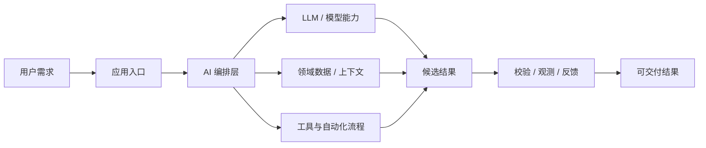
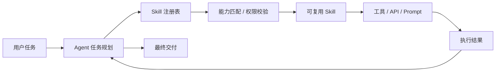

# GitHub AI Daily Trending Top 5

更新时间：2026-07-07T02:42:47Z

筛选范围：仓库名称或描述包含 AI 相关关键词。关键词：ai, agent, agents, agentic, llm, llms, skill, skills, mcp, model context protocol, chatgpt, openai, claude, gemini, copilot, deepseek, rag, embedding, embeddings, transformer, diffusion, machine learning, ml, deep learning, neural, inference, prompt, prompts。

网页版本：由 GitHub Pages 自动发布。

## 1. [asgeirtj/system_prompts_leaks](https://github.com/asgeirtj/system_prompts_leaks)

- 语言：JavaScript
- Stars：51,690
- 主题：ai, ai-agents, anthropic, awesome, chatbot, chatgpt, claude, claude-code, codex, deep-learning, education, gemini, generative-ai, google, llm, machine-learning, nlp, open-source, openai, prompt-engineering
- Star 趋势：

- 作用 / 解决的问题：Extracted system prompts from Anthropic - Claude Fable 5, Opus 4.8, Claude Code, Claude Design. OpenAI - ChatGPT 5.5 Thinking, GPT 5.5 Instant, Codex. Google - Gemini 3.5 Flash, 3.1 Pro, Antigravity. xAI - Grok, Cursor, Copilot, VS Code, Perplexity, and more. Updated regularly.
- 适用场景：
  - 适合快速评估 GitHub AI 热榜中新出现或重新升温的技术方向，因为该仓库已获得短期社区关注。
  - 适合围绕 ai, ai-agents, anthropic, awesome, chatbot, chatgpt, claude, claude-code, codex, deep-learning, education, gemini, generative-ai, google, llm, machine-learning, nlp, open-source, openai, prompt-engineering 做技术调研、竞品分析或原型验证，因为仓库主题与当前 AI 热点高度相关。
- 架构思想：
  - 它成为热榜的核心原因通常不是单点功能，而是把模型能力、工具、数据和工作流组织成更容易落地的工程结构。
  - 当前 Stars 为 51,690，说明它不只是概念验证，还积累了可观的社区验证和传播势能。
  - 相比只提供单一脚本的仓库，它用 ai, ai-agents, anthropic, awesome, chatbot, chatgpt, claude, claude-code, codex, deep-learning, education, gemini, generative-ai, google, llm, machine-learning, nlp, open-source, openai, prompt-engineering 等 topics 明确了能力边界，更容易被目标用户检索和采用。
  - 使用 JavaScript 作为主要实现语言，降低了对应生态开发者集成、扩展和二次开发的成本。
  - 它的稀缺性在于把热门 AI 能力包装成可运行、可组合、可观察的工程入口，而不是停留在论文、提示词或孤立 Demo。
- 原理 / 实现思路：
  - The purpose of this repo is to document the System Prompt instructions for all the AI chatbots out there - Claude, ChatGPT, Gemini etc.
  - \| Claude Sonnet 5 \| July 1, 2026 \| [System prompt](Anthropic/claude-sonnet-5.md) \|
  - \| Claude Design (Opus 4.8 — full prompt + 48 tools + 16 skills + 9 starter sources) \| June 26, 2026 \| [System prompt](Anthropic/claude-design.md) \|
  - 以上内容由 GitHub 公开 README 自动摘取和归纳，适合作为快速了解入口，深入实现仍以仓库源码和文档为准。

## 2. [addyosmani/agent-skills](https://github.com/addyosmani/agent-skills)

- 语言：JavaScript
- Stars：70,941
- 主题：agent-skills, antigravity, claude-code, codex, cursor, skills
- Star 趋势：

- 作用 / 解决的问题：Production-grade engineering skills for AI coding agents.
- 适用场景：
  - 适合快速评估 GitHub AI 热榜中新出现或重新升温的技术方向，因为该仓库已获得短期社区关注。
  - 适合多步骤自动化、工具调用和复杂任务编排场景，因为 Agent 模式能把规划、执行、观察和修正串起来。
  - 适合团队沉淀可复用 AI 能力的场景，因为 Skill 把提示词、工具和流程封装成可发现、可组合的单元。
- 架构思想：
  - 它成为热榜的核心原因通常不是单点功能，而是把模型能力、工具、数据和工作流组织成更容易落地的工程结构。
  - 当前 Stars 为 70,941，说明它不只是概念验证，还积累了可观的社区验证和传播势能。
  - 相比只提供单一脚本的仓库，它用 agent-skills, antigravity, claude-code, codex, cursor, skills 等 topics 明确了能力边界，更容易被目标用户检索和采用。
  - 使用 JavaScript 作为主要实现语言，降低了对应生态开发者集成、扩展和二次开发的成本。
  - 它的稀缺性在于把热门 AI 能力包装成可运行、可组合、可观察的工程入口，而不是停留在论文、提示词或孤立 Demo。
- 原理 / 实现思路：
  - Production-grade engineering skills for AI coding agents.
  - Skills encode the workflows, quality gates, and best practices that senior engineers use when building software. These ones are packaged so AI agents follow them consistently across every phase of development.
  - DEFINE          PLAN           BUILD          VERIFY         REVIEW          SHIP
  - 以上内容由 GitHub 公开 README 自动摘取和归纳，适合作为快速了解入口，深入实现仍以仓库源码和文档为准。

## 3. [Zackriya-Solutions/meetily](https://github.com/Zackriya-Solutions/meetily)

- 语言：Rust
- Stars：19,511
- 主题：ai, ai-meeting-assistant, llm, local-ai, mac, meeting-minutes, meeting-notes, offline-first, ollama, parakeet, privacy-focused, privacy-tools, rust, self-hosted, sortformer, speech-to-text, transcription, whisper, whisper-cpp, windows
- Star 趋势：

- 作用 / 解决的问题：Privacy first, AI meeting assistant with 4x faster Parakeet/Whisper live transcription, speaker diarization, and Ollama summarization built on Rust. 100% local processing. no cloud required. Meetily (Meetly Ai - https://meetily.ai) is the #1 Self-hosted, Open-source Ai meeting note taker for macOS & Windows.
- 适用场景：
  - 适合快速评估 GitHub AI 热榜中新出现或重新升温的技术方向，因为该仓库已获得短期社区关注。
  - 适合围绕 ai, ai-meeting-assistant, llm, local-ai, mac, meeting-minutes, meeting-notes, offline-first, ollama, parakeet, privacy-focused, privacy-tools, rust, self-hosted, sortformer, speech-to-text, transcription, whisper, whisper-cpp, windows 做技术调研、竞品分析或原型验证，因为仓库主题与当前 AI 热点高度相关。
- 架构思想：
  - 它成为热榜的核心原因通常不是单点功能，而是把模型能力、工具、数据和工作流组织成更容易落地的工程结构。
  - 当前 Stars 为 19,511，说明它不只是概念验证，还积累了可观的社区验证和传播势能。
  - 相比只提供单一脚本的仓库，它用 ai, ai-meeting-assistant, llm, local-ai, mac, meeting-minutes, meeting-notes, offline-first, ollama, parakeet, privacy-focused, privacy-tools, rust, self-hosted, sortformer, speech-to-text, transcription, whisper, whisper-cpp, windows 等 topics 明确了能力边界，更容易被目标用户检索和采用。
  - 使用 Rust 作为主要实现语言，降低了对应生态开发者集成、扩展和二次开发的成本。
  - 它的稀缺性在于把热门 AI 能力包装成可运行、可组合、可观察的工程入口，而不是停留在论文、提示词或孤立 Demo。
- 原理 / 实现思路：
  - Open Source • Privacy-First • Enterprise-Ready
  - A privacy-first AI meeting assistant that captures, transcribes, and summarizes meetings entirely on your infrastructure. Built by expert AI engineers passionate about data sovereignty and open source solutions. Perfect for enterprises that need advanced meeti...
  - Meetily is a privacy-first AI meeting assistant that runs entirely on your local machine. It captures your meetings, transcribes them in real-time, and generates summaries, all without sending any data to the cloud. This makes it the perfect solution for profe...
  - 以上内容由 GitHub 公开 README 自动摘取和归纳，适合作为快速了解入口，深入实现仍以仓库源码和文档为准。

## 4. [Leonxlnx/taste-skill](https://github.com/Leonxlnx/taste-skill)

- 语言：JavaScript
- Stars：59,089
- 主题：agent, ai, claude, claude-code, codex, coding, design, frontend, lowcode, nocode, skill, skills, vibecoding
- Star 趋势：

- 作用 / 解决的问题：Taste-Skill - gives your AI good taste. stops the AI from generating boring, generic slop
- 适用场景：
  - 适合快速评估 GitHub AI 热榜中新出现或重新升温的技术方向，因为该仓库已获得短期社区关注。
  - 适合多步骤自动化、工具调用和复杂任务编排场景，因为 Agent 模式能把规划、执行、观察和修正串起来。
  - 适合团队沉淀可复用 AI 能力的场景，因为 Skill 把提示词、工具和流程封装成可发现、可组合的单元。
- 架构思想：
  - 它成为热榜的核心原因通常不是单点功能，而是把模型能力、工具、数据和工作流组织成更容易落地的工程结构。
  - 当前 Stars 为 59,089，说明它不只是概念验证，还积累了可观的社区验证和传播势能。
  - 相比只提供单一脚本的仓库，它用 agent, ai, claude, claude-code, codex, coding, design, frontend, lowcode, nocode, skill, skills, vibecoding 等 topics 明确了能力边界，更容易被目标用户检索和采用。
  - 使用 JavaScript 作为主要实现语言，降低了对应生态开发者集成、扩展和二次开发的成本。
  - 它的稀缺性在于把热门 AI 能力包装成可运行、可组合、可观察的工程入口，而不是停留在论文、提示词或孤立 Demo。
- 原理 / 实现思路：
  - Portable Agent Skills that upgrade AI-built interfaces: stronger layout, typography, motion, and spacing instead of boilerplate-looking UIs. This repo also includes image-generation skills for reference boards (web, mobile, brand kits). Pair them with ChatGPT ...
  - Taste Skill has no official token, coin, or crypto project. Any token using my name, image, or project is unaffiliated and not endorsed by me.
  - We would love your feedback. Suggestions and bug reports:
  - 以上内容由 GitHub 公开 README 自动摘取和归纳，适合作为快速了解入口，深入实现仍以仓库源码和文档为准。

## 5. [alirezarezvani/claude-skills](https://github.com/alirezarezvani/claude-skills)

- 语言：Python
- Stars：21,209
- 主题：agent-plugins, agent-skills, agentic-ai, ai-coding-agent, anthropic-claude, claude-ai, claude-code, claude-code-plugins, claude-code-skills, claude-skills, codex-skills, coding-agent-plugins, cursor-skills, developer-tools, gemini-cli-skills, openai-codex, openclaw, openclaw-plugins, openclaw-skills, prompt-engineering
- Star 趋势：

- 作用 / 解决的问题：345 Claude Code skills & agent skills & plugins (30+ Agents, 70+ custom commands, 330+ skills, customizable references, scripts)for Claude Code, Codex, Gemini CLI, Cursor, and 8 more coding agents — engineering, marketing, product, compliance, C-level advisory, research, business operations, commercial & finance, and your daily productivity skills.
- 适用场景：
  - 适合快速评估 GitHub AI 热榜中新出现或重新升温的技术方向，因为该仓库已获得短期社区关注。
  - 适合多步骤自动化、工具调用和复杂任务编排场景，因为 Agent 模式能把规划、执行、观察和修正串起来。
  - 适合团队沉淀可复用 AI 能力的场景，因为 Skill 把提示词、工具和流程封装成可发现、可组合的单元。
- 架构思想：
  - 它成为热榜的核心原因通常不是单点功能，而是把模型能力、工具、数据和工作流组织成更容易落地的工程结构。
  - 当前 Stars 为 21,209，说明它不只是概念验证，还积累了可观的社区验证和传播势能。
  - 相比只提供单一脚本的仓库，它用 agent-plugins, agent-skills, agentic-ai, ai-coding-agent, anthropic-claude, claude-ai, claude-code, claude-code-plugins, claude-code-skills, claude-skills, codex-skills, coding-agent-plugins, cursor-skills, developer-tools, gemini-cli-skills, openai-codex, openclaw, openclaw-plugins, openclaw-skills, prompt-engineering 等 topics 明确了能力边界，更容易被目标用户检索和采用。
  - 使用 Python 作为主要实现语言，降低了对应生态开发者集成、扩展和二次开发的成本。
  - 它的稀缺性在于把热门 AI 能力包装成可运行、可组合、可观察的工程入口，而不是停留在论文、提示词或孤立 Demo。
- 原理 / 实现思路：
  - Claude Code Skills & Plugins — Agent Skills for Every Coding Tool
  - 355 production-ready Claude Code skills, plugins, and agent skills for 13 AI coding tools.
  - The most comprehensive open-source library of Claude Code skills and agent plugins — also works with OpenAI Codex, Gemini CLI, Cursor, and 9 more coding agents. Reusable expertise packages covering engineering, DevOps, marketing (incl. AEO — Answer Engine Opti...
  - 以上内容由 GitHub 公开 README 自动摘取和归纳，适合作为快速了解入口，深入实现仍以仓库源码和文档为准。

