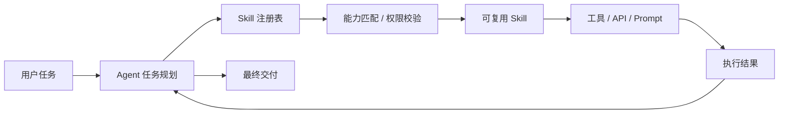
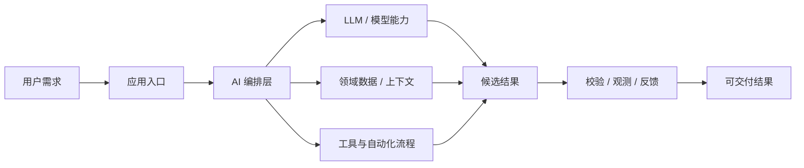
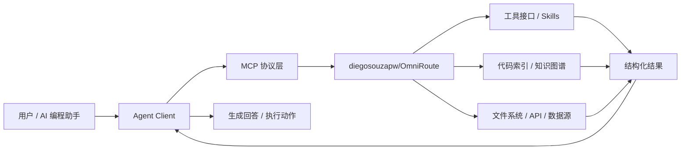

# GitHub AI Daily Trending Top 5

更新时间：2026-07-23T02:23:39Z

筛选范围：仓库名称或描述包含 AI 相关关键词。关键词：ai, agent, agents, agentic, llm, llms, skill, skills, mcp, model context protocol, chatgpt, openai, claude, gemini, copilot, deepseek, rag, embedding, embeddings, transformer, diffusion, machine learning, ml, deep learning, neural, inference, prompt, prompts。

网页版本：由 GitHub Pages 自动发布。

## 1. [koala73/worldmonitor](https://github.com/koala73/worldmonitor)

- 语言：TypeScript
- Stars：69,168
- 主题：agent, ai, dashboard, geopolitics, mcp, mcp-server, monitoring, news, opensource, osint, palantir, situation
- Star 趋势：

- 作用 / 解决的问题：Real-time global intelligence dashboard. AI-powered news aggregation, geopolitical monitoring, and infrastructure tracking in a unified situational awareness interface
- 适用场景：
  - 适合快速评估 GitHub AI 热榜中新出现或重新升温的技术方向，因为该仓库已获得短期社区关注。
  - 适合需要把外部工具、代码库、数据源接入 AI Agent 的场景，因为 MCP 能把能力封装成标准工具接口。
  - 适合多步骤自动化、工具调用和复杂任务编排场景，因为 Agent 模式能把规划、执行、观察和修正串起来。
- 架构思想：
  - 它成为热榜的核心原因通常不是单点功能，而是把模型能力、工具、数据和工作流组织成更容易落地的工程结构。
  - 当前 Stars 为 69,168，说明它不只是概念验证，还积累了可观的社区验证和传播势能。
  - 相比只提供单一脚本的仓库，它用 agent, ai, dashboard, geopolitics, mcp, mcp-server, monitoring, news, opensource, osint, palantir, situation 等 topics 明确了能力边界，更容易被目标用户检索和采用。
  - 使用 TypeScript 作为主要实现语言，降低了对应生态开发者集成、扩展和二次开发的成本。
  - 它的稀缺性在于把热门 AI 能力包装成可运行、可组合、可观察的工程入口，而不是停留在论文、提示词或孤立 Demo。
- 原理 / 实现思路：
  - Real-time global intelligence dashboard — AI-powered news aggregation, geopolitical monitoring, and infrastructure tracking in a unified situational awareness interface.
  - 500+ curated news feeds across 15 categories, AI-synthesized into briefs
  - Dual map engine — 3D globe (globe.gl) and WebGL flat map (deck.gl) with 56 map layer types
  - 以上内容由 GitHub 公开 README 自动摘取和归纳，适合作为快速了解入口，深入实现仍以仓库源码和文档为准。

## 2. [ayghri/i-have-adhd](https://github.com/ayghri/i-have-adhd)

- 语言：Python
- Stars：8,371
- 主题：adhd, claude-, claude-code-plugin, claude-skills, developer-tools, productivity
- Star 趋势：

- 作用 / 解决的问题：A skill for your coding agent to stop it from burying the answer. ADHD-friendly output.
- 适用场景：
  - 适合快速评估 GitHub AI 热榜中新出现或重新升温的技术方向，因为该仓库已获得短期社区关注。
  - 适合多步骤自动化、工具调用和复杂任务编排场景，因为 Agent 模式能把规划、执行、观察和修正串起来。
  - 适合团队沉淀可复用 AI 能力的场景，因为 Skill 把提示词、工具和流程封装成可发现、可组合的单元。
- 架构思想：
  - 它成为热榜的核心原因通常不是单点功能，而是把模型能力、工具、数据和工作流组织成更容易落地的工程结构。
  - 当前 Stars 为 8,371，说明它不只是概念验证，还积累了可观的社区验证和传播势能。
  - 相比只提供单一脚本的仓库，它用 adhd, claude-, claude-code-plugin, claude-skills, developer-tools, productivity 等 topics 明确了能力边界，更容易被目标用户检索和采用。
  - 使用 Python 作为主要实现语言，降低了对应生态开发者集成、扩展和二次开发的成本。
  - 它的稀缺性在于把热门 AI 能力包装成可运行、可组合、可观察的工程入口，而不是停留在论文、提示词或孤立 Demo。
- 原理 / 实现思路：
  - Then type /i-have-adhd. No local clone needed: Claude Code fetches the repo and keeps it updated.
  - Want it on every session? touch ~/.claude/.i-have-adhd-always (see [INSTALL.md](./INSTALL.md)).
  - codex plugin marketplace add ayghri/i-have-adhd --ref main
  - 以上内容由 GitHub 公开 README 自动摘取和归纳，适合作为快速了解入口，深入实现仍以仓库源码和文档为准。

## 3. [jamiepine/voicebox](https://github.com/jamiepine/voicebox)

- 语言：TypeScript
- Stars：45,818
- 主题：ai, cuda, mlx, qwen3-tts, qwen3-tts-ui, voice-ai, voice-clone, whisper
- Star 趋势：

- 作用 / 解决的问题：The open-source AI voice studio. Clone, dictate, create.
- 适用场景：
  - 适合快速评估 GitHub AI 热榜中新出现或重新升温的技术方向，因为该仓库已获得短期社区关注。
  - 适合围绕 ai, cuda, mlx, qwen3-tts, qwen3-tts-ui, voice-ai, voice-clone, whisper 做技术调研、竞品分析或原型验证，因为仓库主题与当前 AI 热点高度相关。
- 架构思想：
  - 它成为热榜的核心原因通常不是单点功能，而是把模型能力、工具、数据和工作流组织成更容易落地的工程结构。
  - 当前 Stars 为 45,818，说明它不只是概念验证，还积累了可观的社区验证和传播势能。
  - 相比只提供单一脚本的仓库，它用 ai, cuda, mlx, qwen3-tts, qwen3-tts-ui, voice-ai, voice-clone, whisper 等 topics 明确了能力边界，更容易被目标用户检索和采用。
  - 使用 TypeScript 作为主要实现语言，降低了对应生态开发者集成、扩展和二次开发的成本。
  - 它的稀缺性在于把热门 AI 能力包装成可运行、可组合、可观察的工程入口，而不是停留在论文、提示词或孤立 Demo。
- 原理 / 实现思路：
  - Clone any voice. Generate speech. Dictate into any app. Talk to agents in voices you own. 
  - The full voice I/O stack, running locally on your machine.
  - Voicebox is a local-first AI voice studio — a free and open-source alternative to ElevenLabs and WisprFlow in one app. Clone voices from a few seconds of audio, generate speech in 23 languages across 7 TTS engines, dictate into any text field with a global hot...
  - 以上内容由 GitHub 公开 README 自动摘取和归纳，适合作为快速了解入口，深入实现仍以仓库源码和文档为准。

## 4. [diegosouzapw/OmniRoute](https://github.com/diegosouzapw/OmniRoute)

- 语言：TypeScript
- Stars：25,423
- 主题：a2a, ai-agents, ai-gateway, anthropic, claude, claude-code, cline, codex, copilot, cursor, deepseek, free-ai, gemini, kimi, llm-gateway, mcp, openai, openai-proxy, qwen, token-saver
- Star 趋势：

- 作用 / 解决的问题：Never stop coding. Free MIT AI gateway: one endpoint, 268+ providers (50+ free), 500+ models — Kimi, Claude, GPT, OpenAI, Gemini, GLM, DeepSeek, MiniMax. Works with Claude Code, Codex, Cursor, OpenCode, Cline & Copilot. Quota-aware auto-fallback, RTK+Caveman compression saves 15-95% tokens, MCP/A2A, Desktop/PWA. Built by 500+ contributors
- 适用场景：
  - 适合快速评估 GitHub AI 热榜中新出现或重新升温的技术方向，因为该仓库已获得短期社区关注。
  - 适合需要把外部工具、代码库、数据源接入 AI Agent 的场景，因为 MCP 能把能力封装成标准工具接口。
- 架构思想：
  - 它成为热榜的核心原因通常不是单点功能，而是把模型能力、工具、数据和工作流组织成更容易落地的工程结构。
  - 当前 Stars 为 25,423，说明它不只是概念验证，还积累了可观的社区验证和传播势能。
  - 相比只提供单一脚本的仓库，它用 a2a, ai-agents, ai-gateway, anthropic, claude, claude-code, cline, codex, copilot, cursor, deepseek, free-ai, gemini, kimi, llm-gateway, mcp, openai, openai-proxy, qwen, token-saver 等 topics 明确了能力边界，更容易被目标用户检索和采用。
  - 使用 TypeScript 作为主要实现语言，降低了对应生态开发者集成、扩展和二次开发的成本。
  - 它的稀缺性在于把热门 AI 能力包装成可运行、可组合、可观察的工程入口，而不是停留在论文、提示词或孤立 Demo。
- 原理 / 实现思路：
  - Stacking free tiers by hand is painful — dozens of SDKs, dozens of rate limits, and no idea how much you actually have. OmniRoute aggregates the documented free tiers of 43 provider pools / 460+ models into one honest number and shows it live on the dashboard ...
  - Animated summary of the live /dashboard/free-tiers page. Full methodology (pool dedupe, credit tiers, provider terms): [docs/reference/FREE_TIERS.md](docs/reference/FREE_TIERS.md).
  - ⭐ Star the repo if OMNIROUTE helped you save money and make your work easier.
  - 以上内容由 GitHub 公开 README 自动摘取和归纳，适合作为快速了解入口，深入实现仍以仓库源码和文档为准。

## 5. [ComposioHQ/awesome-claude-skills](https://github.com/ComposioHQ/awesome-claude-skills)

- 语言：Python
- Stars：68,828
- 主题：agent-skills, ai-agents, antigravity, automation, claude, claude-code, codex, composio, cursor, developer-tools, gemini-cli, mcp, openai-codex, rube, saas, skill, workflow-automation
- Star 趋势：

- 作用 / 解决的问题：A curated list of awesome Claude Skills, resources, and tools for customizing Claude AI workflows
- 适用场景：
  - 适合快速评估 GitHub AI 热榜中新出现或重新升温的技术方向，因为该仓库已获得短期社区关注。
  - 适合需要把外部工具、代码库、数据源接入 AI Agent 的场景，因为 MCP 能把能力封装成标准工具接口。
  - 适合团队沉淀可复用 AI 能力的场景，因为 Skill 把提示词、工具和流程封装成可发现、可组合的单元。
- 架构思想：
  - 它成为热榜的核心原因通常不是单点功能，而是把模型能力、工具、数据和工作流组织成更容易落地的工程结构。
  - 当前 Stars 为 68,828，说明它不只是概念验证，还积累了可观的社区验证和传播势能。
  - 相比只提供单一脚本的仓库，它用 agent-skills, ai-agents, antigravity, automation, claude, claude-code, codex, composio, cursor, developer-tools, gemini-cli, mcp, openai-codex, rube, saas, skill, workflow-automation 等 topics 明确了能力边界，更容易被目标用户检索和采用。
  - 使用 Python 作为主要实现语言，降低了对应生态开发者集成、扩展和二次开发的成本。
  - 它的稀缺性在于把热门 AI 能力包装成可运行、可组合、可观察的工程入口，而不是停留在论文、提示词或孤立 Demo。
- 原理 / 实现思路：
  - A comprehensive and curated list of 1000+ production ready and practical Claude Skills and Plugins for enhancing productivity across usecases on not just Claude.ai, Claude Code, but also across coding agents like Codex, Cursor, Gemini CLI, Antigravity and more...
  - Want skills that do more than generate text? Claude can send emails, create issues, post to Slack, and take actions across 1000+ apps. [See how →](./connect/)
  - The connect-apps plugin lets Claude perform real actions - send emails, create issues, post to Slack. It handles auth and connects to 500+ apps using Composio under the hood.
  - 以上内容由 GitHub 公开 README 自动摘取和归纳，适合作为快速了解入口，深入实现仍以仓库源码和文档为准。

