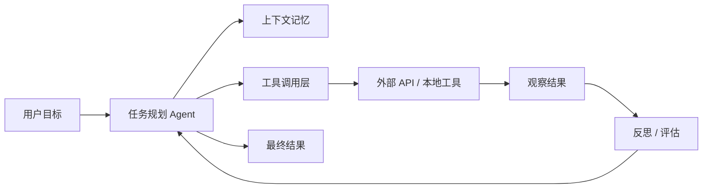
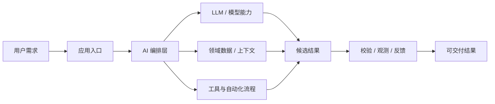
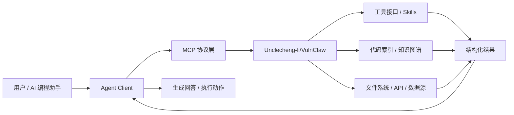

# GitHub AI Daily Trending Top 5

更新时间：2026-06-30T02:55:30Z

筛选范围：仓库名称或描述包含 AI 相关关键词。关键词：ai, agent, agents, agentic, llm, llms, skill, skills, mcp, model context protocol, chatgpt, openai, claude, gemini, copilot, deepseek, rag, embedding, embeddings, transformer, diffusion, machine learning, ml, deep learning, neural, inference, prompt, prompts。

网页版本：由 GitHub Pages 自动发布。

## 1. [msitarzewski/agency-agents](https://github.com/msitarzewski/agency-agents)

- 语言：Shell
- Stars：119,086
- 主题：未在 GitHub API 中公开 topics
- Star 趋势：

- 作用 / 解决的问题：A complete AI agency at your fingertips - From frontend wizards to Reddit community ninjas, from whimsy injectors to reality checkers. Each agent is a specialized expert with personality, processes, and proven deliverables.
- 适用场景：
  - 适合快速评估 GitHub AI 热榜中新出现或重新升温的技术方向，因为该仓库已获得短期社区关注。
  - 适合多步骤自动化、工具调用和复杂任务编排场景，因为 Agent 模式能把规划、执行、观察和修正串起来。
- 架构思想：
  - 它成为热榜的核心原因通常不是单点功能，而是把模型能力、工具、数据和工作流组织成更容易落地的工程结构。
  - 当前 Stars 为 119,086，说明它不只是概念验证，还积累了可观的社区验证和传播势能。
  - 使用 Shell 作为主要实现语言，降低了对应生态开发者集成、扩展和二次开发的成本。
  - 它的稀缺性在于把热门 AI 能力包装成可运行、可组合、可观察的工程入口，而不是停留在论文、提示词或孤立 Demo。
- 原理 / 实现思路：
  - 🎭 The Agency: AI Specialists Ready to Transform Your Workflow
  - A complete AI agency at your fingertips - From frontend wizards to Reddit community ninjas, from whimsy injectors to reality checkers. Each agent is a specialized expert with personality, processes, and proven deliverables.
  - Born from a Reddit thread and months of iteration, The Agency is a growing collection of meticulously crafted AI agent personalities. Each agent is:
  - 以上内容由 GitHub 公开 README 自动摘取和归纳，适合作为快速了解入口，深入实现仍以仓库源码和文档为准。

## 2. [logto-io/logto](https://github.com/logto-io/logto)

- 语言：TypeScript
- Stars：12,726
- 主题：authentication, authorization, email, identity, jwt, login, logto, mfa, oauth2, openid-connect, password, passwordless, rbac, saml, signup, sms, social-login, sso, totp, typescript
- Star 趋势：

- 作用 / 解决的问题：🧑‍🚀 Authentication and authorization infrastructure for SaaS and AI apps, built on OIDC and OAuth 2.1 with multi-tenancy, SSO, and RBAC.
- 适用场景：
  - 适合快速评估 GitHub AI 热榜中新出现或重新升温的技术方向，因为该仓库已获得短期社区关注。
  - 适合围绕 authentication, authorization, email, identity, jwt, login, logto, mfa, oauth2, openid-connect, password, passwordless, rbac, saml, signup, sms, social-login, sso, totp, typescript 做技术调研、竞品分析或原型验证，因为仓库主题与当前 AI 热点高度相关。
- 架构思想：
  - 它成为热榜的核心原因通常不是单点功能，而是把模型能力、工具、数据和工作流组织成更容易落地的工程结构。
  - 当前 Stars 为 12,726，说明它不只是概念验证，还积累了可观的社区验证和传播势能。
  - 相比只提供单一脚本的仓库，它用 authentication, authorization, email, identity, jwt, login, logto, mfa, oauth2, openid-connect, password, passwordless, rbac, saml, signup, sms, social-login, sso, totp, typescript 等 topics 明确了能力边界，更容易被目标用户检索和采用。
  - 使用 TypeScript 作为主要实现语言，降低了对应生态开发者集成、扩展和二次开发的成本。
  - 它的稀缺性在于把热门 AI 能力包装成可运行、可组合、可观察的工程入口，而不是停留在论文、提示词或孤立 Demo。
- 原理 / 实现思路：
  - Logto is the modern, open-source auth infrastructure for SaaS and AI apps.
  - It takes the pain out of OIDC and OAuth 2.1 and makes it easy to build secure, production-ready auth with multi-tenancy, enterprise SSO, and RBAC.
  - Built for teams scaling SaaS, AI, and agent-based platforms without the usual auth headaches.
  - 以上内容由 GitHub 公开 README 自动摘取和归纳，适合作为快速了解入口，深入实现仍以仓库源码和文档为准。

## 3. [xbtlin/ai-berkshire](https://github.com/xbtlin/ai-berkshire)

- 语言：Python
- Stars：6,751
- 主题：ai, ai-agent, anthropic, berkshire-hathaway, charlie-munger, china-stock, claude, claude-code, financial-analysis, fintech, fundamental-analysis, investment, investment-research, llm, mcp, portfolio-management, stock-analysis, stock-market, value-investing, warren-buffett
- Star 趋势：

- 作用 / 解决的问题：AI 时代的伯克希尔：基于 Claude Code / Codex 的价值投资研究框架。巴菲特·芒格·段永平·李录四大师方法论 + 多Agent并行研究。\| AI-era Berkshire: a value investing research framework built for Claude Code / Codex. 4 masters' methodologies + multi-agent adversarial analysis.
- 适用场景：
  - 适合快速评估 GitHub AI 热榜中新出现或重新升温的技术方向，因为该仓库已获得短期社区关注。
  - 适合需要把外部工具、代码库、数据源接入 AI Agent 的场景，因为 MCP 能把能力封装成标准工具接口。
  - 适合多步骤自动化、工具调用和复杂任务编排场景，因为 Agent 模式能把规划、执行、观察和修正串起来。
- 架构思想：
  - 它成为热榜的核心原因通常不是单点功能，而是把模型能力、工具、数据和工作流组织成更容易落地的工程结构。
  - 当前 Stars 为 6,751，说明它不只是概念验证，还积累了可观的社区验证和传播势能。
  - 相比只提供单一脚本的仓库，它用 ai, ai-agent, anthropic, berkshire-hathaway, charlie-munger, china-stock, claude, claude-code, financial-analysis, fintech, fundamental-analysis, investment, investment-research, llm, mcp, portfolio-management, stock-analysis, stock-market, value-investing, warren-buffett 等 topics 明确了能力边界，更容易被目标用户检索和采用。
  - 使用 Python 作为主要实现语言，降低了对应生态开发者集成、扩展和二次开发的成本。
  - 它的稀缺性在于把热门 AI 能力包装成可运行、可组合、可观察的工程入口，而不是停留在论文、提示词或孤立 Demo。
- 原理 / 实现思路：
  - AI Berkshire - AI 时代的价值投资研究框架
  - "Price is what you pay, value is what you get." — Warren Buffett
  - 用 AI 重新定义投资研究的深度与效率。
  - 以上内容由 GitHub 公开 README 自动摘取和归纳，适合作为快速了解入口，深入实现仍以仓库源码和文档为准。

## 4. [browser-use/video-use](https://github.com/browser-use/video-use)

- 语言：Python
- Stars：12,002
- 主题：未在 GitHub API 中公开 topics
- Star 趋势：

- 作用 / 解决的问题：Edit videos with coding agents
- 适用场景：
  - 适合快速评估 GitHub AI 热榜中新出现或重新升温的技术方向，因为该仓库已获得短期社区关注。
  - 适合多步骤自动化、工具调用和复杂任务编排场景，因为 Agent 模式能把规划、执行、观察和修正串起来。
- 架构思想：
  - 它成为热榜的核心原因通常不是单点功能，而是把模型能力、工具、数据和工作流组织成更容易落地的工程结构。
  - 当前 Stars 为 12,002，说明它不只是概念验证，还积累了可观的社区验证和传播势能。
  - 使用 Python 作为主要实现语言，降低了对应生态开发者集成、扩展和二次开发的成本。
  - 它的稀缺性在于把热门 AI 能力包装成可运行、可组合、可观察的工程入口，而不是停留在论文、提示词或孤立 Demo。
- 原理 / 实现思路：
  - Introducing video-use — edit videos with Claude Code. 100% open source.
  - Drop raw footage in a folder, chat with Claude Code, get final.mp4 back. Works for any content — talking heads, montages, tutorials, travel, interviews — without presets or menus.
  - Cuts out filler words (umm, uh, false starts) and dead space between takes
  - 以上内容由 GitHub 公开 README 自动摘取和归纳，适合作为快速了解入口，深入实现仍以仓库源码和文档为准。

## 5. [Unclecheng-li/VulnClaw](https://github.com/Unclecheng-li/VulnClaw)

- 语言：Python
- Stars：1,205
- 主题：ai, ai-agent, ai-tools, ctf, cybersecurity, openclaw, penetration-testing, penetration-testing-tools, security-tools, skill
- Star 趋势：

- 作用 / 解决的问题：基于 AI Agent + MCP 工具链 + 渗透 Skill 编排， 配合大语言模型， 自然语言输入 → 自动完成「信息收集 → 漏洞发现 → 漏洞利用 → 报告生成」全流程。
- 适用场景：
  - 适合快速评估 GitHub AI 热榜中新出现或重新升温的技术方向，因为该仓库已获得短期社区关注。
  - 适合需要把外部工具、代码库、数据源接入 AI Agent 的场景，因为 MCP 能把能力封装成标准工具接口。
  - 适合多步骤自动化、工具调用和复杂任务编排场景，因为 Agent 模式能把规划、执行、观察和修正串起来。
  - 适合团队沉淀可复用 AI 能力的场景，因为 Skill 把提示词、工具和流程封装成可发现、可组合的单元。
- 架构思想：
  - 它成为热榜的核心原因通常不是单点功能，而是把模型能力、工具、数据和工作流组织成更容易落地的工程结构。
  - 当前 Stars 为 1,205，说明它不只是概念验证，还积累了可观的社区验证和传播势能。
  - 相比只提供单一脚本的仓库，它用 ai, ai-agent, ai-tools, ctf, cybersecurity, openclaw, penetration-testing, penetration-testing-tools, security-tools, skill 等 topics 明确了能力边界，更容易被目标用户检索和采用。
  - 使用 Python 作为主要实现语言，降低了对应生态开发者集成、扩展和二次开发的成本。
  - 它的稀缺性在于把热门 AI 能力包装成可运行、可组合、可观察的工程入口，而不是停留在论文、提示词或孤立 Demo。
- 原理 / 实现思路：
  - AI 驱动的渗透测试 CLI 工具 — 说人话，打漏洞。*
  - 🌐 English version: [README_EN.md](README_EN.md)
  - 本项目是可独立运行的 AI 渗透测试 Agent。
  - 以上内容由 GitHub 公开 README 自动摘取和归纳，适合作为快速了解入口，深入实现仍以仓库源码和文档为准。

