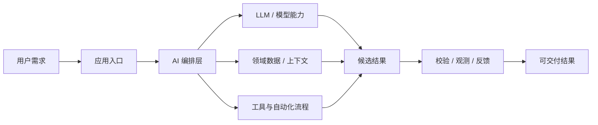
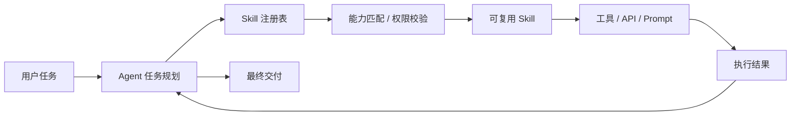
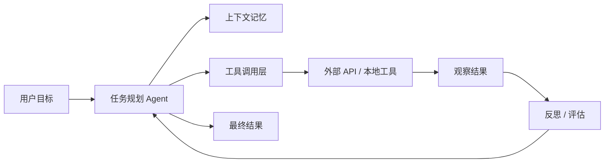
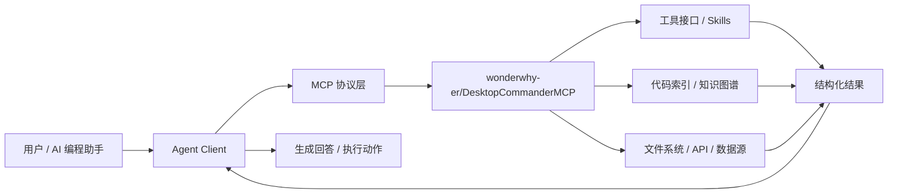

# GitHub AI Daily Trending Top 5

更新时间：2026-07-10T02:36:52Z

筛选范围：仓库名称或描述包含 AI 相关关键词。关键词：ai, agent, agents, agentic, llm, llms, skill, skills, mcp, model context protocol, chatgpt, openai, claude, gemini, copilot, deepseek, rag, embedding, embeddings, transformer, diffusion, machine learning, ml, deep learning, neural, inference, prompt, prompts。

网页版本：由 GitHub Pages 自动发布。

## 1. [MadsLorentzen/ai-job-search](https://github.com/MadsLorentzen/ai-job-search)

- 语言：TypeScript
- Stars：19,249
- 主题：未在 GitHub API 中公开 topics
- Star 趋势：

- 作用 / 解决的问题：AI-powered job application framework built on Claude Code. Fork it, fill in your profile, and let Claude evaluate jobs, tailor CVs, write cover letters, and prepare you for interviews.
- 适用场景：
  - 适合快速评估 GitHub AI 热榜中新出现或重新升温的技术方向，因为该仓库已获得短期社区关注。
  - 适合围绕 未在 GitHub API 中公开 topics 做技术调研、竞品分析或原型验证，因为仓库主题与当前 AI 热点高度相关。
- 架构思想：
  - 它成为热榜的核心原因通常不是单点功能，而是把模型能力、工具、数据和工作流组织成更容易落地的工程结构。
  - 当前 Stars 为 19,249，说明它不只是概念验证，还积累了可观的社区验证和传播势能。
  - 使用 TypeScript 作为主要实现语言，降低了对应生态开发者集成、扩展和二次开发的成本。
  - 它的稀缺性在于把热门 AI 能力包装成可运行、可组合、可观察的工程入口，而不是停留在论文、提示词或孤立 Demo。
- 原理 / 实现思路：
  - Note: This is an independent open-source project and is not affiliated with, endorsed by, sponsored by, or maintained by Anthropic. Anthropic and Claude Code are referenced only to describe the toolchain this workflow uses.
  - A structured workflow that turns Claude Code into a full-stack job application assistant. The core workflow (self-profiling, fit evaluation, and the drafter-reviewer application pipeline) is language- and country-agnostic. The job portal search skills are buil...
  - your profile   portals              Score & recommend
  - 以上内容由 GitHub 公开 README 自动摘取和归纳，适合作为快速了解入口，深入实现仍以仓库源码和文档为准。

## 2. [addyosmani/agent-skills](https://github.com/addyosmani/agent-skills)

- 语言：JavaScript
- Stars：75,972
- 主题：agent-skills, antigravity, claude-code, codex, cursor, skills
- Star 趋势：

- 作用 / 解决的问题：Production-grade engineering skills for AI coding agents.
- 适用场景：
  - 适合快速评估 GitHub AI 热榜中新出现或重新升温的技术方向，因为该仓库已获得短期社区关注。
  - 适合多步骤自动化、工具调用和复杂任务编排场景，因为 Agent 模式能把规划、执行、观察和修正串起来。
  - 适合团队沉淀可复用 AI 能力的场景，因为 Skill 把提示词、工具和流程封装成可发现、可组合的单元。
- 架构思想：
  - 它成为热榜的核心原因通常不是单点功能，而是把模型能力、工具、数据和工作流组织成更容易落地的工程结构。
  - 当前 Stars 为 75,972，说明它不只是概念验证，还积累了可观的社区验证和传播势能。
  - 相比只提供单一脚本的仓库，它用 agent-skills, antigravity, claude-code, codex, cursor, skills 等 topics 明确了能力边界，更容易被目标用户检索和采用。
  - 使用 JavaScript 作为主要实现语言，降低了对应生态开发者集成、扩展和二次开发的成本。
  - 它的稀缺性在于把热门 AI 能力包装成可运行、可组合、可观察的工程入口，而不是停留在论文、提示词或孤立 Demo。
- 原理 / 实现思路：
  - Production-grade engineering skills for AI coding agents.
  - Skills encode the workflows, quality gates, and best practices that senior engineers use when building software. These ones are packaged so AI agents follow them consistently across every phase of development.
  - DEFINE          PLAN           BUILD          VERIFY         REVIEW          SHIP
  - 以上内容由 GitHub 公开 README 自动摘取和归纳，适合作为快速了解入口，深入实现仍以仓库源码和文档为准。

## 3. [VoltAgent/awesome-design-md](https://github.com/VoltAgent/awesome-design-md)

- 语言：-
- Stars：99,829
- 主题：awesome-list, design-md, design-system, design-tokens, figma, google-stitch, landing-page, vibe-coding, vibe-design, vibecoding
- Star 趋势：

- 作用 / 解决的问题：A collection of DESIGN.md files analysis by popular brand design systems. Drop one into your project and let coding agents generate a matching UI.
- 适用场景：
  - 适合快速评估 GitHub AI 热榜中新出现或重新升温的技术方向，因为该仓库已获得短期社区关注。
  - 适合多步骤自动化、工具调用和复杂任务编排场景，因为 Agent 模式能把规划、执行、观察和修正串起来。
- 架构思想：
  - 它成为热榜的核心原因通常不是单点功能，而是把模型能力、工具、数据和工作流组织成更容易落地的工程结构。
  - 当前 Stars 为 99,829，说明它不只是概念验证，还积累了可观的社区验证和传播势能。
  - 相比只提供单一脚本的仓库，它用 awesome-list, design-md, design-system, design-tokens, figma, google-stitch, landing-page, vibe-coding, vibe-design, vibecoding 等 topics 明确了能力边界，更容易被目标用户检索和采用。
  - 它的稀缺性在于把热门 AI 能力包装成可运行、可组合、可观察的工程入口，而不是停留在论文、提示词或孤立 Demo。
- 原理 / 实现思路：
  - Copy a DESIGN.md into your project, tell your AI agent “build me a page that looks like this,” and generate high-quality UI that stays visually consistent with the design language.
  - Built with real design depth — including analyzed patterns, tokens, and rules — for high-quality UI generation, not surface-level outputs.
  - It's just a markdown file. No Figma exports, no JSON schemas, no special tooling. Drop it into your project root and any AI coding agent or Google Stitch instantly understands how your UI should look. Markdown is the format LLMs read best, so there's nothing t...
  - 以上内容由 GitHub 公开 README 自动摘取和归纳，适合作为快速了解入口，深入实现仍以仓库源码和文档为准。

## 4. [iOfficeAI/OfficeCLI](https://github.com/iOfficeAI/OfficeCLI)

- 语言：C#
- Stars：13,568
- 主题：agent, ai, claude-code, cli, codex, docx, excel, office, openclaw, pptx, presentation, skills, word, xlsx
- Star 趋势：

- 作用 / 解决的问题：OfficeCLI is the first and best Office suite purpose-built for AI agents to read, edit, and automate Word, Excel, and PowerPoint files. Free, open-source, single binary, no Office installation required.
- 适用场景：
  - 适合快速评估 GitHub AI 热榜中新出现或重新升温的技术方向，因为该仓库已获得短期社区关注。
  - 适合多步骤自动化、工具调用和复杂任务编排场景，因为 Agent 模式能把规划、执行、观察和修正串起来。
  - 适合团队沉淀可复用 AI 能力的场景，因为 Skill 把提示词、工具和流程封装成可发现、可组合的单元。
- 架构思想：
  - 它成为热榜的核心原因通常不是单点功能，而是把模型能力、工具、数据和工作流组织成更容易落地的工程结构。
  - 当前 Stars 为 13,568，说明它不只是概念验证，还积累了可观的社区验证和传播势能。
  - 相比只提供单一脚本的仓库，它用 agent, ai, claude-code, cli, codex, docx, excel, office, openclaw, pptx, presentation, skills, word, xlsx 等 topics 明确了能力边界，更容易被目标用户检索和采用。
  - 使用 C# 作为主要实现语言，降低了对应生态开发者集成、扩展和二次开发的成本。
  - 它的稀缺性在于把热门 AI 能力包装成可运行、可组合、可观察的工程入口，而不是停留在论文、提示词或孤立 Demo。
- 原理 / 实现思路：
  - OfficeCLI is the world's first and the best Office suite designed for AI agents.
  - Give any AI agent full control over Word, Excel, and PowerPoint — in one line of code.
  - Open-source. Single binary. No Office installation. No dependencies. Works everywhere.
  - 以上内容由 GitHub 公开 README 自动摘取和归纳，适合作为快速了解入口，深入实现仍以仓库源码和文档为准。

## 5. [wonderwhy-er/DesktopCommanderMCP](https://github.com/wonderwhy-er/DesktopCommanderMCP)

- 语言：TypeScript
- Stars：6,592
- 主题：agent, ai, code-analysis, code-generation, gemini-cli-extension, mcp, terminal-ai, terminal-automation, vibe-coding
- Star 趋势：

- 作用 / 解决的问题：This is MCP server for Claude that gives it terminal control, file system search and diff file editing capabilities
- 适用场景：
  - 适合快速评估 GitHub AI 热榜中新出现或重新升温的技术方向，因为该仓库已获得短期社区关注。
  - 适合需要把外部工具、代码库、数据源接入 AI Agent 的场景，因为 MCP 能把能力封装成标准工具接口。
  - 适合多步骤自动化、工具调用和复杂任务编排场景，因为 Agent 模式能把规划、执行、观察和修正串起来。
- 架构思想：
  - 它成为热榜的核心原因通常不是单点功能，而是把模型能力、工具、数据和工作流组织成更容易落地的工程结构。
  - 当前 Stars 为 6,592，说明它不只是概念验证，还积累了可观的社区验证和传播势能。
  - 相比只提供单一脚本的仓库，它用 agent, ai, code-analysis, code-generation, gemini-cli-extension, mcp, terminal-ai, terminal-automation, vibe-coding 等 topics 明确了能力边界，更容易被目标用户检索和采用。
  - 使用 TypeScript 作为主要实现语言，降低了对应生态开发者集成、扩展和二次开发的成本。
  - 它的稀缺性在于把热门 AI 能力包装成可运行、可组合、可观察的工程入口，而不是停留在论文、提示词或孤立 Demo。
- 原理 / 实现思路：
  - Search, update, manage files and run terminal commands with AI
  - Work with code and text, run processes, and automate tasks, going far beyond other AI editors - while using host client subscriptions instead of API token costs.
  - Want a better experience? The Desktop Commander App gives you everything the MCP server does, plus:
  - 以上内容由 GitHub 公开 README 自动摘取和归纳，适合作为快速了解入口，深入实现仍以仓库源码和文档为准。

