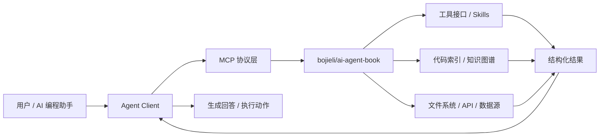
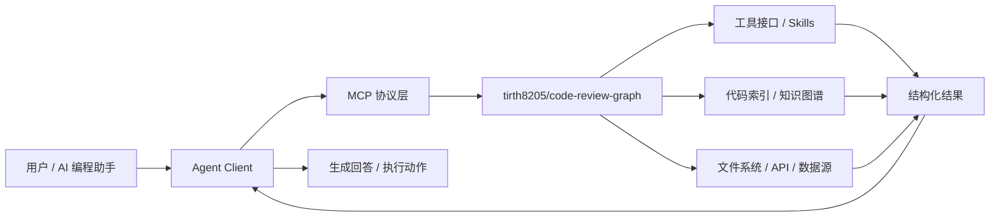
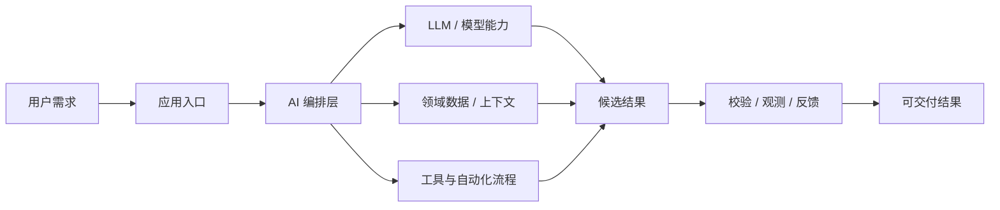

# GitHub AI Daily Trending Top 5

更新时间：2026-07-20T03:18:34Z

筛选范围：仓库名称或描述包含 AI 相关关键词。关键词：ai, agent, agents, agentic, llm, llms, skill, skills, mcp, model context protocol, chatgpt, openai, claude, gemini, copilot, deepseek, rag, embedding, embeddings, transformer, diffusion, machine learning, ml, deep learning, neural, inference, prompt, prompts。

网页版本：由 GitHub Pages 自动发布。

## 1. [bojieli/ai-agent-book](https://github.com/bojieli/ai-agent-book)

- 语言：Python
- Stars：6,392
- 主题：agent, agent-memory, ai-agent, book, coding-agent, context-engineering, large-language-models, llm, mcp, multi-agent, multimodal, rag, reinforcement-learning
- Star 趋势：

- 作用 / 解决的问题：《深入理解 AI Agent：设计原理与工程实践》（李博杰 著）开源主仓库：全书正文、编译版 PDF 与按章配套代码
- 适用场景：
  - 适合快速评估 GitHub AI 热榜中新出现或重新升温的技术方向，因为该仓库已获得短期社区关注。
  - 适合需要把外部工具、代码库、数据源接入 AI Agent 的场景，因为 MCP 能把能力封装成标准工具接口。
  - 适合知识库问答、文档检索和企业内部搜索场景，因为 RAG 能把私有数据补充进 LLM 上下文。
  - 适合多步骤自动化、工具调用和复杂任务编排场景，因为 Agent 模式能把规划、执行、观察和修正串起来。
- 架构思想：
  - 它成为热榜的核心原因通常不是单点功能，而是把模型能力、工具、数据和工作流组织成更容易落地的工程结构。
  - 当前 Stars 为 6,392，说明它不只是概念验证，还积累了可观的社区验证和传播势能。
  - 相比只提供单一脚本的仓库，它用 agent, agent-memory, ai-agent, book, coding-agent, context-engineering, large-language-models, llm, mcp, multi-agent, multimodal, rag, reinforcement-learning 等 topics 明确了能力边界，更容易被目标用户检索和采用。
  - 使用 Python 作为主要实现语言，降低了对应生态开发者集成、扩展和二次开发的成本。
  - 它的稀缺性在于把热门 AI 能力包装成可运行、可组合、可观察的工程入口，而不是停留在论文、提示词或孤立 Demo。
- 原理 / 实现思路：
  - 深入理解 AI Agent：设计原理与工程实践
  - [English](README.en.md) \| 中文 \| [Tiếng Việt](README.vi.md) \| [தமிழ்](README.ta.md)
  - 本仓库是《深入理解 AI Agent：设计原理与工程实践》一书的开源主仓库，包含全书正文与配套示例代码。全书正文、配图与配套实验代码全部开源，欢迎把实验亲手跑一遍、提 issue 和 PR。
  - 以上内容由 GitHub 公开 README 自动摘取和归纳，适合作为快速了解入口，深入实现仍以仓库源码和文档为准。

## 2. [tirth8205/code-review-graph](https://github.com/tirth8205/code-review-graph)

- 语言：Python
- Stars：21,477
- 主题：ai-coding, claude, claude-code, code-review, graphrag, incremental, knowledge-graph, llm, mcp, python, static-analysis, tree-sitter
- Star 趋势：

- 作用 / 解决的问题：Local-first code intelligence graph for MCP and CLI. Builds a persistent map of your codebase so AI coding tools read only what matters, with benchmarked context reductions on reviews and large-repo workflows.
- 适用场景：
  - 适合快速评估 GitHub AI 热榜中新出现或重新升温的技术方向，因为该仓库已获得短期社区关注。
  - 适合需要把外部工具、代码库、数据源接入 AI Agent 的场景，因为 MCP 能把能力封装成标准工具接口。
- 架构思想：
  - 它成为热榜的核心原因通常不是单点功能，而是把模型能力、工具、数据和工作流组织成更容易落地的工程结构。
  - 当前 Stars 为 21,477，说明它不只是概念验证，还积累了可观的社区验证和传播势能。
  - 相比只提供单一脚本的仓库，它用 ai-coding, claude, claude-code, code-review, graphrag, incremental, knowledge-graph, llm, mcp, python, static-analysis, tree-sitter 等 topics 明确了能力边界，更容易被目标用户检索和采用。
  - 使用 Python 作为主要实现语言，降低了对应生态开发者集成、扩展和二次开发的成本。
  - 它的稀缺性在于把热门 AI 能力包装成可运行、可组合、可观察的工程入口，而不是停留在论文、提示词或孤立 Demo。
- 原理 / 实现思路：
  - pip install code-review-graph                     # or: pipx install code-review-graph
  - code-review-graph install          # auto-detects and configures all supported platforms
  - code-review-graph build            # parse your codebase
  - 以上内容由 GitHub 公开 README 自动摘取和归纳，适合作为快速了解入口，深入实现仍以仓库源码和文档为准。

## 3. [kvcache-ai/ktransformers](https://github.com/kvcache-ai/ktransformers)

- 语言：Python
- Stars：18,427
- 主题：未在 GitHub API 中公开 topics
- Star 趋势：

- 作用 / 解决的问题：A Flexible Framework for Experiencing Heterogeneous LLM Inference/Fine-tune Optimizations
- 适用场景：
  - 适合快速评估 GitHub AI 热榜中新出现或重新升温的技术方向，因为该仓库已获得短期社区关注。
  - 适合围绕 未在 GitHub API 中公开 topics 做技术调研、竞品分析或原型验证，因为仓库主题与当前 AI 热点高度相关。
- 架构思想：
  - 它成为热榜的核心原因通常不是单点功能，而是把模型能力、工具、数据和工作流组织成更容易落地的工程结构。
  - 当前 Stars 为 18,427，说明它不只是概念验证，还积累了可观的社区验证和传播势能。
  - 使用 Python 作为主要实现语言，降低了对应生态开发者集成、扩展和二次开发的成本。
  - 它的稀缺性在于把热门 AI 能力包装成可运行、可组合、可观察的工程入口，而不是停留在论文、提示词或孤立 Demo。
- 原理 / 实现思路：
  - KTransformers is a research project focused on efficient inference and fine-tuning of large language models through CPU-GPU heterogeneous computing. The project now exposes two user-facing capabilities from the kt-kernel source tree: [Inference](./kt-kernel/RE...
  - June 21, 2026: MiniMax-M3 Day0 Support! ([Tutorial](./doc/en/kt-kernel/MiniMax-M3-Tutorial.md))
  - June 17, 2026: GLM-5.2 Day0 Support! ([Tutorial](./doc/en/kt-kernel/GLM-5.2-Tutorial.md))
  - 以上内容由 GitHub 公开 README 自动摘取和归纳，适合作为快速了解入口，深入实现仍以仓库源码和文档为准。

## 4. [rohitg00/ai-engineering-from-scratch](https://github.com/rohitg00/ai-engineering-from-scratch)

- 语言：Python
- Stars：39,800
- 主题：agents, ai, ai-agents, ai-engineering, computer-vision, course, deep-learning, from-scratch, generative-ai, llm, machine-learning, mcp, nlp, python, reinforcement-learning, rust, swarm-intelligence, transformers, tutorial, typescript
- Star 趋势：

- 作用 / 解决的问题：Learn it. Build it. Ship it for others.
- 适用场景：
  - 适合快速评估 GitHub AI 热榜中新出现或重新升温的技术方向，因为该仓库已获得短期社区关注。
  - 适合需要把外部工具、代码库、数据源接入 AI Agent 的场景，因为 MCP 能把能力封装成标准工具接口。
  - 适合多步骤自动化、工具调用和复杂任务编排场景，因为 Agent 模式能把规划、执行、观察和修正串起来。
- 架构思想：
  - 它成为热榜的核心原因通常不是单点功能，而是把模型能力、工具、数据和工作流组织成更容易落地的工程结构。
  - 当前 Stars 为 39,800，说明它不只是概念验证，还积累了可观的社区验证和传播势能。
  - 相比只提供单一脚本的仓库，它用 agents, ai, ai-agents, ai-engineering, computer-vision, course, deep-learning, from-scratch, generative-ai, llm, machine-learning, mcp, nlp, python, reinforcement-learning, rust, swarm-intelligence, transformers, tutorial, typescript 等 topics 明确了能力边界，更容易被目标用户检索和采用。
  - 使用 Python 作为主要实现语言，降低了对应生态开发者集成、扩展和二次开发的成本。
  - 它的稀缺性在于把热门 AI 能力包装成可运行、可组合、可观察的工程入口，而不是停留在论文、提示词或孤立 Demo。
- 原理 / 实现思路：
  - 84% of students already use AI tools. Only 18% feel prepared to use them
  - 503 lessons. 20 phases. ~320 hours. Python, TypeScript, Rust, Julia. Every lesson ships
  - a reusable artifact: a prompt, a skill, an agent, an MCP server. Free, open source, MIT.
  - 以上内容由 GitHub 公开 README 自动摘取和归纳，适合作为快速了解入口，深入实现仍以仓库源码和文档为准。

## 5. [jamiepine/voicebox](https://github.com/jamiepine/voicebox)

- 语言：TypeScript
- Stars：43,466
- 主题：ai, cuda, mlx, qwen3-tts, qwen3-tts-ui, voice-ai, voice-clone, whisper
- Star 趋势：

- 作用 / 解决的问题：The open-source AI voice studio. Clone, dictate, create.
- 适用场景：
  - 适合快速评估 GitHub AI 热榜中新出现或重新升温的技术方向，因为该仓库已获得短期社区关注。
  - 适合围绕 ai, cuda, mlx, qwen3-tts, qwen3-tts-ui, voice-ai, voice-clone, whisper 做技术调研、竞品分析或原型验证，因为仓库主题与当前 AI 热点高度相关。
- 架构思想：
  - 它成为热榜的核心原因通常不是单点功能，而是把模型能力、工具、数据和工作流组织成更容易落地的工程结构。
  - 当前 Stars 为 43,466，说明它不只是概念验证，还积累了可观的社区验证和传播势能。
  - 相比只提供单一脚本的仓库，它用 ai, cuda, mlx, qwen3-tts, qwen3-tts-ui, voice-ai, voice-clone, whisper 等 topics 明确了能力边界，更容易被目标用户检索和采用。
  - 使用 TypeScript 作为主要实现语言，降低了对应生态开发者集成、扩展和二次开发的成本。
  - 它的稀缺性在于把热门 AI 能力包装成可运行、可组合、可观察的工程入口，而不是停留在论文、提示词或孤立 Demo。
- 原理 / 实现思路：
  - Clone any voice. Generate speech. Dictate into any app. Talk to agents in voices you own. 
  - The full voice I/O stack, running locally on your machine.
  - Voicebox is a local-first AI voice studio — a free and open-source alternative to ElevenLabs and WisprFlow in one app. Clone voices from a few seconds of audio, generate speech in 23 languages across 7 TTS engines, dictate into any text field with a global hot...
  - 以上内容由 GitHub 公开 README 自动摘取和归纳，适合作为快速了解入口，深入实现仍以仓库源码和文档为准。

