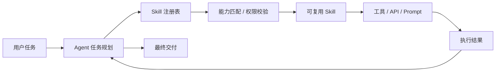
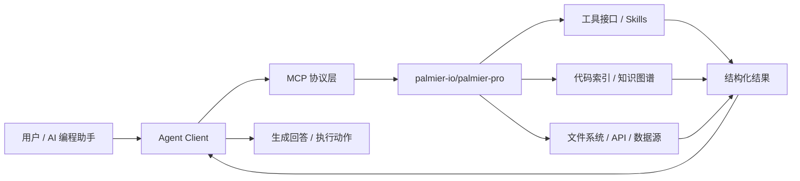
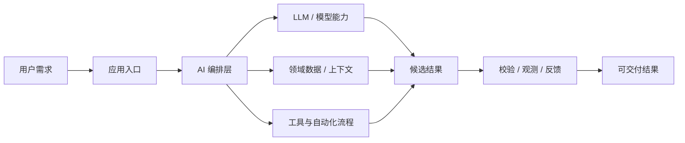
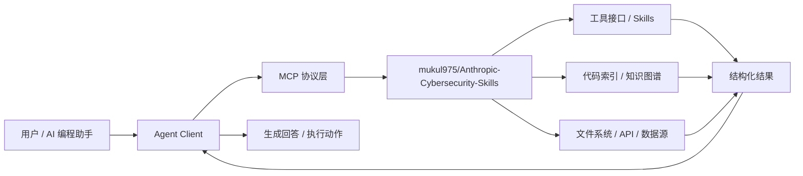

# GitHub AI Daily Trending Top 5

更新时间：2026-06-23T02:50:49Z

筛选范围：仓库名称或描述包含 AI 相关关键词。关键词：ai, agent, agents, agentic, llm, llms, skill, skills, mcp, model context protocol, chatgpt, openai, claude, gemini, copilot, deepseek, rag, embedding, embeddings, transformer, diffusion, machine learning, ml, deep learning, neural, inference, prompt, prompts。

网页版本：由 GitHub Pages 自动发布。

## 1. [calesthio/OpenMontage](https://github.com/calesthio/OpenMontage)

- 语言：Python
- Stars：12,443
- 主题：agent, agentic-ai, ai, claude, copilot, cursor, elevenlabs, ffmpeg, flux, image-generation, open-source, openai, python, remotion, stable-diffusion, text-to-speech, text-to-video, video-generation, video-production
- Star 趋势：

- 作用 / 解决的问题：World's first open-source, agentic video production system. 12 pipelines, 52 tools, 500+ agent skills. Turn your AI coding assistant into a full video production studio.
- 适用场景：
  - 适合快速评估 GitHub AI 热榜中新出现或重新升温的技术方向，因为该仓库已获得短期社区关注。
  - 适合多步骤自动化、工具调用和复杂任务编排场景，因为 Agent 模式能把规划、执行、观察和修正串起来。
  - 适合团队沉淀可复用 AI 能力的场景，因为 Skill 把提示词、工具和流程封装成可发现、可组合的单元。
- 架构思想：
  - 它成为热榜的核心原因通常不是单点功能，而是把模型能力、工具、数据和工作流组织成更容易落地的工程结构。
  - 当前 Stars 为 12,443，说明它不只是概念验证，还积累了可观的社区验证和传播势能。
  - 相比只提供单一脚本的仓库，它用 agent, agentic-ai, ai, claude, copilot, cursor, elevenlabs, ffmpeg, flux, image-generation, open-source, openai, python, remotion, stable-diffusion, text-to-speech, text-to-video, video-generation, video-production 等 topics 明确了能力边界，更容易被目标用户检索和采用。
  - 使用 Python 作为主要实现语言，降低了对应生态开发者集成、扩展和二次开发的成本。
  - 它的稀缺性在于把热门 AI 能力包装成可运行、可组合、可观察的工程入口，而不是停留在论文、提示词或孤立 Demo。
- 原理 / 实现思路：
  - Turn your AI coding assistant into a full video production studio. Describe what you want in plain language — your agent handles research, scripting, asset generation, editing, and final composition.
  - Important distinction: OpenMontage can make image-based videos, but it can also make a real video video for free/open-source workflows: the agent builds a corpus from free stock footage and open archives, retrieves actual motion clips, edits them into a timeli...
  - "SIGNAL FROM TOMORROW" — a cinematic sci-fi trailer fully produced through OpenMontage: concept, script, scene plan, Veo-generated motion clips, soundtrack, and Remotion composition.
  - 以上内容由 GitHub 公开 README 自动摘取和归纳，适合作为快速了解入口，深入实现仍以仓库源码和文档为准。

## 2. [palmier-io/palmier-pro](https://github.com/palmier-io/palmier-pro)

- 语言：Swift
- Stars：7,531
- 主题：ai-video, claude, macos, mcp, seedance2, swift, video-editor
- Star 趋势：

- 作用 / 解决的问题：macOS video editor built for AI
- 适用场景：
  - 适合快速评估 GitHub AI 热榜中新出现或重新升温的技术方向，因为该仓库已获得短期社区关注。
  - 适合需要把外部工具、代码库、数据源接入 AI Agent 的场景，因为 MCP 能把能力封装成标准工具接口。
- 架构思想：
  - 它成为热榜的核心原因通常不是单点功能，而是把模型能力、工具、数据和工作流组织成更容易落地的工程结构。
  - 当前 Stars 为 7,531，说明它不只是概念验证，还积累了可观的社区验证和传播势能。
  - 相比只提供单一脚本的仓库，它用 ai-video, claude, macos, mcp, seedance2, swift, video-editor 等 topics 明确了能力边界，更容易被目标用户检索和采用。
  - 使用 Swift 作为主要实现语言，降低了对应生态开发者集成、扩展和二次开发的成本。
  - 它的稀缺性在于把热门 AI 能力包装成可运行、可组合、可观察的工程入口，而不是停留在论文、提示词或孤立 Demo。
- 原理 / 实现思路：
  - Palmier Pro is an open source video editor for Mac. You and your agent can generate and edit videos together inside the timeline.
  - We built Palmier Pro from scratch with Swift. The north star is Premiere Pro, with our take on integrating AI into the workflow.
  - Generate videos and images with SOTA models like Seedance, Kling, Nano Banana Pro inside the timeline editor.
  - 以上内容由 GitHub 公开 README 自动摘取和归纳，适合作为快速了解入口，深入实现仍以仓库源码和文档为准。

## 3. [jamiepine/voicebox](https://github.com/jamiepine/voicebox)

- 语言：TypeScript
- Stars：32,370
- 主题：ai, cuda, mlx, qwen3-tts, qwen3-tts-ui, voice-ai, voice-clone, whisper
- Star 趋势：

- 作用 / 解决的问题：The open-source AI voice studio. Clone, dictate, create.
- 适用场景：
  - 适合快速评估 GitHub AI 热榜中新出现或重新升温的技术方向，因为该仓库已获得短期社区关注。
  - 适合围绕 ai, cuda, mlx, qwen3-tts, qwen3-tts-ui, voice-ai, voice-clone, whisper 做技术调研、竞品分析或原型验证，因为仓库主题与当前 AI 热点高度相关。
- 架构思想：
  - 它成为热榜的核心原因通常不是单点功能，而是把模型能力、工具、数据和工作流组织成更容易落地的工程结构。
  - 当前 Stars 为 32,370，说明它不只是概念验证，还积累了可观的社区验证和传播势能。
  - 相比只提供单一脚本的仓库，它用 ai, cuda, mlx, qwen3-tts, qwen3-tts-ui, voice-ai, voice-clone, whisper 等 topics 明确了能力边界，更容易被目标用户检索和采用。
  - 使用 TypeScript 作为主要实现语言，降低了对应生态开发者集成、扩展和二次开发的成本。
  - 它的稀缺性在于把热门 AI 能力包装成可运行、可组合、可观察的工程入口，而不是停留在论文、提示词或孤立 Demo。
- 原理 / 实现思路：
  - Clone any voice. Generate speech. Dictate into any app. Talk to agents in voices you own. 
  - The full voice I/O stack, running locally on your machine.
  - Voicebox is a local-first AI voice studio — a free and open-source alternative to ElevenLabs and WisprFlow in one app. Clone voices from a few seconds of audio, generate speech in 23 languages across 7 TTS engines, dictate into any text field with a global hot...
  - 以上内容由 GitHub 公开 README 自动摘取和归纳，适合作为快速了解入口，深入实现仍以仓库源码和文档为准。

## 4. [mukul975/Anthropic-Cybersecurity-Skills](https://github.com/mukul975/Anthropic-Cybersecurity-Skills)

- 语言：Python
- Stars：18,801
- 主题：ai-agents, claude-code, cloud-security, cybersecurity, devsecops, ethical-hacking, incident-response, infosec, llm, malware-analysis, mcp, mitre-attack, nist-csf, osint, penetration-testing, red-team, security, security-automation, threat-hunting, threat-intelligence
- Star 趋势：

- 作用 / 解决的问题：817 structured cybersecurity skills for AI agents · Mapped to 6 frameworks: MITRE ATT&CK, NIST CSF 2.0, MITRE ATLAS, D3FEND, NIST AI RMF & MITRE F3 (Fight Fraud) · agentskills.io standard · Works with Claude Code, GitHub Copilot, Codex CLI, Cursor, Gemini CLI & 20+ platforms · 29 security domains · Apache 2.0
- 适用场景：
  - 适合快速评估 GitHub AI 热榜中新出现或重新升温的技术方向，因为该仓库已获得短期社区关注。
  - 适合需要把外部工具、代码库、数据源接入 AI Agent 的场景，因为 MCP 能把能力封装成标准工具接口。
  - 适合多步骤自动化、工具调用和复杂任务编排场景，因为 Agent 模式能把规划、执行、观察和修正串起来。
  - 适合团队沉淀可复用 AI 能力的场景，因为 Skill 把提示词、工具和流程封装成可发现、可组合的单元。
- 架构思想：
  - 它成为热榜的核心原因通常不是单点功能，而是把模型能力、工具、数据和工作流组织成更容易落地的工程结构。
  - 当前 Stars 为 18,801，说明它不只是概念验证，还积累了可观的社区验证和传播势能。
  - 相比只提供单一脚本的仓库，它用 ai-agents, claude-code, cloud-security, cybersecurity, devsecops, ethical-hacking, incident-response, infosec, llm, malware-analysis, mcp, mitre-attack, nist-csf, osint, penetration-testing, red-team, security, security-automation, threat-hunting, threat-intelligence 等 topics 明确了能力边界，更容易被目标用户检索和采用。
  - 使用 Python 作为主要实现语言，降低了对应生态开发者集成、扩展和二次开发的成本。
  - 它的稀缺性在于把热门 AI 能力包装成可运行、可组合、可观察的工程入口，而不是停留在论文、提示词或孤立 Demo。
- 原理 / 实现思路：
  - The largest open-source cybersecurity skills library for AI agents
  - 817 production-grade cybersecurity skills · 29 security domains · 6 framework mappings · 26+ AI platforms
  - [Get Started](#quick-start) · [What's Inside](#whats-inside--29-security-domains) · [Frameworks](#five-frameworks-one-skill-library) · [Platforms](#compatible-platforms) · [Contributing](#contributing)
  - 以上内容由 GitHub 公开 README 自动摘取和归纳，适合作为快速了解入口，深入实现仍以仓库源码和文档为准。

## 5. [garrytan/gstack](https://github.com/garrytan/gstack)

- 语言：TypeScript
- Stars：113,239
- 主题：未在 GitHub API 中公开 topics
- Star 趋势：

- 作用 / 解决的问题：Use Garry Tan's exact Claude Code setup: 23 opinionated tools that serve as CEO, Designer, Eng Manager, Release Manager, Doc Engineer, and QA
- 适用场景：
  - 适合快速评估 GitHub AI 热榜中新出现或重新升温的技术方向，因为该仓库已获得短期社区关注。
  - 适合围绕 未在 GitHub API 中公开 topics 做技术调研、竞品分析或原型验证，因为仓库主题与当前 AI 热点高度相关。
- 架构思想：
  - 它成为热榜的核心原因通常不是单点功能，而是把模型能力、工具、数据和工作流组织成更容易落地的工程结构。
  - 当前 Stars 为 113,239，说明它不只是概念验证，还积累了可观的社区验证和传播势能。
  - 使用 TypeScript 作为主要实现语言，降低了对应生态开发者集成、扩展和二次开发的成本。
  - 它的稀缺性在于把热门 AI 能力包装成可运行、可组合、可观察的工程入口，而不是停留在论文、提示词或孤立 Demo。
- 原理 / 实现思路：
  - gstack is my answer. I've been building products for twenty years, and right now I'm shipping more products than I ever have. In the last 60 days: 3 production services, 40+ shipped features, part-time, while running YC full-time. On logical code change — not ...
  - The LOC critics aren't wrong that raw line counts inflate with AI. They are wrong that normalized-for-inflation, I'm less productive. I'm more productive, by a lot. Full methodology, caveats, and reproduction script: [On the LOC Controversy](docs/ON_THE_LOC_CO...
  - 2013 — when I built Bookface at YC (772 contributions):
  - 以上内容由 GitHub 公开 README 自动摘取和归纳，适合作为快速了解入口，深入实现仍以仓库源码和文档为准。

