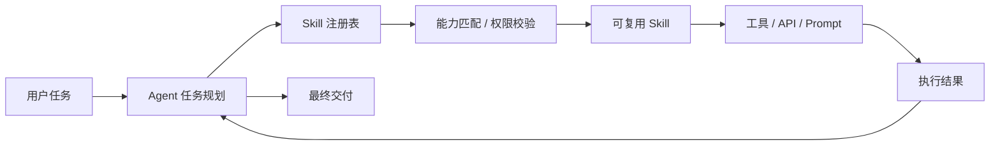
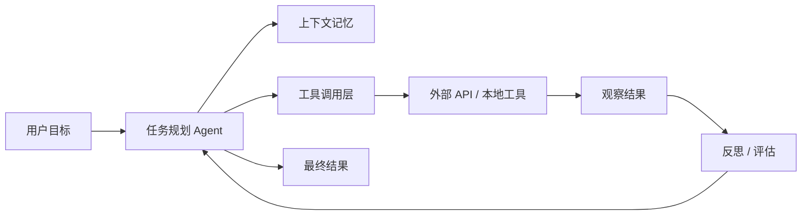
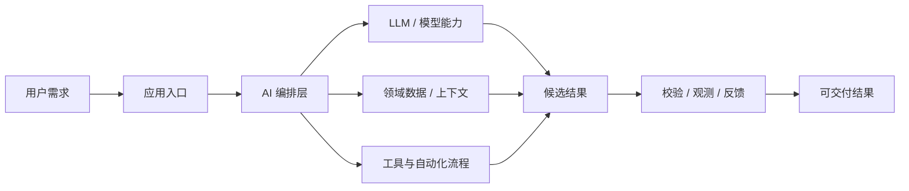

# GitHub AI Daily Trending Top 5

更新时间：2026-07-09T02:34:45Z

筛选范围：仓库名称或描述包含 AI 相关关键词。关键词：ai, agent, agents, agentic, llm, llms, skill, skills, mcp, model context protocol, chatgpt, openai, claude, gemini, copilot, deepseek, rag, embedding, embeddings, transformer, diffusion, machine learning, ml, deep learning, neural, inference, prompt, prompts。

网页版本：由 GitHub Pages 自动发布。

## 1. [addyosmani/agent-skills](https://github.com/addyosmani/agent-skills)

- 语言：JavaScript
- Stars：74,284
- 主题：agent-skills, antigravity, claude-code, codex, cursor, skills
- Star 趋势：

- 作用 / 解决的问题：Production-grade engineering skills for AI coding agents.
- 适用场景：
  - 适合快速评估 GitHub AI 热榜中新出现或重新升温的技术方向，因为该仓库已获得短期社区关注。
  - 适合多步骤自动化、工具调用和复杂任务编排场景，因为 Agent 模式能把规划、执行、观察和修正串起来。
  - 适合团队沉淀可复用 AI 能力的场景，因为 Skill 把提示词、工具和流程封装成可发现、可组合的单元。
- 架构思想：
  - 它成为热榜的核心原因通常不是单点功能，而是把模型能力、工具、数据和工作流组织成更容易落地的工程结构。
  - 当前 Stars 为 74,284，说明它不只是概念验证，还积累了可观的社区验证和传播势能。
  - 相比只提供单一脚本的仓库，它用 agent-skills, antigravity, claude-code, codex, cursor, skills 等 topics 明确了能力边界，更容易被目标用户检索和采用。
  - 使用 JavaScript 作为主要实现语言，降低了对应生态开发者集成、扩展和二次开发的成本。
  - 它的稀缺性在于把热门 AI 能力包装成可运行、可组合、可观察的工程入口，而不是停留在论文、提示词或孤立 Demo。
- 原理 / 实现思路：
  - Production-grade engineering skills for AI coding agents.
  - Skills encode the workflows, quality gates, and best practices that senior engineers use when building software. These ones are packaged so AI agents follow them consistently across every phase of development.
  - DEFINE          PLAN           BUILD          VERIFY         REVIEW          SHIP
  - 以上内容由 GitHub 公开 README 自动摘取和归纳，适合作为快速了解入口，深入实现仍以仓库源码和文档为准。

## 2. [TencentCloud/TencentDB-Agent-Memory](https://github.com/TencentCloud/TencentDB-Agent-Memory)

- 语言：TypeScript
- Stars：7,709
- 主题：agent, ai-agent, embedding, llm, local-first, long-term-memory, memory, openclaw-plugin, vector-search
- Star 趋势：

- 作用 / 解决的问题：TencentDB Agent Memory delivers fully local long-term memory for AI Agents via a 4-tier progressive pipeline, with zero external API dependencies.
- 适用场景：
  - 适合快速评估 GitHub AI 热榜中新出现或重新升温的技术方向，因为该仓库已获得短期社区关注。
  - 适合多步骤自动化、工具调用和复杂任务编排场景，因为 Agent 模式能把规划、执行、观察和修正串起来。
- 架构思想：
  - 它成为热榜的核心原因通常不是单点功能，而是把模型能力、工具、数据和工作流组织成更容易落地的工程结构。
  - 当前 Stars 为 7,709，说明它不只是概念验证，还积累了可观的社区验证和传播势能。
  - 相比只提供单一脚本的仓库，它用 agent, ai-agent, embedding, llm, local-first, long-term-memory, memory, openclaw-plugin, vector-search 等 topics 明确了能力边界，更容易被目标用户检索和采用。
  - 使用 TypeScript 作为主要实现语言，降低了对应生态开发者集成、扩展和二次开发的成本。
  - 它的稀缺性在于把热门 AI 能力包装成可运行、可组合、可观察的工程入口，而不是停留在论文、提示词或孤立 Demo。
- 原理 / 实现思路：
  - [Highlights](#-highlights) · [Overview](#overview) · [Core Technology](#core-technology-reject-flat-storage-embrace-layering-and-symbolization) · [Features](#-features) · [Quick Start](#quick-start)
  - [English](./README.md) · [简体中文](./README_CN.md)
  - TencentDB Agent Memory = symbolic short-term memory + layered long-term memory.
  - 以上内容由 GitHub 公开 README 自动摘取和归纳，适合作为快速了解入口，深入实现仍以仓库源码和文档为准。

## 3. [mvanhorn/last30days-skill](https://github.com/mvanhorn/last30days-skill)

- 语言：Python
- Stars：50,797
- 主题：ai-prompts, ai-skill, bluesky, claude, claude-code, clawhub, deep-research, hackernews, instagram, openclaw, polymarket, recency, reddit, research, social-media, tiktok, trends, twitter, web-search, youtube
- Star 趋势：

- 作用 / 解决的问题：AI agent skill that researches any topic across Reddit, X, YouTube, HN, Polymarket, and the web - then synthesizes a grounded summary
- 适用场景：
  - 适合快速评估 GitHub AI 热榜中新出现或重新升温的技术方向，因为该仓库已获得短期社区关注。
  - 适合多步骤自动化、工具调用和复杂任务编排场景，因为 Agent 模式能把规划、执行、观察和修正串起来。
  - 适合团队沉淀可复用 AI 能力的场景，因为 Skill 把提示词、工具和流程封装成可发现、可组合的单元。
- 架构思想：
  - 它成为热榜的核心原因通常不是单点功能，而是把模型能力、工具、数据和工作流组织成更容易落地的工程结构。
  - 当前 Stars 为 50,797，说明它不只是概念验证，还积累了可观的社区验证和传播势能。
  - 相比只提供单一脚本的仓库，它用 ai-prompts, ai-skill, bluesky, claude, claude-code, clawhub, deep-research, hackernews, instagram, openclaw, polymarket, recency, reddit, research, social-media, tiktok, trends, twitter, web-search, youtube 等 topics 明确了能力边界，更容易被目标用户检索和采用。
  - 使用 Python 作为主要实现语言，降低了对应生态开发者集成、扩展和二次开发的成本。
  - 它的稀缺性在于把热门 AI 能力包装成可运行、可组合、可观察的工程入口，而不是停留在论文、提示词或孤立 Demo。
- 原理 / 实现思路：
  - An AI agent-led search engine scored by upvotes, likes, and real money - not editors.
  - This README tracks the current v3 pipeline. The runtime skill spec lives in [skills/last30days/SKILL.md](skills/last30days/SKILL.md), which is the source of truth for the latest command and setup behavior.
  - Claude Code (recommended — auto-updates via marketplace):
  - 以上内容由 GitHub 公开 README 自动摘取和归纳，适合作为快速了解入口，深入实现仍以仓库源码和文档为准。

## 4. [iOfficeAI/OfficeCLI](https://github.com/iOfficeAI/OfficeCLI)

- 语言：C#
- Stars：12,030
- 主题：agent, ai, claude-code, cli, codex, docx, excel, office, openclaw, pptx, presentation, skills, word, xlsx
- Star 趋势：

- 作用 / 解决的问题：OfficeCLI is the first and best Office suite purpose-built for AI agents to read, edit, and automate Word, Excel, and PowerPoint files. Free, open-source, single binary, no Office installation required.
- 适用场景：
  - 适合快速评估 GitHub AI 热榜中新出现或重新升温的技术方向，因为该仓库已获得短期社区关注。
  - 适合多步骤自动化、工具调用和复杂任务编排场景，因为 Agent 模式能把规划、执行、观察和修正串起来。
  - 适合团队沉淀可复用 AI 能力的场景，因为 Skill 把提示词、工具和流程封装成可发现、可组合的单元。
- 架构思想：
  - 它成为热榜的核心原因通常不是单点功能，而是把模型能力、工具、数据和工作流组织成更容易落地的工程结构。
  - 当前 Stars 为 12,030，说明它不只是概念验证，还积累了可观的社区验证和传播势能。
  - 相比只提供单一脚本的仓库，它用 agent, ai, claude-code, cli, codex, docx, excel, office, openclaw, pptx, presentation, skills, word, xlsx 等 topics 明确了能力边界，更容易被目标用户检索和采用。
  - 使用 C# 作为主要实现语言，降低了对应生态开发者集成、扩展和二次开发的成本。
  - 它的稀缺性在于把热门 AI 能力包装成可运行、可组合、可观察的工程入口，而不是停留在论文、提示词或孤立 Demo。
- 原理 / 实现思路：
  - OfficeCLI is the world's first and the best Office suite designed for AI agents.
  - Give any AI agent full control over Word, Excel, and PowerPoint — in one line of code.
  - Open-source. Single binary. No Office installation. No dependencies. Works everywhere.
  - 以上内容由 GitHub 公开 README 自动摘取和归纳，适合作为快速了解入口，深入实现仍以仓库源码和文档为准。

## 5. [asgeirtj/system_prompts_leaks](https://github.com/asgeirtj/system_prompts_leaks)

- 语言：JavaScript
- Stars：54,282
- 主题：ai, ai-agents, anthropic, awesome, chatbot, chatgpt, claude, claude-code, codex, deep-learning, education, gemini, generative-ai, google, llm, machine-learning, nlp, open-source, openai, prompt-engineering
- Star 趋势：

- 作用 / 解决的问题：Extracted system prompts from Anthropic - Claude Fable 5, Opus 4.8, Claude Code, Claude Design. OpenAI - ChatGPT 5.5 Thinking, GPT 5.5 Instant, Codex. Google - Gemini 3.5 Flash, 3.1 Pro, Antigravity. xAI - Grok, Cursor, Copilot, VS Code, Perplexity, and more. Updated regularly.
- 适用场景：
  - 适合快速评估 GitHub AI 热榜中新出现或重新升温的技术方向，因为该仓库已获得短期社区关注。
  - 适合围绕 ai, ai-agents, anthropic, awesome, chatbot, chatgpt, claude, claude-code, codex, deep-learning, education, gemini, generative-ai, google, llm, machine-learning, nlp, open-source, openai, prompt-engineering 做技术调研、竞品分析或原型验证，因为仓库主题与当前 AI 热点高度相关。
- 架构思想：
  - 它成为热榜的核心原因通常不是单点功能，而是把模型能力、工具、数据和工作流组织成更容易落地的工程结构。
  - 当前 Stars 为 54,282，说明它不只是概念验证，还积累了可观的社区验证和传播势能。
  - 相比只提供单一脚本的仓库，它用 ai, ai-agents, anthropic, awesome, chatbot, chatgpt, claude, claude-code, codex, deep-learning, education, gemini, generative-ai, google, llm, machine-learning, nlp, open-source, openai, prompt-engineering 等 topics 明确了能力边界，更容易被目标用户检索和采用。
  - 使用 JavaScript 作为主要实现语言，降低了对应生态开发者集成、扩展和二次开发的成本。
  - 它的稀缺性在于把热门 AI 能力包装成可运行、可组合、可观察的工程入口，而不是停留在论文、提示词或孤立 Demo。
- 原理 / 实现思路：
  - The purpose of this repo is to document the System Prompt instructions for all the AI chatbots out there - Claude, ChatGPT, Gemini etc.
  - \| Claude Sonnet 5 \| July 1, 2026 \| [System prompt](Anthropic/claude-sonnet-5.md) \|
  - \| Claude Design (Opus 4.8 — full prompt + 48 tools + 16 skills + 9 starter sources) \| June 26, 2026 \| [System prompt](Anthropic/claude-design.md) \|
  - 以上内容由 GitHub 公开 README 自动摘取和归纳，适合作为快速了解入口，深入实现仍以仓库源码和文档为准。

