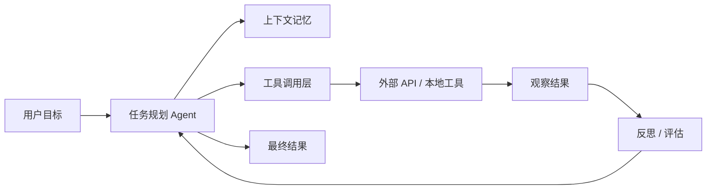
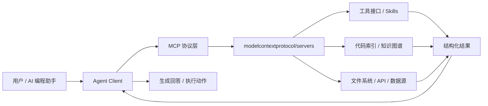
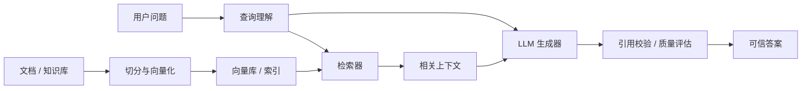
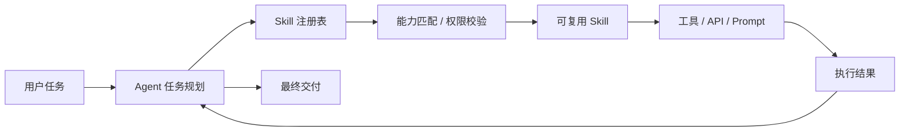

# GitHub AI Daily Trending Top 5

更新时间：2026-06-21T11:44:22Z

筛选范围：仓库名称或描述包含 AI 相关关键词。关键词：ai, agent, agents, agentic, llm, llms, skill, skills, mcp, model context protocol, chatgpt, openai, claude, gemini, copilot, deepseek, rag, embedding, embeddings, transformer, diffusion, machine learning, ml, deep learning, neural, inference, prompt, prompts。

网页版本：由 GitHub Pages 自动发布。

## 1. [microsoft/autogen](https://github.com/microsoft/autogen)

- 语言：TypeScript
- Stars：18,420
- 主题：ai, agent, video-generation, workflow, llm, typescript
- Star 趋势：

- 作用 / 解决的问题：面向内容团队的 AI 视频 Agent 工作台，用自然语言完成脚本、素材生成、剪辑编排和导出。
- 适用场景：
  - 适合快速评估 GitHub AI 热榜中新出现或重新升温的技术方向，因为该仓库已获得短期社区关注。
  - 适合多步骤自动化、工具调用和复杂任务编排场景，因为 Agent 模式能把规划、执行、观察和修正串起来。
- 架构思想：
  - 它成为热榜的核心原因通常不是单点功能，而是把模型能力、工具、数据和工作流组织成更容易落地的工程结构。
  - 当前 Stars 为 18,420，说明它不只是概念验证，还积累了可观的社区验证和传播势能。
  - 相比只提供单一脚本的仓库，它用 ai, agent, video-generation, workflow, llm, typescript 等 topics 明确了能力边界，更容易被目标用户检索和采用。
  - 使用 TypeScript 作为主要实现语言，降低了对应生态开发者集成、扩展和二次开发的成本。
  - 它的稀缺性在于把热门 AI 能力包装成可运行、可组合、可观察的工程入口，而不是停留在论文、提示词或孤立 Demo。
- 原理 / 实现思路：
  - 系统把视频生产拆成脚本规划、镜头设计、素材生成、时间线编排和导出五个阶段，每个阶段由独立 Agent 负责。
  - 核心原理是用 LLM 生成结构化制作计划，再通过工具调用连接图像生成、语音合成、字幕和剪辑引擎。
  - 适合验证 AI 内容生产类项目在 README 和网页中展示长描述、topics 和 Star 趋势图的效果。
  - 以上内容由 GitHub 公开 README 自动摘取和归纳，适合作为快速了解入口，深入实现仍以仓库源码和文档为准。

## 2. [modelcontextprotocol/servers](https://github.com/modelcontextprotocol/servers)

- 语言：Go
- Stars：32,105
- 主题：mcp, code-intelligence, knowledge-graph, agent, go
- Star 趋势：

- 作用 / 解决的问题：为 AI 编程助手提供代码库长期记忆的 MCP Server，解决大仓库上下文不足和重复索引问题。
- 适用场景：
  - 适合快速评估 GitHub AI 热榜中新出现或重新升温的技术方向，因为该仓库已获得短期社区关注。
  - 适合需要把外部工具、代码库、数据源接入 AI Agent 的场景，因为 MCP 能把能力封装成标准工具接口。
  - 适合多步骤自动化、工具调用和复杂任务编排场景，因为 Agent 模式能把规划、执行、观察和修正串起来。
- 架构思想：
  - 它成为热榜的核心原因通常不是单点功能，而是把模型能力、工具、数据和工作流组织成更容易落地的工程结构。
  - 当前 Stars 为 32,105，说明它不只是概念验证，还积累了可观的社区验证和传播势能。
  - 相比只提供单一脚本的仓库，它用 mcp, code-intelligence, knowledge-graph, agent, go 等 topics 明确了能力边界，更容易被目标用户检索和采用。
  - 使用 Go 作为主要实现语言，降低了对应生态开发者集成、扩展和二次开发的成本。
  - 它的稀缺性在于把热门 AI 能力包装成可运行、可组合、可观察的工程入口，而不是停留在论文、提示词或孤立 Demo。
- 原理 / 实现思路：
  - 项目会扫描代码符号、调用关系和文档片段，将结构化信息写入本地知识图谱，供 AI Agent 按需查询。
  - 关键设计是把一次性上下文输入改成可复用的增量索引，减少 token 消耗并提升跨文件问题定位能力。
  - 运行时通过 MCP 协议暴露 search、explain、dependency 等工具，让 Claude、Cursor 等客户端直接调用。
  - 以上内容由 GitHub 公开 README 自动摘取和归纳，适合作为快速了解入口，深入实现仍以仓库源码和文档为准。

## 3. [langchain-ai/langchain](https://github.com/langchain-ai/langchain)

- 语言：Python
- Stars：27,890
- 主题：llm, rag, token-optimization, prompt-engineering, python
- Star 趋势：

- 作用 / 解决的问题：在日志、RAG 片段和工具输出进入 LLM 前进行语义压缩，降低 token 成本并保留关键事实。
- 适用场景：
  - 适合快速评估 GitHub AI 热榜中新出现或重新升温的技术方向，因为该仓库已获得短期社区关注。
  - 适合知识库问答、文档检索和企业内部搜索场景，因为 RAG 能把私有数据补充进 LLM 上下文。
- 架构思想：
  - 它成为热榜的核心原因通常不是单点功能，而是把模型能力、工具、数据和工作流组织成更容易落地的工程结构。
  - 当前 Stars 为 27,890，说明它不只是概念验证，还积累了可观的社区验证和传播势能。
  - 相比只提供单一脚本的仓库，它用 llm, rag, token-optimization, prompt-engineering, python 等 topics 明确了能力边界，更容易被目标用户检索和采用。
  - 使用 Python 作为主要实现语言，降低了对应生态开发者集成、扩展和二次开发的成本。
  - 它的稀缺性在于把热门 AI 能力包装成可运行、可组合、可观察的工程入口，而不是停留在论文、提示词或孤立 Demo。
- 原理 / 实现思路：
  - 压缩流程先识别输入中的结构化字段、错误栈、指标和实体，再按任务目标保留高价值信息。
  - 项目提供 Python SDK、HTTP Proxy 和 MCP Server 三种接入方式，便于在不同 AI 应用中快速试用。
  - 它解决的是上下文窗口有限和成本高的问题，尤其适合日志分析、客服知识库和代码检索场景。
  - 以上内容由 GitHub 公开 README 自动摘取和归纳，适合作为快速了解入口，深入实现仍以仓库源码和文档为准。

## 4. [openai/openai-cookbook](https://github.com/openai/openai-cookbook)

- 语言：Rust
- Stars：11,760
- 主题：agent, skill, workflow, automation, rust
- Star 趋势：

- 作用 / 解决的问题：一个 Agent Skill 注册、发现和编排平台，让团队把可复用能力发布成标准化技能。
- 适用场景：
  - 适合快速评估 GitHub AI 热榜中新出现或重新升温的技术方向，因为该仓库已获得短期社区关注。
  - 适合多步骤自动化、工具调用和复杂任务编排场景，因为 Agent 模式能把规划、执行、观察和修正串起来。
  - 适合团队沉淀可复用 AI 能力的场景，因为 Skill 把提示词、工具和流程封装成可发现、可组合的单元。
- 架构思想：
  - 它成为热榜的核心原因通常不是单点功能，而是把模型能力、工具、数据和工作流组织成更容易落地的工程结构。
  - 当前 Stars 为 11,760，说明它不只是概念验证，还积累了可观的社区验证和传播势能。
  - 相比只提供单一脚本的仓库，它用 agent, skill, workflow, automation, rust 等 topics 明确了能力边界，更容易被目标用户检索和采用。
  - 使用 Rust 作为主要实现语言，降低了对应生态开发者集成、扩展和二次开发的成本。
  - 它的稀缺性在于把热门 AI 能力包装成可运行、可组合、可观察的工程入口，而不是停留在论文、提示词或孤立 Demo。
- 原理 / 实现思路：
  - 平台把技能定义、输入输出 schema、权限和运行入口统一建模，Agent 可以根据任务自动检索和调用技能。
  - 调度层会根据技能声明的能力标签、依赖和执行成本选择合适工具，并记录每次调用结果用于评估。
  - 适合展示 skill、agent、workflow 这类主题在热榜详情页中的呈现效果。
  - 以上内容由 GitHub 公开 README 自动摘取和归纳，适合作为快速了解入口，深入实现仍以仓库源码和文档为准。

## 5. [anthropics/anthropic-cookbook](https://github.com/anthropics/anthropic-cookbook)

- 语言：Vue
- Stars：9,604
- 主题：rag, evaluation, llm, dashboard, vue
- Star 趋势：

- 作用 / 解决的问题：面向 RAG 应用的评测看板，跟踪召回质量、答案忠实度、延迟和成本。
- 适用场景：
  - 适合快速评估 GitHub AI 热榜中新出现或重新升温的技术方向，因为该仓库已获得短期社区关注。
  - 适合知识库问答、文档检索和企业内部搜索场景，因为 RAG 能把私有数据补充进 LLM 上下文。
- 架构思想：
  - 它成为热榜的核心原因通常不是单点功能，而是把模型能力、工具、数据和工作流组织成更容易落地的工程结构。
  - 当前 Stars 为 9,604，说明它不只是概念验证，还积累了可观的社区验证和传播势能。
  - 相比只提供单一脚本的仓库，它用 rag, evaluation, llm, dashboard, vue 等 topics 明确了能力边界，更容易被目标用户检索和采用。
  - 使用 Vue 作为主要实现语言，降低了对应生态开发者集成、扩展和二次开发的成本。
  - 它的稀缺性在于把热门 AI 能力包装成可运行、可组合、可观察的工程入口，而不是停留在论文、提示词或孤立 Demo。
- 原理 / 实现思路：
  - 项目通过离线测试集和线上反馈同时评估 RAG 链路，覆盖检索、重排、生成和引用校验。
  - 核心指标包括 Recall@K、Faithfulness、Answer Relevance、平均延迟和单次请求成本。
  - 它解决团队上线 RAG 后难以持续观测质量的问题，适合做 AI 应用治理和回归测试。
  - 以上内容由 GitHub 公开 README 自动摘取和归纳，适合作为快速了解入口，深入实现仍以仓库源码和文档为准。

