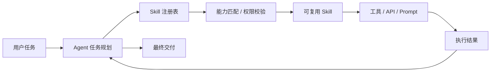
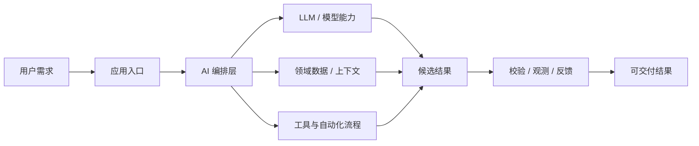
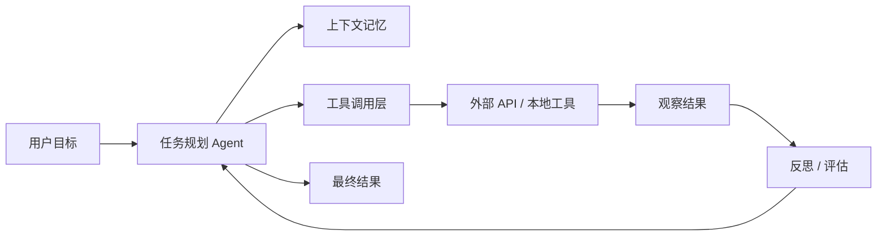

# GitHub AI Daily Trending Top 5

更新时间：2026-07-16T02:11:20Z

筛选范围：仓库名称或描述包含 AI 相关关键词。关键词：ai, agent, agents, agentic, llm, llms, skill, skills, mcp, model context protocol, chatgpt, openai, claude, gemini, copilot, deepseek, rag, embedding, embeddings, transformer, diffusion, machine learning, ml, deep learning, neural, inference, prompt, prompts。

网页版本：由 GitHub Pages 自动发布。

## 1. [Nutlope/hallmark](https://github.com/Nutlope/hallmark)

- 语言：CSS
- Stars：8,678
- 主题：未在 GitHub API 中公开 topics
- Star 趋势：

- 作用 / 解决的问题：Anti-AI-slop design skill for Claude Code, Cursor, and Codex.
- 适用场景：
  - 适合快速评估 GitHub AI 热榜中新出现或重新升温的技术方向，因为该仓库已获得短期社区关注。
  - 适合团队沉淀可复用 AI 能力的场景，因为 Skill 把提示词、工具和流程封装成可发现、可组合的单元。
- 架构思想：
  - 它成为热榜的核心原因通常不是单点功能，而是把模型能力、工具、数据和工作流组织成更容易落地的工程结构。
  - 当前 Stars 为 8,678，说明它不只是概念验证，还积累了可观的社区验证和传播势能。
  - 使用 CSS 作为主要实现语言，降低了对应生态开发者集成、扩展和二次开发的成本。
  - 它的稀缺性在于把热门 AI 能力包装成可运行、可组合、可观察的工程入口，而不是停留在论文、提示词或孤立 Demo。
- 原理 / 实现思路：
  - A design skill for Claude Code, Cursor, and Codex that refuses to look AI-generated.
  - Hallmark picks a macrostructure for the brief, dresses it in one of twenty themes, runs fifty-seven slop-test gates plus a pre-emit self-critique, and refuses the on-distribution defaults every LLM was trained into. Two pages by Hallmark for two different brie...
  - \| *(default)* \| Build new UI. Picks a macrostructure, applies the rule-set, runs the slop test before handing back. \|
  - 以上内容由 GitHub 公开 README 自动摘取和归纳，适合作为快速了解入口，深入实现仍以仓库源码和文档为准。

## 2. [mattpocock/skills](https://github.com/mattpocock/skills)

- 语言：Shell
- Stars：172,392
- 主题：未在 GitHub API 中公开 topics
- Star 趋势：

- 作用 / 解决的问题：Skills for Real Engineers. Straight from my .claude directory.
- 适用场景：
  - 适合快速评估 GitHub AI 热榜中新出现或重新升温的技术方向，因为该仓库已获得短期社区关注。
  - 适合团队沉淀可复用 AI 能力的场景，因为 Skill 把提示词、工具和流程封装成可发现、可组合的单元。
- 架构思想：
  - 它成为热榜的核心原因通常不是单点功能，而是把模型能力、工具、数据和工作流组织成更容易落地的工程结构。
  - 当前 Stars 为 172,392，说明它不只是概念验证，还积累了可观的社区验证和传播势能。
  - 使用 Shell 作为主要实现语言，降低了对应生态开发者集成、扩展和二次开发的成本。
  - 它的稀缺性在于把热门 AI 能力包装成可运行、可组合、可观察的工程入口，而不是停留在论文、提示词或孤立 Demo。
- 原理 / 实现思路：
  - My agent skills that I use every day to do real engineering - not vibe coding.
  - Developing real applications is hard. Approaches like GSD, BMAD, and Spec-Kit try to help by owning the process. But while doing so, they take away your control and make bugs in the process hard to resolve.
  - These skills are designed to be small, easy to adapt, and composable. They work with any model. They're based on decades of engineering experience. Hack around with them. Make them your own. Enjoy.
  - 以上内容由 GitHub 公开 README 自动摘取和归纳，适合作为快速了解入口，深入实现仍以仓库源码和文档为准。

## 3. [moeru-ai/airi](https://github.com/moeru-ai/airi)

- 语言：TypeScript
- Stars：42,542
- 主题：ai-companion, ai-vtuber, airi, digital-life, grok-companion, live2d, neuro-sama, neurosama, openclaw, vrm, vtuber
- Star 趋势：

- 作用 / 解决的问题：💖🧸 Self hosted, you-owned Grok Companion, a container of souls of waifu, cyber livings to bring them into our worlds, wishing to achieve Neuro-sama's altitude. Capable of realtime voice chat, Minecraft, Factorio playing. Web / macOS / Windows supported.
- 适用场景：
  - 适合快速评估 GitHub AI 热榜中新出现或重新升温的技术方向，因为该仓库已获得短期社区关注。
  - 适合围绕 ai-companion, ai-vtuber, airi, digital-life, grok-companion, live2d, neuro-sama, neurosama, openclaw, vrm, vtuber 做技术调研、竞品分析或原型验证，因为仓库主题与当前 AI 热点高度相关。
- 架构思想：
  - 它成为热榜的核心原因通常不是单点功能，而是把模型能力、工具、数据和工作流组织成更容易落地的工程结构。
  - 当前 Stars 为 42,542，说明它不只是概念验证，还积累了可观的社区验证和传播势能。
  - 相比只提供单一脚本的仓库，它用 ai-companion, ai-vtuber, airi, digital-life, grok-companion, live2d, neuro-sama, neurosama, openclaw, vrm, vtuber 等 topics 明确了能力边界，更容易被目标用户检索和采用。
  - 使用 TypeScript 作为主要实现语言，降低了对应生态开发者集成、扩展和二次开发的成本。
  - 它的稀缺性在于把热门 AI 能力包装成可运行、可组合、可观察的工程入口，而不是停留在论文、提示词或孤立 Demo。
- 原理 / 实现思路：
  - media="(prefers-color-scheme: light), (prefers-color-scheme: no-preference)"
  - media="(prefers-color-scheme: light), (prefers-color-scheme: no-preference)"
  - media="(prefers-color-scheme: light), (prefers-color-scheme: no-preference)"
  - 以上内容由 GitHub 公开 README 自动摘取和归纳，适合作为快速了解入口，深入实现仍以仓库源码和文档为准。

## 4. [Dicklesworthstone/destructive_command_guard](https://github.com/Dicklesworthstone/destructive_command_guard)

- 语言：Rust
- Stars：4,789
- 主题：ai-agents, cli, developer-tools, git, rust, safety
- Star 趋势：

- 作用 / 解决的问题：The Destructive Command Guard (dcg) is for blocking dangerous git and shell commands from being executed by agents.
- 适用场景：
  - 适合快速评估 GitHub AI 热榜中新出现或重新升温的技术方向，因为该仓库已获得短期社区关注。
  - 适合多步骤自动化、工具调用和复杂任务编排场景，因为 Agent 模式能把规划、执行、观察和修正串起来。
- 架构思想：
  - 它成为热榜的核心原因通常不是单点功能，而是把模型能力、工具、数据和工作流组织成更容易落地的工程结构。
  - 当前 Stars 为 4,789，说明它不只是概念验证，还积累了可观的社区验证和传播势能。
  - 相比只提供单一脚本的仓库，它用 ai-agents, cli, developer-tools, git, rust, safety 等 topics 明确了能力边界，更容易被目标用户检索和采用。
  - 使用 Rust 作为主要实现语言，降低了对应生态开发者集成、扩展和二次开发的成本。
  - 它的稀缺性在于把热门 AI 能力包装成可运行、可组合、可观察的工程入口，而不是停留在论文、提示词或孤立 Demo。
- 原理 / 实现思路：
  - A high-performance hook for AI coding agents that blocks destructive commands before they execute, protecting your work from accidental deletion across Claude Code, Codex CLI, Gemini CLI, Copilot CLI, VS Code Copilot Chat, Cursor, Hermes Agent, Grok (xAI), and...
  - The Problem: AI coding agents (Claude, Codex, Gemini, Copilot, etc.) occasionally run catastrophic commands like git reset --hard, rm -rf ./src, or DROP TABLE users—destroying hours of uncommitted work in seconds.
  - The Solution: dcg is a high-performance hook that intercepts destructive commands *before* they execute, blocking them with clear explanations and safer alternatives.
  - 以上内容由 GitHub 公开 README 自动摘取和归纳，适合作为快速了解入口，深入实现仍以仓库源码和文档为准。

## 5. [HKUDS/Vibe-Trading](https://github.com/HKUDS/Vibe-Trading)

- 语言：Python
- Stars：23,748
- 主题：ai-agent, algorithmic-trading, backtesting, fintech, llm, mcp, multi-agent, python, quantitative-finance, trading
- Star 趋势：

- 作用 / 解决的问题："Vibe-Trading: Your Personal Trading Agent"
- 适用场景：
  - 适合快速评估 GitHub AI 热榜中新出现或重新升温的技术方向，因为该仓库已获得短期社区关注。
  - 适合需要把外部工具、代码库、数据源接入 AI Agent 的场景，因为 MCP 能把能力封装成标准工具接口。
  - 适合多步骤自动化、工具调用和复杂任务编排场景，因为 Agent 模式能把规划、执行、观察和修正串起来。
- 架构思想：
  - 它成为热榜的核心原因通常不是单点功能，而是把模型能力、工具、数据和工作流组织成更容易落地的工程结构。
  - 当前 Stars 为 23,748，说明它不只是概念验证，还积累了可观的社区验证和传播势能。
  - 相比只提供单一脚本的仓库，它用 ai-agent, algorithmic-trading, backtesting, fintech, llm, mcp, multi-agent, python, quantitative-finance, trading 等 topics 明确了能力边界，更容易被目标用户检索和采用。
  - 使用 Python 作为主要实现语言，降低了对应生态开发者集成、扩展和二次开发的成本。
  - 它的稀缺性在于把热门 AI 能力包装成可运行、可组合、可观察的工程入口，而不是停留在论文、提示词或孤立 Demo。
- 原理 / 实现思路：
  - ⚠️ Security warning: The X account VibeTrading_HKU, Virtuals project 101845, and token contract 0x640BDBF77b6447E8b7DB7894cED84BD1c40571f4 are not official Vibe-Trading assets. We have never launched or endorsed any token or memecoin. Do not buy, connect a wal...
  - 2026-07-04 🧹 UTC timestamp cleanup for session and API paths: tightened the #395 timestamp fix so session, goal, channel, and API timestamps now emit timezone-aware UTC values in explicit ISO form.
  - 2026-06-19 🚀 v0.1.10 — Global data layer: market-data sources grow 10 → 18 (free Eastmoney / Sina / Stooq / Yahoo + key-gated Finnhub / Alpha Vantage / Tiingo / FMP, ban-risk fallback) plus 18 read-only data tools (fund flow, dragon-tiger, northbound, margin, ...
  - 以上内容由 GitHub 公开 README 自动摘取和归纳，适合作为快速了解入口，深入实现仍以仓库源码和文档为准。

