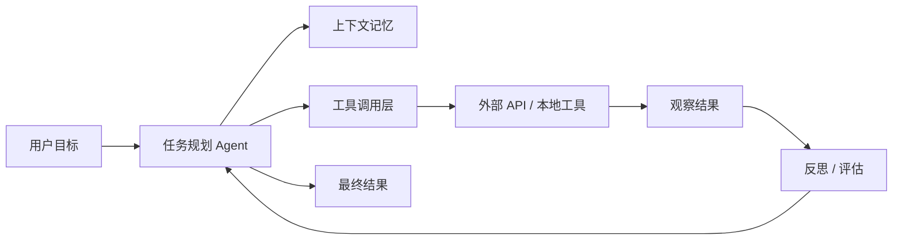
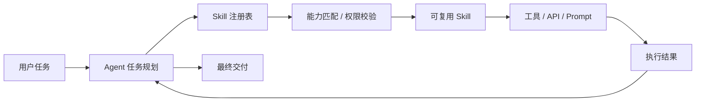

# GitHub AI Daily Trending Top 5

更新时间：2026-07-03T02:34:42Z

筛选范围：仓库名称或描述包含 AI 相关关键词。关键词：ai, agent, agents, agentic, llm, llms, skill, skills, mcp, model context protocol, chatgpt, openai, claude, gemini, copilot, deepseek, rag, embedding, embeddings, transformer, diffusion, machine learning, ml, deep learning, neural, inference, prompt, prompts。

网页版本：由 GitHub Pages 自动发布。

## 1. [usestrix/strix](https://github.com/usestrix/strix)

- 语言：Python
- Stars：32,400
- 主题：agents, ai-hacking, ai-penetration-testing, ai-pentesting, ai-security, artificial-intelligence, bug-bounty, code-quality, ctf-tools, cybersecurity, cybersecurity-tools, ethical-hacking, hacking, llm-security, offensive-security, penetration-testing, pentesting-tools, red-teaming, security, security-automation
- Star 趋势：

- 作用 / 解决的问题：Open-source AI penetration testing tool to find and fix your app’s vulnerabilities.
- 适用场景：
  - 适合快速评估 GitHub AI 热榜中新出现或重新升温的技术方向，因为该仓库已获得短期社区关注。
  - 适合多步骤自动化、工具调用和复杂任务编排场景，因为 Agent 模式能把规划、执行、观察和修正串起来。
- 架构思想：
  - 它成为热榜的核心原因通常不是单点功能，而是把模型能力、工具、数据和工作流组织成更容易落地的工程结构。
  - 当前 Stars 为 32,400，说明它不只是概念验证，还积累了可观的社区验证和传播势能。
  - 相比只提供单一脚本的仓库，它用 agents, ai-hacking, ai-penetration-testing, ai-pentesting, ai-security, artificial-intelligence, bug-bounty, code-quality, ctf-tools, cybersecurity, cybersecurity-tools, ethical-hacking, hacking, llm-security, offensive-security, penetration-testing, pentesting-tools, red-teaming, security, security-automation 等 topics 明确了能力边界，更容易被目标用户检索和采用。
  - 使用 Python 作为主要实现语言，降低了对应生态开发者集成、扩展和二次开发的成本。
  - 它的稀缺性在于把热门 AI 能力包装成可运行、可组合、可观察的工程入口，而不是停留在论文、提示词或孤立 Demo。
- 原理 / 实现思路：
  - The open-source AI pentesting tool. Autonomous AI hackers that find and fix your app’s vulnerabilities.
  - Strix are autonomous AI penetration testing agents that act just like real hackers - they run your code dynamically, find vulnerabilities, and validate them through actual proof-of-concepts. Built for developers and security teams who need fast, accurate secur...
  - Full pentesting toolkit - reconnaissance, exploitation, and validation out of the box
  - 以上内容由 GitHub 公开 README 自动摘取和归纳，适合作为快速了解入口，深入实现仍以仓库源码和文档为准。

## 2. [JuliusBrussee/caveman](https://github.com/JuliusBrussee/caveman)

- 语言：JavaScript
- Stars：81,149
- 主题：ai, anthropic, caveman, claude, claude-code, llm, meme, prompt-engineering, skill, tokens
- Star 趋势：

- 作用 / 解决的问题：🪨 why use many token when few token do trick — Claude Code skill that cuts 65% of tokens by talking like caveman
- 适用场景：
  - 适合快速评估 GitHub AI 热榜中新出现或重新升温的技术方向，因为该仓库已获得短期社区关注。
  - 适合团队沉淀可复用 AI 能力的场景，因为 Skill 把提示词、工具和流程封装成可发现、可组合的单元。
- 架构思想：
  - 它成为热榜的核心原因通常不是单点功能，而是把模型能力、工具、数据和工作流组织成更容易落地的工程结构。
  - 当前 Stars 为 81,149，说明它不只是概念验证，还积累了可观的社区验证和传播势能。
  - 相比只提供单一脚本的仓库，它用 ai, anthropic, caveman, claude, claude-code, llm, meme, prompt-engineering, skill, tokens 等 topics 明确了能力边界，更容易被目标用户检索和采用。
  - 使用 JavaScript 作为主要实现语言，降低了对应生态开发者集成、扩展和二次开发的成本。
  - 它的稀缺性在于把热门 AI 能力包装成可运行、可组合、可观察的工程入口，而不是停留在论文、提示词或孤立 Demo。
- 原理 / 实现思路：
  - "The reason your React component is re-rendering is likely because you're creating a new object reference on each render cycle. When you pass an inline object as a prop, React's shallow comparison sees it as a different object every time, which triggers a re-r...
  - "New object ref each render. Inline object prop = new ref = re-render. Wrap in useMemo."
  - "Sure! I'd be happy to help you with that. The issue you're experiencing is most likely caused by your authentication middleware not properly validating the token expiry. Let me take a look and suggest a fix."
  - 以上内容由 GitHub 公开 README 自动摘取和归纳，适合作为快速了解入口，深入实现仍以仓库源码和文档为准。

## 3. [msitarzewski/agency-agents](https://github.com/msitarzewski/agency-agents)

- 语言：Shell
- Stars：125,604
- 主题：未在 GitHub API 中公开 topics
- Star 趋势：

- 作用 / 解决的问题：A complete AI agency at your fingertips - From frontend wizards to Reddit community ninjas, from whimsy injectors to reality checkers. Each agent is a specialized expert with personality, processes, and proven deliverables.
- 适用场景：
  - 适合快速评估 GitHub AI 热榜中新出现或重新升温的技术方向，因为该仓库已获得短期社区关注。
  - 适合多步骤自动化、工具调用和复杂任务编排场景，因为 Agent 模式能把规划、执行、观察和修正串起来。
- 架构思想：
  - 它成为热榜的核心原因通常不是单点功能，而是把模型能力、工具、数据和工作流组织成更容易落地的工程结构。
  - 当前 Stars 为 125,604，说明它不只是概念验证，还积累了可观的社区验证和传播势能。
  - 使用 Shell 作为主要实现语言，降低了对应生态开发者集成、扩展和二次开发的成本。
  - 它的稀缺性在于把热门 AI 能力包装成可运行、可组合、可观察的工程入口，而不是停留在论文、提示词或孤立 Demo。
- 原理 / 实现思路：
  - 🎭 The Agency: AI Specialists Ready to Transform Your Workflow
  - A complete AI agency at your fingertips - From frontend wizards to Reddit community ninjas, from whimsy injectors to reality checkers. Each agent is a specialized expert with personality, processes, and proven deliverables.
  - Born from a Reddit thread and months of iteration, The Agency is a growing collection of meticulously crafted AI agent personalities. Each agent is:
  - 以上内容由 GitHub 公开 README 自动摘取和归纳，适合作为快速了解入口，深入实现仍以仓库源码和文档为准。

## 4. [santifer/career-ops](https://github.com/santifer/career-ops)

- 语言：JavaScript
- Stars：57,911
- 主题：ai-agent, anthropic, automation, beginner-friendly, career, careerops, claude, claude-code, cli, first-timers-only, golang, good-first-issue, interview-prep, job-search, open-source, resume
- Star 趋势：

- 作用 / 解决的问题：AI-powered job search system built on Claude Code. 14 skill modes, Go dashboard, PDF generation, batch processing.
- 适用场景：
  - 适合快速评估 GitHub AI 热榜中新出现或重新升温的技术方向，因为该仓库已获得短期社区关注。
  - 适合团队沉淀可复用 AI 能力的场景，因为 Skill 把提示词、工具和流程封装成可发现、可组合的单元。
- 架构思想：
  - 它成为热榜的核心原因通常不是单点功能，而是把模型能力、工具、数据和工作流组织成更容易落地的工程结构。
  - 当前 Stars 为 57,911，说明它不只是概念验证，还积累了可观的社区验证和传播势能。
  - 相比只提供单一脚本的仓库，它用 ai-agent, anthropic, automation, beginner-friendly, career, careerops, claude, claude-code, cli, first-timers-only, golang, good-first-issue, interview-prep, job-search, open-source, resume 等 topics 明确了能力边界，更容易被目标用户检索和采用。
  - 使用 JavaScript 作为主要实现语言，降低了对应生态开发者集成、扩展和二次开发的成本。
  - 它的稀缺性在于把热门 AI 能力包装成可运行、可组合、可观察的工程入口，而不是停留在论文、提示词或孤立 Demo。
- 原理 / 实现思路：
  - [English](README.md) \| [Deutsch](README.de.md) \| [Español](README.es.md) \| [Français](README.fr.md) \| [Português (Brasil)](README.pt-BR.md) \| [한국어](README.ko-KR.md) \| [日本語](README.ja.md) \| [简体中文](README.cn.md) \| [繁體中文](README.zh-TW.md) \| [Українська](README.ua...
  - Companies use AI to filter candidates. <strong>I just gave candidates AI to <em>choose</em> companies.</strong> 
  - Evaluates offers with a structured A-F scoring system (10 weighted dimensions)
  - 以上内容由 GitHub 公开 README 自动摘取和归纳，适合作为快速了解入口，深入实现仍以仓库源码和文档为准。

## 5. [obra/superpowers](https://github.com/obra/superpowers)

- 语言：Shell
- Stars：244,529
- 主题：ai, brainstorming, coding, obra, sdlc, skills, subagent-driven-development, superpowers
- Star 趋势：

- 作用 / 解决的问题：An agentic skills framework & software development methodology that works.
- 适用场景：
  - 适合快速评估 GitHub AI 热榜中新出现或重新升温的技术方向，因为该仓库已获得短期社区关注。
  - 适合多步骤自动化、工具调用和复杂任务编排场景，因为 Agent 模式能把规划、执行、观察和修正串起来。
  - 适合团队沉淀可复用 AI 能力的场景，因为 Skill 把提示词、工具和流程封装成可发现、可组合的单元。
- 架构思想：
  - 它成为热榜的核心原因通常不是单点功能，而是把模型能力、工具、数据和工作流组织成更容易落地的工程结构。
  - 当前 Stars 为 244,529，说明它不只是概念验证，还积累了可观的社区验证和传播势能。
  - 相比只提供单一脚本的仓库，它用 ai, brainstorming, coding, obra, sdlc, skills, subagent-driven-development, superpowers 等 topics 明确了能力边界，更容易被目标用户检索和采用。
  - 使用 Shell 作为主要实现语言，降低了对应生态开发者集成、扩展和二次开发的成本。
  - 它的稀缺性在于把热门 AI 能力包装成可运行、可组合、可观察的工程入口，而不是停留在论文、提示词或孤立 Demo。
- 原理 / 实现思路：
  - Superpowers is a complete software development methodology for your coding agents, built on top of a set of composable skills and some initial instructions that make sure your agent uses them.
  - We're hiring someone to help out full time with Superpowers community and code work.
  - If this sounds like someone you know, definitely send them our way.
  - 以上内容由 GitHub 公开 README 自动摘取和归纳，适合作为快速了解入口，深入实现仍以仓库源码和文档为准。

