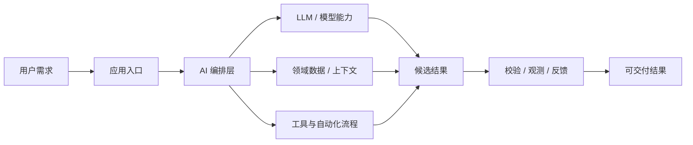
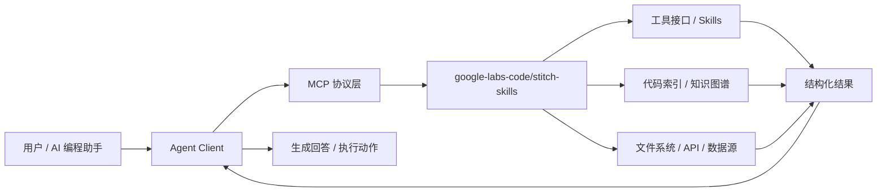
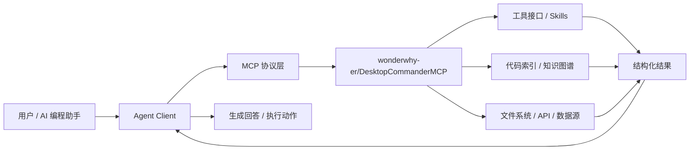

# GitHub AI Daily Trending Top 5

更新时间：2026-07-12T02:22:59Z

筛选范围：仓库名称或描述包含 AI 相关关键词。关键词：ai, agent, agents, agentic, llm, llms, skill, skills, mcp, model context protocol, chatgpt, openai, claude, gemini, copilot, deepseek, rag, embedding, embeddings, transformer, diffusion, machine learning, ml, deep learning, neural, inference, prompt, prompts。

网页版本：由 GitHub Pages 自动发布。

## 1. [davila7/claude-code-templates](https://github.com/davila7/claude-code-templates)

- 语言：Python
- Stars：29,035
- 主题：anthropic, anthropic-claude, claude, claude-code
- Star 趋势：

- 作用 / 解决的问题：CLI tool for configuring and monitoring Claude Code
- 适用场景：
  - 适合快速评估 GitHub AI 热榜中新出现或重新升温的技术方向，因为该仓库已获得短期社区关注。
  - 适合围绕 anthropic, anthropic-claude, claude, claude-code 做技术调研、竞品分析或原型验证，因为仓库主题与当前 AI 热点高度相关。
- 架构思想：
  - 它成为热榜的核心原因通常不是单点功能，而是把模型能力、工具、数据和工作流组织成更容易落地的工程结构。
  - 当前 Stars 为 29,035，说明它不只是概念验证，还积累了可观的社区验证和传播势能。
  - 相比只提供单一脚本的仓库，它用 anthropic, anthropic-claude, claude, claude-code 等 topics 明确了能力边界，更容易被目标用户检索和采用。
  - 使用 Python 作为主要实现语言，降低了对应生态开发者集成、扩展和二次开发的成本。
  - 它的稀缺性在于把热门 AI 能力包装成可运行、可组合、可观察的工程入口，而不是停留在论文、提示词或孤立 Demo。
- 原理 / 实现思路：
  - Ready-to-use configurations for Anthropic's Claude Code. A comprehensive collection of AI agents, custom commands, settings, hooks, external integrations (MCPs), and project templates to enhance your development workflow.
  - npx claude-code-templates@latest --agent development-team/frontend-developer --command testing/generate-tests --mcp development/github-integration --yes
  - npx claude-code-templates@latest --agent development-tools/code-reviewer --yes
  - 以上内容由 GitHub 公开 README 自动摘取和归纳，适合作为快速了解入口，深入实现仍以仓库源码和文档为准。

## 2. [google-labs-code/stitch-skills](https://github.com/google-labs-code/stitch-skills)

- 语言：TypeScript
- Stars：7,082
- 主题：未在 GitHub API 中公开 topics
- Star 趋势：

- 作用 / 解决的问题：A library of Agent Skills designed to work with the Stitch MCP server. Each skill follows the Agent Skills open standard, for compatibility with coding agents such as Antigravity, Gemini CLI, Claude Code, Cursor.
- 适用场景：
  - 适合快速评估 GitHub AI 热榜中新出现或重新升温的技术方向，因为该仓库已获得短期社区关注。
  - 适合需要把外部工具、代码库、数据源接入 AI Agent 的场景，因为 MCP 能把能力封装成标准工具接口。
  - 适合多步骤自动化、工具调用和复杂任务编排场景，因为 Agent 模式能把规划、执行、观察和修正串起来。
  - 适合团队沉淀可复用 AI 能力的场景，因为 Skill 把提示词、工具和流程封装成可发现、可组合的单元。
- 架构思想：
  - 它成为热榜的核心原因通常不是单点功能，而是把模型能力、工具、数据和工作流组织成更容易落地的工程结构。
  - 当前 Stars 为 7,082，说明它不只是概念验证，还积累了可观的社区验证和传播势能。
  - 使用 TypeScript 作为主要实现语言，降低了对应生态开发者集成、扩展和二次开发的成本。
  - 它的稀缺性在于把热门 AI 能力包装成可运行、可组合、可观察的工程入口，而不是停留在论文、提示词或孤立 Demo。
- 原理 / 实现思路：
  - The fastest way to set up the full Stitch plugin suite globally.
  - Add the Stitch Skills marketplace, then install the plugins you need.
  - codex plugin marketplace add google-labs-code/stitch-skills --ref main \
  - 以上内容由 GitHub 公开 README 自动摘取和归纳，适合作为快速了解入口，深入实现仍以仓库源码和文档为准。

## 3. [openai/plugins](https://github.com/openai/plugins)

- 语言：JavaScript
- Stars：4,429
- 主题：未在 GitHub API 中公开 topics
- Star 趋势：

- 作用 / 解决的问题：OpenAI Plugins
- 适用场景：
  - 适合快速评估 GitHub AI 热榜中新出现或重新升温的技术方向，因为该仓库已获得短期社区关注。
  - 适合围绕 未在 GitHub API 中公开 topics 做技术调研、竞品分析或原型验证，因为仓库主题与当前 AI 热点高度相关。
- 架构思想：
  - 它成为热榜的核心原因通常不是单点功能，而是把模型能力、工具、数据和工作流组织成更容易落地的工程结构。
  - 当前 Stars 为 4,429，说明它不只是概念验证，还积累了可观的社区验证和传播势能。
  - 使用 JavaScript 作为主要实现语言，降低了对应生态开发者集成、扩展和二次开发的成本。
  - 它的稀缺性在于把热门 AI 能力包装成可运行、可组合、可观察的工程入口，而不是停留在论文、提示词或孤立 Demo。
- 原理 / 实现思路：
  - This repository contains a curated collection of Codex plugin examples.
  - Each plugin lives under plugins/<name>/ with a required
  - .codex-plugin/plugin.json manifest and optional companion surfaces such as
  - 以上内容由 GitHub 公开 README 自动摘取和归纳，适合作为快速了解入口，深入实现仍以仓库源码和文档为准。

## 4. [wonderwhy-er/DesktopCommanderMCP](https://github.com/wonderwhy-er/DesktopCommanderMCP)

- 语言：TypeScript
- Stars：7,787
- 主题：agent, ai, code-analysis, code-generation, gemini-cli-extension, mcp, terminal-ai, terminal-automation, vibe-coding
- Star 趋势：

- 作用 / 解决的问题：This is MCP server for Claude that gives it terminal control, file system search and diff file editing capabilities
- 适用场景：
  - 适合快速评估 GitHub AI 热榜中新出现或重新升温的技术方向，因为该仓库已获得短期社区关注。
  - 适合需要把外部工具、代码库、数据源接入 AI Agent 的场景，因为 MCP 能把能力封装成标准工具接口。
  - 适合多步骤自动化、工具调用和复杂任务编排场景，因为 Agent 模式能把规划、执行、观察和修正串起来。
- 架构思想：
  - 它成为热榜的核心原因通常不是单点功能，而是把模型能力、工具、数据和工作流组织成更容易落地的工程结构。
  - 当前 Stars 为 7,787，说明它不只是概念验证，还积累了可观的社区验证和传播势能。
  - 相比只提供单一脚本的仓库，它用 agent, ai, code-analysis, code-generation, gemini-cli-extension, mcp, terminal-ai, terminal-automation, vibe-coding 等 topics 明确了能力边界，更容易被目标用户检索和采用。
  - 使用 TypeScript 作为主要实现语言，降低了对应生态开发者集成、扩展和二次开发的成本。
  - 它的稀缺性在于把热门 AI 能力包装成可运行、可组合、可观察的工程入口，而不是停留在论文、提示词或孤立 Demo。
- 原理 / 实现思路：
  - Search, update, manage files and run terminal commands with AI
  - Work with code and text, run processes, and automate tasks, going far beyond other AI editors - while using host client subscriptions instead of API token costs.
  - Want a better experience? The Desktop Commander App gives you everything the MCP server does, plus:
  - 以上内容由 GitHub 公开 README 自动摘取和归纳，适合作为快速了解入口，深入实现仍以仓库源码和文档为准。

## 5. [DayuanJiang/next-ai-draw-io](https://github.com/DayuanJiang/next-ai-draw-io)

- 语言：TypeScript
- Stars：33,304
- 主题：ai, diagrams, productivity
- Star 趋势：

- 作用 / 解决的问题：A next.js web application that integrates AI capabilities with draw.io diagrams. This app allows you to create, modify, and enhance diagrams through natural language commands and AI-assisted visualization.
- 适用场景：
  - 适合快速评估 GitHub AI 热榜中新出现或重新升温的技术方向，因为该仓库已获得短期社区关注。
  - 适合围绕 ai, diagrams, productivity 做技术调研、竞品分析或原型验证，因为仓库主题与当前 AI 热点高度相关。
- 架构思想：
  - 它成为热榜的核心原因通常不是单点功能，而是把模型能力、工具、数据和工作流组织成更容易落地的工程结构。
  - 当前 Stars 为 33,304，说明它不只是概念验证，还积累了可观的社区验证和传播势能。
  - 相比只提供单一脚本的仓库，它用 ai, diagrams, productivity 等 topics 明确了能力边界，更容易被目标用户检索和采用。
  - 使用 TypeScript 作为主要实现语言，降低了对应生态开发者集成、扩展和二次开发的成本。
  - 它的稀缺性在于把热门 AI 能力包装成可运行、可组合、可观察的工程入口，而不是停留在论文、提示词或孤立 Demo。
- 原理 / 实现思路：
  - AI-Powered Diagram Creation Tool - Chat, Draw, Visualize
  - English \| [中文](./docs/cn/README_CN.md) \| [日本語](./docs/ja/README_JA.md)
  - A Next.js web application that integrates AI capabilities with draw.io diagrams. Create, modify, and enhance diagrams through natural language commands and AI-assisted visualization.
  - 以上内容由 GitHub 公开 README 自动摘取和归纳，适合作为快速了解入口，深入实现仍以仓库源码和文档为准。

