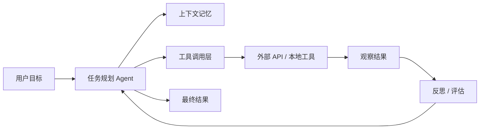
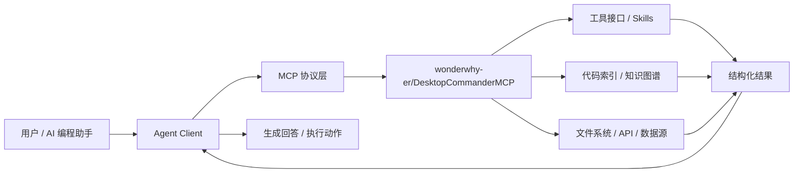
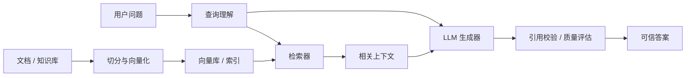
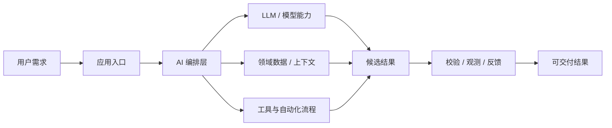

# GitHub AI Daily Trending Top 5

更新时间：2026-07-13T02:24:43Z

筛选范围：仓库名称或描述包含 AI 相关关键词。关键词：ai, agent, agents, agentic, llm, llms, skill, skills, mcp, model context protocol, chatgpt, openai, claude, gemini, copilot, deepseek, rag, embedding, embeddings, transformer, diffusion, machine learning, ml, deep learning, neural, inference, prompt, prompts。

网页版本：由 GitHub Pages 自动发布。

## 1. [Dicklesworthstone/destructive_command_guard](https://github.com/Dicklesworthstone/destructive_command_guard)

- 语言：Rust
- Stars：2,999
- 主题：ai-agents, cli, developer-tools, git, rust, safety
- Star 趋势：

- 作用 / 解决的问题：The Destructive Command Guard (dcg) is for blocking dangerous git and shell commands from being executed by agents.
- 适用场景：
  - 适合快速评估 GitHub AI 热榜中新出现或重新升温的技术方向，因为该仓库已获得短期社区关注。
  - 适合多步骤自动化、工具调用和复杂任务编排场景，因为 Agent 模式能把规划、执行、观察和修正串起来。
- 架构思想：
  - 它成为热榜的核心原因通常不是单点功能，而是把模型能力、工具、数据和工作流组织成更容易落地的工程结构。
  - 当前 Stars 为 2,999，说明它不只是概念验证，还积累了可观的社区验证和传播势能。
  - 相比只提供单一脚本的仓库，它用 ai-agents, cli, developer-tools, git, rust, safety 等 topics 明确了能力边界，更容易被目标用户检索和采用。
  - 使用 Rust 作为主要实现语言，降低了对应生态开发者集成、扩展和二次开发的成本。
  - 它的稀缺性在于把热门 AI 能力包装成可运行、可组合、可观察的工程入口，而不是停留在论文、提示词或孤立 Demo。
- 原理 / 实现思路：
  - A high-performance hook for AI coding agents that blocks destructive commands before they execute, protecting your work from accidental deletion across Claude Code, Codex CLI, Gemini CLI, Copilot CLI, VS Code Copilot Chat, Cursor, Hermes Agent, Grok (xAI), and...
  - The Problem: AI coding agents (Claude, Codex, Gemini, Copilot, etc.) occasionally run catastrophic commands like git reset --hard, rm -rf ./src, or DROP TABLE users—destroying hours of uncommitted work in seconds.
  - The Solution: dcg is a high-performance hook that intercepts destructive commands *before* they execute, blocking them with clear explanations and safer alternatives.
  - 以上内容由 GitHub 公开 README 自动摘取和归纳，适合作为快速了解入口，深入实现仍以仓库源码和文档为准。

## 2. [wonderwhy-er/DesktopCommanderMCP](https://github.com/wonderwhy-er/DesktopCommanderMCP)

- 语言：TypeScript
- Stars：8,014
- 主题：agent, ai, code-analysis, code-generation, gemini-cli-extension, mcp, terminal-ai, terminal-automation, vibe-coding
- Star 趋势：

- 作用 / 解决的问题：This is MCP server for Claude that gives it terminal control, file system search and diff file editing capabilities
- 适用场景：
  - 适合快速评估 GitHub AI 热榜中新出现或重新升温的技术方向，因为该仓库已获得短期社区关注。
  - 适合需要把外部工具、代码库、数据源接入 AI Agent 的场景，因为 MCP 能把能力封装成标准工具接口。
  - 适合多步骤自动化、工具调用和复杂任务编排场景，因为 Agent 模式能把规划、执行、观察和修正串起来。
- 架构思想：
  - 它成为热榜的核心原因通常不是单点功能，而是把模型能力、工具、数据和工作流组织成更容易落地的工程结构。
  - 当前 Stars 为 8,014，说明它不只是概念验证，还积累了可观的社区验证和传播势能。
  - 相比只提供单一脚本的仓库，它用 agent, ai, code-analysis, code-generation, gemini-cli-extension, mcp, terminal-ai, terminal-automation, vibe-coding 等 topics 明确了能力边界，更容易被目标用户检索和采用。
  - 使用 TypeScript 作为主要实现语言，降低了对应生态开发者集成、扩展和二次开发的成本。
  - 它的稀缺性在于把热门 AI 能力包装成可运行、可组合、可观察的工程入口，而不是停留在论文、提示词或孤立 Demo。
- 原理 / 实现思路：
  - Search, update, manage files and run terminal commands with AI
  - Work with code and text, run processes, and automate tasks, going far beyond other AI editors - while using host client subscriptions instead of API token costs.
  - Want a better experience? The Desktop Commander App gives you everything the MCP server does, plus:
  - 以上内容由 GitHub 公开 README 自动摘取和归纳，适合作为快速了解入口，深入实现仍以仓库源码和文档为准。

## 3. [HKUDS/Vibe-Trading](https://github.com/HKUDS/Vibe-Trading)

- 语言：Python
- Stars：20,638
- 主题：ai-agent, algorithmic-trading, backtesting, fintech, llm, mcp, multi-agent, python, quantitative-finance, trading
- Star 趋势：

- 作用 / 解决的问题："Vibe-Trading: Your Personal Trading Agent"
- 适用场景：
  - 适合快速评估 GitHub AI 热榜中新出现或重新升温的技术方向，因为该仓库已获得短期社区关注。
  - 适合需要把外部工具、代码库、数据源接入 AI Agent 的场景，因为 MCP 能把能力封装成标准工具接口。
  - 适合多步骤自动化、工具调用和复杂任务编排场景，因为 Agent 模式能把规划、执行、观察和修正串起来。
- 架构思想：
  - 它成为热榜的核心原因通常不是单点功能，而是把模型能力、工具、数据和工作流组织成更容易落地的工程结构。
  - 当前 Stars 为 20,638，说明它不只是概念验证，还积累了可观的社区验证和传播势能。
  - 相比只提供单一脚本的仓库，它用 ai-agent, algorithmic-trading, backtesting, fintech, llm, mcp, multi-agent, python, quantitative-finance, trading 等 topics 明确了能力边界，更容易被目标用户检索和采用。
  - 使用 Python 作为主要实现语言，降低了对应生态开发者集成、扩展和二次开发的成本。
  - 它的稀缺性在于把热门 AI 能力包装成可运行、可组合、可观察的工程入口，而不是停留在论文、提示词或孤立 Demo。
- 原理 / 实现思路：
  - ⚠️ Security warning: The X account VibeTrading_HKU, Virtuals project 101845, and token contract 0x640BDBF77b6447E8b7DB7894cED84BD1c40571f4 are not official Vibe-Trading assets. We have never launched or endorsed any token or memecoin. Do not buy, connect a wal...
  - 2026-07-04 🧹 UTC timestamp cleanup for session and API paths: tightened the #395 timestamp fix so session, goal, channel, and API timestamps now emit timezone-aware UTC values in explicit ISO form.
  - 2026-06-19 🚀 v0.1.10 — Global data layer: market-data sources grow 10 → 18 (free Eastmoney / Sina / Stooq / Yahoo + key-gated Finnhub / Alpha Vantage / Tiingo / FMP, ban-risk fallback) plus 18 read-only data tools (fund flow, dragon-tiger, northbound, margin, ...
  - 以上内容由 GitHub 公开 README 自动摘取和归纳，适合作为快速了解入口，深入实现仍以仓库源码和文档为准。

## 4. [Shubhamsaboo/awesome-llm-apps](https://github.com/Shubhamsaboo/awesome-llm-apps)

- 语言：Python
- Stars：118,641
- 主题：agents, llms, python, rag
- Star 趋势：

- 作用 / 解决的问题：100+ AI Agent & RAG apps you can actually run — clone, customize, ship.
- 适用场景：
  - 适合快速评估 GitHub AI 热榜中新出现或重新升温的技术方向，因为该仓库已获得短期社区关注。
  - 适合知识库问答、文档检索和企业内部搜索场景，因为 RAG 能把私有数据补充进 LLM 上下文。
  - 适合多步骤自动化、工具调用和复杂任务编排场景，因为 Agent 模式能把规划、执行、观察和修正串起来。
- 架构思想：
  - 它成为热榜的核心原因通常不是单点功能，而是把模型能力、工具、数据和工作流组织成更容易落地的工程结构。
  - 当前 Stars 为 118,641，说明它不只是概念验证，还积累了可观的社区验证和传播势能。
  - 相比只提供单一脚本的仓库，它用 agents, llms, python, rag 等 topics 明确了能力边界，更容易被目标用户检索和采用。
  - 使用 Python 作为主要实现语言，降低了对应生态开发者集成、扩展和二次开发的成本。
  - 它的稀缺性在于把热门 AI 能力包装成可运行、可组合、可观察的工程入口，而不是停留在论文、提示词或孤立 Demo。
- 原理 / 实现思路：
  - AI Agents · Always-on Agents · Multi-agent Teams · MCP Agents · RAG · Voice Agents · Agent Skills · Fine-tuning

  - You shouldn't have to rebuild the same RAG pipeline, agent loop, or MCP integration from scratch every time you start a new LLM project.
  - Awesome LLM Apps is a cookbook of ready-to-run templates - starter code you can fork, customize, and ship as a production LLM app. Every template here is self-contained with full source code, not collected from elsewhere.
  - 以上内容由 GitHub 公开 README 自动摘取和归纳，适合作为快速了解入口，深入实现仍以仓库源码和文档为准。

## 5. [anthropics/claude-cookbooks](https://github.com/anthropics/claude-cookbooks)

- 语言：Jupyter Notebook
- Stars：48,467
- 主题：未在 GitHub API 中公开 topics
- Star 趋势：

- 作用 / 解决的问题：A collection of notebooks/recipes showcasing some fun and effective ways of using Claude.
- 适用场景：
  - 适合快速评估 GitHub AI 热榜中新出现或重新升温的技术方向，因为该仓库已获得短期社区关注。
  - 适合围绕 未在 GitHub API 中公开 topics 做技术调研、竞品分析或原型验证，因为仓库主题与当前 AI 热点高度相关。
- 架构思想：
  - 它成为热榜的核心原因通常不是单点功能，而是把模型能力、工具、数据和工作流组织成更容易落地的工程结构。
  - 当前 Stars 为 48,467，说明它不只是概念验证，还积累了可观的社区验证和传播势能。
  - 使用 Jupyter Notebook 作为主要实现语言，降低了对应生态开发者集成、扩展和二次开发的成本。
  - 它的稀缺性在于把热门 AI 能力包装成可运行、可组合、可观察的工程入口，而不是停留在论文、提示词或孤立 Demo。
- 原理 / 实现思路：
  - The Claude Cookbooks provide code and guides designed to help developers build with Claude, offering copy-able code snippets that you can easily integrate into your own projects.
  - While the code examples are primarily written in Python, the concepts can be adapted to any programming language that supports interaction with the Claude API.
  - Looking for more resources to enhance your experience with Claude and AI assistants? Check out these helpful links:
  - 以上内容由 GitHub 公开 README 自动摘取和归纳，适合作为快速了解入口，深入实现仍以仓库源码和文档为准。

