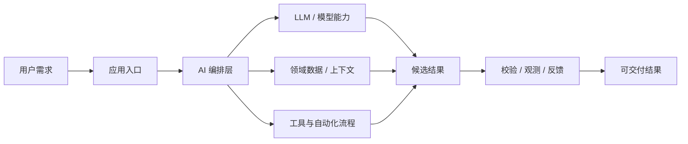
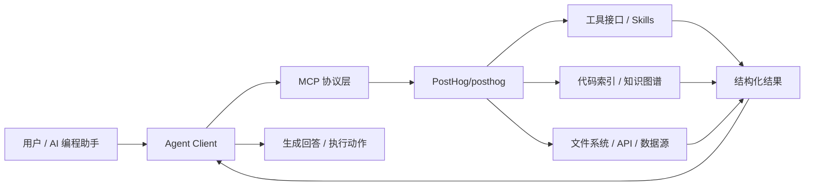
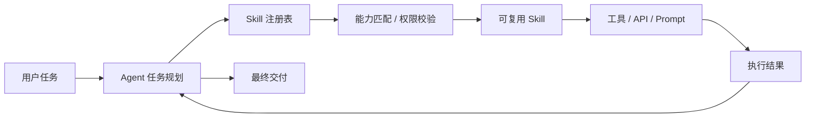
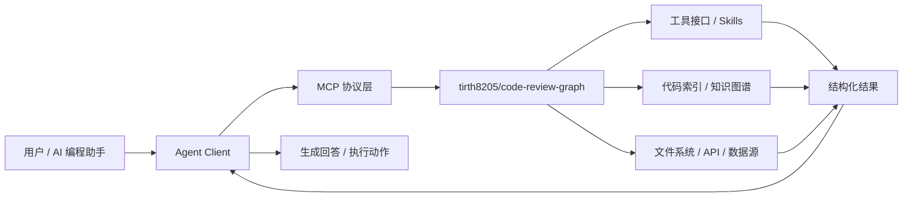

# GitHub AI Daily Trending Top 5

更新时间：2026-07-19T02:15:21Z

筛选范围：仓库名称或描述包含 AI 相关关键词。关键词：ai, agent, agents, agentic, llm, llms, skill, skills, mcp, model context protocol, chatgpt, openai, claude, gemini, copilot, deepseek, rag, embedding, embeddings, transformer, diffusion, machine learning, ml, deep learning, neural, inference, prompt, prompts。

网页版本：由 GitHub Pages 自动发布。

## 1. [apache/ossie](https://github.com/apache/ossie)

- 语言：Python
- Stars：1,281
- 主题：metadata, semantic
- Star 趋势：

- 作用 / 解决的问题：Apache Ossie, industry wide specification effort to standardize how we exchange semantic metadata across analytics, AI and BI platforms, providing a vendor neutral, single source of truth for semantic data
- 适用场景：
  - 适合快速评估 GitHub AI 热榜中新出现或重新升温的技术方向，因为该仓库已获得短期社区关注。
  - 适合围绕 metadata, semantic 做技术调研、竞品分析或原型验证，因为仓库主题与当前 AI 热点高度相关。
- 架构思想：
  - 它成为热榜的核心原因通常不是单点功能，而是把模型能力、工具、数据和工作流组织成更容易落地的工程结构。
  - 当前 Stars 为 1,281，说明它不只是概念验证，还积累了可观的社区验证和传播势能。
  - 相比只提供单一脚本的仓库，它用 metadata, semantic 等 topics 明确了能力边界，更容易被目标用户检索和采用。
  - 使用 Python 作为主要实现语言，降低了对应生态开发者集成、扩展和二次开发的成本。
  - 它的稀缺性在于把热门 AI 能力包装成可运行、可组合、可观察的工程入口，而不是停留在论文、提示词或孤立 Demo。
- 原理 / 实现思路：
  - or more contributor license agreements.  See the NOTICE file
  - distributed with this work for additional information
  - regarding copyright ownership.  The ASF licenses this file
  - 以上内容由 GitHub 公开 README 自动摘取和归纳，适合作为快速了解入口，深入实现仍以仓库源码和文档为准。

## 2. [PostHog/posthog](https://github.com/PostHog/posthog)

- 语言：Python
- Stars：36,610
- 主题：ab-testing, ai-analytics, analytics, cdp, data-warehouse, experiments, feature-flags, javascript, product-analytics, python, react, session-replay, surveys, typescript, web-analytics
- Star 趋势：

- 作用 / 解决的问题：🦔 PostHog is the leading platform for building self-driving products. Our developer tools – AI observability, analytics, session replay, flags, experiments, error tracking, logs, and more – capture all the context agents need to diagnose problems, uncover opportunities, and ship fixes. Steer it all from Slack, web, desktop, or the MCP.
- 适用场景：
  - 适合快速评估 GitHub AI 热榜中新出现或重新升温的技术方向，因为该仓库已获得短期社区关注。
  - 适合需要把外部工具、代码库、数据源接入 AI Agent 的场景，因为 MCP 能把能力封装成标准工具接口。
  - 适合多步骤自动化、工具调用和复杂任务编排场景，因为 Agent 模式能把规划、执行、观察和修正串起来。
- 架构思想：
  - 它成为热榜的核心原因通常不是单点功能，而是把模型能力、工具、数据和工作流组织成更容易落地的工程结构。
  - 当前 Stars 为 36,610，说明它不只是概念验证，还积累了可观的社区验证和传播势能。
  - 相比只提供单一脚本的仓库，它用 ab-testing, ai-analytics, analytics, cdp, data-warehouse, experiments, feature-flags, javascript, product-analytics, python, react, session-replay, surveys, typescript, web-analytics 等 topics 明确了能力边界，更容易被目标用户检索和采用。
  - 使用 Python 作为主要实现语言，降低了对应生态开发者集成、扩展和二次开发的成本。
  - 它的稀缺性在于把热门 AI 能力包装成可运行、可组合、可观察的工程入口，而不是停留在论文、提示词或孤立 Demo。
- 原理 / 实现思路：
  - PostHog is the open source platform for building self-driving products
  - [PostHog is the open source platform for building self-driving products](#posthog-is-the-open-source-platform-for-building-self-driving-products)
  - [Getting started with PostHog](#getting-started-with-posthog)
  - 以上内容由 GitHub 公开 README 自动摘取和归纳，适合作为快速了解入口，深入实现仍以仓库源码和文档为准。

## 3. [ibelick/ui-skills](https://github.com/ibelick/ui-skills)

- 语言：TypeScript
- Stars：5,047
- 主题：skills, ui-skills
- Star 趋势：

- 作用 / 解决的问题：Skills for Design Engineers
- 适用场景：
  - 适合快速评估 GitHub AI 热榜中新出现或重新升温的技术方向，因为该仓库已获得短期社区关注。
  - 适合团队沉淀可复用 AI 能力的场景，因为 Skill 把提示词、工具和流程封装成可发现、可组合的单元。
- 架构思想：
  - 它成为热榜的核心原因通常不是单点功能，而是把模型能力、工具、数据和工作流组织成更容易落地的工程结构。
  - 当前 Stars 为 5,047，说明它不只是概念验证，还积累了可观的社区验证和传播势能。
  - 相比只提供单一脚本的仓库，它用 skills, ui-skills 等 topics 明确了能力边界，更容易被目标用户检索和采用。
  - 使用 TypeScript 作为主要实现语言，降低了对应生态开发者集成、扩展和二次开发的成本。
  - 它的稀缺性在于把热门 AI 能力包装成可运行、可组合、可观察的工程入口，而不是停留在论文、提示词或孤立 Demo。
- 原理 / 实现思路：
  - Run npx ui-skills start to route your agent through the right UI skill set for the task.
  - 以上内容由 GitHub 公开 README 自动摘取和归纳，适合作为快速了解入口，深入实现仍以仓库源码和文档为准。

## 4. [rohitg00/ai-engineering-from-scratch](https://github.com/rohitg00/ai-engineering-from-scratch)

- 语言：Python
- Stars：39,126
- 主题：agents, ai, ai-agents, ai-engineering, computer-vision, course, deep-learning, from-scratch, generative-ai, llm, machine-learning, mcp, nlp, python, reinforcement-learning, rust, swarm-intelligence, transformers, tutorial, typescript
- Star 趋势：

- 作用 / 解决的问题：Learn it. Build it. Ship it for others.
- 适用场景：
  - 适合快速评估 GitHub AI 热榜中新出现或重新升温的技术方向，因为该仓库已获得短期社区关注。
  - 适合需要把外部工具、代码库、数据源接入 AI Agent 的场景，因为 MCP 能把能力封装成标准工具接口。
  - 适合多步骤自动化、工具调用和复杂任务编排场景，因为 Agent 模式能把规划、执行、观察和修正串起来。
- 架构思想：
  - 它成为热榜的核心原因通常不是单点功能，而是把模型能力、工具、数据和工作流组织成更容易落地的工程结构。
  - 当前 Stars 为 39,126，说明它不只是概念验证，还积累了可观的社区验证和传播势能。
  - 相比只提供单一脚本的仓库，它用 agents, ai, ai-agents, ai-engineering, computer-vision, course, deep-learning, from-scratch, generative-ai, llm, machine-learning, mcp, nlp, python, reinforcement-learning, rust, swarm-intelligence, transformers, tutorial, typescript 等 topics 明确了能力边界，更容易被目标用户检索和采用。
  - 使用 Python 作为主要实现语言，降低了对应生态开发者集成、扩展和二次开发的成本。
  - 它的稀缺性在于把热门 AI 能力包装成可运行、可组合、可观察的工程入口，而不是停留在论文、提示词或孤立 Demo。
- 原理 / 实现思路：
  - 84% of students already use AI tools. Only 18% feel prepared to use them
  - 503 lessons. 20 phases. ~320 hours. Python, TypeScript, Rust, Julia. Every lesson ships
  - a reusable artifact: a prompt, a skill, an agent, an MCP server. Free, open source, MIT.
  - 以上内容由 GitHub 公开 README 自动摘取和归纳，适合作为快速了解入口，深入实现仍以仓库源码和文档为准。

## 5. [tirth8205/code-review-graph](https://github.com/tirth8205/code-review-graph)

- 语言：Python
- Stars：20,195
- 主题：ai-coding, claude, claude-code, code-review, graphrag, incremental, knowledge-graph, llm, mcp, python, static-analysis, tree-sitter
- Star 趋势：

- 作用 / 解决的问题：Local-first code intelligence graph for MCP and CLI. Builds a persistent map of your codebase so AI coding tools read only what matters, with benchmarked context reductions on reviews and large-repo workflows.
- 适用场景：
  - 适合快速评估 GitHub AI 热榜中新出现或重新升温的技术方向，因为该仓库已获得短期社区关注。
  - 适合需要把外部工具、代码库、数据源接入 AI Agent 的场景，因为 MCP 能把能力封装成标准工具接口。
- 架构思想：
  - 它成为热榜的核心原因通常不是单点功能，而是把模型能力、工具、数据和工作流组织成更容易落地的工程结构。
  - 当前 Stars 为 20,195，说明它不只是概念验证，还积累了可观的社区验证和传播势能。
  - 相比只提供单一脚本的仓库，它用 ai-coding, claude, claude-code, code-review, graphrag, incremental, knowledge-graph, llm, mcp, python, static-analysis, tree-sitter 等 topics 明确了能力边界，更容易被目标用户检索和采用。
  - 使用 Python 作为主要实现语言，降低了对应生态开发者集成、扩展和二次开发的成本。
  - 它的稀缺性在于把热门 AI 能力包装成可运行、可组合、可观察的工程入口，而不是停留在论文、提示词或孤立 Demo。
- 原理 / 实现思路：
  - pip install code-review-graph                     # or: pipx install code-review-graph
  - code-review-graph install          # auto-detects and configures all supported platforms
  - code-review-graph build            # parse your codebase
  - 以上内容由 GitHub 公开 README 自动摘取和归纳，适合作为快速了解入口，深入实现仍以仓库源码和文档为准。

