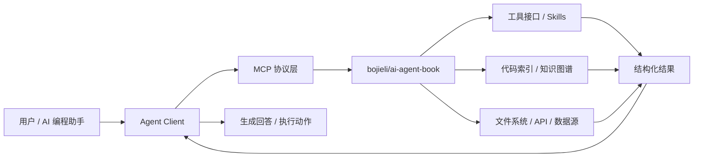
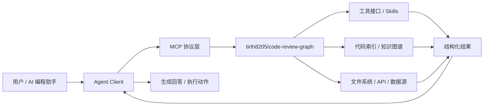
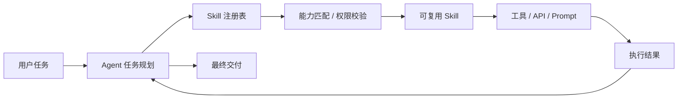

# GitHub AI Daily Trending Top 5

更新时间：2026-07-22T02:11:52Z

筛选范围：仓库名称或描述包含 AI 相关关键词。关键词：ai, agent, agents, agentic, llm, llms, skill, skills, mcp, model context protocol, chatgpt, openai, claude, gemini, copilot, deepseek, rag, embedding, embeddings, transformer, diffusion, machine learning, ml, deep learning, neural, inference, prompt, prompts。

网页版本：由 GitHub Pages 自动发布。

## 1. [koala73/worldmonitor](https://github.com/koala73/worldmonitor)

- 语言：TypeScript
- Stars：65,655
- 主题：agent, ai, dashboard, geopolitics, mcp, mcp-server, monitoring, news, opensource, osint, palantir, situation
- Star 趋势：

- 作用 / 解决的问题：Real-time global intelligence dashboard. AI-powered news aggregation, geopolitical monitoring, and infrastructure tracking in a unified situational awareness interface
- 适用场景：
  - 适合快速评估 GitHub AI 热榜中新出现或重新升温的技术方向，因为该仓库已获得短期社区关注。
  - 适合需要把外部工具、代码库、数据源接入 AI Agent 的场景，因为 MCP 能把能力封装成标准工具接口。
  - 适合多步骤自动化、工具调用和复杂任务编排场景，因为 Agent 模式能把规划、执行、观察和修正串起来。
- 架构思想：
  - 它成为热榜的核心原因通常不是单点功能，而是把模型能力、工具、数据和工作流组织成更容易落地的工程结构。
  - 当前 Stars 为 65,655，说明它不只是概念验证，还积累了可观的社区验证和传播势能。
  - 相比只提供单一脚本的仓库，它用 agent, ai, dashboard, geopolitics, mcp, mcp-server, monitoring, news, opensource, osint, palantir, situation 等 topics 明确了能力边界，更容易被目标用户检索和采用。
  - 使用 TypeScript 作为主要实现语言，降低了对应生态开发者集成、扩展和二次开发的成本。
  - 它的稀缺性在于把热门 AI 能力包装成可运行、可组合、可观察的工程入口，而不是停留在论文、提示词或孤立 Demo。
- 原理 / 实现思路：
  - Real-time global intelligence dashboard — AI-powered news aggregation, geopolitical monitoring, and infrastructure tracking in a unified situational awareness interface.
  - 500+ curated news feeds across 15 categories, AI-synthesized into briefs
  - Dual map engine — 3D globe (globe.gl) and WebGL flat map (deck.gl) with 56 map layer types
  - 以上内容由 GitHub 公开 README 自动摘取和归纳，适合作为快速了解入口，深入实现仍以仓库源码和文档为准。

## 2. [bojieli/ai-agent-book](https://github.com/bojieli/ai-agent-book)

- 语言：Python
- Stars：14,807
- 主题：agent, agent-memory, ai-agent, book, coding-agent, context-engineering, large-language-models, llm, mcp, multi-agent, multimodal, rag, reinforcement-learning
- Star 趋势：

- 作用 / 解决的问题：《深入理解 AI Agent：设计原理与工程实践》（李博杰 著）开源主仓库：全书正文、编译版 PDF 与按章配套代码
- 适用场景：
  - 适合快速评估 GitHub AI 热榜中新出现或重新升温的技术方向，因为该仓库已获得短期社区关注。
  - 适合需要把外部工具、代码库、数据源接入 AI Agent 的场景，因为 MCP 能把能力封装成标准工具接口。
  - 适合知识库问答、文档检索和企业内部搜索场景，因为 RAG 能把私有数据补充进 LLM 上下文。
  - 适合多步骤自动化、工具调用和复杂任务编排场景，因为 Agent 模式能把规划、执行、观察和修正串起来。
- 架构思想：
  - 它成为热榜的核心原因通常不是单点功能，而是把模型能力、工具、数据和工作流组织成更容易落地的工程结构。
  - 当前 Stars 为 14,807，说明它不只是概念验证，还积累了可观的社区验证和传播势能。
  - 相比只提供单一脚本的仓库，它用 agent, agent-memory, ai-agent, book, coding-agent, context-engineering, large-language-models, llm, mcp, multi-agent, multimodal, rag, reinforcement-learning 等 topics 明确了能力边界，更容易被目标用户检索和采用。
  - 使用 Python 作为主要实现语言，降低了对应生态开发者集成、扩展和二次开发的成本。
  - 它的稀缺性在于把热门 AI 能力包装成可运行、可组合、可观察的工程入口，而不是停留在论文、提示词或孤立 Demo。
- 原理 / 实现思路：
  - 深入理解 AI Agent：设计原理与工程实践
  - 中文 ← 当前 · [中文繁体](docs/zh-TW/README.md) · [English](docs/en/README.md) · [Tiếng Việt](docs/vi/README.md) · [தமிழ்](docs/ta/README.md)
  - Agent = LLM + 上下文 + 工具——本书围绕这个核心公式，用 10 章把 AI Agent 从原理讲到工程实战。全书正文、配图、88 个配套实验全部开源，欢迎亲手把实验跑一遍。
  - 以上内容由 GitHub 公开 README 自动摘取和归纳，适合作为快速了解入口，深入实现仍以仓库源码和文档为准。

## 3. [tirth8205/code-review-graph](https://github.com/tirth8205/code-review-graph)

- 语言：Python
- Stars：24,612
- 主题：ai-coding, claude, claude-code, code-review, graphrag, incremental, knowledge-graph, llm, mcp, python, static-analysis, tree-sitter
- Star 趋势：

- 作用 / 解决的问题：Local-first code intelligence graph for MCP and CLI. Builds a persistent map of your codebase so AI coding tools read only what matters, with benchmarked context reductions on reviews and large-repo workflows.
- 适用场景：
  - 适合快速评估 GitHub AI 热榜中新出现或重新升温的技术方向，因为该仓库已获得短期社区关注。
  - 适合需要把外部工具、代码库、数据源接入 AI Agent 的场景，因为 MCP 能把能力封装成标准工具接口。
- 架构思想：
  - 它成为热榜的核心原因通常不是单点功能，而是把模型能力、工具、数据和工作流组织成更容易落地的工程结构。
  - 当前 Stars 为 24,612，说明它不只是概念验证，还积累了可观的社区验证和传播势能。
  - 相比只提供单一脚本的仓库，它用 ai-coding, claude, claude-code, code-review, graphrag, incremental, knowledge-graph, llm, mcp, python, static-analysis, tree-sitter 等 topics 明确了能力边界，更容易被目标用户检索和采用。
  - 使用 Python 作为主要实现语言，降低了对应生态开发者集成、扩展和二次开发的成本。
  - 它的稀缺性在于把热门 AI 能力包装成可运行、可组合、可观察的工程入口，而不是停留在论文、提示词或孤立 Demo。
- 原理 / 实现思路：
  - pip install code-review-graph                     # or: pipx install code-review-graph
  - code-review-graph install          # auto-detects and configures all supported platforms
  - code-review-graph build            # parse your codebase
  - 以上内容由 GitHub 公开 README 自动摘取和归纳，适合作为快速了解入口，深入实现仍以仓库源码和文档为准。

## 4. [ayghri/i-have-adhd](https://github.com/ayghri/i-have-adhd)

- 语言：-
- Stars：6,951
- 主题：adhd, claude-, claude-code-plugin, claude-skills, developer-tools, productivity
- Star 趋势：

- 作用 / 解决的问题：A skill for your coding agent to stop it from burying the answer. ADHD-friendly output.
- 适用场景：
  - 适合快速评估 GitHub AI 热榜中新出现或重新升温的技术方向，因为该仓库已获得短期社区关注。
  - 适合多步骤自动化、工具调用和复杂任务编排场景，因为 Agent 模式能把规划、执行、观察和修正串起来。
  - 适合团队沉淀可复用 AI 能力的场景，因为 Skill 把提示词、工具和流程封装成可发现、可组合的单元。
- 架构思想：
  - 它成为热榜的核心原因通常不是单点功能，而是把模型能力、工具、数据和工作流组织成更容易落地的工程结构。
  - 当前 Stars 为 6,951，说明它不只是概念验证，还积累了可观的社区验证和传播势能。
  - 相比只提供单一脚本的仓库，它用 adhd, claude-, claude-code-plugin, claude-skills, developer-tools, productivity 等 topics 明确了能力边界，更容易被目标用户检索和采用。
  - 它的稀缺性在于把热门 AI 能力包装成可运行、可组合、可观察的工程入口，而不是停留在论文、提示词或孤立 Demo。
- 原理 / 实现思路：
  - Then type /i-have-adhd. No local clone needed — Claude Code fetches the repo and keeps it updated.
  - codex plugin marketplace add ayghri/i-have-adhd --ref main
  - Then type $i-have-adhd to apply the output style explicitly. The skill can also be invoked implicitly when Codex sees a task that benefits from it.
  - 以上内容由 GitHub 公开 README 自动摘取和归纳，适合作为快速了解入口，深入实现仍以仓库源码和文档为准。

## 5. [earthtojake/text-to-cad](https://github.com/earthtojake/text-to-cad)

- 语言：JavaScript
- Stars：9,186
- 主题：3mf, agents, ai-agents, build123d, cad, dxf, glb, mechanical-engineering, opencascade, robotics, sdf, srdf, step, stl, stp, text-to-cad, urdf
- Star 趋势：

- 作用 / 解决的问题：A collection of agent skills for CAD, robotics and hardware design
- 适用场景：
  - 适合快速评估 GitHub AI 热榜中新出现或重新升温的技术方向，因为该仓库已获得短期社区关注。
  - 适合多步骤自动化、工具调用和复杂任务编排场景，因为 Agent 模式能把规划、执行、观察和修正串起来。
  - 适合团队沉淀可复用 AI 能力的场景，因为 Skill 把提示词、工具和流程封装成可发现、可组合的单元。
- 架构思想：
  - 它成为热榜的核心原因通常不是单点功能，而是把模型能力、工具、数据和工作流组织成更容易落地的工程结构。
  - 当前 Stars 为 9,186，说明它不只是概念验证，还积累了可观的社区验证和传播势能。
  - 相比只提供单一脚本的仓库，它用 3mf, agents, ai-agents, build123d, cad, dxf, glb, mechanical-engineering, opencascade, robotics, sdf, srdf, step, stl, stp, text-to-cad, urdf 等 topics 明确了能力边界，更容易被目标用户检索和采用。
  - 使用 JavaScript 作为主要实现语言，降低了对应生态开发者集成、扩展和二次开发的成本。
  - 它的稀缺性在于把热门 AI 能力包装成可运行、可组合、可观察的工程入口，而不是停留在论文、提示词或孤立 Demo。
- 原理 / 实现思路：
  - A skills library for CAD, robotics, and hardware design agents
  - CAD Skills is a library of agent skills for generating, inspecting, sourcing,
  - slicing, and handing off CAD and robot-description artifacts from local project
  - 以上内容由 GitHub 公开 README 自动摘取和归纳，适合作为快速了解入口，深入实现仍以仓库源码和文档为准。

