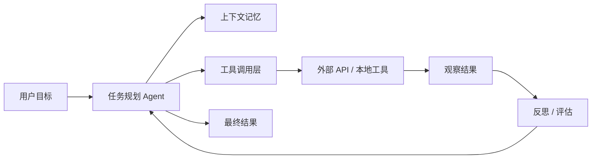
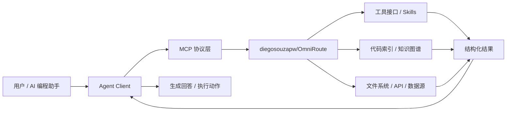

# GitHub AI Daily Trending Top 5

更新时间：2026-07-02T02:51:42Z

筛选范围：仓库名称或描述包含 AI 相关关键词。关键词：ai, agent, agents, agentic, llm, llms, skill, skills, mcp, model context protocol, chatgpt, openai, claude, gemini, copilot, deepseek, rag, embedding, embeddings, transformer, diffusion, machine learning, ml, deep learning, neural, inference, prompt, prompts。

网页版本：由 GitHub Pages 自动发布。

## 1. [msitarzewski/agency-agents](https://github.com/msitarzewski/agency-agents)

- 语言：Shell
- Stars：123,688
- 主题：未在 GitHub API 中公开 topics
- Star 趋势：

- 作用 / 解决的问题：A complete AI agency at your fingertips - From frontend wizards to Reddit community ninjas, from whimsy injectors to reality checkers. Each agent is a specialized expert with personality, processes, and proven deliverables.
- 适用场景：
  - 适合快速评估 GitHub AI 热榜中新出现或重新升温的技术方向，因为该仓库已获得短期社区关注。
  - 适合多步骤自动化、工具调用和复杂任务编排场景，因为 Agent 模式能把规划、执行、观察和修正串起来。
- 架构思想：
  - 它成为热榜的核心原因通常不是单点功能，而是把模型能力、工具、数据和工作流组织成更容易落地的工程结构。
  - 当前 Stars 为 123,688，说明它不只是概念验证，还积累了可观的社区验证和传播势能。
  - 使用 Shell 作为主要实现语言，降低了对应生态开发者集成、扩展和二次开发的成本。
  - 它的稀缺性在于把热门 AI 能力包装成可运行、可组合、可观察的工程入口，而不是停留在论文、提示词或孤立 Demo。
- 原理 / 实现思路：
  - 🎭 The Agency: AI Specialists Ready to Transform Your Workflow
  - A complete AI agency at your fingertips - From frontend wizards to Reddit community ninjas, from whimsy injectors to reality checkers. Each agent is a specialized expert with personality, processes, and proven deliverables.
  - Born from a Reddit thread and months of iteration, The Agency is a growing collection of meticulously crafted AI agent personalities. Each agent is:
  - 以上内容由 GitHub 公开 README 自动摘取和归纳，适合作为快速了解入口，深入实现仍以仓库源码和文档为准。

## 2. [usestrix/strix](https://github.com/usestrix/strix)

- 语言：Python
- Stars：29,870
- 主题：agents, ai-hacking, ai-penetration-testing, ai-pentesting, ai-security, artificial-intelligence, bug-bounty, code-quality, ctf-tools, cybersecurity, cybersecurity-tools, ethical-hacking, hacking, llm-security, offensive-security, penetration-testing, pentesting-tools, red-teaming, security, security-automation
- Star 趋势：

- 作用 / 解决的问题：Open-source AI penetration testing tool to find and fix your app’s vulnerabilities.
- 适用场景：
  - 适合快速评估 GitHub AI 热榜中新出现或重新升温的技术方向，因为该仓库已获得短期社区关注。
  - 适合多步骤自动化、工具调用和复杂任务编排场景，因为 Agent 模式能把规划、执行、观察和修正串起来。
- 架构思想：
  - 它成为热榜的核心原因通常不是单点功能，而是把模型能力、工具、数据和工作流组织成更容易落地的工程结构。
  - 当前 Stars 为 29,870，说明它不只是概念验证，还积累了可观的社区验证和传播势能。
  - 相比只提供单一脚本的仓库，它用 agents, ai-hacking, ai-penetration-testing, ai-pentesting, ai-security, artificial-intelligence, bug-bounty, code-quality, ctf-tools, cybersecurity, cybersecurity-tools, ethical-hacking, hacking, llm-security, offensive-security, penetration-testing, pentesting-tools, red-teaming, security, security-automation 等 topics 明确了能力边界，更容易被目标用户检索和采用。
  - 使用 Python 作为主要实现语言，降低了对应生态开发者集成、扩展和二次开发的成本。
  - 它的稀缺性在于把热门 AI 能力包装成可运行、可组合、可观察的工程入口，而不是停留在论文、提示词或孤立 Demo。
- 原理 / 实现思路：
  - The open-source AI pentesting tool. Autonomous AI hackers that find and fix your app’s vulnerabilities.
  - Strix are autonomous AI penetration testing agents that act just like real hackers - they run your code dynamically, find vulnerabilities, and validate them through actual proof-of-concepts. Built for developers and security teams who need fast, accurate secur...
  - Full pentesting toolkit - reconnaissance, exploitation, and validation out of the box
  - 以上内容由 GitHub 公开 README 自动摘取和归纳，适合作为快速了解入口，深入实现仍以仓库源码和文档为准。

## 3. [HKUDS/Vibe-Trading](https://github.com/HKUDS/Vibe-Trading)

- 语言：Python
- Stars：16,633
- 主题：ai-agent, algorithmic-trading, backtesting, fintech, llm, mcp, multi-agent, python, quantitative-finance, trading
- Star 趋势：

- 作用 / 解决的问题："Vibe-Trading: Your Personal Trading Agent"
- 适用场景：
  - 适合快速评估 GitHub AI 热榜中新出现或重新升温的技术方向，因为该仓库已获得短期社区关注。
  - 适合需要把外部工具、代码库、数据源接入 AI Agent 的场景，因为 MCP 能把能力封装成标准工具接口。
  - 适合多步骤自动化、工具调用和复杂任务编排场景，因为 Agent 模式能把规划、执行、观察和修正串起来。
- 架构思想：
  - 它成为热榜的核心原因通常不是单点功能，而是把模型能力、工具、数据和工作流组织成更容易落地的工程结构。
  - 当前 Stars 为 16,633，说明它不只是概念验证，还积累了可观的社区验证和传播势能。
  - 相比只提供单一脚本的仓库，它用 ai-agent, algorithmic-trading, backtesting, fintech, llm, mcp, multi-agent, python, quantitative-finance, trading 等 topics 明确了能力边界，更容易被目标用户检索和采用。
  - 使用 Python 作为主要实现语言，降低了对应生态开发者集成、扩展和二次开发的成本。
  - 它的稀缺性在于把热门 AI 能力包装成可运行、可组合、可观察的工程入口，而不是停留在论文、提示词或孤立 Demo。
- 原理 / 实现思路：
  - 2026-06-19 🚀 v0.1.10 — Global data layer: market-data sources grow 10 → 18 (free Eastmoney / Sina / Stooq / Yahoo + key-gated Finnhub / Alpha Vantage / Tiingo / FMP, ban-risk fallback) plus 18 read-only data tools (fund flow, dragon-tiger, northbound, margin, ...
  - 2026-06-06 ⚖️ Alpha compare — head-to-head across CLI, Web UI, REST & agent: A new alpha compare benches a hand-picked shortlist of Alpha Zoo alphas against each other on a universe and period, then ranks them by IC mean/std, IR, IC-positive ratio or sample co...
  - 2026-05-31 🔌 Connector-first broker architecture (IBKR + Robinhood): Trading access now starts from a selectable connector profile instead of separate broker/live entry points. vibe-trading connector list/use/check/account/positions/orders/quote/history and th...
  - 以上内容由 GitHub 公开 README 自动摘取和归纳，适合作为快速了解入口，深入实现仍以仓库源码和文档为准。

## 4. [facebook/astryx](https://github.com/facebook/astryx)

- 语言：TypeScript
- Stars：2,735
- 主题：未在 GitHub API 中公开 topics
- Star 趋势：

- 作用 / 解决的问题：An open source design system that's fully customizable and agent ready
- 适用场景：
  - 适合快速评估 GitHub AI 热榜中新出现或重新升温的技术方向，因为该仓库已获得短期社区关注。
  - 适合多步骤自动化、工具调用和复杂任务编排场景，因为 Agent 模式能把规划、执行、观察和修正串起来。
- 架构思想：
  - 它成为热榜的核心原因通常不是单点功能，而是把模型能力、工具、数据和工作流组织成更容易落地的工程结构。
  - 当前 Stars 为 2,735，说明它不只是概念验证，还积累了可观的社区验证和传播势能。
  - 使用 TypeScript 作为主要实现语言，降低了对应生态开发者集成、扩展和二次开发的成本。
  - 它的稀缺性在于把热门 AI 能力包装成可运行、可组合、可观察的工程入口，而不是停留在论文、提示词或孤立 Demo。
- 原理 / 实现思路：
  - An open source design system that's fully customizable and built for how we build now — by people and the agents working alongside them.
  - Astryx is an open source design system that grew inside Meta over the last eight years, where it became the most-used and largest design system in the company — powering 13,000+ apps and shaped by the engineers, designers, and product teams who depend on it ev...
  - It ships 150+ accessible components, brand-level theming, dark mode, ready-to-ship templates, and a CLI as one cohesive system. You import pre-built CSS and use typed React components — no build plugin, no styling library to adopt — and both people and AI assi...
  - 以上内容由 GitHub 公开 README 自动摘取和归纳，适合作为快速了解入口，深入实现仍以仓库源码和文档为准。

## 5. [diegosouzapw/OmniRoute](https://github.com/diegosouzapw/OmniRoute)

- 语言：TypeScript
- Stars：9,614
- 主题：a2a, ai-agents, ai-gateway, anthropic, claude, claude-code, cline, codex, copilot, cursor, deepseek, free-ai, gemini, gemini-cli, llm-gateway, mcp, openai, openai-proxy, qwen, token-saver
- Star 趋势：

- 作用 / 解决的问题：Never stop coding. Free AI gateway: one endpoint, 231+ providers (50+ free), connect Claude Code, Codex, Cursor, Cline & Copilot to FREE Claude/GPT/Gemini. RTK+Caveman stacked compression saves 15-95% tokens, smart auto-fallback, MCP/A2A, multimodal APIs, Desktop/PWA.
- 适用场景：
  - 适合快速评估 GitHub AI 热榜中新出现或重新升温的技术方向，因为该仓库已获得短期社区关注。
  - 适合需要把外部工具、代码库、数据源接入 AI Agent 的场景，因为 MCP 能把能力封装成标准工具接口。
- 架构思想：
  - 它成为热榜的核心原因通常不是单点功能，而是把模型能力、工具、数据和工作流组织成更容易落地的工程结构。
  - 当前 Stars 为 9,614，说明它不只是概念验证，还积累了可观的社区验证和传播势能。
  - 相比只提供单一脚本的仓库，它用 a2a, ai-agents, ai-gateway, anthropic, claude, claude-code, cline, codex, copilot, cursor, deepseek, free-ai, gemini, gemini-cli, llm-gateway, mcp, openai, openai-proxy, qwen, token-saver 等 topics 明确了能力边界，更容易被目标用户检索和采用。
  - 使用 TypeScript 作为主要实现语言，降低了对应生态开发者集成、扩展和二次开发的成本。
  - 它的稀缺性在于把热门 AI 能力包装成可运行、可组合、可观察的工程入口，而不是停留在论文、提示词或孤立 Demo。
- 原理 / 实现思路：
  - Never stop coding. Connect every AI tool to 236 providers — 50+ free — through one endpoint.
  - Plug Claude Code, Codex, Cursor, Cline, Copilot & Antigravity into FREE Claude / GPT / Gemini. Auto-fallback.
  - RTK + Caveman compression saves 15–95% tokens. Never hit limits.
  - 以上内容由 GitHub 公开 README 自动摘取和归纳，适合作为快速了解入口，深入实现仍以仓库源码和文档为准。

