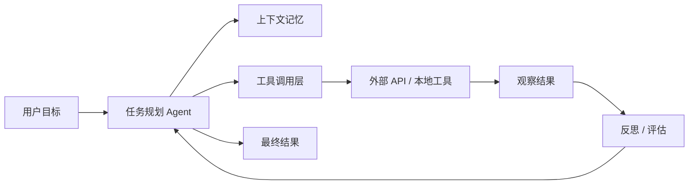

# GitHub AI Daily Trending Top 5

更新时间：2026-06-29T03:30:52Z

筛选范围：仓库名称或描述包含 AI 相关关键词。关键词：ai, agent, agents, agentic, llm, llms, skill, skills, mcp, model context protocol, chatgpt, openai, claude, gemini, copilot, deepseek, rag, embedding, embeddings, transformer, diffusion, machine learning, ml, deep learning, neural, inference, prompt, prompts。

网页版本：由 GitHub Pages 自动发布。

## 1. [xbtlin/ai-berkshire](https://github.com/xbtlin/ai-berkshire)

- 语言：Python
- Stars：5,598
- 主题：ai, ai-agent, anthropic, berkshire-hathaway, charlie-munger, china-stock, claude, claude-code, financial-analysis, fintech, fundamental-analysis, investment, investment-research, llm, mcp, portfolio-management, stock-analysis, stock-market, value-investing, warren-buffett
- Star 趋势：

- 作用 / 解决的问题：AI 时代的伯克希尔：基于 Claude Code / Codex 的价值投资研究框架。巴菲特·芒格·段永平·李录四大师方法论 + 多Agent并行研究。\| AI-era Berkshire: a value investing research framework built for Claude Code / Codex. 4 masters' methodologies + multi-agent adversarial analysis.
- 适用场景：
  - 适合快速评估 GitHub AI 热榜中新出现或重新升温的技术方向，因为该仓库已获得短期社区关注。
  - 适合需要把外部工具、代码库、数据源接入 AI Agent 的场景，因为 MCP 能把能力封装成标准工具接口。
  - 适合多步骤自动化、工具调用和复杂任务编排场景，因为 Agent 模式能把规划、执行、观察和修正串起来。
- 架构思想：
  - 它成为热榜的核心原因通常不是单点功能，而是把模型能力、工具、数据和工作流组织成更容易落地的工程结构。
  - 当前 Stars 为 5,598，说明它不只是概念验证，还积累了可观的社区验证和传播势能。
  - 相比只提供单一脚本的仓库，它用 ai, ai-agent, anthropic, berkshire-hathaway, charlie-munger, china-stock, claude, claude-code, financial-analysis, fintech, fundamental-analysis, investment, investment-research, llm, mcp, portfolio-management, stock-analysis, stock-market, value-investing, warren-buffett 等 topics 明确了能力边界，更容易被目标用户检索和采用。
  - 使用 Python 作为主要实现语言，降低了对应生态开发者集成、扩展和二次开发的成本。
  - 它的稀缺性在于把热门 AI 能力包装成可运行、可组合、可观察的工程入口，而不是停留在论文、提示词或孤立 Demo。
- 原理 / 实现思路：
  - AI Berkshire - AI 时代的价值投资研究框架
  - "Price is what you pay, value is what you get." — Warren Buffett
  - 用 AI 重新定义投资研究的深度与效率。
  - 以上内容由 GitHub 公开 README 自动摘取和归纳，适合作为快速了解入口，深入实现仍以仓库源码和文档为准。

## 2. [DeusData/codebase-memory-mcp](https://github.com/DeusData/codebase-memory-mcp)

- 语言：C
- Stars：19,986
- 主题：aider, ast, claude-code, code-analysis, code-intelligence, codex, cursor, cypher, developer-tools, gemini-cli, graph-visualization, kilocode, knowledge-graph, mcp, mcp-server, model-context-protocol, opencode, sqlite, tree-sitter, windsurf
- Star 趋势：

- 作用 / 解决的问题：High-performance code intelligence MCP server. Indexes codebases into a persistent knowledge graph — average repo in milliseconds. 158 languages, sub-ms queries, 99% fewer tokens. Single static binary, zero dependencies.
- 适用场景：
  - 适合快速评估 GitHub AI 热榜中新出现或重新升温的技术方向，因为该仓库已获得短期社区关注。
  - 适合需要把外部工具、代码库、数据源接入 AI Agent 的场景，因为 MCP 能把能力封装成标准工具接口。
  - 适合知识库问答、文档检索和企业内部搜索场景，因为 RAG 能把私有数据补充进 LLM 上下文。
- 架构思想：
  - 它成为热榜的核心原因通常不是单点功能，而是把模型能力、工具、数据和工作流组织成更容易落地的工程结构。
  - 当前 Stars 为 19,986，说明它不只是概念验证，还积累了可观的社区验证和传播势能。
  - 相比只提供单一脚本的仓库，它用 aider, ast, claude-code, code-analysis, code-intelligence, codex, cursor, cypher, developer-tools, gemini-cli, graph-visualization, kilocode, knowledge-graph, mcp, mcp-server, model-context-protocol, opencode, sqlite, tree-sitter, windsurf 等 topics 明确了能力边界，更容易被目标用户检索和采用。
  - 使用 C 作为主要实现语言，降低了对应生态开发者集成、扩展和二次开发的成本。
  - 它的稀缺性在于把热门 AI 能力包装成可运行、可组合、可观察的工程入口，而不是停留在论文、提示词或孤立 Demo。
- 原理 / 实现思路：
  - The fastest and most efficient code intelligence engine for AI coding agents. Full-indexes an average repository in milliseconds, the Linux kernel (28M LOC, 75K files) in 3 minutes. Answers structural queries in under 1ms. Ships as a single static binary for m...
  - Extreme indexing speed — Linux kernel (28M LOC, 75K files) in 3 minutes. RAM-first pipeline: LZ4 compression, in-memory SQLite, fused Aho-Corasick pattern matching. Memory released after indexing.
  - Plug and play — single static binary for macOS (arm64/amd64), Linux (arm64/amd64), and Windows (amd64). No Docker, no runtime dependencies, no API keys. Download → install → restart agent → done.
  - 以上内容由 GitHub 公开 README 自动摘取和归纳，适合作为快速了解入口，深入实现仍以仓库源码和文档为准。

## 3. [opendatalab/MinerU](https://github.com/opendatalab/MinerU)

- 语言：Python
- Stars：71,747
- 主题：ai4science, document-analysis, docx, extract-data, layout-analysis, ocr, parser, pdf, pdf-converter, pdf-extractor-llm, pdf-extractor-pretrain, pdf-extractor-rag, pdf-parser, pptx, python, xlsx
- Star 趋势：

- 作用 / 解决的问题：Transforms complex documents like PDFs and Office docs into LLM-ready markdown/JSON for your Agentic workflows.
- 适用场景：
  - 适合快速评估 GitHub AI 热榜中新出现或重新升温的技术方向，因为该仓库已获得短期社区关注。
  - 适合多步骤自动化、工具调用和复杂任务编排场景，因为 Agent 模式能把规划、执行、观察和修正串起来。
- 架构思想：
  - 它成为热榜的核心原因通常不是单点功能，而是把模型能力、工具、数据和工作流组织成更容易落地的工程结构。
  - 当前 Stars 为 71,747，说明它不只是概念验证，还积累了可观的社区验证和传播势能。
  - 相比只提供单一脚本的仓库，它用 ai4science, document-analysis, docx, extract-data, layout-analysis, ocr, parser, pdf, pdf-converter, pdf-extractor-llm, pdf-extractor-pretrain, pdf-extractor-rag, pdf-parser, pptx, python, xlsx 等 topics 明确了能力边界，更容易被目标用户检索和采用。
  - 使用 Python 作为主要实现语言，降低了对应生态开发者集成、扩展和二次开发的成本。
  - 它的稀缺性在于把热门 AI 能力包装成可运行、可组合、可观察的工程入口，而不是停留在论文、提示词或孤立 Demo。
- 原理 / 实现思路：
  - [English](README.md) \| [简体中文](README_zh-CN.md)
  - Converts PDF · DOCX · PPTX · XLSX · Images · Web pages into structured Markdown / JSON · VLM+OCR dual engine · 109 languages  
  - MCP Server · LangChain / Dify / FastGPT native integration · 10+ domestic AI chip support
  - 以上内容由 GitHub 公开 README 自动摘取和归纳，适合作为快速了解入口，深入实现仍以仓库源码和文档为准。

## 4. [HKUDS/Vibe-Trading](https://github.com/HKUDS/Vibe-Trading)

- 语言：Python
- Stars：14,445
- 主题：ai-agent, algorithmic-trading, backtesting, fintech, llm, mcp, multi-agent, python, quantitative-finance, trading
- Star 趋势：

- 作用 / 解决的问题："Vibe-Trading: Your Personal Trading Agent"
- 适用场景：
  - 适合快速评估 GitHub AI 热榜中新出现或重新升温的技术方向，因为该仓库已获得短期社区关注。
  - 适合需要把外部工具、代码库、数据源接入 AI Agent 的场景，因为 MCP 能把能力封装成标准工具接口。
  - 适合多步骤自动化、工具调用和复杂任务编排场景，因为 Agent 模式能把规划、执行、观察和修正串起来。
- 架构思想：
  - 它成为热榜的核心原因通常不是单点功能，而是把模型能力、工具、数据和工作流组织成更容易落地的工程结构。
  - 当前 Stars 为 14,445，说明它不只是概念验证，还积累了可观的社区验证和传播势能。
  - 相比只提供单一脚本的仓库，它用 ai-agent, algorithmic-trading, backtesting, fintech, llm, mcp, multi-agent, python, quantitative-finance, trading 等 topics 明确了能力边界，更容易被目标用户检索和采用。
  - 使用 Python 作为主要实现语言，降低了对应生态开发者集成、扩展和二次开发的成本。
  - 它的稀缺性在于把热门 AI 能力包装成可运行、可组合、可观察的工程入口，而不是停留在论文、提示词或孤立 Demo。
- 原理 / 实现思路：
  - 2026-06-19 🚀 v0.1.10 — Global data layer: market-data sources grow 10 → 18 (free Eastmoney / Sina / Stooq / Yahoo + key-gated Finnhub / Alpha Vantage / Tiingo / FMP, ban-risk fallback) plus 18 read-only data tools (fund flow, dragon-tiger, northbound, margin, ...
  - 2026-06-06 ⚖️ Alpha compare — head-to-head across CLI, Web UI, REST & agent: A new alpha compare benches a hand-picked shortlist of Alpha Zoo alphas against each other on a universe and period, then ranks them by IC mean/std, IR, IC-positive ratio or sample co...
  - 2026-05-31 🔌 Connector-first broker architecture (IBKR + Robinhood): Trading access now starts from a selectable connector profile instead of separate broker/live entry points. vibe-trading connector list/use/check/account/positions/orders/quote/history and th...
  - 以上内容由 GitHub 公开 README 自动摘取和归纳，适合作为快速了解入口，深入实现仍以仓库源码和文档为准。

## 5. [usestrix/strix](https://github.com/usestrix/strix)

- 语言：Python
- Stars：26,830
- 主题：agents, ai-hacking, ai-penetration-testing, ai-pentesting, ai-security, artificial-intelligence, bug-bounty, code-quality, ctf-tools, cybersecurity, cybersecurity-tools, ethical-hacking, hacking, llm-security, offensive-security, penetration-testing, pentesting-tools, red-teaming, security, security-automation
- Star 趋势：

- 作用 / 解决的问题：Open-source AI hackers to find and fix your app’s vulnerabilities.
- 适用场景：
  - 适合快速评估 GitHub AI 热榜中新出现或重新升温的技术方向，因为该仓库已获得短期社区关注。
  - 适合多步骤自动化、工具调用和复杂任务编排场景，因为 Agent 模式能把规划、执行、观察和修正串起来。
- 架构思想：
  - 它成为热榜的核心原因通常不是单点功能，而是把模型能力、工具、数据和工作流组织成更容易落地的工程结构。
  - 当前 Stars 为 26,830，说明它不只是概念验证，还积累了可观的社区验证和传播势能。
  - 相比只提供单一脚本的仓库，它用 agents, ai-hacking, ai-penetration-testing, ai-pentesting, ai-security, artificial-intelligence, bug-bounty, code-quality, ctf-tools, cybersecurity, cybersecurity-tools, ethical-hacking, hacking, llm-security, offensive-security, penetration-testing, pentesting-tools, red-teaming, security, security-automation 等 topics 明确了能力边界，更容易被目标用户检索和采用。
  - 使用 Python 作为主要实现语言，降低了对应生态开发者集成、扩展和二次开发的成本。
  - 它的稀缺性在于把热门 AI 能力包装成可运行、可组合、可观察的工程入口，而不是停留在论文、提示词或孤立 Demo。
- 原理 / 实现思路：
  - Open-source AI hackers to find and fix your app’s vulnerabilities.
  - Strix are autonomous AI agents that act just like real hackers - they run your code dynamically, find vulnerabilities, and validate them through actual proof-of-concepts. Built for developers and security teams who need fast, accurate security testing without ...
  - Application Security Testing - Detect and validate critical vulnerabilities in your applications
  - 以上内容由 GitHub 公开 README 自动摘取和归纳，适合作为快速了解入口，深入实现仍以仓库源码和文档为准。

