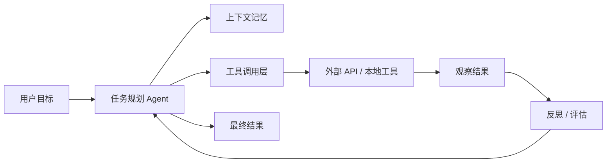
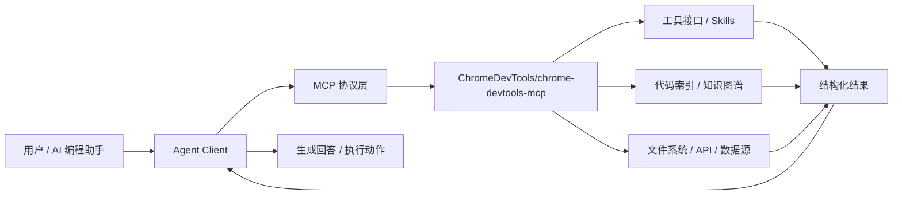

# GitHub AI Daily Trending Top 5

更新时间：2026-09-03T02:43:11Z

筛选范围：仓库名称或描述包含 AI 相关关键词。关键词：ai, agent, agents, agentic, llm, llms, skill, skills, mcp, model context protocol, chatgpt, openai, claude, gemini, copilot, deepseek, rag, embedding, embeddings, transformer, diffusion, machine learning, ml, deep learning, neural, inference, prompt, prompts。

网页版本：由 GitHub Pages 自动发布。

## 1. [DietrichGebert/ponytail](https://github.com/DietrichGebert/ponytail)

- 语言：JavaScript
- Stars：121,778
- 主题：agent-skills, ai-agents, claude, claude-code, claude-code-plugin, cursor-rules, developer-tools, llm, prompt-engineering, yagni
- Star 趋势：

- 作用 / 解决的问题：Makes your AI agent think like the laziest senior dev in the room. The best code is the code you never wrote.
- 适用场景：
  - 适合快速评估 GitHub AI 热榜中新出现或重新升温的技术方向，因为该仓库已获得短期社区关注。
  - 适合多步骤自动化、工具调用和复杂任务编排场景，因为 Agent 模式能把规划、执行、观察和修正串起来。
- 架构思想：
  - 它成为热榜的核心原因通常不是单点功能，而是把模型能力、工具、数据和工作流组织成更容易落地的工程结构。
  - 当前 Stars 为 121,778，说明它不只是概念验证，还积累了可观的社区验证和传播势能。
  - 相比只提供单一脚本的仓库，它用 agent-skills, ai-agents, claude, claude-code, claude-code-plugin, cursor-rules, developer-tools, llm, prompt-engineering, yagni 等 topics 明确了能力边界，更容易被目标用户检索和采用。
  - 使用 JavaScript 作为主要实现语言，降低了对应生态开发者集成、扩展和二次开发的成本。
  - 它的稀缺性在于把热门 AI 能力包装成可运行、可组合、可观察的工程入口，而不是停留在论文、提示词或孤立 Demo。
- 原理 / 实现思路：
  - You ask for a date picker. Your agent installs flatpickr, writes a wrapper component, adds a stylesheet, and starts a discussion about timezones.
  - \| vs no-skill baseline \| LOC \| tokens \| cost \| time \| safe \|
  - \| caveman (terse-prose control) \| -20% \| +7% \| +3% \| +2% \| 100% \|
  - 以上内容由 GitHub 公开 README 自动摘取和归纳，适合作为快速了解入口，深入实现仍以仓库源码和文档为准。

```mermaid
flowchart LR
    User[用户目标] --> Planner[任务规划 Agent]
    Planner --> Memory[上下文记忆]
    Planner --> Tools[工具调用层]
    Tools --> APIs[外部 API / 本地工具]
    APIs --> Observation[观察结果]
    Observation --> Critic[反思 / 评估]
    Critic --> Planner
    Planner --> Deliverable[最终结果]
```

## 2. [ChromeDevTools/chrome-devtools-mcp](https://github.com/ChromeDevTools/chrome-devtools-mcp)

- 语言：TypeScript
- Stars：50,680
- 主题：browser, chrome, chrome-devtools, debugging, devtools, mcp, mcp-server, puppeteer
- Star 趋势：

- 作用 / 解决的问题：Chrome DevTools for coding agents
- 适用场景：
  - 适合快速评估 GitHub AI 热榜中新出现或重新升温的技术方向，因为该仓库已获得短期社区关注。
  - 适合需要把外部工具、代码库、数据源接入 AI Agent 的场景，因为 MCP 能把能力封装成标准工具接口。
  - 适合多步骤自动化、工具调用和复杂任务编排场景，因为 Agent 模式能把规划、执行、观察和修正串起来。
- 架构思想：
  - 它成为热榜的核心原因通常不是单点功能，而是把模型能力、工具、数据和工作流组织成更容易落地的工程结构。
  - 当前 Stars 为 50,680，说明它不只是概念验证，还积累了可观的社区验证和传播势能。
  - 相比只提供单一脚本的仓库，它用 browser, chrome, chrome-devtools, debugging, devtools, mcp, mcp-server, puppeteer 等 topics 明确了能力边界，更容易被目标用户检索和采用。
  - 使用 TypeScript 作为主要实现语言，降低了对应生态开发者集成、扩展和二次开发的成本。
  - 它的稀缺性在于把热门 AI 能力包装成可运行、可组合、可观察的工程入口，而不是停留在论文、提示词或孤立 Demo。
- 原理 / 实现思路：
  - Chrome DevTools for agents (chrome-devtools-mcp) lets your coding agent (such as Antigravity, Claude, Cursor or Copilot)
  - control and inspect a live Chrome browser. It acts as a Model-Context-Protocol
  - (MCP) server, giving your AI coding assistant access to the full power of
  - 以上内容由 GitHub 公开 README 自动摘取和归纳，适合作为快速了解入口，深入实现仍以仓库源码和文档为准。

```mermaid
flowchart LR
    User[用户 / AI 编程助手] --> Client[Agent Client]
    Client --> Protocol[MCP 协议层]
    Protocol --> Server[ChromeDevTools/chrome-devtools-mcp]
    Server --> Tools[工具接口 / Skills]
    Server --> Index[代码索引 / 知识图谱]
    Server --> Data[文件系统 / API / 数据源]
    Tools --> Result[结构化结果]
    Index --> Result
    Data --> Result
    Result --> Client
    Client --> Answer[生成回答 / 执行动作]
```

## 3. [NousResearch/hermes-agent](https://github.com/NousResearch/hermes-agent)

- 语言：Python
- Stars：240,185
- 主题：ai, ai-agent, ai-agents, anthropic, chatgpt, claude, claude-code, codex, hermes, hermes-agent, llm, nous-research, openai
- Star 趋势：

- 作用 / 解决的问题：The agent that grows with you
- 适用场景：
  - 适合快速评估 GitHub AI 热榜中新出现或重新升温的技术方向，因为该仓库已获得短期社区关注。
  - 适合多步骤自动化、工具调用和复杂任务编排场景，因为 Agent 模式能把规划、执行、观察和修正串起来。
- 架构思想：
  - 它成为热榜的核心原因通常不是单点功能，而是把模型能力、工具、数据和工作流组织成更容易落地的工程结构。
  - 当前 Stars 为 240,185，说明它不只是概念验证，还积累了可观的社区验证和传播势能。
  - 相比只提供单一脚本的仓库，它用 ai, ai-agent, ai-agents, anthropic, chatgpt, claude, claude-code, codex, hermes, hermes-agent, llm, nous-research, openai 等 topics 明确了能力边界，更容易被目标用户检索和采用。
  - 使用 Python 作为主要实现语言，降低了对应生态开发者集成、扩展和二次开发的成本。
  - 它的稀缺性在于把热门 AI 能力包装成可运行、可组合、可观察的工程入口，而不是停留在论文、提示词或孤立 Demo。
- 原理 / 实现思路：
  - The installer handles everything: uv, Python 3.11, Node.js, ripgrep, ffmpeg, and a portable Git Bash (MinGit, unpacked to %LOCALAPPDATA%\hermes\git — no admin required, completely isolated from any system Git install). Hermes uses this bundled Git Bash to run ...
  - If you already have Git installed, the installer detects it and uses that instead. Otherwise a ~45MB MinGit download is all you need — it won't touch or interfere with any system Git.
  - source ~/.bashrc    # reload shell (or: source ~/.zshrc)
  - 以上内容由 GitHub 公开 README 自动摘取和归纳，适合作为快速了解入口，深入实现仍以仓库源码和文档为准。

```mermaid
flowchart LR
    User[用户目标] --> Planner[任务规划 Agent]
    Planner --> Memory[上下文记忆]
    Planner --> Tools[工具调用层]
    Tools --> APIs[外部 API / 本地工具]
    APIs --> Observation[观察结果]
    Observation --> Critic[反思 / 评估]
    Critic --> Planner
    Planner --> Deliverable[最终结果]
```

## 4. [superlinked/sie](https://github.com/superlinked/sie)

- 语言：Python
- Stars：3,093
- 主题：bge, colbert, data-pipeline, deep-learning, embeddings, inference, inference-server, information-retrieval, llm, ml, mlops, natural-language-processing, nlp, python, reranking, retrieval, retrieval-augmented-generation, semantic-search, splade, vector-search
- Star 趋势：

- 作用 / 解决的问题：Open-source inference server and production cluster for all the models your agent needs.
- 适用场景：
  - 适合快速评估 GitHub AI 热榜中新出现或重新升温的技术方向，因为该仓库已获得短期社区关注。
  - 适合多步骤自动化、工具调用和复杂任务编排场景，因为 Agent 模式能把规划、执行、观察和修正串起来。
- 架构思想：
  - 它成为热榜的核心原因通常不是单点功能，而是把模型能力、工具、数据和工作流组织成更容易落地的工程结构。
  - 当前 Stars 为 3,093，说明它不只是概念验证，还积累了可观的社区验证和传播势能。
  - 相比只提供单一脚本的仓库，它用 bge, colbert, data-pipeline, deep-learning, embeddings, inference, inference-server, information-retrieval, llm, ml, mlops, natural-language-processing, nlp, python, reranking, retrieval, retrieval-augmented-generation, semantic-search, splade, vector-search 等 topics 明确了能力边界，更容易被目标用户检索和采用。
  - 使用 Python 作为主要实现语言，降低了对应生态开发者集成、扩展和二次开发的成本。
  - 它的稀缺性在于把热门 AI 能力包装成可运行、可组合、可观察的工程入口，而不是停留在论文、提示词或孤立 Demo。
- 原理 / 实现思路：
  - ⭐ _Help us reach more developers and grow the SIE community. Star this repo!_
  - SIE is an open-source inference engine that runs the models behind every agent task through one API: search and retrieval, document-to-markdown conversion, structured output, content safety, and the agent loop itself. It replaces the patchwork of a separate mo...
  - OpenAI-compatible API for drop-in migration: /v1/embeddings, /v1/chat/completions, /v1/completions, /v1/responses
  - 以上内容由 GitHub 公开 README 自动摘取和归纳，适合作为快速了解入口，深入实现仍以仓库源码和文档为准。

```mermaid
flowchart LR
    User[用户目标] --> Planner[任务规划 Agent]
    Planner --> Memory[上下文记忆]
    Planner --> Tools[工具调用层]
    Tools --> APIs[外部 API / 本地工具]
    APIs --> Observation[观察结果]
    Observation --> Critic[反思 / 评估]
    Critic --> Planner
    Planner --> Deliverable[最终结果]
```

## 5. [pacifio/atlas](https://github.com/pacifio/atlas)

- 语言：Rust
- Stars：2,938
- 主题：ai, ai-coding-assistant, claude-code, codex, coding-agents, git, gitops, kilo-code, mcp, mcp-client, opencode, opencode-ai, opencode-skills, self-hosted, skills
- Star 趋势：

- 作用 / 解决的问题：Source control for agents. Use multiple coding agents, track their changes and query them in one place
- 适用场景：
  - 适合快速评估 GitHub AI 热榜中新出现或重新升温的技术方向，因为该仓库已获得短期社区关注。
  - 适合需要把外部工具、代码库、数据源接入 AI Agent 的场景，因为 MCP 能把能力封装成标准工具接口。
  - 适合多步骤自动化、工具调用和复杂任务编排场景，因为 Agent 模式能把规划、执行、观察和修正串起来。
  - 适合团队沉淀可复用 AI 能力的场景，因为 Skill 把提示词、工具和流程封装成可发现、可组合的单元。
- 架构思想：
  - 它成为热榜的核心原因通常不是单点功能，而是把模型能力、工具、数据和工作流组织成更容易落地的工程结构。
  - 当前 Stars 为 2,938，说明它不只是概念验证，还积累了可观的社区验证和传播势能。
  - 相比只提供单一脚本的仓库，它用 ai, ai-coding-assistant, claude-code, codex, coding-agents, git, gitops, kilo-code, mcp, mcp-client, opencode, opencode-ai, opencode-skills, self-hosted, skills 等 topics 明确了能力边界，更容易被目标用户检索和采用。
  - 使用 Rust 作为主要实现语言，降低了对应生态开发者集成、扩展和二次开发的成本。
  - 它的稀缺性在于把热门 AI 能力包装成可运行、可组合、可观察的工程入口，而不是停留在论文、提示词或孤立 Demo。
- 原理 / 实现思路：
  - Atlas is source control for coding agents. Every agent run produces checkpoints: commits are linked back to the session that made it alongside the prompts, tool calls, and reasoning. You see which agent did exactly what and why.
  - Run Claude Code, Codex, Atlas's own agent, or anything from the ACP registry side by side against the same codebase, with shared memory so switching agents mid-task doesn't mean starting over.
  - Every commit, explained. A checkpoint links a commit back to the session that produced it: prompts, tool calls, and file changes kept together, queryable months later.
  - 以上内容由 GitHub 公开 README 自动摘取和归纳，适合作为快速了解入口，深入实现仍以仓库源码和文档为准。

```mermaid
flowchart LR
    User[用户 / AI 编程助手] --> Client[Agent Client]
    Client --> Protocol[MCP 协议层]
    Protocol --> Server[pacifio/atlas]
    Server --> Tools[工具接口 / Skills]
    Server --> Index[代码索引 / 知识图谱]
    Server --> Data[文件系统 / API / 数据源]
    Tools --> Result[结构化结果]
    Index --> Result
    Data --> Result
    Result --> Client
    Client --> Answer[生成回答 / 执行动作]
```

