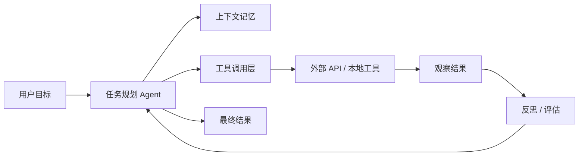
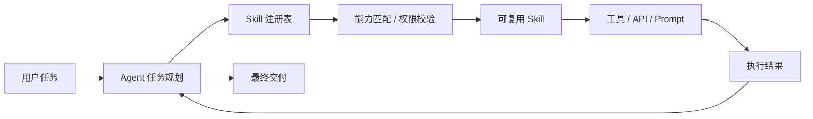
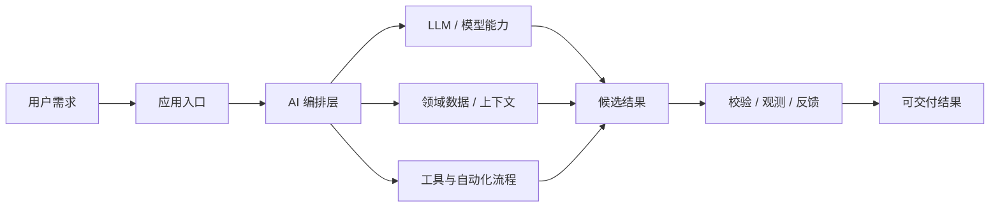

# GitHub AI Daily Trending Top 5

更新时间：2026-07-26T02:25:04Z

筛选范围：仓库名称或描述包含 AI 相关关键词。关键词：ai, agent, agents, agentic, llm, llms, skill, skills, mcp, model context protocol, chatgpt, openai, claude, gemini, copilot, deepseek, rag, embedding, embeddings, transformer, diffusion, machine learning, ml, deep learning, neural, inference, prompt, prompts。

网页版本：由 GitHub Pages 自动发布。

## 1. [alibaba/open-code-review](https://github.com/alibaba/open-code-review)

- 语言：Go
- Stars：13,009
- 主题：agent, agent-skills, code-review, code-review-assistant, harness, repository-level-context
- Star 趋势：

- 作用 / 解决的问题：Open-source & free — Battle-tested at Alibaba's scale. Hybrid architecture code review tool: deterministic pipelines + LLM Agent, precise line-level comments, built-in fine-tuned ruleset (NPE, thread-safety, XSS, SQL injection), OpenAI & Anthropic compatible.
- 适用场景：
  - 适合快速评估 GitHub AI 热榜中新出现或重新升温的技术方向，因为该仓库已获得短期社区关注。
  - 适合多步骤自动化、工具调用和复杂任务编排场景，因为 Agent 模式能把规划、执行、观察和修正串起来。
- 架构思想：
  - 它成为热榜的核心原因通常不是单点功能，而是把模型能力、工具、数据和工作流组织成更容易落地的工程结构。
  - 当前 Stars 为 13,009，说明它不只是概念验证，还积累了可观的社区验证和传播势能。
  - 相比只提供单一脚本的仓库，它用 agent, agent-skills, code-review, code-review-assistant, harness, repository-level-context 等 topics 明确了能力边界，更容易被目标用户检索和采用。
  - 使用 Go 作为主要实现语言，降低了对应生态开发者集成、扩展和二次开发的成本。
  - 它的稀缺性在于把热门 AI 能力包装成可运行、可组合、可观察的工程入口，而不是停留在论文、提示词或孤立 Demo。
- 原理 / 实现思路：
  - English \| <a href="README.zh-CN.md">简体中文</a> \| <a href="README.ja-JP.md">日本語</a> \| <a href="README.ko-KR.md">한국어</a> \| <a href="README.ru-RU.md">Русский</a>
  - Open Code Review is an AI-powered code review CLI tool. It originated as Alibaba Group's internal official AI code review assistant — over the past two years, it has served tens of thousands of developers and identified millions of code defects. After thorough...
  - It reads Git diffs, sends changed files to a configurable LLM via an agent with tool-use capabilities, and generates structured review comments with line-level precision. The agent can read full file contents, search the codebase, inspect other changed files f...
  - 以上内容由 GitHub 公开 README 自动摘取和归纳，适合作为快速了解入口，深入实现仍以仓库源码和文档为准。

```mermaid
flowchart LR
    User[用户目标] --> Planner[任务规划 Agent]
    Planner --> Memory[上下文记忆]
    Planner --> Tools[工具调用层]
    Tools --> APIs[外部 API / 本地工具]
    APIs --> Observation[观察结果]
    Observation --> Critic[反思 / 评估]
    Critic --> Planner
    Planner --> Deliverable[最终结果]
```

## 2. [citrolabs/ego-lite](https://github.com/citrolabs/ego-lite)

- 语言：JavaScript
- Stars：3,632
- 主题：agent-skills, ai-agent, browser, skills, skills-sh
- Star 趋势：

- 作用 / 解决的问题：The fastest browser for AI agents to run web automation, built for sharing your logged-in browser state with your AI agents, like Codex or Claude Code, without disturbing you. Zero cost, zero config.
- 适用场景：
  - 适合快速评估 GitHub AI 热榜中新出现或重新升温的技术方向，因为该仓库已获得短期社区关注。
  - 适合多步骤自动化、工具调用和复杂任务编排场景，因为 Agent 模式能把规划、执行、观察和修正串起来。
  - 适合团队沉淀可复用 AI 能力的场景，因为 Skill 把提示词、工具和流程封装成可发现、可组合的单元。
- 架构思想：
  - 它成为热榜的核心原因通常不是单点功能，而是把模型能力、工具、数据和工作流组织成更容易落地的工程结构。
  - 当前 Stars 为 3,632，说明它不只是概念验证，还积累了可观的社区验证和传播势能。
  - 相比只提供单一脚本的仓库，它用 agent-skills, ai-agent, browser, skills, skills-sh 等 topics 明确了能力边界，更容易被目标用户检索和采用。
  - 使用 JavaScript 作为主要实现语言，降低了对应生态开发者集成、扩展和二次开发的成本。
  - 它的稀缺性在于把热门 AI 能力包装成可运行、可组合、可观察的工程入口，而不是停留在论文、提示词或孤立 Demo。
- 原理 / 实现思路：
  - The fastest browser for AI agents to run web automation
  - ego (lite) is a browser where you and your AI agents work in parallel. Your agents run multiple browser tasks in their own Spaces while your tabs stay yours, and tasks complete faster on fewer tokens.
  - Existing tools like browser-use and agent-browser are browser automation frameworks: they need a separate browser to drive, logins never carry cleanly, and you and the agent end up fighting for the same tabs. ego lite is one browser designed from the start for...
  - 以上内容由 GitHub 公开 README 自动摘取和归纳，适合作为快速了解入口，深入实现仍以仓库源码和文档为准。

```mermaid
flowchart LR
    User[用户任务] --> Planner[Agent 任务规划]
    Planner --> Registry[Skill 注册表]
    Registry --> Select[能力匹配 / 权限校验]
    Select --> Skill[可复用 Skill]
    Skill --> Tool[工具 / API / Prompt]
    Tool --> Observation[执行结果]
    Observation --> Planner
    Planner --> Output[最终交付]
```

## 3. [ComposioHQ/awesome-claude-skills](https://github.com/ComposioHQ/awesome-claude-skills)

- 语言：Python
- Stars：70,615
- 主题：agent-skills, ai-agents, antigravity, automation, claude, claude-code, codex, composio, cursor, developer-tools, gemini-cli, mcp, openai-codex, rube, saas, skill, workflow-automation
- Star 趋势：

- 作用 / 解决的问题：A curated list of awesome Claude Skills, resources, and tools for customizing Claude AI workflows
- 适用场景：
  - 适合快速评估 GitHub AI 热榜中新出现或重新升温的技术方向，因为该仓库已获得短期社区关注。
  - 适合需要把外部工具、代码库、数据源接入 AI Agent 的场景，因为 MCP 能把能力封装成标准工具接口。
  - 适合团队沉淀可复用 AI 能力的场景，因为 Skill 把提示词、工具和流程封装成可发现、可组合的单元。
- 架构思想：
  - 它成为热榜的核心原因通常不是单点功能，而是把模型能力、工具、数据和工作流组织成更容易落地的工程结构。
  - 当前 Stars 为 70,615，说明它不只是概念验证，还积累了可观的社区验证和传播势能。
  - 相比只提供单一脚本的仓库，它用 agent-skills, ai-agents, antigravity, automation, claude, claude-code, codex, composio, cursor, developer-tools, gemini-cli, mcp, openai-codex, rube, saas, skill, workflow-automation 等 topics 明确了能力边界，更容易被目标用户检索和采用。
  - 使用 Python 作为主要实现语言，降低了对应生态开发者集成、扩展和二次开发的成本。
  - 它的稀缺性在于把热门 AI 能力包装成可运行、可组合、可观察的工程入口，而不是停留在论文、提示词或孤立 Demo。
- 原理 / 实现思路：
  - A comprehensive and curated list of 1000+ production ready and practical Claude Skills and Plugins for enhancing productivity across usecases on not just Claude.ai, Claude Code, but also across coding agents like Codex, Cursor, Gemini CLI, Antigravity and more...
  - Skills tell your agent how to work. An MCP Gateway gives it secure access to the tools it needs.
  - The connect-apps plugin lets Claude perform real actions - send emails, create issues, post to Slack. It handles auth and connects to 1000+ apps using Composio under the hood.
  - 以上内容由 GitHub 公开 README 自动摘取和归纳，适合作为快速了解入口，深入实现仍以仓库源码和文档为准。

```mermaid
flowchart LR
    User[用户 / AI 编程助手] --> Client[Agent Client]
    Client --> Protocol[MCP 协议层]
    Protocol --> Server[ComposioHQ/awesome-claude-skills]
    Server --> Tools[工具接口 / Skills]
    Server --> Index[代码索引 / 知识图谱]
    Server --> Data[文件系统 / API / 数据源]
    Tools --> Result[结构化结果]
    Index --> Result
    Data --> Result
    Result --> Client
    Client --> Answer[生成回答 / 执行动作]
```

## 4. [anthropics/claude-cookbooks](https://github.com/anthropics/claude-cookbooks)

- 语言：Jupyter Notebook
- Stars：49,911
- 主题：未在 GitHub API 中公开 topics
- Star 趋势：

- 作用 / 解决的问题：A collection of notebooks/recipes showcasing some fun and effective ways of using Claude.
- 适用场景：
  - 适合快速评估 GitHub AI 热榜中新出现或重新升温的技术方向，因为该仓库已获得短期社区关注。
  - 适合围绕 未在 GitHub API 中公开 topics 做技术调研、竞品分析或原型验证，因为仓库主题与当前 AI 热点高度相关。
- 架构思想：
  - 它成为热榜的核心原因通常不是单点功能，而是把模型能力、工具、数据和工作流组织成更容易落地的工程结构。
  - 当前 Stars 为 49,911，说明它不只是概念验证，还积累了可观的社区验证和传播势能。
  - 使用 Jupyter Notebook 作为主要实现语言，降低了对应生态开发者集成、扩展和二次开发的成本。
  - 它的稀缺性在于把热门 AI 能力包装成可运行、可组合、可观察的工程入口，而不是停留在论文、提示词或孤立 Demo。
- 原理 / 实现思路：
  - The Claude Cookbooks provide code and guides designed to help developers build with Claude, offering copy-able code snippets that you can easily integrate into your own projects.
  - While the code examples are primarily written in Python, the concepts can be adapted to any programming language that supports interaction with the Claude API.
  - Looking for more resources to enhance your experience with Claude and AI assistants? Check out these helpful links:
  - 以上内容由 GitHub 公开 README 自动摘取和归纳，适合作为快速了解入口，深入实现仍以仓库源码和文档为准。

```mermaid
flowchart LR
    User[用户需求] --> Interface[应用入口]
    Interface --> Orchestrator[AI 编排层]
    Orchestrator --> Model[LLM / 模型能力]
    Orchestrator --> Data[领域数据 / 上下文]
    Orchestrator --> Tools[工具与自动化流程]
    Model --> Result[候选结果]
    Data --> Result
    Tools --> Result
    Result --> Review[校验 / 观测 / 反馈]
    Review --> Output[可交付结果]
```

## 5. [obra/superpowers](https://github.com/obra/superpowers)

- 语言：Shell
- Stars：261,124
- 主题：ai, brainstorming, coding, obra, sdlc, skills, subagent-driven-development, superpowers
- Star 趋势：

- 作用 / 解决的问题：An agentic skills framework & software development methodology that works.
- 适用场景：
  - 适合快速评估 GitHub AI 热榜中新出现或重新升温的技术方向，因为该仓库已获得短期社区关注。
  - 适合多步骤自动化、工具调用和复杂任务编排场景，因为 Agent 模式能把规划、执行、观察和修正串起来。
  - 适合团队沉淀可复用 AI 能力的场景，因为 Skill 把提示词、工具和流程封装成可发现、可组合的单元。
- 架构思想：
  - 它成为热榜的核心原因通常不是单点功能，而是把模型能力、工具、数据和工作流组织成更容易落地的工程结构。
  - 当前 Stars 为 261,124，说明它不只是概念验证，还积累了可观的社区验证和传播势能。
  - 相比只提供单一脚本的仓库，它用 ai, brainstorming, coding, obra, sdlc, skills, subagent-driven-development, superpowers 等 topics 明确了能力边界，更容易被目标用户检索和采用。
  - 使用 Shell 作为主要实现语言，降低了对应生态开发者集成、扩展和二次开发的成本。
  - 它的稀缺性在于把热门 AI 能力包装成可运行、可组合、可观察的工程入口，而不是停留在论文、提示词或孤立 Demo。
- 原理 / 实现思路：
  - Superpowers is a complete software development methodology for your coding agents, built on top of a set of composable skills and some initial instructions that make sure your agent uses them.
  - We're hiring someone to help out full time with Superpowers community and code work.
  - If this sounds like someone you know, definitely send them our way.
  - 以上内容由 GitHub 公开 README 自动摘取和归纳，适合作为快速了解入口，深入实现仍以仓库源码和文档为准。

```mermaid
flowchart LR
    User[用户任务] --> Planner[Agent 任务规划]
    Planner --> Registry[Skill 注册表]
    Registry --> Select[能力匹配 / 权限校验]
    Select --> Skill[可复用 Skill]
    Skill --> Tool[工具 / API / Prompt]
    Tool --> Observation[执行结果]
    Observation --> Planner
    Planner --> Output[最终交付]
```

