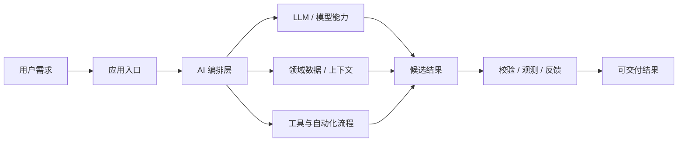
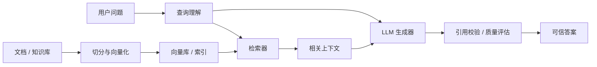
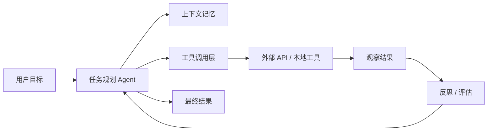
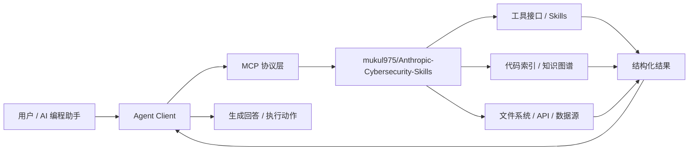
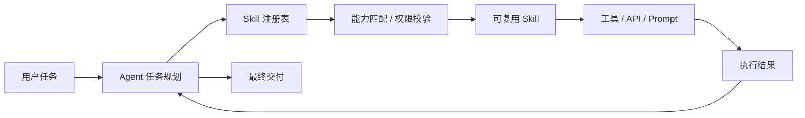

# GitHub AI Daily Trending Top 5

更新时间：2026-08-20T00:58:34Z

筛选范围：仓库名称或描述包含 AI 相关关键词。关键词：ai, agent, agents, agentic, llm, llms, skill, skills, mcp, model context protocol, chatgpt, openai, claude, gemini, copilot, deepseek, rag, embedding, embeddings, transformer, diffusion, machine learning, ml, deep learning, neural, inference, prompt, prompts。

网页版本：由 GitHub Pages 自动发布。

## 1. [harry0703/MoneyPrinterTurbo](https://github.com/harry0703/MoneyPrinterTurbo)

- 语言：Python
- Stars：110,666
- 主题：ai-video-generator, content-creation, ffmpeg, instagram-reels, llm, python, short-video, subtitles, text-to-speech, tiktok, video-automation, video-workflow, workflow-automation, youtube-shorts
- Star 趋势：

- 作用 / 解决的问题：利用 AI 大模型和自动化工作流，根据主题或关键词一键生成高清短视频。Generate HD short videos from a topic or keyword with an automated AI workflow.
- 适用场景：
  - 适合快速评估 GitHub AI 热榜中新出现或重新升温的技术方向，因为该仓库已获得短期社区关注。
  - 适合围绕 ai-video-generator, content-creation, ffmpeg, instagram-reels, llm, python, short-video, subtitles, text-to-speech, tiktok, video-automation, video-workflow, workflow-automation, youtube-shorts 做技术调研、竞品分析或原型验证，因为仓库主题与当前 AI 热点高度相关。
- 架构思想：
  - 它成为热榜的核心原因通常不是单点功能，而是把模型能力、工具、数据和工作流组织成更容易落地的工程结构。
  - 当前 Stars 为 110,666，说明它不只是概念验证，还积累了可观的社区验证和传播势能。
  - 相比只提供单一脚本的仓库，它用 ai-video-generator, content-creation, ffmpeg, instagram-reels, llm, python, short-video, subtitles, text-to-speech, tiktok, video-automation, video-workflow, workflow-automation, youtube-shorts 等 topics 明确了能力边界，更容易被目标用户检索和采用。
  - 使用 Python 作为主要实现语言，降低了对应生态开发者集成、扩展和二次开发的成本。
  - 它的稀缺性在于把热门 AI 能力包装成可运行、可组合、可观察的工程入口，而不是停留在论文、提示词或孤立 Demo。
- 原理 / 实现思路：
  - ⚡ 超低成本与稳定调度：价格低至官方 1 折，模型倍率与调用明细全程透明；多路供应动态调度，告别限流与断连困扰。 
  - 🧠 全系大模型完美驱动脚本：全面覆盖 OpenAI、Claude、Google Gemini、DeepSeek、通义千问（Qwen）等主流 LLM，兼容 OpenAI 标准接口，为 MoneyPrinterTurbo 的文案生成与素材关键词提炼提供低延迟、高并发支持。 
  - 🎨 前沿多模态生态：全面接入 FLUX、Midjourney、Seedance、可灵（Kling）、Sora、Luma 等顶级生图与视频模型，满足下一代 AI 视频生成需求。 
  - 以上内容由 GitHub 公开 README 自动摘取和归纳，适合作为快速了解入口，深入实现仍以仓库源码和文档为准。

```mermaid
flowchart LR
    User[用户需求] --> Interface[应用入口]
    Interface --> Orchestrator[AI 编排层]
    Orchestrator --> Model[LLM / 模型能力]
    Orchestrator --> Data[领域数据 / 上下文]
    Orchestrator --> Tools[工具与自动化流程]
    Model --> Result[候选结果]
    Data --> Result
    Tools --> Result
    Result --> Review[校验 / 观测 / 反馈]
    Review --> Output[可交付结果]
```

## 2. [volcengine/OpenViking](https://github.com/volcengine/OpenViking)

- 语言：Python
- Stars：30,189
- 主题：agent-memory, agent-plugins, agentic-rag, context-database, dsh-plugin, self-evolving
- Star 趋势：

- 作用 / 解决的问题：Self-evolving Context Database for AI Agents. Unify Agent Memory, Knowledge RAG and Skills.
- 适用场景：
  - 适合快速评估 GitHub AI 热榜中新出现或重新升温的技术方向，因为该仓库已获得短期社区关注。
  - 适合知识库问答、文档检索和企业内部搜索场景，因为 RAG 能把私有数据补充进 LLM 上下文。
  - 适合多步骤自动化、工具调用和复杂任务编排场景，因为 Agent 模式能把规划、执行、观察和修正串起来。
  - 适合团队沉淀可复用 AI 能力的场景，因为 Skill 把提示词、工具和流程封装成可发现、可组合的单元。
- 架构思想：
  - 它成为热榜的核心原因通常不是单点功能，而是把模型能力、工具、数据和工作流组织成更容易落地的工程结构。
  - 当前 Stars 为 30,189，说明它不只是概念验证，还积累了可观的社区验证和传播势能。
  - 相比只提供单一脚本的仓库，它用 agent-memory, agent-plugins, agentic-rag, context-database, dsh-plugin, self-evolving 等 topics 明确了能力边界，更容易被目标用户检索和采用。
  - 使用 Python 作为主要实现语言，降低了对应生态开发者集成、扩展和二次开发的成本。
  - 它的稀缺性在于把热门 AI 能力包装成可运行、可组合、可观察的工程入口，而不是停留在论文、提示词或孤立 Demo。
- 原理 / 实现思路：
  - English / [中文](README_CN.md) / [日本語](README_JA.md)
  - ├── resources/              # Resources: project docs, repos, web pages, etc.
  - L0 (Abstract): a one-sentence summary for quick relevance checks.
  - 以上内容由 GitHub 公开 README 自动摘取和归纳，适合作为快速了解入口，深入实现仍以仓库源码和文档为准。

```mermaid
flowchart LR
    User[用户问题] --> Query[查询理解]
    Query --> Retriever[检索器]
    Docs[文档 / 知识库] --> Chunk[切分与向量化]
    Chunk --> Store[向量库 / 索引]
    Store --> Retriever
    Retriever --> Context[相关上下文]
    Context --> LLM[LLM 生成器]
    Query --> LLM
    LLM --> Eval[引用校验 / 质量评估]
    Eval --> Answer[可信答案]
```

## 3. [chaitanyagiri/munder-difflin](https://github.com/chaitanyagiri/munder-difflin)

- 语言：TypeScript
- Stars：2,693
- 主题：agents, claude-code, free, harness, harness-engineering, memory
- Star 趋势：

- 作用 / 解决的问题：local multi-agent harness
- 适用场景：
  - 适合快速评估 GitHub AI 热榜中新出现或重新升温的技术方向，因为该仓库已获得短期社区关注。
  - 适合多步骤自动化、工具调用和复杂任务编排场景，因为 Agent 模式能把规划、执行、观察和修正串起来。
- 架构思想：
  - 它成为热榜的核心原因通常不是单点功能，而是把模型能力、工具、数据和工作流组织成更容易落地的工程结构。
  - 当前 Stars 为 2,693，说明它不只是概念验证，还积累了可观的社区验证和传播势能。
  - 相比只提供单一脚本的仓库，它用 agents, claude-code, free, harness, harness-engineering, memory 等 topics 明确了能力边界，更容易被目标用户检索和采用。
  - 使用 TypeScript 作为主要实现语言，降低了对应生态开发者集成、扩展和二次开发的成本。
  - 它的稀缺性在于把热门 AI 能力包装成可运行、可组合、可观察的工程入口，而不是停留在论文、提示词或孤立 Demo。
- 原理 / 实现思路：
  - Free, open source and performant — a multi-agent harness that works with the
  - subscriptions you already pay for, on their hourly limits. It turns the terminal coding CLI
  - you already run into a clone of you, one that keeps working while you're away and
  - 以上内容由 GitHub 公开 README 自动摘取和归纳，适合作为快速了解入口，深入实现仍以仓库源码和文档为准。

```mermaid
flowchart LR
    User[用户目标] --> Planner[任务规划 Agent]
    Planner --> Memory[上下文记忆]
    Planner --> Tools[工具调用层]
    Tools --> APIs[外部 API / 本地工具]
    APIs --> Observation[观察结果]
    Observation --> Critic[反思 / 评估]
    Critic --> Planner
    Planner --> Deliverable[最终结果]
```

## 4. [mukul975/Anthropic-Cybersecurity-Skills](https://github.com/mukul975/Anthropic-Cybersecurity-Skills)

- 语言：Python
- Stars：29,841
- 主题：ai-agents, claude-code, cloud-security, cybersecurity, devsecops, ethical-hacking, incident-response, infosec, llm, malware-analysis, mcp, mitre-attack, nist-csf, osint, penetration-testing, red-team, security, security-automation, threat-hunting, threat-intelligence
- Star 趋势：

- 作用 / 解决的问题：817 structured cybersecurity skills for AI agents · Mapped to 6 frameworks: MITRE ATT&CK, NIST CSF 2.0, MITRE ATLAS, D3FEND, NIST AI RMF & MITRE F3 (Fight Fraud) · agentskills.io standard · Works with Claude Code, GitHub Copilot, Codex CLI, Cursor, Gemini CLI & 20+ platforms · 29 security domains · Apache 2.0
- 适用场景：
  - 适合快速评估 GitHub AI 热榜中新出现或重新升温的技术方向，因为该仓库已获得短期社区关注。
  - 适合需要把外部工具、代码库、数据源接入 AI Agent 的场景，因为 MCP 能把能力封装成标准工具接口。
  - 适合多步骤自动化、工具调用和复杂任务编排场景，因为 Agent 模式能把规划、执行、观察和修正串起来。
  - 适合团队沉淀可复用 AI 能力的场景，因为 Skill 把提示词、工具和流程封装成可发现、可组合的单元。
- 架构思想：
  - 它成为热榜的核心原因通常不是单点功能，而是把模型能力、工具、数据和工作流组织成更容易落地的工程结构。
  - 当前 Stars 为 29,841，说明它不只是概念验证，还积累了可观的社区验证和传播势能。
  - 相比只提供单一脚本的仓库，它用 ai-agents, claude-code, cloud-security, cybersecurity, devsecops, ethical-hacking, incident-response, infosec, llm, malware-analysis, mcp, mitre-attack, nist-csf, osint, penetration-testing, red-team, security, security-automation, threat-hunting, threat-intelligence 等 topics 明确了能力边界，更容易被目标用户检索和采用。
  - 使用 Python 作为主要实现语言，降低了对应生态开发者集成、扩展和二次开发的成本。
  - 它的稀缺性在于把热门 AI 能力包装成可运行、可组合、可观察的工程入口，而不是停留在论文、提示词或孤立 Demo。
- 原理 / 实现思路：
  - The largest open-source cybersecurity skills library for AI agents
  - 817 production-grade cybersecurity skills · 29 security domains · 6 framework mappings · 26+ AI platforms
  - [Get Started](#quick-start) · [What's Inside](#whats-inside--29-security-domains) · [Frameworks](#six-frameworks-one-skill-library) · [Platforms](#compatible-platforms) · [Contributing](#contributing)
  - 以上内容由 GitHub 公开 README 自动摘取和归纳，适合作为快速了解入口，深入实现仍以仓库源码和文档为准。

```mermaid
flowchart LR
    User[用户 / AI 编程助手] --> Client[Agent Client]
    Client --> Protocol[MCP 协议层]
    Protocol --> Server[mukul975/Anthropic-Cybersecurity-Skills]
    Server --> Tools[工具接口 / Skills]
    Server --> Index[代码索引 / 知识图谱]
    Server --> Data[文件系统 / API / 数据源]
    Tools --> Result[结构化结果]
    Index --> Result
    Data --> Result
    Result --> Client
    Client --> Answer[生成回答 / 执行动作]
```

## 5. [mattpocock/skills](https://github.com/mattpocock/skills)

- 语言：Shell
- Stars：223,810
- 主题：未在 GitHub API 中公开 topics
- Star 趋势：

- 作用 / 解决的问题：Skills for Real Engineers. Straight from my .agents directory.
- 适用场景：
  - 适合快速评估 GitHub AI 热榜中新出现或重新升温的技术方向，因为该仓库已获得短期社区关注。
  - 适合多步骤自动化、工具调用和复杂任务编排场景，因为 Agent 模式能把规划、执行、观察和修正串起来。
  - 适合团队沉淀可复用 AI 能力的场景，因为 Skill 把提示词、工具和流程封装成可发现、可组合的单元。
- 架构思想：
  - 它成为热榜的核心原因通常不是单点功能，而是把模型能力、工具、数据和工作流组织成更容易落地的工程结构。
  - 当前 Stars 为 223,810，说明它不只是概念验证，还积累了可观的社区验证和传播势能。
  - 使用 Shell 作为主要实现语言，降低了对应生态开发者集成、扩展和二次开发的成本。
  - 它的稀缺性在于把热门 AI 能力包装成可运行、可组合、可观察的工程入口，而不是停留在论文、提示词或孤立 Demo。
- 原理 / 实现思路：
  - My agent skills that I use every day to do real engineering - not vibe coding.
  - Developing real applications is hard. Approaches like GSD, BMAD, and Spec-Kit try to help by owning the process. But while doing so, they take away your control and make bugs in the process hard to resolve.
  - These skills are designed to be small, easy to adapt, and composable. They work with any model. They're based on decades of engineering experience. Hack around with them. Make them your own. Enjoy.
  - 以上内容由 GitHub 公开 README 自动摘取和归纳，适合作为快速了解入口，深入实现仍以仓库源码和文档为准。

```mermaid
flowchart LR
    User[用户任务] --> Planner[Agent 任务规划]
    Planner --> Registry[Skill 注册表]
    Registry --> Select[能力匹配 / 权限校验]
    Select --> Skill[可复用 Skill]
    Skill --> Tool[工具 / API / Prompt]
    Tool --> Observation[执行结果]
    Observation --> Planner
    Planner --> Output[最终交付]
```

