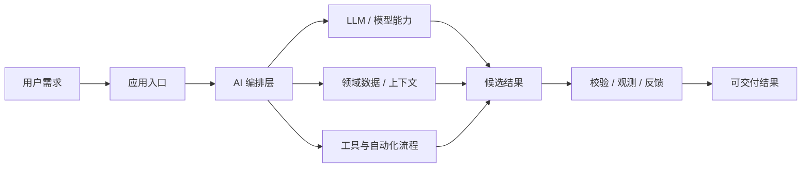
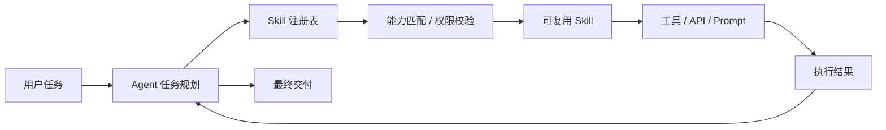
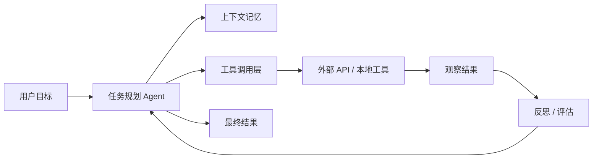

# GitHub AI Daily Trending Top 5

更新时间：2026-09-02T02:36:57Z

筛选范围：仓库名称或描述包含 AI 相关关键词。关键词：ai, agent, agents, agentic, llm, llms, skill, skills, mcp, model context protocol, chatgpt, openai, claude, gemini, copilot, deepseek, rag, embedding, embeddings, transformer, diffusion, machine learning, ml, deep learning, neural, inference, prompt, prompts。

网页版本：由 GitHub Pages 自动发布。

## 1. [Gitlawb/openclaude](https://github.com/Gitlawb/openclaude)

- 语言：TypeScript
- Stars：31,378
- 主题：ai, ai-agent, ai-tools, cli, coding
- Star 趋势：

- 作用 / 解决的问题：runs anywhere. uses anything
- 适用场景：
  - 适合快速评估 GitHub AI 热榜中新出现或重新升温的技术方向，因为该仓库已获得短期社区关注。
  - 适合围绕 ai, ai-agent, ai-tools, cli, coding 做技术调研、竞品分析或原型验证，因为仓库主题与当前 AI 热点高度相关。
- 架构思想：
  - 它成为热榜的核心原因通常不是单点功能，而是把模型能力、工具、数据和工作流组织成更容易落地的工程结构。
  - 当前 Stars 为 31,378，说明它不只是概念验证，还积累了可观的社区验证和传播势能。
  - 相比只提供单一脚本的仓库，它用 ai, ai-agent, ai-tools, cli, coding 等 topics 明确了能力边界，更容易被目标用户检索和采用。
  - 使用 TypeScript 作为主要实现语言，降低了对应生态开发者集成、扩展和二次开发的成本。
  - 它的稀缺性在于把热门 AI 能力包装成可运行、可组合、可观察的工程入口，而不是停留在论文、提示词或孤立 Demo。
- 原理 / 实现思路：
  - OpenClaude is an open-source coding-agent CLI for cloud and local model providers.
  - Use OpenAI-compatible APIs, Gemini, GitHub Models, Codex OAuth, Codex, Ollama, Atomic Chat, and other supported backends while keeping one terminal-first workflow: prompts, tools, agents, MCP, slash commands, and streaming output.
  - [Quick Start](#quick-start) \| [Setup Guides](#setup-guides) \| [Providers](#supported-providers) \| [Development](#development) \| [VS Code Extension](#vs-code-extension) \| [Partners](#partners) \| [Community](#community)
  - 以上内容由 GitHub 公开 README 自动摘取和归纳，适合作为快速了解入口，深入实现仍以仓库源码和文档为准。

```mermaid
flowchart LR
    User[用户需求] --> Interface[应用入口]
    Interface --> Orchestrator[AI 编排层]
    Orchestrator --> Model[LLM / 模型能力]
    Orchestrator --> Data[领域数据 / 上下文]
    Orchestrator --> Tools[工具与自动化流程]
    Model --> Result[候选结果]
    Data --> Result
    Tools --> Result
    Result --> Review[校验 / 观测 / 反馈]
    Review --> Output[可交付结果]
```

## 2. [Imbad0202/academic-research-skills](https://github.com/Imbad0202/academic-research-skills)

- 语言：Python
- Stars：44,974
- 主题：academic-pipeline, academic-writing, ai-research, claude, claude-code, literature-review, peer-review, prompt-engineering
- Star 趋势：

- 作用 / 解决的问题：Academic Research Skills for Claude Code: research → write → review → revise → finalize
- 适用场景：
  - 适合快速评估 GitHub AI 热榜中新出现或重新升温的技术方向，因为该仓库已获得短期社区关注。
  - 适合团队沉淀可复用 AI 能力的场景，因为 Skill 把提示词、工具和流程封装成可发现、可组合的单元。
- 架构思想：
  - 它成为热榜的核心原因通常不是单点功能，而是把模型能力、工具、数据和工作流组织成更容易落地的工程结构。
  - 当前 Stars 为 44,974，说明它不只是概念验证，还积累了可观的社区验证和传播势能。
  - 相比只提供单一脚本的仓库，它用 academic-pipeline, academic-writing, ai-research, claude, claude-code, literature-review, peer-review, prompt-engineering 等 topics 明确了能力边界，更容易被目标用户检索和采用。
  - 使用 Python 作为主要实现语言，降低了对应生态开发者集成、扩展和二次开发的成本。
  - 它的稀缺性在于把热门 AI 能力包装成可运行、可组合、可观察的工程入口，而不是停留在论文、提示词或孤立 Demo。
- 原理 / 实现思路：
  - [简体中文版](README.zh-CN.md) \| [繁體中文版](README.zh-TW.md) \| [日本語版](README.ja-JP.md) \| [한국어](README.ko-KR.md)
  - A comprehensive suite of Claude Code skills for academic research, covering the full pipeline from research to publication.
  - /plugin marketplace add Imbad0202/academic-research-skills
  - 以上内容由 GitHub 公开 README 自动摘取和归纳，适合作为快速了解入口，深入实现仍以仓库源码和文档为准。

```mermaid
flowchart LR
    User[用户任务] --> Planner[Agent 任务规划]
    Planner --> Registry[Skill 注册表]
    Registry --> Select[能力匹配 / 权限校验]
    Select --> Skill[可复用 Skill]
    Skill --> Tool[工具 / API / Prompt]
    Tool --> Observation[执行结果]
    Observation --> Planner
    Planner --> Output[最终交付]
```

## 3. [THU-MAIC/OpenMAIC](https://github.com/THU-MAIC/OpenMAIC)

- 语言：TypeScript
- Stars：29,620
- 主题：未在 GitHub API 中公开 topics
- Star 趋势：

- 作用 / 解决的问题：Open Multi-Agent Interactive Classroom — Get an immersive, multi-agent learning experience in just one click
- 适用场景：
  - 适合快速评估 GitHub AI 热榜中新出现或重新升温的技术方向，因为该仓库已获得短期社区关注。
  - 适合多步骤自动化、工具调用和复杂任务编排场景，因为 Agent 模式能把规划、执行、观察和修正串起来。
- 架构思想：
  - 它成为热榜的核心原因通常不是单点功能，而是把模型能力、工具、数据和工作流组织成更容易落地的工程结构。
  - 当前 Stars 为 29,620，说明它不只是概念验证，还积累了可观的社区验证和传播势能。
  - 使用 TypeScript 作为主要实现语言，降低了对应生态开发者集成、扩展和二次开发的成本。
  - 它的稀缺性在于把热门 AI 能力包装成可运行、可组合、可观察的工程入口，而不是停留在论文、提示词或孤立 Demo。
- 原理 / 实现思路：
  - Get an immersive, multi-agent learning experience in just one click
  - 🎉 OpenMAIC v1.0.0 — Build courses with an agent
  - One prompt in, a whole course out — and now you can steer. Released August 27, 2026, OpenMAIC v1.0.0 adds a Pro workbench alongside the classic one-click generator: chat with an agent that plans your curriculum, builds and revises every page, and works straigh...
  - 以上内容由 GitHub 公开 README 自动摘取和归纳，适合作为快速了解入口，深入实现仍以仓库源码和文档为准。

```mermaid
flowchart LR
    User[用户目标] --> Planner[任务规划 Agent]
    Planner --> Memory[上下文记忆]
    Planner --> Tools[工具调用层]
    Tools --> APIs[外部 API / 本地工具]
    APIs --> Observation[观察结果]
    Observation --> Critic[反思 / 评估]
    Critic --> Planner
    Planner --> Deliverable[最终结果]
```

## 4. [jingyaogong/minimind](https://github.com/jingyaogong/minimind)

- 语言：Python
- Stars：57,172
- 主题：artificial-intelligence, large-language-model
- Star 趋势：

- 作用 / 解决的问题：🧠 Train a 64M-parameter LLM from scratch in just 2h!
- 适用场景：
  - 适合快速评估 GitHub AI 热榜中新出现或重新升温的技术方向，因为该仓库已获得短期社区关注。
  - 适合围绕 artificial-intelligence, large-language-model 做技术调研、竞品分析或原型验证，因为仓库主题与当前 AI 热点高度相关。
- 架构思想：
  - 它成为热榜的核心原因通常不是单点功能，而是把模型能力、工具、数据和工作流组织成更容易落地的工程结构。
  - 当前 Stars 为 57,172，说明它不只是概念验证，还积累了可观的社区验证和传播势能。
  - 相比只提供单一脚本的仓库，它用 artificial-intelligence, large-language-model 等 topics 明确了能力边界，更容易被目标用户检索和采用。
  - 使用 Python 作为主要实现语言，降低了对应生态开发者集成、扩展和二次开发的成本。
  - 它的稀缺性在于把热门 AI 能力包装成可运行、可组合、可观察的工程入口，而不是停留在论文、提示词或孤立 Demo。
- 原理 / 实现思路：
  - 此开源项目旨在完全从 0 开始，仅用 3 块钱成本与 2 小时训练时间，即可训练出规模约为 64M 的超小语言模型 MiniMind。
  - 项目同时开源了大模型的极简结构与完整训练链路，覆盖 MoE、数据清洗、预训练（Pretrain）、监督微调（SFT）、LoRA、RLHF（DPO）、RLAIF（PPO / GRPO / CISPO）、Tool Use、Agentic RL、自适应思考与模型蒸馏等全过程代码。
  - 项目所有核心算法代码均从 0 使用 PyTorch 原生实现，不依赖第三方库提供的高层抽象接口。
  - 以上内容由 GitHub 公开 README 自动摘取和归纳，适合作为快速了解入口，深入实现仍以仓库源码和文档为准。

```mermaid
flowchart LR
    User[用户需求] --> Interface[应用入口]
    Interface --> Orchestrator[AI 编排层]
    Orchestrator --> Model[LLM / 模型能力]
    Orchestrator --> Data[领域数据 / 上下文]
    Orchestrator --> Tools[工具与自动化流程]
    Model --> Result[候选结果]
    Data --> Result
    Tools --> Result
    Result --> Review[校验 / 观测 / 反馈]
    Review --> Output[可交付结果]
```

## 5. [browser-use/video-use](https://github.com/browser-use/video-use)

- 语言：Python
- Stars：23,014
- 主题：未在 GitHub API 中公开 topics
- Star 趋势：

- 作用 / 解决的问题：Edit videos with coding agents
- 适用场景：
  - 适合快速评估 GitHub AI 热榜中新出现或重新升温的技术方向，因为该仓库已获得短期社区关注。
  - 适合多步骤自动化、工具调用和复杂任务编排场景，因为 Agent 模式能把规划、执行、观察和修正串起来。
- 架构思想：
  - 它成为热榜的核心原因通常不是单点功能，而是把模型能力、工具、数据和工作流组织成更容易落地的工程结构。
  - 当前 Stars 为 23,014，说明它不只是概念验证，还积累了可观的社区验证和传播势能。
  - 使用 Python 作为主要实现语言，降低了对应生态开发者集成、扩展和二次开发的成本。
  - 它的稀缺性在于把热门 AI 能力包装成可运行、可组合、可观察的工程入口，而不是停留在论文、提示词或孤立 Demo。
- 原理 / 实现思路：
  - Introducing video-use — edit videos with Claude Code. 100% open source.
  - Drop raw footage in a folder, chat with Claude Code, get final.mp4 back. Works for any content — talking heads, montages, tutorials, travel, interviews — without presets or menus.
  - Cuts out filler words (umm, uh, false starts) and dead space between takes
  - 以上内容由 GitHub 公开 README 自动摘取和归纳，适合作为快速了解入口，深入实现仍以仓库源码和文档为准。

```mermaid
flowchart LR
    User[用户目标] --> Planner[任务规划 Agent]
    Planner --> Memory[上下文记忆]
    Planner --> Tools[工具调用层]
    Tools --> APIs[外部 API / 本地工具]
    APIs --> Observation[观察结果]
    Observation --> Critic[反思 / 评估]
    Critic --> Planner
    Planner --> Deliverable[最终结果]
```

