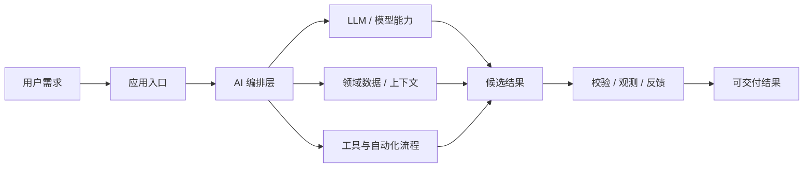
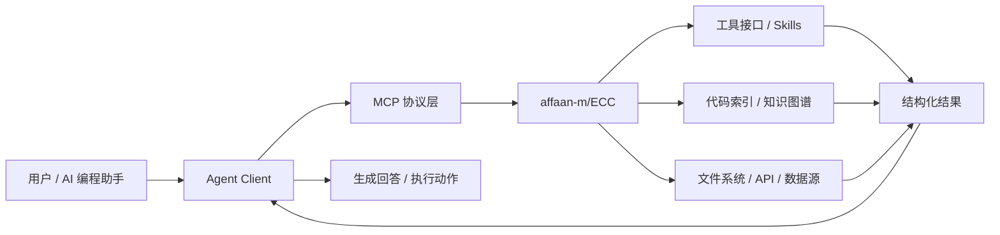
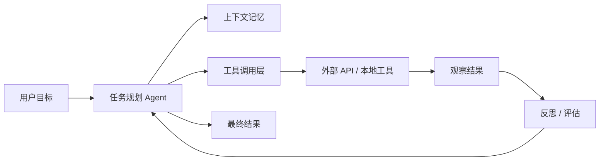

# GitHub AI Daily Trending Top 5

更新时间：2026-07-30T01:59:47Z

筛选范围：仓库名称或描述包含 AI 相关关键词。关键词：ai, agent, agents, agentic, llm, llms, skill, skills, mcp, model context protocol, chatgpt, openai, claude, gemini, copilot, deepseek, rag, embedding, embeddings, transformer, diffusion, machine learning, ml, deep learning, neural, inference, prompt, prompts。

网页版本：由 GitHub Pages 自动发布。

## 1. [moeru-ai/airi](https://github.com/moeru-ai/airi)

- 语言：TypeScript
- Stars：45,406
- 主题：ai-companion, ai-vtuber, airi, digital-life, grok-companion, live2d, neuro-sama, neurosama, openclaw, vrm, vtuber
- Star 趋势：

- 作用 / 解决的问题：💖🧸 Self hosted, you-owned Grok Companion, a container of souls of waifu, cyber livings to bring them into our worlds, wishing to achieve Neuro-sama's altitude. Capable of realtime voice chat, Minecraft, Factorio playing. Web / macOS / Windows supported.
- 适用场景：
  - 适合快速评估 GitHub AI 热榜中新出现或重新升温的技术方向，因为该仓库已获得短期社区关注。
  - 适合围绕 ai-companion, ai-vtuber, airi, digital-life, grok-companion, live2d, neuro-sama, neurosama, openclaw, vrm, vtuber 做技术调研、竞品分析或原型验证，因为仓库主题与当前 AI 热点高度相关。
- 架构思想：
  - 它成为热榜的核心原因通常不是单点功能，而是把模型能力、工具、数据和工作流组织成更容易落地的工程结构。
  - 当前 Stars 为 45,406，说明它不只是概念验证，还积累了可观的社区验证和传播势能。
  - 相比只提供单一脚本的仓库，它用 ai-companion, ai-vtuber, airi, digital-life, grok-companion, live2d, neuro-sama, neurosama, openclaw, vrm, vtuber 等 topics 明确了能力边界，更容易被目标用户检索和采用。
  - 使用 TypeScript 作为主要实现语言，降低了对应生态开发者集成、扩展和二次开发的成本。
  - 它的稀缺性在于把热门 AI 能力包装成可运行、可组合、可观察的工程入口，而不是停留在论文、提示词或孤立 Demo。
- 原理 / 实现思路：
  - media="(prefers-color-scheme: light), (prefers-color-scheme: no-preference)"
  - media="(prefers-color-scheme: light), (prefers-color-scheme: no-preference)"
  - media="(prefers-color-scheme: light), (prefers-color-scheme: no-preference)"
  - 以上内容由 GitHub 公开 README 自动摘取和归纳，适合作为快速了解入口，深入实现仍以仓库源码和文档为准。

```mermaid
flowchart LR
    User[用户需求] --> Interface[应用入口]
    Interface --> Orchestrator[AI 编排层]
    Orchestrator --> Model[LLM / 模型能力]
    Orchestrator --> Data[领域数据 / 上下文]
    Orchestrator --> Tools[工具与自动化流程]
    Model --> Result[候选结果]
    Data --> Result
    Tools --> Result
    Result --> Review[校验 / 观测 / 反馈]
    Review --> Output[可交付结果]
```

## 2. [affaan-m/ECC](https://github.com/affaan-m/ECC)

- 语言：JavaScript
- Stars：235,614
- 主题：ai-agents, anthropic, claude, claude-code, developer-tools, llm, mcp, productivity
- Star 趋势：

- 作用 / 解决的问题：The agent harness performance optimization system. Skills, instincts, memory, security, and research-first development for Claude Code, Codex, Opencode, Cursor and beyond.
- 适用场景：
  - 适合快速评估 GitHub AI 热榜中新出现或重新升温的技术方向，因为该仓库已获得短期社区关注。
  - 适合需要把外部工具、代码库、数据源接入 AI Agent 的场景，因为 MCP 能把能力封装成标准工具接口。
  - 适合多步骤自动化、工具调用和复杂任务编排场景，因为 Agent 模式能把规划、执行、观察和修正串起来。
  - 适合团队沉淀可复用 AI 能力的场景，因为 Skill 把提示词、工具和流程封装成可发现、可组合的单元。
- 架构思想：
  - 它成为热榜的核心原因通常不是单点功能，而是把模型能力、工具、数据和工作流组织成更容易落地的工程结构。
  - 当前 Stars 为 235,614，说明它不只是概念验证，还积累了可观的社区验证和传播势能。
  - 相比只提供单一脚本的仓库，它用 ai-agents, anthropic, claude, claude-code, developer-tools, llm, mcp, productivity 等 topics 明确了能力边界，更容易被目标用户检索和采用。
  - 使用 JavaScript 作为主要实现语言，降低了对应生态开发者集成、扩展和二次开发的成本。
  - 它的稀缺性在于把热门 AI 能力包装成可运行、可组合、可观察的工程入口，而不是停留在论文、提示词或孤立 Demo。
- 原理 / 实现思路：
  - Your agent can write code, but ECC gives it a coordinated engineering system and toolbox: it plans before it builds, verifies changes with tests, reviews its own work from a fresh context, remembers what matters, and turns repeated wins into reusable skills an...
  - plan -> test -> implement -> review -> verify -> remember -> improve
  - Instead of rebuilding that process in every prompt, you install it once and make it part of how your agent works.
  - 以上内容由 GitHub 公开 README 自动摘取和归纳，适合作为快速了解入口，深入实现仍以仓库源码和文档为准。

```mermaid
flowchart LR
    User[用户 / AI 编程助手] --> Client[Agent Client]
    Client --> Protocol[MCP 协议层]
    Protocol --> Server[affaan-m/ECC]
    Server --> Tools[工具接口 / Skills]
    Server --> Index[代码索引 / 知识图谱]
    Server --> Data[文件系统 / API / 数据源]
    Tools --> Result[结构化结果]
    Index --> Result
    Data --> Result
    Result --> Client
    Client --> Answer[生成回答 / 执行动作]
```

## 3. [huggingface/speech-to-speech](https://github.com/huggingface/speech-to-speech)

- 语言：Python
- Stars：7,890
- 主题：ai, assistant, language-model, machine-learning, python, speech, speech-synthesis, speech-to-text, speech-translation
- Star 趋势：

- 作用 / 解决的问题：Build local voice agents with open-source models
- 适用场景：
  - 适合快速评估 GitHub AI 热榜中新出现或重新升温的技术方向，因为该仓库已获得短期社区关注。
  - 适合多步骤自动化、工具调用和复杂任务编排场景，因为 Agent 模式能把规划、执行、观察和修正串起来。
- 架构思想：
  - 它成为热榜的核心原因通常不是单点功能，而是把模型能力、工具、数据和工作流组织成更容易落地的工程结构。
  - 当前 Stars 为 7,890，说明它不只是概念验证，还积累了可观的社区验证和传播势能。
  - 相比只提供单一脚本的仓库，它用 ai, assistant, language-model, machine-learning, python, speech, speech-synthesis, speech-to-text, speech-translation 等 topics 明确了能力边界，更容易被目标用户检索和采用。
  - 使用 Python 作为主要实现语言，降低了对应生态开发者集成、扩展和二次开发的成本。
  - 它的稀缺性在于把热门 AI 能力包装成可运行、可组合、可观察的工程入口，而不是停留在论文、提示词或孤立 Demo。
- 原理 / 实现思路：
  - Speech To Speech: Build voice agents with open-source models
  - This starts an OpenAI Realtime-compatible server at ws://localhost:8765/v1/realtime using Parakeet TDT for local STT, an OpenAI-compatible LLM, and Qwen3-TTS for local speech output.
  - From a source checkout, talk to it from a second terminal:
  - 以上内容由 GitHub 公开 README 自动摘取和归纳，适合作为快速了解入口，深入实现仍以仓库源码和文档为准。

```mermaid
flowchart LR
    User[用户目标] --> Planner[任务规划 Agent]
    Planner --> Memory[上下文记忆]
    Planner --> Tools[工具调用层]
    Tools --> APIs[外部 API / 本地工具]
    APIs --> Observation[观察结果]
    Observation --> Critic[反思 / 评估]
    Critic --> Planner
    Planner --> Deliverable[最终结果]
```

## 4. [microsoft/VibeVoice](https://github.com/microsoft/VibeVoice)

- 语言：Python
- Stars：51,318
- 主题：未在 GitHub API 中公开 topics
- Star 趋势：

- 作用 / 解决的问题：Open-Source Frontier Voice AI
- 适用场景：
  - 适合快速评估 GitHub AI 热榜中新出现或重新升温的技术方向，因为该仓库已获得短期社区关注。
  - 适合围绕 未在 GitHub API 中公开 topics 做技术调研、竞品分析或原型验证，因为仓库主题与当前 AI 热点高度相关。
- 架构思想：
  - 它成为热榜的核心原因通常不是单点功能，而是把模型能力、工具、数据和工作流组织成更容易落地的工程结构。
  - 当前 Stars 为 51,318，说明它不只是概念验证，还积累了可观的社区验证和传播势能。
  - 使用 Python 作为主要实现语言，降低了对应生态开发者集成、扩展和二次开发的成本。
  - 它的稀缺性在于把热门 AI 能力包装成可运行、可组合、可观察的工程入口，而不是停留在论文、提示词或孤立 Demo。
- 原理 / 实现思路：
  - ⭐️ VibeVoice-ASR is natively multilingual, supporting over 50 languages — check the [supported languages](docs/vibevoice-asr.md#language-distribution) for details.
  - 🔥 The VibeVoice-ASR [finetuning code](finetuning-asr/README.md) is now available!
  - 2025-12-16: 📣 We added experimental speakers to <a href="docs/vibevoice-realtime-0.5b.md"><strong>VibeVoice‑Realtime‑0.5B</strong></a> for exploration, including multilingual voices in nine languages (DE, FR, IT, JP, KR, NL, PL, PT, ES) and 11 distinct English...
  - 以上内容由 GitHub 公开 README 自动摘取和归纳，适合作为快速了解入口，深入实现仍以仓库源码和文档为准。

```mermaid
flowchart LR
    User[用户需求] --> Interface[应用入口]
    Interface --> Orchestrator[AI 编排层]
    Orchestrator --> Model[LLM / 模型能力]
    Orchestrator --> Data[领域数据 / 上下文]
    Orchestrator --> Tools[工具与自动化流程]
    Model --> Result[候选结果]
    Data --> Result
    Tools --> Result
    Result --> Review[校验 / 观测 / 反馈]
    Review --> Output[可交付结果]
```

## 5. [different-ai/openwork](https://github.com/different-ai/openwork)

- 语言：TypeScript
- Stars：17,963
- 主题：未在 GitHub API 中公开 topics
- Star 趋势：

- 作用 / 解决的问题：The open-source alternative to Claude Cowork (powered by opencode)
- 适用场景：
  - 适合快速评估 GitHub AI 热榜中新出现或重新升温的技术方向，因为该仓库已获得短期社区关注。
  - 适合围绕 未在 GitHub API 中公开 topics 做技术调研、竞品分析或原型验证，因为仓库主题与当前 AI 热点高度相关。
- 架构思想：
  - 它成为热榜的核心原因通常不是单点功能，而是把模型能力、工具、数据和工作流组织成更容易落地的工程结构。
  - 当前 Stars 为 17,963，说明它不只是概念验证，还积累了可观的社区验证和传播势能。
  - 使用 TypeScript 作为主要实现语言，降低了对应生态开发者集成、扩展和二次开发的成本。
  - 它的稀缺性在于把热门 AI 能力包装成可运行、可组合、可观察的工程入口，而不是停留在论文、提示词或孤立 Demo。
- 原理 / 实现思路：
  - OpenWork is a free, open-source desktop app made for sharing AI workflows. It is an open-source alternative to Claude Cowork and Codex for macOS, Windows, and Linux.
  - Add one OpenWork MCP to Codex, Claude Code, Cursor, or another compatible agent and reuse the same skills, MCPs, and connected services across your tools, teammates, and machines. Create something once, share it with coworkers or friends, or keep it for yourse...
  - The desktop app is there when you want a dedicated workspace, but it is not required. You can use OpenWork from the agent you already have. For larger organizations, the admin interface lets you publish capabilities, manage access, and configure shared or per-...
  - 以上内容由 GitHub 公开 README 自动摘取和归纳，适合作为快速了解入口，深入实现仍以仓库源码和文档为准。

```mermaid
flowchart LR
    User[用户需求] --> Interface[应用入口]
    Interface --> Orchestrator[AI 编排层]
    Orchestrator --> Model[LLM / 模型能力]
    Orchestrator --> Data[领域数据 / 上下文]
    Orchestrator --> Tools[工具与自动化流程]
    Model --> Result[候选结果]
    Data --> Result
    Tools --> Result
    Result --> Review[校验 / 观测 / 反馈]
    Review --> Output[可交付结果]
```

