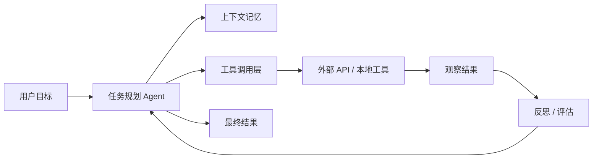
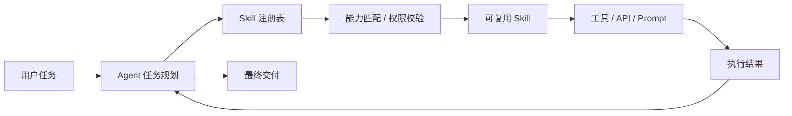
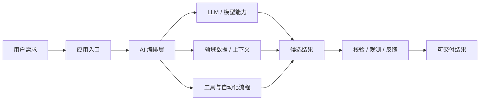

# GitHub AI Daily Trending Top 5

更新时间：2026-08-31T03:15:38Z

筛选范围：仓库名称或描述包含 AI 相关关键词。关键词：ai, agent, agents, agentic, llm, llms, skill, skills, mcp, model context protocol, chatgpt, openai, claude, gemini, copilot, deepseek, rag, embedding, embeddings, transformer, diffusion, machine learning, ml, deep learning, neural, inference, prompt, prompts。

网页版本：由 GitHub Pages 自动发布。

## 1. [THU-MAIC/OpenMAIC](https://github.com/THU-MAIC/OpenMAIC)

- 语言：TypeScript
- Stars：24,463
- 主题：未在 GitHub API 中公开 topics
- Star 趋势：

- 作用 / 解决的问题：Open Multi-Agent Interactive Classroom — Get an immersive, multi-agent learning experience in just one click
- 适用场景：
  - 适合快速评估 GitHub AI 热榜中新出现或重新升温的技术方向，因为该仓库已获得短期社区关注。
  - 适合多步骤自动化、工具调用和复杂任务编排场景，因为 Agent 模式能把规划、执行、观察和修正串起来。
- 架构思想：
  - 它成为热榜的核心原因通常不是单点功能，而是把模型能力、工具、数据和工作流组织成更容易落地的工程结构。
  - 当前 Stars 为 24,463，说明它不只是概念验证，还积累了可观的社区验证和传播势能。
  - 使用 TypeScript 作为主要实现语言，降低了对应生态开发者集成、扩展和二次开发的成本。
  - 它的稀缺性在于把热门 AI 能力包装成可运行、可组合、可观察的工程入口，而不是停留在论文、提示词或孤立 Demo。
- 原理 / 实现思路：
  - Get an immersive, multi-agent learning experience in just one click
  - 🎉 OpenMAIC v1.0.0 — Build courses with an agent
  - One prompt in, a whole course out — and now you can steer. Released August 27, 2026, OpenMAIC v1.0.0 adds a Pro workbench alongside the classic one-click generator: chat with an agent that plans your curriculum, builds and revises every page, and works straigh...
  - 以上内容由 GitHub 公开 README 自动摘取和归纳，适合作为快速了解入口，深入实现仍以仓库源码和文档为准。

```mermaid
flowchart LR
    User[用户目标] --> Planner[任务规划 Agent]
    Planner --> Memory[上下文记忆]
    Planner --> Tools[工具调用层]
    Tools --> APIs[外部 API / 本地工具]
    APIs --> Observation[观察结果]
    Observation --> Critic[反思 / 评估]
    Critic --> Planner
    Planner --> Deliverable[最终结果]
```

## 2. [K-Dense-AI/scientific-agent-skills](https://github.com/K-Dense-AI/scientific-agent-skills)

- 语言：Python
- Stars：39,493
- 主题：agent-skills, ai-scientist, bioinformatics, chemoinformatics, claude, claude-skills, claudecode, clinical-research, computational-biology, data-analysis, drug-discovery, genomics, materials-science, metabolomics, proteomics, scientific-computing, scientific-visualization
- Star 趋势：

- 作用 / 解决的问题：Turn any AI agent into an AI Scientist. The #1 Agent Skills library for science, used by 190,000+ scientists worldwide. 165 ready-to-use validated skills plus 100+ scientific databases covering biology, chemistry, medicine, and drug discovery. Compatible with Cursor, Claude Code, Codex, Pi, Antigravity, and the open Agent Skills standard.
- 适用场景：
  - 适合快速评估 GitHub AI 热榜中新出现或重新升温的技术方向，因为该仓库已获得短期社区关注。
  - 适合多步骤自动化、工具调用和复杂任务编排场景，因为 Agent 模式能把规划、执行、观察和修正串起来。
  - 适合团队沉淀可复用 AI 能力的场景，因为 Skill 把提示词、工具和流程封装成可发现、可组合的单元。
- 架构思想：
  - 它成为热榜的核心原因通常不是单点功能，而是把模型能力、工具、数据和工作流组织成更容易落地的工程结构。
  - 当前 Stars 为 39,493，说明它不只是概念验证，还积累了可观的社区验证和传播势能。
  - 相比只提供单一脚本的仓库，它用 agent-skills, ai-scientist, bioinformatics, chemoinformatics, claude, claude-skills, claudecode, clinical-research, computational-biology, data-analysis, drug-discovery, genomics, materials-science, metabolomics, proteomics, scientific-computing, scientific-visualization 等 topics 明确了能力边界，更容易被目标用户检索和采用。
  - 使用 Python 作为主要实现语言，降低了对应生态开发者集成、扩展和二次开发的成本。
  - 它的稀缺性在于把热门 AI 能力包装成可运行、可组合、可观察的工程入口，而不是停留在论文、提示词或孤立 Demo。
- 原理 / 实现思路：
  - These skills enable your AI agent to seamlessly work with specialized scientific libraries, databases, and tools across multiple scientific domains. While the agent can use any Python package or API on its own, these explicitly defined skills provide curated d...
  - 🧬 Bioinformatics & Genomics - Sequence analysis, single-cell RNA-seq, gene regulatory networks, variant annotation, phylogenetic analysis
  - 🧪 Cheminformatics & Drug Discovery - Molecular property prediction, virtual screening, ADMET analysis, molecular docking, lead optimization
  - 以上内容由 GitHub 公开 README 自动摘取和归纳，适合作为快速了解入口，深入实现仍以仓库源码和文档为准。

```mermaid
flowchart LR
    User[用户任务] --> Planner[Agent 任务规划]
    Planner --> Registry[Skill 注册表]
    Registry --> Select[能力匹配 / 权限校验]
    Select --> Skill[可复用 Skill]
    Skill --> Tool[工具 / API / Prompt]
    Tool --> Observation[执行结果]
    Observation --> Planner
    Planner --> Output[最终交付]
```

## 3. [tt-a1i/archify](https://github.com/tt-a1i/archify)

- 语言：JavaScript
- Stars：35,203
- 主题：agent-skills, architecture-as-code, architecture-diagram, claude-skill, code-visualization, codex, coding-agents, data-flow-diagram, deepseek-harness, developer-tools, diagram-as-code, diagrams, diagrams-as-code, dsh-plugin, mermaid-alternative, opencode, sequence-diagram, software-architecture, system-design, text-to-diagram
- Star 趋势：

- 作用 / 解决的问题：Agent skill for beautiful, verifiable architecture, workflow, sequence, data-flow, and lifecycle diagrams—self-contained HTML with motion and crisp export.
- 适用场景：
  - 适合快速评估 GitHub AI 热榜中新出现或重新升温的技术方向，因为该仓库已获得短期社区关注。
  - 适合多步骤自动化、工具调用和复杂任务编排场景，因为 Agent 模式能把规划、执行、观察和修正串起来。
  - 适合团队沉淀可复用 AI 能力的场景，因为 Skill 把提示词、工具和流程封装成可发现、可组合的单元。
- 架构思想：
  - 它成为热榜的核心原因通常不是单点功能，而是把模型能力、工具、数据和工作流组织成更容易落地的工程结构。
  - 当前 Stars 为 35,203，说明它不只是概念验证，还积累了可观的社区验证和传播势能。
  - 相比只提供单一脚本的仓库，它用 agent-skills, architecture-as-code, architecture-diagram, claude-skill, code-visualization, codex, coding-agents, data-flow-diagram, deepseek-harness, developer-tools, diagram-as-code, diagrams, diagrams-as-code, dsh-plugin, mermaid-alternative, opencode, sequence-diagram, software-architecture, system-design, text-to-diagram 等 topics 明确了能力边界，更容易被目标用户检索和采用。
  - 使用 JavaScript 作为主要实现语言，降低了对应生态开发者集成、扩展和二次开发的成本。
  - 它的稀缺性在于把热门 AI 能力包装成可运行、可组合、可观察的工程入口，而不是停留在论文、提示词或孤立 Demo。
- 原理 / 实现思路：
  - Turn a codebase or system description into a polished, interactive system map — directly in chat.
  - Open it and present — five diagram types, four presets, dark/light themes, built-in brand marks, and finite motion
  - Review architecture changes before merge — compare two validated snapshots as Before / Delta / After, with exact added, removed, changed, moved, and rerouted facts
  - 以上内容由 GitHub 公开 README 自动摘取和归纳，适合作为快速了解入口，深入实现仍以仓库源码和文档为准。

```mermaid
flowchart LR
    User[用户任务] --> Planner[Agent 任务规划]
    Planner --> Registry[Skill 注册表]
    Registry --> Select[能力匹配 / 权限校验]
    Select --> Skill[可复用 Skill]
    Skill --> Tool[工具 / API / Prompt]
    Tool --> Observation[执行结果]
    Observation --> Planner
    Planner --> Output[最终交付]
```

## 4. [unclecode/crawl4ai](https://github.com/unclecode/crawl4ai)

- 语言：Python
- Stars：80,311
- 主题：未在 GitHub API 中公开 topics
- Star 趋势：

- 作用 / 解决的问题：🚀🤖 Crawl4AI: Open-source LLM Friendly Web Crawler & Scraper. Don't be shy, join here: https://discord.gg/jP8KfhDhyN
- 适用场景：
  - 适合快速评估 GitHub AI 热榜中新出现或重新升温的技术方向，因为该仓库已获得短期社区关注。
  - 适合围绕 未在 GitHub API 中公开 topics 做技术调研、竞品分析或原型验证，因为仓库主题与当前 AI 热点高度相关。
- 架构思想：
  - 它成为热榜的核心原因通常不是单点功能，而是把模型能力、工具、数据和工作流组织成更容易落地的工程结构。
  - 当前 Stars 为 80,311，说明它不只是概念验证，还积累了可观的社区验证和传播势能。
  - 使用 Python 作为主要实现语言，降低了对应生态开发者集成、扩展和二次开发的成本。
  - 它的稀缺性在于把热门 AI 能力包装成可运行、可组合、可观察的工程入口，而不是停留在论文、提示词或孤立 Demo。
- 原理 / 实现思路：
  - 🚀🤖 Crawl4AI: Open-source LLM Friendly Web Crawler & Scraper.
  - 🚀 Crawl4AI Cloud API — Closed Beta (Launching Soon)
  - Reliable, large-scale web extraction, now built to be _drastically more cost-effective_ than any of the existing solutions.
  - 以上内容由 GitHub 公开 README 自动摘取和归纳，适合作为快速了解入口，深入实现仍以仓库源码和文档为准。

```mermaid
flowchart LR
    User[用户需求] --> Interface[应用入口]
    Interface --> Orchestrator[AI 编排层]
    Orchestrator --> Model[LLM / 模型能力]
    Orchestrator --> Data[领域数据 / 上下文]
    Orchestrator --> Tools[工具与自动化流程]
    Model --> Result[候选结果]
    Data --> Result
    Tools --> Result
    Result --> Review[校验 / 观测 / 反馈]
    Review --> Output[可交付结果]
```

## 5. [mvanhorn/last30days-skill](https://github.com/mvanhorn/last30days-skill)

- 语言：Python
- Stars：60,559
- 主题：ai-prompts, ai-skill, bluesky, claude, claude-code, clawhub, deep-research, hackernews, instagram, openclaw, polymarket, recency, reddit, research, social-media, tiktok, trends, twitter, web-search, youtube
- Star 趋势：

- 作用 / 解决的问题：AI agent skill that researches any topic across Reddit, X, YouTube, HN, Polymarket, and the web - then synthesizes a grounded summary
- 适用场景：
  - 适合快速评估 GitHub AI 热榜中新出现或重新升温的技术方向，因为该仓库已获得短期社区关注。
  - 适合多步骤自动化、工具调用和复杂任务编排场景，因为 Agent 模式能把规划、执行、观察和修正串起来。
  - 适合团队沉淀可复用 AI 能力的场景，因为 Skill 把提示词、工具和流程封装成可发现、可组合的单元。
- 架构思想：
  - 它成为热榜的核心原因通常不是单点功能，而是把模型能力、工具、数据和工作流组织成更容易落地的工程结构。
  - 当前 Stars 为 60,559，说明它不只是概念验证，还积累了可观的社区验证和传播势能。
  - 相比只提供单一脚本的仓库，它用 ai-prompts, ai-skill, bluesky, claude, claude-code, clawhub, deep-research, hackernews, instagram, openclaw, polymarket, recency, reddit, research, social-media, tiktok, trends, twitter, web-search, youtube 等 topics 明确了能力边界，更容易被目标用户检索和采用。
  - 使用 Python 作为主要实现语言，降低了对应生态开发者集成、扩展和二次开发的成本。
  - 它的稀缺性在于把热门 AI 能力包装成可运行、可组合、可观察的工程入口，而不是停留在论文、提示词或孤立 Demo。
- 原理 / 实现思路：
  - English \| [Français](README.fr.md) \| [Deutsch](README.de.md) \| [Español](README.es.md) \| [Português (Brasil)](README.pt-BR.md) \| [日本語](README.ja.md) \| [简体中文](README.zh-CN.md)
  - An AI agent-led search engine scored by upvotes, likes, and real money - not editors.
  - This README tracks the current v3 pipeline. The runtime skill spec lives in [skills/last30days/SKILL.md](skills/last30days/SKILL.md), which is the source of truth for the latest command and setup behavior.
  - 以上内容由 GitHub 公开 README 自动摘取和归纳，适合作为快速了解入口，深入实现仍以仓库源码和文档为准。

```mermaid
flowchart LR
    User[用户任务] --> Planner[Agent 任务规划]
    Planner --> Registry[Skill 注册表]
    Registry --> Select[能力匹配 / 权限校验]
    Select --> Skill[可复用 Skill]
    Skill --> Tool[工具 / API / Prompt]
    Tool --> Observation[执行结果]
    Observation --> Planner
    Planner --> Output[最终交付]
```

