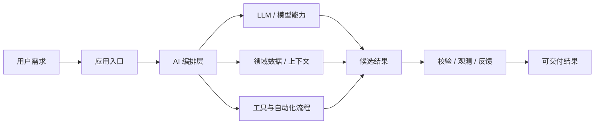
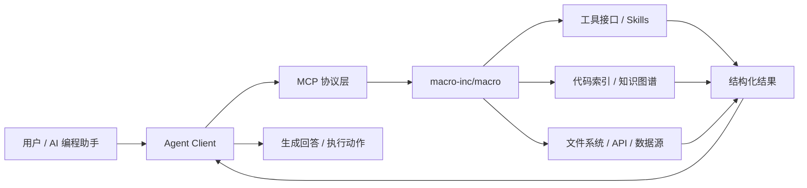
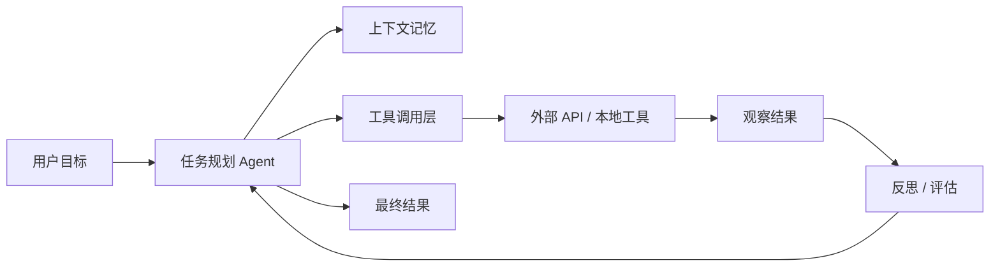

# GitHub AI Daily Trending Top 5

更新时间：2026-08-13T01:38:59Z

筛选范围：仓库名称或描述包含 AI 相关关键词。关键词：ai, agent, agents, agentic, llm, llms, skill, skills, mcp, model context protocol, chatgpt, openai, claude, gemini, copilot, deepseek, rag, embedding, embeddings, transformer, diffusion, machine learning, ml, deep learning, neural, inference, prompt, prompts。

网页版本：由 GitHub Pages 自动发布。

## 1. [cathrynlavery/diagram-design](https://github.com/cathrynlavery/diagram-design)

- 语言：HTML
- Stars：10,588
- 主题：未在 GitHub API 中公开 topics
- Star 趋势：

- 作用 / 解决的问题：29 editorial diagram types for Claude Code. Self-contained HTML + SVG. No shadows, no Mermaid-slop.
- 适用场景：
  - 适合快速评估 GitHub AI 热榜中新出现或重新升温的技术方向，因为该仓库已获得短期社区关注。
  - 适合围绕 未在 GitHub API 中公开 topics 做技术调研、竞品分析或原型验证，因为仓库主题与当前 AI 热点高度相关。
- 架构思想：
  - 它成为热榜的核心原因通常不是单点功能，而是把模型能力、工具、数据和工作流组织成更容易落地的工程结构。
  - 当前 Stars 为 10,588，说明它不只是概念验证，还积累了可观的社区验证和传播势能。
  - 使用 HTML 作为主要实现语言，降低了对应生态开发者集成、扩展和二次开发的成本。
  - 它的稀缺性在于把热门 AI 能力包装成可运行、可组合、可观察的工程入口，而不是停留在论文、提示词或孤立 Demo。
- 原理 / 实现思路：
  - New in 2.0 — the Loop: flywheels with a shared-memory hub. The dashed lines are the write-backs.*
  - New in 2.3: semantic system patterns and optional accessible motion, while static output stays the default.*
  - No Figma. No generic rounded boxes. No 30-minute color-picking sessions.
  - 以上内容由 GitHub 公开 README 自动摘取和归纳，适合作为快速了解入口，深入实现仍以仓库源码和文档为准。

```mermaid
flowchart LR
    User[用户需求] --> Interface[应用入口]
    Interface --> Orchestrator[AI 编排层]
    Orchestrator --> Model[LLM / 模型能力]
    Orchestrator --> Data[领域数据 / 上下文]
    Orchestrator --> Tools[工具与自动化流程]
    Model --> Result[候选结果]
    Data --> Result
    Tools --> Result
    Result --> Review[校验 / 观测 / 反馈]
    Review --> Output[可交付结果]
```

## 2. [macro-inc/macro](https://github.com/macro-inc/macro)

- 语言：Rust
- Stars：1,847
- 主题：agent, ai, ai-agents, all-in-one, crm, crm-system, email, linear, mcp, messaging, notes, notion, office, rust, slack, slack-alternative, startup, startup-tools, typescript, workspace
- Star 趋势：

- 作用 / 解决的问题：Macro is a unified workspace for teams: email, chat, docs, tasks, agents, calls, and CRM — @-linked together with shared AI memory.
- 适用场景：
  - 适合快速评估 GitHub AI 热榜中新出现或重新升温的技术方向，因为该仓库已获得短期社区关注。
  - 适合需要把外部工具、代码库、数据源接入 AI Agent 的场景，因为 MCP 能把能力封装成标准工具接口。
  - 适合多步骤自动化、工具调用和复杂任务编排场景，因为 Agent 模式能把规划、执行、观察和修正串起来。
- 架构思想：
  - 它成为热榜的核心原因通常不是单点功能，而是把模型能力、工具、数据和工作流组织成更容易落地的工程结构。
  - 当前 Stars 为 1,847，说明它不只是概念验证，还积累了可观的社区验证和传播势能。
  - 相比只提供单一脚本的仓库，它用 agent, ai, ai-agents, all-in-one, crm, crm-system, email, linear, mcp, messaging, notes, notion, office, rust, slack, slack-alternative, startup, startup-tools, typescript, workspace 等 topics 明确了能力边界，更容易被目标用户检索和采用。
  - 使用 Rust 作为主要实现语言，降低了对应生态开发者集成、扩展和二次开发的成本。
  - 它的稀缺性在于把热门 AI 能力包装成可运行、可组合、可观察的工程入口，而不是停留在论文、提示词或孤立 Demo。
- 原理 / 实现思路：
  - Macro is the all-in-one workspace for you and your team. It unifies email + messages + docs + tasks + agents + CRM into a single fast interface with shared team-level memory. Everything in your workspace is @linked and searchable so your team (and your agents)...
  - We built Macro because we wanted a single operating system for our startup. There are many good software products, and we used them all — Slack, Linear, Notion, HubSpot, and Superhuman — but they don't work together as one system. As we scaled our last venture...
  - Macro is a complete redesign of work software from the ground up as a single system.
  - 以上内容由 GitHub 公开 README 自动摘取和归纳，适合作为快速了解入口，深入实现仍以仓库源码和文档为准。

```mermaid
flowchart LR
    User[用户 / AI 编程助手] --> Client[Agent Client]
    Client --> Protocol[MCP 协议层]
    Protocol --> Server[macro-inc/macro]
    Server --> Tools[工具接口 / Skills]
    Server --> Index[代码索引 / 知识图谱]
    Server --> Data[文件系统 / API / 数据源]
    Tools --> Result[结构化结果]
    Index --> Result
    Data --> Result
    Result --> Client
    Client --> Answer[生成回答 / 执行动作]
```

## 3. [semantica-agi/semantica](https://github.com/semantica-agi/semantica)

- 语言：Python
- Stars：5,737
- 主题：agent-memory, ai, ai-governance, ai-infrastructure, artificial-intelligence, context-engineering, context-graphs, data-engineering, decision-intelligence, developer-tools, explainable-ai, generative-ai, graph-rag, knowledge-graph, llm, ontology, provenance, python, reasoning, semantic-search
- Star 趋势：

- 作用 / 解决的问题：Graph-Native Infrastructure for Context and Accountable AI Systems
- 适用场景：
  - 适合快速评估 GitHub AI 热榜中新出现或重新升温的技术方向，因为该仓库已获得短期社区关注。
  - 适合围绕 agent-memory, ai, ai-governance, ai-infrastructure, artificial-intelligence, context-engineering, context-graphs, data-engineering, decision-intelligence, developer-tools, explainable-ai, generative-ai, graph-rag, knowledge-graph, llm, ontology, provenance, python, reasoning, semantic-search 做技术调研、竞品分析或原型验证，因为仓库主题与当前 AI 热点高度相关。
- 架构思想：
  - 它成为热榜的核心原因通常不是单点功能，而是把模型能力、工具、数据和工作流组织成更容易落地的工程结构。
  - 当前 Stars 为 5,737，说明它不只是概念验证，还积累了可观的社区验证和传播势能。
  - 相比只提供单一脚本的仓库，它用 agent-memory, ai, ai-governance, ai-infrastructure, artificial-intelligence, context-engineering, context-graphs, data-engineering, decision-intelligence, developer-tools, explainable-ai, generative-ai, graph-rag, knowledge-graph, llm, ontology, provenance, python, reasoning, semantic-search 等 topics 明确了能力边界，更容易被目标用户检索和采用。
  - 使用 Python 作为主要实现语言，降低了对应生态开发者集成、扩展和二次开发的成本。
  - 它的稀缺性在于把热门 AI 能力包装成可运行、可组合、可观察的工程入口，而不是停留在论文、提示词或孤立 Demo。
- 原理 / 实现思路：
  - Graph-Native Infrastructure for Context and Accountable AI Systems
  - Ingest your enterprise data, extract what matters, build a Context Graph and knowledge graph (KG), and run graph analytics and causal reasoning over all of it, with full decision provenance baked in. Explainable, traceable, and trustworthy by design.
  - alt="Semantica Knowledge Explorer: live graph, decisions, entity resolution, ontology hub"
  - 以上内容由 GitHub 公开 README 自动摘取和归纳，适合作为快速了解入口，深入实现仍以仓库源码和文档为准。

```mermaid
flowchart LR
    User[用户需求] --> Interface[应用入口]
    Interface --> Orchestrator[AI 编排层]
    Orchestrator --> Model[LLM / 模型能力]
    Orchestrator --> Data[领域数据 / 上下文]
    Orchestrator --> Tools[工具与自动化流程]
    Model --> Result[候选结果]
    Data --> Result
    Tools --> Result
    Result --> Review[校验 / 观测 / 反馈]
    Review --> Output[可交付结果]
```

## 4. [stablyai/orca](https://github.com/stablyai/orca)

- 语言：TypeScript
- Stars：43,921
- 主题：ade, agent-ide, ai-agents, claude-code, cli, codex, cursor-agent, devtools, ghostty, ide, mobile-app, opencode, orchestration, parallel-agents, pi, terminal, worktrees, yc-backed
- Star 趋势：

- 作用 / 解决的问题：Orca is the ADE for working with a fleet of parallel agents. Run any coding agent with your own subscription. Available on desktop, mobile and VPS.
- 适用场景：
  - 适合快速评估 GitHub AI 热榜中新出现或重新升温的技术方向，因为该仓库已获得短期社区关注。
  - 适合多步骤自动化、工具调用和复杂任务编排场景，因为 Agent 模式能把规划、执行、观察和修正串起来。
- 架构思想：
  - 它成为热榜的核心原因通常不是单点功能，而是把模型能力、工具、数据和工作流组织成更容易落地的工程结构。
  - 当前 Stars 为 43,921，说明它不只是概念验证，还积累了可观的社区验证和传播势能。
  - 相比只提供单一脚本的仓库，它用 ade, agent-ide, ai-agents, claude-code, cli, codex, cursor-agent, devtools, ghostty, ide, mobile-app, opencode, orchestration, parallel-agents, pi, terminal, worktrees, yc-backed 等 topics 明确了能力边界，更容易被目标用户检索和采用。
  - 使用 TypeScript 作为主要实现语言，降低了对应生态开发者集成、扩展和二次开发的成本。
  - 它的稀缺性在于把热门 AI 能力包装成可运行、可组合、可观察的工程入口，而不是停留在论文、提示词或孤立 Demo。
- 原理 / 实现思路：
  - Run Codex, ClaudeCode, OpenCode or Pi side-by-side — each in its own worktree, tracked in one place.
  - Monitor and steer your agents from your phone — get notified when an agent finishes and send follow-ups from anywhere.
  - Fan one prompt across five agents, each in its own isolated git worktree — compare the results and merge the winner.
  - 以上内容由 GitHub 公开 README 自动摘取和归纳，适合作为快速了解入口，深入实现仍以仓库源码和文档为准。

```mermaid
flowchart LR
    User[用户目标] --> Planner[任务规划 Agent]
    Planner --> Memory[上下文记忆]
    Planner --> Tools[工具调用层]
    Tools --> APIs[外部 API / 本地工具]
    APIs --> Observation[观察结果]
    Observation --> Critic[反思 / 评估]
    Critic --> Planner
    Planner --> Deliverable[最终结果]
```

## 5. [msitarzewski/agency-agents](https://github.com/msitarzewski/agency-agents)

- 语言：Shell
- Stars：144,593
- 主题：未在 GitHub API 中公开 topics
- Star 趋势：

- 作用 / 解决的问题：A complete AI agency at your fingertips - From frontend wizards to Reddit community ninjas, from whimsy injectors to reality checkers. Each agent is a specialized expert with personality, processes, and proven deliverables.
- 适用场景：
  - 适合快速评估 GitHub AI 热榜中新出现或重新升温的技术方向，因为该仓库已获得短期社区关注。
  - 适合多步骤自动化、工具调用和复杂任务编排场景，因为 Agent 模式能把规划、执行、观察和修正串起来。
- 架构思想：
  - 它成为热榜的核心原因通常不是单点功能，而是把模型能力、工具、数据和工作流组织成更容易落地的工程结构。
  - 当前 Stars 为 144,593，说明它不只是概念验证，还积累了可观的社区验证和传播势能。
  - 使用 Shell 作为主要实现语言，降低了对应生态开发者集成、扩展和二次开发的成本。
  - 它的稀缺性在于把热门 AI 能力包装成可运行、可组合、可观察的工程入口，而不是停留在论文、提示词或孤立 Demo。
- 原理 / 实现思路：
  - 🎭 The Agency: AI Specialists Ready to Transform Your Workflow
  - A complete AI agency at your fingertips - From frontend wizards to Reddit community ninjas, from whimsy injectors to reality checkers. Each agent is a specialized expert with personality, processes, and proven deliverables.
  - Born from a Reddit thread and months of iteration, The Agency is a growing collection of meticulously crafted AI agent personalities. Each agent is:
  - 以上内容由 GitHub 公开 README 自动摘取和归纳，适合作为快速了解入口，深入实现仍以仓库源码和文档为准。

```mermaid
flowchart LR
    User[用户目标] --> Planner[任务规划 Agent]
    Planner --> Memory[上下文记忆]
    Planner --> Tools[工具调用层]
    Tools --> APIs[外部 API / 本地工具]
    APIs --> Observation[观察结果]
    Observation --> Critic[反思 / 评估]
    Critic --> Planner
    Planner --> Deliverable[最终结果]
```

