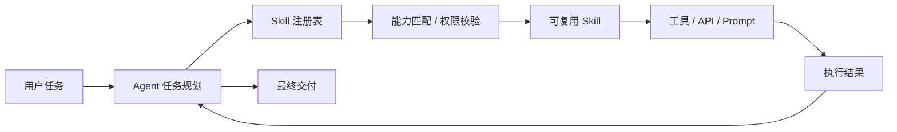
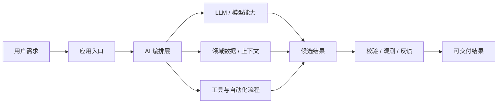
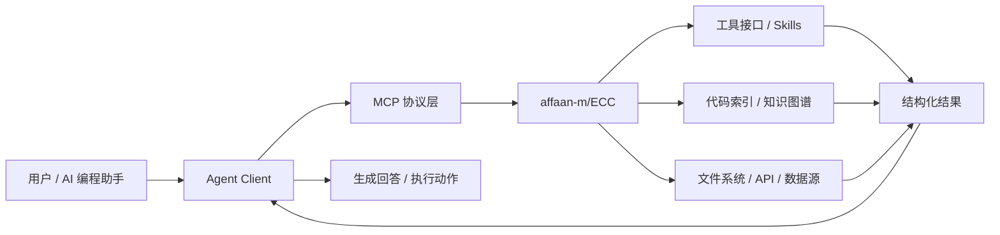
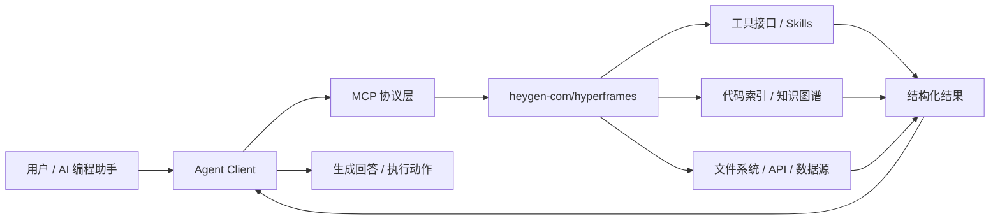

# GitHub AI Daily Trending Top 5

更新时间：2026-09-09T02:49:25Z

筛选范围：仓库名称或描述包含 AI 相关关键词。关键词：ai, agent, agents, agentic, llm, llms, skill, skills, mcp, model context protocol, chatgpt, openai, claude, gemini, copilot, deepseek, rag, embedding, embeddings, transformer, diffusion, machine learning, ml, deep learning, neural, inference, prompt, prompts。

网页版本：由 GitHub Pages 自动发布。

## 1. [ayghri/i-have-adhd](https://github.com/ayghri/i-have-adhd)

- 语言：Python
- Stars：30,856
- 主题：adhd, claude-, claude-code-plugin, claude-skills, developer-tools, productivity
- Star 趋势：

- 作用 / 解决的问题：A skill to stop your coding agent from burying the answer. ADHD-friendly output.
- 适用场景：
  - 适合快速评估 GitHub AI 热榜中新出现或重新升温的技术方向，因为该仓库已获得短期社区关注。
  - 适合多步骤自动化、工具调用和复杂任务编排场景，因为 Agent 模式能把规划、执行、观察和修正串起来。
  - 适合团队沉淀可复用 AI 能力的场景，因为 Skill 把提示词、工具和流程封装成可发现、可组合的单元。
- 架构思想：
  - 它成为热榜的核心原因通常不是单点功能，而是把模型能力、工具、数据和工作流组织成更容易落地的工程结构。
  - 当前 Stars 为 30,856，说明它不只是概念验证，还积累了可观的社区验证和传播势能。
  - 相比只提供单一脚本的仓库，它用 adhd, claude-, claude-code-plugin, claude-skills, developer-tools, productivity 等 topics 明确了能力边界，更容易被目标用户检索和采用。
  - 使用 Python 作为主要实现语言，降低了对应生态开发者集成、扩展和二次开发的成本。
  - 它的稀缺性在于把热门 AI 能力包装成可运行、可组合、可观察的工程入口，而不是停留在论文、提示词或孤立 Demo。
- 原理 / 实现思路：
  - Or 🔗 [check the installation instructions](INSTALL.md).
  - A skill for your coding assistant that stops it from burying the answer. Action first. Steps numbered. No "Hope this helps!"
  - Great question! Let me think about this. Your auth flow has a few moving pieces: the middleware, the token verification, and the cookie handling. Looking at src/auth.ts, the verifyToken function (around lines 42-58) seems to be using an older jsonwebtoken API....
  - 以上内容由 GitHub 公开 README 自动摘取和归纳，适合作为快速了解入口，深入实现仍以仓库源码和文档为准。

```mermaid
flowchart LR
    User[用户任务] --> Planner[Agent 任务规划]
    Planner --> Registry[Skill 注册表]
    Registry --> Select[能力匹配 / 权限校验]
    Select --> Skill[可复用 Skill]
    Skill --> Tool[工具 / API / Prompt]
    Tool --> Observation[执行结果]
    Observation --> Planner
    Planner --> Output[最终交付]
```

## 2. [cathrynlavery/diagram-design](https://github.com/cathrynlavery/diagram-design)

- 语言：HTML
- Stars：35,011
- 主题：agent-skills, claude-code, codex, data-visualization, diagrams, drawio, mermaid, svg
- Star 趋势：

- 作用 / 解决的问题：38 editorial diagram types for Claude Code, Codex, and Pi. Self-contained HTML + SVG. No shadows. No Mermaid slop.
- 适用场景：
  - 适合快速评估 GitHub AI 热榜中新出现或重新升温的技术方向，因为该仓库已获得短期社区关注。
  - 适合围绕 agent-skills, claude-code, codex, data-visualization, diagrams, drawio, mermaid, svg 做技术调研、竞品分析或原型验证，因为仓库主题与当前 AI 热点高度相关。
- 架构思想：
  - 它成为热榜的核心原因通常不是单点功能，而是把模型能力、工具、数据和工作流组织成更容易落地的工程结构。
  - 当前 Stars 为 35,011，说明它不只是概念验证，还积累了可观的社区验证和传播势能。
  - 相比只提供单一脚本的仓库，它用 agent-skills, claude-code, codex, data-visualization, diagrams, drawio, mermaid, svg 等 topics 明确了能力边界，更容易被目标用户检索和采用。
  - 使用 HTML 作为主要实现语言，降低了对应生态开发者集成、扩展和二次开发的成本。
  - 它的稀缺性在于把热门 AI 能力包装成可运行、可组合、可观察的工程入口，而不是停留在论文、提示词或孤立 Demo。
- 原理 / 实现思路：
  - New in 2.0 — the Loop: flywheels with a shared-memory hub. The dashed lines are the write-backs.*
  - New in 2.3: semantic system patterns and optional accessible motion, while static output stays the default.*
  - New in 2.5.10: ten more layout grammars — Sankey, fishbone, Wardley map, kanban, user journey, deployment, dependency graph, UML class, story map, and database schema.*
  - 以上内容由 GitHub 公开 README 自动摘取和归纳，适合作为快速了解入口，深入实现仍以仓库源码和文档为准。

```mermaid
flowchart LR
    User[用户需求] --> Interface[应用入口]
    Interface --> Orchestrator[AI 编排层]
    Orchestrator --> Model[LLM / 模型能力]
    Orchestrator --> Data[领域数据 / 上下文]
    Orchestrator --> Tools[工具与自动化流程]
    Model --> Result[候选结果]
    Data --> Result
    Tools --> Result
    Result --> Review[校验 / 观测 / 反馈]
    Review --> Output[可交付结果]
```

## 3. [openai/skills](https://github.com/openai/skills)

- 语言：Python
- Stars：26,556
- 主题：未在 GitHub API 中公开 topics
- Star 趋势：

- 作用 / 解决的问题：Skills Catalog for Codex
- 适用场景：
  - 适合快速评估 GitHub AI 热榜中新出现或重新升温的技术方向，因为该仓库已获得短期社区关注。
  - 适合团队沉淀可复用 AI 能力的场景，因为 Skill 把提示词、工具和流程封装成可发现、可组合的单元。
- 架构思想：
  - 它成为热榜的核心原因通常不是单点功能，而是把模型能力、工具、数据和工作流组织成更容易落地的工程结构。
  - 当前 Stars 为 26,556，说明它不只是概念验证，还积累了可观的社区验证和传播势能。
  - 使用 Python 作为主要实现语言，降低了对应生态开发者集成、扩展和二次开发的成本。
  - 它的稀缺性在于把热门 AI 能力包装成可运行、可组合、可观察的工程入口，而不是停留在论文、提示词或孤立 Demo。
- 原理 / 实现思路：
  - Agent Skills are folders of instructions, scripts, and resources that AI agents can discover and use to perform at specific tasks. Write once, use everywhere.
  - Codex uses skills to help package capabilities that teams and individuals can use to complete specific tasks in a repeatable way. This repository catalogs skills for use and distribution with Codex.
  - Skills in [.system](skills/.system/) are automatically installed in the latest version of Codex.
  - 以上内容由 GitHub 公开 README 自动摘取和归纳，适合作为快速了解入口，深入实现仍以仓库源码和文档为准。

```mermaid
flowchart LR
    User[用户任务] --> Planner[Agent 任务规划]
    Planner --> Registry[Skill 注册表]
    Registry --> Select[能力匹配 / 权限校验]
    Select --> Skill[可复用 Skill]
    Skill --> Tool[工具 / API / Prompt]
    Tool --> Observation[执行结果]
    Observation --> Planner
    Planner --> Output[最终交付]
```

## 4. [affaan-m/ECC](https://github.com/affaan-m/ECC)

- 语言：JavaScript
- Stars：254,384
- 主题：ai-agents, anthropic, claude, claude-code, developer-tools, llm, mcp, productivity
- Star 趋势：

- 作用 / 解决的问题：The agent harness performance optimization system. Skills, instincts, memory, security, and research-first development for Claude Code, Codex, Opencode, Cursor and beyond.
- 适用场景：
  - 适合快速评估 GitHub AI 热榜中新出现或重新升温的技术方向，因为该仓库已获得短期社区关注。
  - 适合需要把外部工具、代码库、数据源接入 AI Agent 的场景，因为 MCP 能把能力封装成标准工具接口。
  - 适合多步骤自动化、工具调用和复杂任务编排场景，因为 Agent 模式能把规划、执行、观察和修正串起来。
  - 适合团队沉淀可复用 AI 能力的场景，因为 Skill 把提示词、工具和流程封装成可发现、可组合的单元。
- 架构思想：
  - 它成为热榜的核心原因通常不是单点功能，而是把模型能力、工具、数据和工作流组织成更容易落地的工程结构。
  - 当前 Stars 为 254,384，说明它不只是概念验证，还积累了可观的社区验证和传播势能。
  - 相比只提供单一脚本的仓库，它用 ai-agents, anthropic, claude, claude-code, developer-tools, llm, mcp, productivity 等 topics 明确了能力边界，更容易被目标用户检索和采用。
  - 使用 JavaScript 作为主要实现语言，降低了对应生态开发者集成、扩展和二次开发的成本。
  - 它的稀缺性在于把热门 AI 能力包装成可运行、可组合、可观察的工程入口，而不是停留在论文、提示词或孤立 Demo。
- 原理 / 实现思路：
  - Run the canonical guided setup from your terminal:
  - If npm reports a version or cache error, confirm the registry version before retrying:
  - This path requires Node.js 18 or newer, Git, and Claude Code 2.1 or newer on
  - 以上内容由 GitHub 公开 README 自动摘取和归纳，适合作为快速了解入口，深入实现仍以仓库源码和文档为准。

```mermaid
flowchart LR
    User[用户 / AI 编程助手] --> Client[Agent Client]
    Client --> Protocol[MCP 协议层]
    Protocol --> Server[affaan-m/ECC]
    Server --> Tools[工具接口 / Skills]
    Server --> Index[代码索引 / 知识图谱]
    Server --> Data[文件系统 / API / 数据源]
    Tools --> Result[结构化结果]
    Index --> Result
    Data --> Result
    Result --> Client
    Client --> Answer[生成回答 / 执行动作]
```

## 5. [heygen-com/hyperframes](https://github.com/heygen-com/hyperframes)

- 语言：TypeScript
- Stars：47,848
- 主题：ai, animation, ffmpeg, framework, gsap, html, mcp, puppeteer, rendering, typescript, video
- Star 趋势：

- 作用 / 解决的问题：Write HTML. Render video. Built for agents.
- 适用场景：
  - 适合快速评估 GitHub AI 热榜中新出现或重新升温的技术方向，因为该仓库已获得短期社区关注。
  - 适合需要把外部工具、代码库、数据源接入 AI Agent 的场景，因为 MCP 能把能力封装成标准工具接口。
  - 适合多步骤自动化、工具调用和复杂任务编排场景，因为 Agent 模式能把规划、执行、观察和修正串起来。
- 架构思想：
  - 它成为热榜的核心原因通常不是单点功能，而是把模型能力、工具、数据和工作流组织成更容易落地的工程结构。
  - 当前 Stars 为 47,848，说明它不只是概念验证，还积累了可观的社区验证和传播势能。
  - 相比只提供单一脚本的仓库，它用 ai, animation, ffmpeg, framework, gsap, html, mcp, puppeteer, rendering, typescript, video 等 topics 明确了能力边界，更容易被目标用户检索和采用。
  - 使用 TypeScript 作为主要实现语言，降低了对应生态开发者集成、扩展和二次开发的成本。
  - 它的稀缺性在于把热门 AI 能力包装成可运行、可组合、可观察的工程入口，而不是停留在论文、提示词或孤立 Demo。
- 原理 / 实现思路：
  - HyperFrames is an open-source framework for turning HTML, CSS, media, and seekable animations into deterministic MP4 videos. Use it locally with the CLI, from AI coding agents with skills, or as the rendering core behind hosted authoring workflows.
  - The picker opens with nothing pre-selected — the Core Skills group is all you need: the /hyperframes router installs each creation workflow on demand. Agents and non-interactive runs should use npx hyperframes skills update instead — it installs exactly the co...
  - skills add resolves the skills.sh registry blob, which can lag main by hours. npx hyperframes skills update installs from the current main, so reach for it when you need the newest copy of a skill.
  - 以上内容由 GitHub 公开 README 自动摘取和归纳，适合作为快速了解入口，深入实现仍以仓库源码和文档为准。

```mermaid
flowchart LR
    User[用户 / AI 编程助手] --> Client[Agent Client]
    Client --> Protocol[MCP 协议层]
    Protocol --> Server[heygen-com/hyperframes]
    Server --> Tools[工具接口 / Skills]
    Server --> Index[代码索引 / 知识图谱]
    Server --> Data[文件系统 / API / 数据源]
    Tools --> Result[结构化结果]
    Index --> Result
    Data --> Result
    Result --> Client
    Client --> Answer[生成回答 / 执行动作]
```

