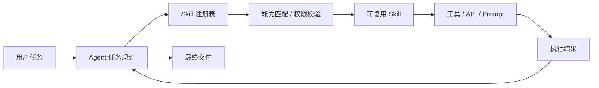
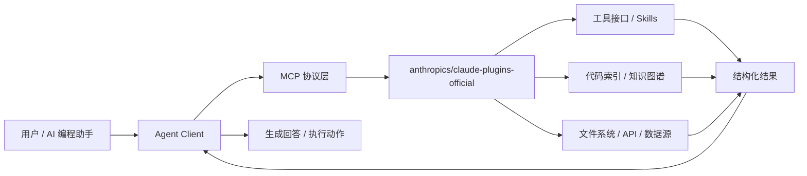
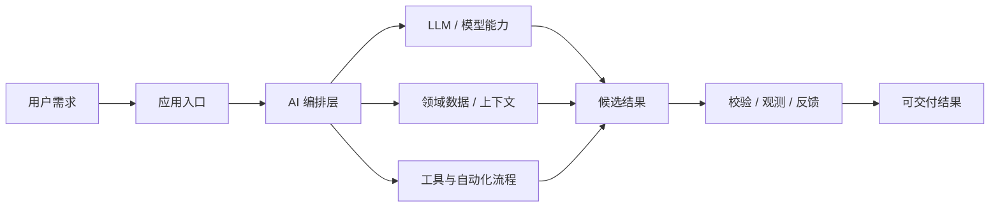

# GitHub AI Daily Trending Top 5

更新时间：2026-08-27T06:59:12Z

筛选范围：仓库名称或描述包含 AI 相关关键词。关键词：ai, agent, agents, agentic, llm, llms, skill, skills, mcp, model context protocol, chatgpt, openai, claude, gemini, copilot, deepseek, rag, embedding, embeddings, transformer, diffusion, machine learning, ml, deep learning, neural, inference, prompt, prompts。

网页版本：由 GitHub Pages 自动发布。

## 1. [tt-a1i/archify](https://github.com/tt-a1i/archify)

- 语言：JavaScript
- Stars：19,502
- 主题：agent-skills, architecture-as-code, architecture-diagram, claude-skill, code-visualization, codex, coding-agents, data-flow-diagram, deepseek-harness, developer-tools, diagram-as-code, diagrams, diagrams-as-code, dsh-plugin, mermaid-alternative, opencode, sequence-diagram, software-architecture, system-design, text-to-diagram
- Star 趋势：

- 作用 / 解决的问题：Agent skill for beautiful, verifiable architecture, workflow, sequence, data-flow, and lifecycle diagrams—self-contained HTML with motion and crisp export.
- 适用场景：
  - 适合快速评估 GitHub AI 热榜中新出现或重新升温的技术方向，因为该仓库已获得短期社区关注。
  - 适合多步骤自动化、工具调用和复杂任务编排场景，因为 Agent 模式能把规划、执行、观察和修正串起来。
  - 适合团队沉淀可复用 AI 能力的场景，因为 Skill 把提示词、工具和流程封装成可发现、可组合的单元。
- 架构思想：
  - 它成为热榜的核心原因通常不是单点功能，而是把模型能力、工具、数据和工作流组织成更容易落地的工程结构。
  - 当前 Stars 为 19,502，说明它不只是概念验证，还积累了可观的社区验证和传播势能。
  - 相比只提供单一脚本的仓库，它用 agent-skills, architecture-as-code, architecture-diagram, claude-skill, code-visualization, codex, coding-agents, data-flow-diagram, deepseek-harness, developer-tools, diagram-as-code, diagrams, diagrams-as-code, dsh-plugin, mermaid-alternative, opencode, sequence-diagram, software-architecture, system-design, text-to-diagram 等 topics 明确了能力边界，更容易被目标用户检索和采用。
  - 使用 JavaScript 作为主要实现语言，降低了对应生态开发者集成、扩展和二次开发的成本。
  - 它的稀缺性在于把热门 AI 能力包装成可运行、可组合、可观察的工程入口，而不是停留在论文、提示词或孤立 Demo。
- 原理 / 实现思路：
  - Turn a codebase or system description into a polished, interactive system map — directly in chat.
  - Open it and present — five diagram types, four presets, dark/light themes, built-in brand marks, and finite motion
  - Review architecture changes before merge — compare two validated snapshots as Before / Delta / After, with exact added, removed, changed, moved, and rerouted facts
  - 以上内容由 GitHub 公开 README 自动摘取和归纳，适合作为快速了解入口，深入实现仍以仓库源码和文档为准。

```mermaid
flowchart LR
    User[用户任务] --> Planner[Agent 任务规划]
    Planner --> Registry[Skill 注册表]
    Registry --> Select[能力匹配 / 权限校验]
    Select --> Skill[可复用 Skill]
    Skill --> Tool[工具 / API / Prompt]
    Tool --> Observation[执行结果]
    Observation --> Planner
    Planner --> Output[最终交付]
```

## 2. [freestylefly/awesome-gpt-image-2](https://github.com/freestylefly/awesome-gpt-image-2)

- 语言：JavaScript
- Stars：22,035
- 主题：agents, ai-image-generation, chatgpt, dsh-plugin, gpt-image-2, image-prompts, prompt-as-code, prompt-engineering, skills, workflow-automation
- Star 趋势：

- 作用 / 解决的问题：Prompt as Code \| GPT-Image2 工业级提示词引擎与模板库，530+ 个案例逆向工程，20+ 套工业级模板，并提炼出Skills，持续更新中
- 适用场景：
  - 适合快速评估 GitHub AI 热榜中新出现或重新升温的技术方向，因为该仓库已获得短期社区关注。
  - 适合多步骤自动化、工具调用和复杂任务编排场景，因为 Agent 模式能把规划、执行、观察和修正串起来。
  - 适合团队沉淀可复用 AI 能力的场景，因为 Skill 把提示词、工具和流程封装成可发现、可组合的单元。
- 架构思想：
  - 它成为热榜的核心原因通常不是单点功能，而是把模型能力、工具、数据和工作流组织成更容易落地的工程结构。
  - 当前 Stars 为 22,035，说明它不只是概念验证，还积累了可观的社区验证和传播势能。
  - 相比只提供单一脚本的仓库，它用 agents, ai-image-generation, chatgpt, dsh-plugin, gpt-image-2, image-prompts, prompt-as-code, prompt-engineering, skills, workflow-automation 等 topics 明确了能力边界，更容易被目标用户检索和采用。
  - 使用 JavaScript 作为主要实现语言，降低了对应生态开发者集成、扩展和二次开发的成本。
  - 它的稀缺性在于把热门 AI 能力包装成可运行、可组合、可观察的工程入口，而不是停留在论文、提示词或孤立 Demo。
- 原理 / 实现思路：
  - Follow the WeChat official account 苍何 or scan the QR code below to receive project updates, new cases, and practical tutorials.
  - [Want to appear here?](data/images/sponsors/wechat-personal.jpg) Support the project through GitHub Sponsors, or search 苍何 on WeChat and send your product name plus a short sponsorship note.
  - After GPT-Image2 became widely available, AI image generation moved from "can it make an image?" to "can it make stable, controllable, reusable images?" This project turns scattered community examples into Prompt-as-Code assets that are easier for agents and a...
  - 以上内容由 GitHub 公开 README 自动摘取和归纳，适合作为快速了解入口，深入实现仍以仓库源码和文档为准。

```mermaid
flowchart LR
    User[用户任务] --> Planner[Agent 任务规划]
    Planner --> Registry[Skill 注册表]
    Registry --> Select[能力匹配 / 权限校验]
    Select --> Skill[可复用 Skill]
    Skill --> Tool[工具 / API / Prompt]
    Tool --> Observation[执行结果]
    Observation --> Planner
    Planner --> Output[最终交付]
```

## 3. [anthropics/claude-plugins-official](https://github.com/anthropics/claude-plugins-official)

- 语言：Python
- Stars：34,441
- 主题：claude-code, mcp, skills
- Star 趋势：

- 作用 / 解决的问题：Official, Anthropic-managed directory of high quality Claude Code Plugins.
- 适用场景：
  - 适合快速评估 GitHub AI 热榜中新出现或重新升温的技术方向，因为该仓库已获得短期社区关注。
  - 适合需要把外部工具、代码库、数据源接入 AI Agent 的场景，因为 MCP 能把能力封装成标准工具接口。
  - 适合团队沉淀可复用 AI 能力的场景，因为 Skill 把提示词、工具和流程封装成可发现、可组合的单元。
- 架构思想：
  - 它成为热榜的核心原因通常不是单点功能，而是把模型能力、工具、数据和工作流组织成更容易落地的工程结构。
  - 当前 Stars 为 34,441，说明它不只是概念验证，还积累了可观的社区验证和传播势能。
  - 相比只提供单一脚本的仓库，它用 claude-code, mcp, skills 等 topics 明确了能力边界，更容易被目标用户检索和采用。
  - 使用 Python 作为主要实现语言，降低了对应生态开发者集成、扩展和二次开发的成本。
  - 它的稀缺性在于把热门 AI 能力包装成可运行、可组合、可观察的工程入口，而不是停留在论文、提示词或孤立 Demo。
- 原理 / 实现思路：
  - A curated directory of high-quality plugins for Claude Code.
  - ⚠️ Important: Make sure you trust a plugin before installing, updating, or using it. Anthropic does not control what MCP servers, files, or other software are included in plugins and cannot verify that they will work as intended or that they won't change. See ...
  - /plugins - Internal plugins developed and maintained by Anthropic
  - 以上内容由 GitHub 公开 README 自动摘取和归纳，适合作为快速了解入口，深入实现仍以仓库源码和文档为准。

```mermaid
flowchart LR
    User[用户 / AI 编程助手] --> Client[Agent Client]
    Client --> Protocol[MCP 协议层]
    Protocol --> Server[anthropics/claude-plugins-official]
    Server --> Tools[工具接口 / Skills]
    Server --> Index[代码索引 / 知识图谱]
    Server --> Data[文件系统 / API / 数据源]
    Tools --> Result[结构化结果]
    Index --> Result
    Data --> Result
    Result --> Client
    Client --> Answer[生成回答 / 执行动作]
```

## 4. [Alishahryar1/free-claude-code](https://github.com/Alishahryar1/free-claude-code)

- 语言：Python
- Stars：50,561
- 主题：未在 GitHub API 中公开 topics
- Star 趋势：

- 作用 / 解决的问题：Use Claude Code, Codex, Pi, and OpenCode and more for free (1.3B+ free tokens) from your terminal, app, IDE, or phone like OpenClaw (voice supported + ToS friendly)
- 适用场景：
  - 适合快速评估 GitHub AI 热榜中新出现或重新升温的技术方向，因为该仓库已获得短期社区关注。
  - 适合围绕 未在 GitHub API 中公开 topics 做技术调研、竞品分析或原型验证，因为仓库主题与当前 AI 热点高度相关。
- 架构思想：
  - 它成为热榜的核心原因通常不是单点功能，而是把模型能力、工具、数据和工作流组织成更容易落地的工程结构。
  - 当前 Stars 为 50,561，说明它不只是概念验证，还积累了可观的社区验证和传播势能。
  - 使用 Python 作为主要实现语言，降低了对应生态开发者集成、扩展和二次开发的成本。
  - 它的稀缺性在于把热门 AI 能力包装成可运行、可组合、可观察的工程入口，而不是停留在论文、提示词或孤立 Demo。
- 原理 / 实现思路：
  - [Quick Start](#quick-start) · [Providers](#choose-a-provider) · [Clients](#connect-your-client) · [Integrations](#optional-integrations) · [Manage](#manage-your-installation)
  - 50 ToS-friendly providers. 1.3B+ free tokens every month. Use free, paid, subscription, and local models from one searchable UI without putting your account at risk. FCC follows provider terms and removes integrations if they stop being allowed.
  - Keep coding through provider outages. After retries are exhausted, FCC automatically tries your next configured model without making you restart the turn—across every client.
  - 以上内容由 GitHub 公开 README 自动摘取和归纳，适合作为快速了解入口，深入实现仍以仓库源码和文档为准。

```mermaid
flowchart LR
    User[用户需求] --> Interface[应用入口]
    Interface --> Orchestrator[AI 编排层]
    Orchestrator --> Model[LLM / 模型能力]
    Orchestrator --> Data[领域数据 / 上下文]
    Orchestrator --> Tools[工具与自动化流程]
    Model --> Result[候选结果]
    Data --> Result
    Tools --> Result
    Result --> Review[校验 / 观测 / 反馈]
    Review --> Output[可交付结果]
```

## 5. [MadsLorentzen/ai-job-search](https://github.com/MadsLorentzen/ai-job-search)

- 语言：Python
- Stars：36,760
- 主题：ai, ai-agents, career, claude-code, cover-letter, cv, interview-preparation, job-application, job-hunting, job-search, latex, resume
- Star 趋势：

- 作用 / 解决的问题：The job search that runs on your machine. AI job application framework built on Claude Code: evaluate postings, tailor CVs, write cover letters, prep interviews. Fork it and own it.
- 适用场景：
  - 适合快速评估 GitHub AI 热榜中新出现或重新升温的技术方向，因为该仓库已获得短期社区关注。
  - 适合围绕 ai, ai-agents, career, claude-code, cover-letter, cv, interview-preparation, job-application, job-hunting, job-search, latex, resume 做技术调研、竞品分析或原型验证，因为仓库主题与当前 AI 热点高度相关。
- 架构思想：
  - 它成为热榜的核心原因通常不是单点功能，而是把模型能力、工具、数据和工作流组织成更容易落地的工程结构。
  - 当前 Stars 为 36,760，说明它不只是概念验证，还积累了可观的社区验证和传播势能。
  - 相比只提供单一脚本的仓库，它用 ai, ai-agents, career, claude-code, cover-letter, cv, interview-preparation, job-application, job-hunting, job-search, latex, resume 等 topics 明确了能力边界，更容易被目标用户检索和采用。
  - 使用 Python 作为主要实现语言，降低了对应生态开发者集成、扩展和二次开发的成本。
  - 它的稀缺性在于把热门 AI 能力包装成可运行、可组合、可观察的工程入口，而不是停留在论文、提示词或孤立 Demo。
- 原理 / 实现思路：
  - Note: This is an independent open-source project and is not affiliated with, endorsed by, sponsored by, or maintained by Anthropic. Anthropic and Claude Code are referenced only to describe the toolchain this workflow uses.
  - This project has no affiliated cryptocurrency, token, or paid sponsorship program. Anything claiming otherwise is unauthorized and should be treated as a scam. The only ways to support the project are the Ko-fi link below and contributing on GitHub.
  - I'm a geophysicist by training. When my position was cut in late 2025, I built this framework to run my own job search - the same /scrape, /apply, and /interview workflow in this repo, used weekly, on my own career. I was upfront about it with every employer I...
  - 以上内容由 GitHub 公开 README 自动摘取和归纳，适合作为快速了解入口，深入实现仍以仓库源码和文档为准。

```mermaid
flowchart LR
    User[用户需求] --> Interface[应用入口]
    Interface --> Orchestrator[AI 编排层]
    Orchestrator --> Model[LLM / 模型能力]
    Orchestrator --> Data[领域数据 / 上下文]
    Orchestrator --> Tools[工具与自动化流程]
    Model --> Result[候选结果]
    Data --> Result
    Tools --> Result
    Result --> Review[校验 / 观测 / 反馈]
    Review --> Output[可交付结果]
```

