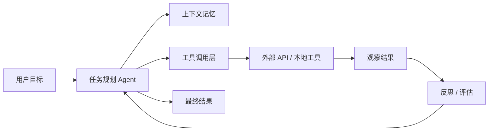

# GitHub AI Daily Trending Top 5

更新时间：2026-08-17T01:00:02Z

筛选范围：仓库名称或描述包含 AI 相关关键词。关键词：ai, agent, agents, agentic, llm, llms, skill, skills, mcp, model context protocol, chatgpt, openai, claude, gemini, copilot, deepseek, rag, embedding, embeddings, transformer, diffusion, machine learning, ml, deep learning, neural, inference, prompt, prompts。

网页版本：由 GitHub Pages 自动发布。

## 1. [unslothai/unsloth](https://github.com/unslothai/unsloth)

- 语言：Python
- Stars：72,582
- 主题：agent, ai, chatgpt, deepseek, fine-tuning, gemma, image-generation, llama, llm, llms, openai, python, qwen, reinforcement-learning, self-hosted, stable-diffusion, text-to-speech, tts, ui, unsloth
- Star 趋势：

- 作用 / 解决的问题：Local UI to run and train LLMs and diffusion models, including Qwen3.8, Kimi K3, MiniMax-H3, Gemma 4, DeepSeek-V4, FLUX and more.
- 适用场景：
  - 适合快速评估 GitHub AI 热榜中新出现或重新升温的技术方向，因为该仓库已获得短期社区关注。
  - 适合多步骤自动化、工具调用和复杂任务编排场景，因为 Agent 模式能把规划、执行、观察和修正串起来。
- 架构思想：
  - 它成为热榜的核心原因通常不是单点功能，而是把模型能力、工具、数据和工作流组织成更容易落地的工程结构。
  - 当前 Stars 为 72,582，说明它不只是概念验证，还积累了可观的社区验证和传播势能。
  - 相比只提供单一脚本的仓库，它用 agent, ai, chatgpt, deepseek, fine-tuning, gemma, image-generation, llama, llm, llms, openai, python, qwen, reinforcement-learning, self-hosted, stable-diffusion, text-to-speech, tts, ui, unsloth 等 topics 明确了能力边界，更容易被目标用户检索和采用。
  - 使用 Python 作为主要实现语言，降低了对应生态开发者集成、扩展和二次开发的成本。
  - 它的稀缺性在于把热门 AI 能力包装成可运行、可组合、可观察的工程入口，而不是停留在论文、提示词或孤立 Demo。
- 原理 / 实现思路：
  - Unsloth is the first desktop app to run and train models.
  - Download the native Unsloth Desktop app for your operating system:
  - Unsloth lets you run, train, and deploy AI models locally, with support for all types of models.
  - 以上内容由 GitHub 公开 README 自动摘取和归纳，适合作为快速了解入口，深入实现仍以仓库源码和文档为准。

```mermaid
flowchart LR
    User[用户目标] --> Planner[任务规划 Agent]
    Planner --> Memory[上下文记忆]
    Planner --> Tools[工具调用层]
    Tools --> APIs[外部 API / 本地工具]
    APIs --> Observation[观察结果]
    Observation --> Critic[反思 / 评估]
    Critic --> Planner
    Planner --> Deliverable[最终结果]
```

## 2. [ToolJet/ToolJet](https://github.com/ToolJet/ToolJet)

- 语言：JavaScript
- Stars：40,032
- 主题：ai-app-builder, docker, hacktoberfest, internal-applications, internal-project, internal-tool, internal-tools, javascript, kubernetes, low-code, low-code-development-platform, low-code-framework, no-code, nodejs, reactjs, self-hosted, typescript, web-development-tools, workflow-automation
- Star 趋势：

- 作用 / 解决的问题：ToolJet is the open-source foundation of ToolJet AI - the enterprise app generation platform for building internal tools, dashboard, business applications, workflows and AI agents 🚀
- 适用场景：
  - 适合快速评估 GitHub AI 热榜中新出现或重新升温的技术方向，因为该仓库已获得短期社区关注。
  - 适合多步骤自动化、工具调用和复杂任务编排场景，因为 Agent 模式能把规划、执行、观察和修正串起来。
- 架构思想：
  - 它成为热榜的核心原因通常不是单点功能，而是把模型能力、工具、数据和工作流组织成更容易落地的工程结构。
  - 当前 Stars 为 40,032，说明它不只是概念验证，还积累了可观的社区验证和传播势能。
  - 相比只提供单一脚本的仓库，它用 ai-app-builder, docker, hacktoberfest, internal-applications, internal-project, internal-tool, internal-tools, javascript, kubernetes, low-code, low-code-development-platform, low-code-framework, no-code, nodejs, reactjs, self-hosted, typescript, web-development-tools, workflow-automation 等 topics 明确了能力边界，更容易被目标用户检索和采用。
  - 使用 JavaScript 作为主要实现语言，降低了对应生态开发者集成、扩展和二次开发的成本。
  - 它的稀缺性在于把热门 AI 能力包装成可运行、可组合、可观察的工程入口，而不是停留在论文、提示词或孤立 Demo。
- 原理 / 实现思路：
  - ToolJet is the open-source foundation of ToolJet AI - the AI-native platform for building and deploying internal tools, workflows and AI agents. The community edition provides a powerful visual builder, drag-and-drop UI, and integrations with databases, APIs, ...
  - :star: If you find ToolJet useful, please consider giving us a star on GitHub! Your support helps us continue to innovate and deliver exciting features.
  - Visual App Builder: 60+ responsive components (Tables, Charts, Forms, Lists, Progress Bars, and more).
  - 以上内容由 GitHub 公开 README 自动摘取和归纳，适合作为快速了解入口，深入实现仍以仓库源码和文档为准。

```mermaid
flowchart LR
    User[用户目标] --> Planner[任务规划 Agent]
    Planner --> Memory[上下文记忆]
    Planner --> Tools[工具调用层]
    Tools --> APIs[外部 API / 本地工具]
    APIs --> Observation[观察结果]
    Observation --> Critic[反思 / 评估]
    Critic --> Planner
    Planner --> Deliverable[最终结果]
```

