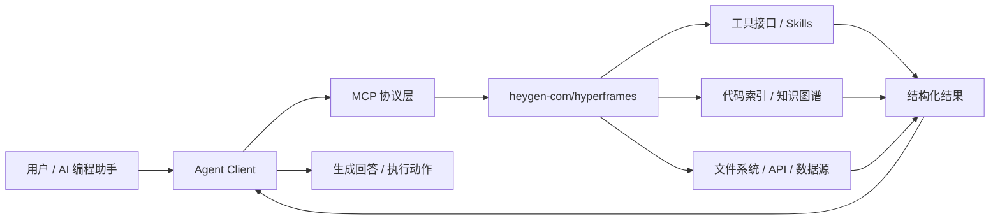
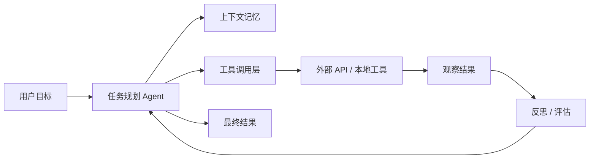
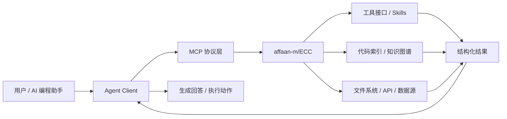
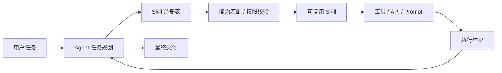

# GitHub AI Daily Trending Top 5

更新时间：2026-09-08T02:49:34Z

筛选范围：仓库名称或描述包含 AI 相关关键词。关键词：ai, agent, agents, agentic, llm, llms, skill, skills, mcp, model context protocol, chatgpt, openai, claude, gemini, copilot, deepseek, rag, embedding, embeddings, transformer, diffusion, machine learning, ml, deep learning, neural, inference, prompt, prompts。

网页版本：由 GitHub Pages 自动发布。

## 1. [heygen-com/hyperframes](https://github.com/heygen-com/hyperframes)

- 语言：TypeScript
- Stars：46,191
- 主题：ai, animation, ffmpeg, framework, gsap, html, mcp, puppeteer, rendering, typescript, video
- Star 趋势：

- 作用 / 解决的问题：Write HTML. Render video. Built for agents.
- 适用场景：
  - 适合快速评估 GitHub AI 热榜中新出现或重新升温的技术方向，因为该仓库已获得短期社区关注。
  - 适合需要把外部工具、代码库、数据源接入 AI Agent 的场景，因为 MCP 能把能力封装成标准工具接口。
  - 适合多步骤自动化、工具调用和复杂任务编排场景，因为 Agent 模式能把规划、执行、观察和修正串起来。
- 架构思想：
  - 它成为热榜的核心原因通常不是单点功能，而是把模型能力、工具、数据和工作流组织成更容易落地的工程结构。
  - 当前 Stars 为 46,191，说明它不只是概念验证，还积累了可观的社区验证和传播势能。
  - 相比只提供单一脚本的仓库，它用 ai, animation, ffmpeg, framework, gsap, html, mcp, puppeteer, rendering, typescript, video 等 topics 明确了能力边界，更容易被目标用户检索和采用。
  - 使用 TypeScript 作为主要实现语言，降低了对应生态开发者集成、扩展和二次开发的成本。
  - 它的稀缺性在于把热门 AI 能力包装成可运行、可组合、可观察的工程入口，而不是停留在论文、提示词或孤立 Demo。
- 原理 / 实现思路：
  - HyperFrames is an open-source framework for turning HTML, CSS, media, and seekable animations into deterministic MP4 videos. Use it locally with the CLI, from AI coding agents with skills, or as the rendering core behind hosted authoring workflows.
  - The picker opens with nothing pre-selected — the Core Skills group is all you need: the /hyperframes router installs each creation workflow on demand. Agents and non-interactive runs should use npx hyperframes skills update instead — it installs exactly the co...
  - skills add resolves the skills.sh registry blob, which can lag main by hours. npx hyperframes skills update installs from the current main, so reach for it when you need the newest copy of a skill.
  - 以上内容由 GitHub 公开 README 自动摘取和归纳，适合作为快速了解入口，深入实现仍以仓库源码和文档为准。

```mermaid
flowchart LR
    User[用户 / AI 编程助手] --> Client[Agent Client]
    Client --> Protocol[MCP 协议层]
    Protocol --> Server[heygen-com/hyperframes]
    Server --> Tools[工具接口 / Skills]
    Server --> Index[代码索引 / 知识图谱]
    Server --> Data[文件系统 / API / 数据源]
    Tools --> Result[结构化结果]
    Index --> Result
    Data --> Result
    Result --> Client
    Client --> Answer[生成回答 / 执行动作]
```

## 2. [mksglu/context-mode](https://github.com/mksglu/context-mode)

- 语言：TypeScript
- Stars：20,915
- 主题：antigravity, claude, claude-code, claude-code-hooks, claude-code-plugins, claude-code-skill, codex, codex-cli, context-mode, copilot, cursor-plugin, kiro, mcp, mcp-server, mcp-tools, openclaw, opencode, pi-agent, skills, zed-extension
- Star 趋势：

- 作用 / 解决的问题：Context window optimization for AI coding agents. Sandboxes tool output (98% reduction), persists session memory, and enforces routing across 17 platforms via MCP + hooks.
- 适用场景：
  - 适合快速评估 GitHub AI 热榜中新出现或重新升温的技术方向，因为该仓库已获得短期社区关注。
  - 适合需要把外部工具、代码库、数据源接入 AI Agent 的场景，因为 MCP 能把能力封装成标准工具接口。
  - 适合多步骤自动化、工具调用和复杂任务编排场景，因为 Agent 模式能把规划、执行、观察和修正串起来。
  - 适合团队沉淀可复用 AI 能力的场景，因为 Skill 把提示词、工具和流程封装成可发现、可组合的单元。
- 架构思想：
  - 它成为热榜的核心原因通常不是单点功能，而是把模型能力、工具、数据和工作流组织成更容易落地的工程结构。
  - 当前 Stars 为 20,915，说明它不只是概念验证，还积累了可观的社区验证和传播势能。
  - 相比只提供单一脚本的仓库，它用 antigravity, claude, claude-code, claude-code-hooks, claude-code-plugins, claude-code-skill, codex, codex-cli, context-mode, copilot, cursor-plugin, kiro, mcp, mcp-server, mcp-tools, openclaw, opencode, pi-agent, skills, zed-extension 等 topics 明确了能力边界，更容易被目标用户检索和采用。
  - 使用 TypeScript 作为主要实现语言，降低了对应生态开发者集成、扩展和二次开发的成本。
  - 它的稀缺性在于把热门 AI 能力包装成可运行、可组合、可观察的工程入口，而不是停留在论文、提示词或孤立 Demo。
- 原理 / 实现思路：
  - Every MCP tool call dumps raw data into your context window. A Playwright snapshot costs 56 KB. Twenty GitHub issues cost 59 KB. One access log — 45 KB. After 30 minutes, 40% of your context is gone. And when the agent compacts the conversation to free space, ...
  - Context Mode is an MCP server that solves all four sides of this problem:
  - 1. Context Saving — Sandbox tools keep raw data out of the context window. 315 KB becomes 5.4 KB. 98% reduction.
  - 以上内容由 GitHub 公开 README 自动摘取和归纳，适合作为快速了解入口，深入实现仍以仓库源码和文档为准。

```mermaid
flowchart LR
    User[用户 / AI 编程助手] --> Client[Agent Client]
    Client --> Protocol[MCP 协议层]
    Protocol --> Server[mksglu/context-mode]
    Server --> Tools[工具接口 / Skills]
    Server --> Index[代码索引 / 知识图谱]
    Server --> Data[文件系统 / API / 数据源]
    Tools --> Result[结构化结果]
    Index --> Result
    Data --> Result
    Result --> Client
    Client --> Answer[生成回答 / 执行动作]
```

## 3. [jo-inc/camofox-browser](https://github.com/jo-inc/camofox-browser)

- 语言：JavaScript
- Stars：9,810
- 主题：ai-agent, anti-bot, antidetect-browser, automation, bot-detection, browser-automation, cloudflare-bypass, headless-browser, javascript, nodejs, playwright, puppeteer, scraping, stealth-browser, web-scraping
- Star 趋势：

- 作用 / 解决的问题：Stealth headless browser for AI agents — bypass Cloudflare, bot detection, and anti-scraping. Drop-in Puppeteer/Playwright replacement.
- 适用场景：
  - 适合快速评估 GitHub AI 热榜中新出现或重新升温的技术方向，因为该仓库已获得短期社区关注。
  - 适合多步骤自动化、工具调用和复杂任务编排场景，因为 Agent 模式能把规划、执行、观察和修正串起来。
- 架构思想：
  - 它成为热榜的核心原因通常不是单点功能，而是把模型能力、工具、数据和工作流组织成更容易落地的工程结构。
  - 当前 Stars 为 9,810，说明它不只是概念验证，还积累了可观的社区验证和传播势能。
  - 相比只提供单一脚本的仓库，它用 ai-agent, anti-bot, antidetect-browser, automation, bot-detection, browser-automation, cloudflare-bypass, headless-browser, javascript, nodejs, playwright, puppeteer, scraping, stealth-browser, web-scraping 等 topics 明确了能力边界，更容易被目标用户检索和采用。
  - 使用 JavaScript 作为主要实现语言，降低了对应生态开发者集成、扩展和二次开发的成本。
  - 它的稀缺性在于把热门 AI 能力包装成可运行、可组合、可观察的工程入口，而不是停留在论文、提示词或孤立 Demo。
- 原理 / 实现思路：
  - AI agents need to browse the real web. Playwright gets blocked. Headless Chrome gets fingerprinted. Stealth plugins become the fingerprint.
  - Camoufox patches Firefox at the C++ implementation level - navigator.hardwareConcurrency, WebGL renderers, AudioContext, screen geometry, WebRTC - all spoofed before JavaScript ever sees them. No shims, no wrappers, no tells.
  - This project wraps that engine in a REST API built for agents: accessibility snapshots instead of bloated HTML, stable element refs for clicking, and search macros for common sites.
  - 以上内容由 GitHub 公开 README 自动摘取和归纳，适合作为快速了解入口，深入实现仍以仓库源码和文档为准。

```mermaid
flowchart LR
    User[用户目标] --> Planner[任务规划 Agent]
    Planner --> Memory[上下文记忆]
    Planner --> Tools[工具调用层]
    Tools --> APIs[外部 API / 本地工具]
    APIs --> Observation[观察结果]
    Observation --> Critic[反思 / 评估]
    Critic --> Planner
    Planner --> Deliverable[最终结果]
```

## 4. [affaan-m/ECC](https://github.com/affaan-m/ECC)

- 语言：JavaScript
- Stars：252,948
- 主题：ai-agents, anthropic, claude, claude-code, developer-tools, llm, mcp, productivity
- Star 趋势：

- 作用 / 解决的问题：The agent harness performance optimization system. Skills, instincts, memory, security, and research-first development for Claude Code, Codex, Opencode, Cursor and beyond.
- 适用场景：
  - 适合快速评估 GitHub AI 热榜中新出现或重新升温的技术方向，因为该仓库已获得短期社区关注。
  - 适合需要把外部工具、代码库、数据源接入 AI Agent 的场景，因为 MCP 能把能力封装成标准工具接口。
  - 适合多步骤自动化、工具调用和复杂任务编排场景，因为 Agent 模式能把规划、执行、观察和修正串起来。
  - 适合团队沉淀可复用 AI 能力的场景，因为 Skill 把提示词、工具和流程封装成可发现、可组合的单元。
- 架构思想：
  - 它成为热榜的核心原因通常不是单点功能，而是把模型能力、工具、数据和工作流组织成更容易落地的工程结构。
  - 当前 Stars 为 252,948，说明它不只是概念验证，还积累了可观的社区验证和传播势能。
  - 相比只提供单一脚本的仓库，它用 ai-agents, anthropic, claude, claude-code, developer-tools, llm, mcp, productivity 等 topics 明确了能力边界，更容易被目标用户检索和采用。
  - 使用 JavaScript 作为主要实现语言，降低了对应生态开发者集成、扩展和二次开发的成本。
  - 它的稀缺性在于把热门 AI 能力包装成可运行、可组合、可观察的工程入口，而不是停留在论文、提示词或孤立 Demo。
- 原理 / 实现思路：
  - Run the canonical guided setup from your terminal:
  - If npm reports a version or cache error, confirm the registry version before retrying:
  - This path requires Node.js 18 or newer, Git, and Claude Code 2.1 or newer on
  - 以上内容由 GitHub 公开 README 自动摘取和归纳，适合作为快速了解入口，深入实现仍以仓库源码和文档为准。

```mermaid
flowchart LR
    User[用户 / AI 编程助手] --> Client[Agent Client]
    Client --> Protocol[MCP 协议层]
    Protocol --> Server[affaan-m/ECC]
    Server --> Tools[工具接口 / Skills]
    Server --> Index[代码索引 / 知识图谱]
    Server --> Data[文件系统 / API / 数据源]
    Tools --> Result[结构化结果]
    Index --> Result
    Data --> Result
    Result --> Client
    Client --> Answer[生成回答 / 执行动作]
```

## 5. [coreyhaines31/marketingskills](https://github.com/coreyhaines31/marketingskills)

- 语言：JavaScript
- Stars：48,204
- 主题：claude, codex, marketing
- Star 趋势：

- 作用 / 解决的问题：Marketing skills for Claude Code and AI agents. CRO, copywriting, SEO, analytics, and growth engineering.
- 适用场景：
  - 适合快速评估 GitHub AI 热榜中新出现或重新升温的技术方向，因为该仓库已获得短期社区关注。
  - 适合多步骤自动化、工具调用和复杂任务编排场景，因为 Agent 模式能把规划、执行、观察和修正串起来。
  - 适合团队沉淀可复用 AI 能力的场景，因为 Skill 把提示词、工具和流程封装成可发现、可组合的单元。
- 架构思想：
  - 它成为热榜的核心原因通常不是单点功能，而是把模型能力、工具、数据和工作流组织成更容易落地的工程结构。
  - 当前 Stars 为 48,204，说明它不只是概念验证，还积累了可观的社区验证和传播势能。
  - 相比只提供单一脚本的仓库，它用 claude, codex, marketing 等 topics 明确了能力边界，更容易被目标用户检索和采用。
  - 使用 JavaScript 作为主要实现语言，降低了对应生态开发者集成、扩展和二次开发的成本。
  - 它的稀缺性在于把热门 AI 能力包装成可运行、可组合、可观察的工程入口，而不是停留在论文、提示词或孤立 Demo。
- 原理 / 实现思路：
  - Contributions welcome! Found a way to improve a skill or have a new one to add? [Open a PR](#contributing).
  - Skills are markdown files that give AI agents specialized knowledge and workflows for specific tasks. When you add these to your project, your agent can recognize when you're working on a marketing task and apply the right frameworks and best practices.
  - Skills reference each other and build on shared context. The product-marketing skill is the foundation — every other skill checks it first to understand your product, audience, and positioning before doing anything.
  - 以上内容由 GitHub 公开 README 自动摘取和归纳，适合作为快速了解入口，深入实现仍以仓库源码和文档为准。

```mermaid
flowchart LR
    User[用户任务] --> Planner[Agent 任务规划]
    Planner --> Registry[Skill 注册表]
    Registry --> Select[能力匹配 / 权限校验]
    Select --> Skill[可复用 Skill]
    Skill --> Tool[工具 / API / Prompt]
    Tool --> Observation[执行结果]
    Observation --> Planner
    Planner --> Output[最终交付]
```

