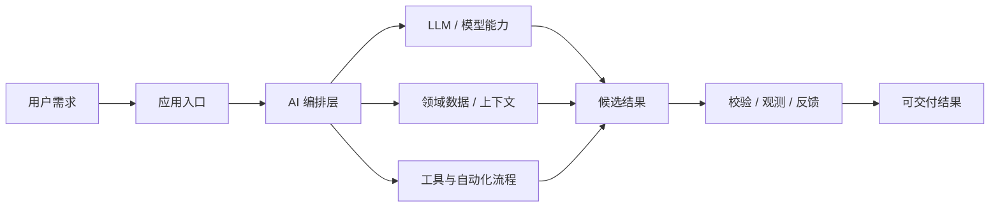
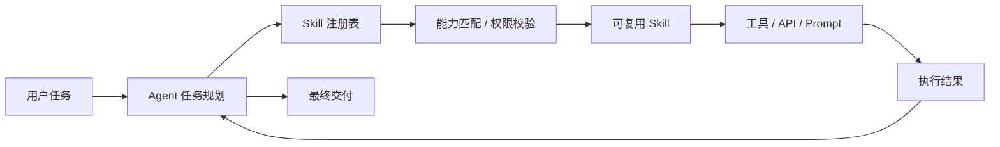

# GitHub AI Daily Trending Top 5

更新时间：2026-08-03T02:25:50Z

筛选范围：仓库名称或描述包含 AI 相关关键词。关键词：ai, agent, agents, agentic, llm, llms, skill, skills, mcp, model context protocol, chatgpt, openai, claude, gemini, copilot, deepseek, rag, embedding, embeddings, transformer, diffusion, machine learning, ml, deep learning, neural, inference, prompt, prompts。

网页版本：由 GitHub Pages 自动发布。

## 1. [microsoft/AI-For-Beginners](https://github.com/microsoft/AI-For-Beginners)

- 语言：Jupyter Notebook
- Stars：59,239
- 主题：ai, artificial-intelligence, cnn, computer-vision, deep-learning, gan, machine-learning, microsoft-for-beginners, nlp, rnn
- Star 趋势：

- 作用 / 解决的问题：12 Weeks, 24 Lessons, AI for All!
- 适用场景：
  - 适合快速评估 GitHub AI 热榜中新出现或重新升温的技术方向，因为该仓库已获得短期社区关注。
  - 适合围绕 ai, artificial-intelligence, cnn, computer-vision, deep-learning, gan, machine-learning, microsoft-for-beginners, nlp, rnn 做技术调研、竞品分析或原型验证，因为仓库主题与当前 AI 热点高度相关。
- 架构思想：
  - 它成为热榜的核心原因通常不是单点功能，而是把模型能力、工具、数据和工作流组织成更容易落地的工程结构。
  - 当前 Stars 为 59,239，说明它不只是概念验证，还积累了可观的社区验证和传播势能。
  - 相比只提供单一脚本的仓库，它用 ai, artificial-intelligence, cnn, computer-vision, deep-learning, gan, machine-learning, microsoft-for-beginners, nlp, rnn 等 topics 明确了能力边界，更容易被目标用户检索和采用。
  - 使用 Jupyter Notebook 作为主要实现语言，降低了对应生态开发者集成、扩展和二次开发的成本。
  - 它的稀缺性在于把热门 AI 能力包装成可运行、可组合、可观察的工程入口，而不是停留在论文、提示词或孤立 Demo。
- 原理 / 实现思路：
  - Artificial Intelligence for Beginners - A Curriculum
  - Explore the world of Artificial Intelligence (AI) with our 12-week, 24-lesson curriculum!  It includes practical lessons, quizzes, and labs. The curriculum is beginner-friendly and covers tools like TensorFlow and PyTorch, as well as ethics in AI
  - Supported via GitHub Action (Automated & Always Up-to-Date)
  - 以上内容由 GitHub 公开 README 自动摘取和归纳，适合作为快速了解入口，深入实现仍以仓库源码和文档为准。

```mermaid
flowchart LR
    User[用户需求] --> Interface[应用入口]
    Interface --> Orchestrator[AI 编排层]
    Orchestrator --> Model[LLM / 模型能力]
    Orchestrator --> Data[领域数据 / 上下文]
    Orchestrator --> Tools[工具与自动化流程]
    Model --> Result[候选结果]
    Data --> Result
    Tools --> Result
    Result --> Review[校验 / 观测 / 反馈]
    Review --> Output[可交付结果]
```

## 2. [lyogavin/airllm](https://github.com/lyogavin/airllm)

- 语言：Jupyter Notebook
- Stars：25,757
- 主题：chinese-llm, chinese-nlp, finetune, generative-ai, instruct-gpt, instruction-set, llama, llm, lora, open-models, open-source, open-source-models, qlora
- Star 趋势：

- 作用 / 解决的问题：AirLLM 70B inference with single 4GB GPU
- 适用场景：
  - 适合快速评估 GitHub AI 热榜中新出现或重新升温的技术方向，因为该仓库已获得短期社区关注。
  - 适合围绕 chinese-llm, chinese-nlp, finetune, generative-ai, instruct-gpt, instruction-set, llama, llm, lora, open-models, open-source, open-source-models, qlora 做技术调研、竞品分析或原型验证，因为仓库主题与当前 AI 热点高度相关。
- 架构思想：
  - 它成为热榜的核心原因通常不是单点功能，而是把模型能力、工具、数据和工作流组织成更容易落地的工程结构。
  - 当前 Stars 为 25,757，说明它不只是概念验证，还积累了可观的社区验证和传播势能。
  - 相比只提供单一脚本的仓库，它用 chinese-llm, chinese-nlp, finetune, generative-ai, instruct-gpt, instruction-set, llama, llm, lora, open-models, open-source, open-source-models, qlora 等 topics 明确了能力边界，更容易被目标用户检索和采用。
  - 使用 Jupyter Notebook 作为主要实现语言，降低了对应生态开发者集成、扩展和二次开发的成本。
  - 它的稀缺性在于把热门 AI 能力包装成可运行、可组合、可观察的工程入口，而不是停留在论文、提示词或孤立 Demo。
- 原理 / 实现思路：
  - AirLLM dramatically reduces inference memory usage, letting 70B large language models run on a single 4GB GPU card — without quantization, distillation, or pruning. You can even run 405B Llama 3.1 on 8GB, DeepSeek-V3 (671B) on ~12GB, and Kimi K3 (2.8T) — the l...
  - [2026/07] Kimi K3 (2.8T) support: the largest open-source model runs on a single card in 3.72GB of VRAM, measured end to end on one RTX 6000 Ada. Per-expert streaming loads only the experts a token actually routes to. K3 brings three requirements of its own: p...
  - [2026/06] v3.0: FP8 model support + the latest models. Run DeepSeek-V3 (671B) on ~12GB and Qwen3-235B on ~3GB, plus Qwen3, Llama 3.x/4, DeepSeek V2/V3, Phi-4, Gemma and more — all through a single AutoModel.
  - 以上内容由 GitHub 公开 README 自动摘取和归纳，适合作为快速了解入口，深入实现仍以仓库源码和文档为准。

```mermaid
flowchart LR
    User[用户需求] --> Interface[应用入口]
    Interface --> Orchestrator[AI 编排层]
    Orchestrator --> Model[LLM / 模型能力]
    Orchestrator --> Data[领域数据 / 上下文]
    Orchestrator --> Tools[工具与自动化流程]
    Model --> Result[候选结果]
    Data --> Result
    Tools --> Result
    Result --> Review[校验 / 观测 / 反馈]
    Review --> Output[可交付结果]
```

## 3. [zhaoxuya520/reverse-skill](https://github.com/zhaoxuya520/reverse-skill)

- 语言：PowerShell
- Stars：13,706
- 主题：未在 GitHub API 中公开 topics
- Star 趋势：

- 作用 / 解决的问题：Reverse Engineering / Authorized Penetration Testing / Security Research Skill Router Pack AI-powered routing + On-demand toolchain bootstrapping + Self-evolving knowledge base Supports Claude Code, Kiro, Cursor, Cline, and other AI coding clients 逆向/渗透/安全技能路由包 - AI 自动路由 + 按需自举工具链 + 自动进化经验库 \| 支持 Claude Code / Kiro / Cursor / Cline 等代码 AI 客户端
- 适用场景：
  - 适合快速评估 GitHub AI 热榜中新出现或重新升温的技术方向，因为该仓库已获得短期社区关注。
  - 适合团队沉淀可复用 AI 能力的场景，因为 Skill 把提示词、工具和流程封装成可发现、可组合的单元。
- 架构思想：
  - 它成为热榜的核心原因通常不是单点功能，而是把模型能力、工具、数据和工作流组织成更容易落地的工程结构。
  - 当前 Stars 为 13,706，说明它不只是概念验证，还积累了可观的社区验证和传播势能。
  - 使用 PowerShell 作为主要实现语言，降低了对应生态开发者集成、扩展和二次开发的成本。
  - 它的稀缺性在于把热门 AI 能力包装成可运行、可组合、可观察的工程入口，而不是停留在论文、提示词或孤立 Demo。
- 原理 / 实现思路：
  - If you are an AI Agent, jump to [README_AI.md](README_AI.md) and follow the instructions strictly.
  - When an AI agent (Claude Code, Codex CLI, Cursor, etc.) encounters an APK, a binary, frontend JS encryption, a CTF challenge, or a pentesting target, this package routes it to the right methodology, checks available tools, and executes a repeatable workflow in...
  - → timeline + Evidence→Finding→Path → report + field-journal
  - 以上内容由 GitHub 公开 README 自动摘取和归纳，适合作为快速了解入口，深入实现仍以仓库源码和文档为准。

```mermaid
flowchart LR
    User[用户任务] --> Planner[Agent 任务规划]
    Planner --> Registry[Skill 注册表]
    Registry --> Select[能力匹配 / 权限校验]
    Select --> Skill[可复用 Skill]
    Skill --> Tool[工具 / API / Prompt]
    Tool --> Observation[执行结果]
    Observation --> Planner
    Planner --> Output[最终交付]
```

## 4. [different-ai/openwork](https://github.com/different-ai/openwork)

- 语言：TypeScript
- Stars：20,372
- 主题：未在 GitHub API 中公开 topics
- Star 趋势：

- 作用 / 解决的问题：The open-source alternative to Claude Cowork (powered by opencode)
- 适用场景：
  - 适合快速评估 GitHub AI 热榜中新出现或重新升温的技术方向，因为该仓库已获得短期社区关注。
  - 适合围绕 未在 GitHub API 中公开 topics 做技术调研、竞品分析或原型验证，因为仓库主题与当前 AI 热点高度相关。
- 架构思想：
  - 它成为热榜的核心原因通常不是单点功能，而是把模型能力、工具、数据和工作流组织成更容易落地的工程结构。
  - 当前 Stars 为 20,372，说明它不只是概念验证，还积累了可观的社区验证和传播势能。
  - 使用 TypeScript 作为主要实现语言，降低了对应生态开发者集成、扩展和二次开发的成本。
  - 它的稀缺性在于把热门 AI 能力包装成可运行、可组合、可观察的工程入口，而不是停留在论文、提示词或孤立 Demo。
- 原理 / 实现思路：
  - OpenWork is a free, open-source desktop app made for sharing AI workflows. It is an open-source alternative to Claude Cowork and Codex for macOS, Windows, and Linux.
  - Add one OpenWork MCP to Codex, Claude Code, Cursor, or another compatible agent and reuse the same skills, MCPs, and connected services across your tools, teammates, and machines. Create something once, share it with coworkers or friends, or keep it for yourse...
  - The desktop app is there when you want a dedicated workspace, but it is not required. You can use OpenWork from the agent you already have. For larger organizations, the admin interface lets you publish capabilities, manage access, and configure shared or per-...
  - 以上内容由 GitHub 公开 README 自动摘取和归纳，适合作为快速了解入口，深入实现仍以仓库源码和文档为准。

```mermaid
flowchart LR
    User[用户需求] --> Interface[应用入口]
    Interface --> Orchestrator[AI 编排层]
    Orchestrator --> Model[LLM / 模型能力]
    Orchestrator --> Data[领域数据 / 上下文]
    Orchestrator --> Tools[工具与自动化流程]
    Model --> Result[候选结果]
    Data --> Result
    Tools --> Result
    Result --> Review[校验 / 观测 / 反馈]
    Review --> Output[可交付结果]
```

## 5. [microsoft/generative-ai-for-beginners](https://github.com/microsoft/generative-ai-for-beginners)

- 语言：Jupyter Notebook
- Stars：114,842
- 主题：ai, azure, chatgpt, dall-e, generative-ai, generativeai, gpt, language-model, llms, microsoft-for-beginners, openai, prompt-engineering, semantic-search, transformers
- Star 趋势：

- 作用 / 解决的问题：21 Lessons, Get Started Building with Generative AI
- 适用场景：
  - 适合快速评估 GitHub AI 热榜中新出现或重新升温的技术方向，因为该仓库已获得短期社区关注。
  - 适合围绕 ai, azure, chatgpt, dall-e, generative-ai, generativeai, gpt, language-model, llms, microsoft-for-beginners, openai, prompt-engineering, semantic-search, transformers 做技术调研、竞品分析或原型验证，因为仓库主题与当前 AI 热点高度相关。
- 架构思想：
  - 它成为热榜的核心原因通常不是单点功能，而是把模型能力、工具、数据和工作流组织成更容易落地的工程结构。
  - 当前 Stars 为 114,842，说明它不只是概念验证，还积累了可观的社区验证和传播势能。
  - 相比只提供单一脚本的仓库，它用 ai, azure, chatgpt, dall-e, generative-ai, generativeai, gpt, language-model, llms, microsoft-for-beginners, openai, prompt-engineering, semantic-search, transformers 等 topics 明确了能力边界，更容易被目标用户检索和采用。
  - 使用 Jupyter Notebook 作为主要实现语言，降低了对应生态开发者集成、扩展和二次开发的成本。
  - 它的稀缺性在于把热门 AI 能力包装成可运行、可组合、可观察的工程入口，而不是停留在论文、提示词或孤立 Demo。
- 原理 / 实现思路：
  - 21 Lessons teaching everything you need to know to start building Generative AI applications
  - Supported via GitHub Action (Automated & Always Up-to-Date)
  - [Arabic](./translations/ar/README.md) \| [Bengali](./translations/bn/README.md) \| [Bulgarian](./translations/bg/README.md) \| [Burmese (Myanmar)](./translations/my/README.md) \| [Chinese (Simplified)](./translations/zh-CN/README.md) \| [Chinese (Traditional, Hong ...
  - 以上内容由 GitHub 公开 README 自动摘取和归纳，适合作为快速了解入口，深入实现仍以仓库源码和文档为准。

```mermaid
flowchart LR
    User[用户需求] --> Interface[应用入口]
    Interface --> Orchestrator[AI 编排层]
    Orchestrator --> Model[LLM / 模型能力]
    Orchestrator --> Data[领域数据 / 上下文]
    Orchestrator --> Tools[工具与自动化流程]
    Model --> Result[候选结果]
    Data --> Result
    Tools --> Result
    Result --> Review[校验 / 观测 / 反馈]
    Review --> Output[可交付结果]
```

