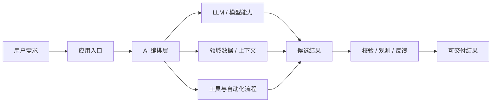
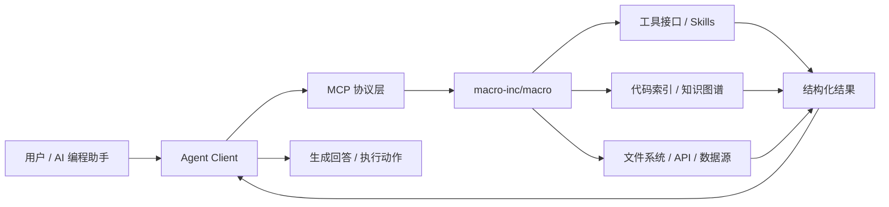
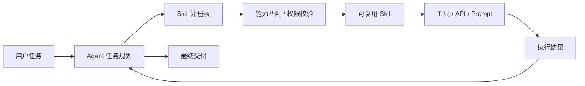
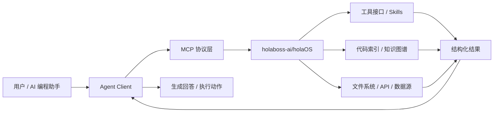

# GitHub AI Daily Trending Top 5

更新时间：2026-08-15T00:59:01Z

筛选范围：仓库名称或描述包含 AI 相关关键词。关键词：ai, agent, agents, agentic, llm, llms, skill, skills, mcp, model context protocol, chatgpt, openai, claude, gemini, copilot, deepseek, rag, embedding, embeddings, transformer, diffusion, machine learning, ml, deep learning, neural, inference, prompt, prompts。

网页版本：由 GitHub Pages 自动发布。

## 1. [cathrynlavery/diagram-design](https://github.com/cathrynlavery/diagram-design)

- 语言：HTML
- Stars：17,258
- 主题：未在 GitHub API 中公开 topics
- Star 趋势：

- 作用 / 解决的问题：29 editorial diagram types for Claude Code. Self-contained HTML + SVG. No shadows, no Mermaid-slop.
- 适用场景：
  - 适合快速评估 GitHub AI 热榜中新出现或重新升温的技术方向，因为该仓库已获得短期社区关注。
  - 适合围绕 未在 GitHub API 中公开 topics 做技术调研、竞品分析或原型验证，因为仓库主题与当前 AI 热点高度相关。
- 架构思想：
  - 它成为热榜的核心原因通常不是单点功能，而是把模型能力、工具、数据和工作流组织成更容易落地的工程结构。
  - 当前 Stars 为 17,258，说明它不只是概念验证，还积累了可观的社区验证和传播势能。
  - 使用 HTML 作为主要实现语言，降低了对应生态开发者集成、扩展和二次开发的成本。
  - 它的稀缺性在于把热门 AI 能力包装成可运行、可组合、可观察的工程入口，而不是停留在论文、提示词或孤立 Demo。
- 原理 / 实现思路：
  - New in 2.0 — the Loop: flywheels with a shared-memory hub. The dashed lines are the write-backs.*
  - New in 2.3: semantic system patterns and optional accessible motion, while static output stays the default.*
  - No Figma. No generic rounded boxes. No 30-minute color-picking sessions.
  - 以上内容由 GitHub 公开 README 自动摘取和归纳，适合作为快速了解入口，深入实现仍以仓库源码和文档为准。

```mermaid
flowchart LR
    User[用户需求] --> Interface[应用入口]
    Interface --> Orchestrator[AI 编排层]
    Orchestrator --> Model[LLM / 模型能力]
    Orchestrator --> Data[领域数据 / 上下文]
    Orchestrator --> Tools[工具与自动化流程]
    Model --> Result[候选结果]
    Data --> Result
    Tools --> Result
    Result --> Review[校验 / 观测 / 反馈]
    Review --> Output[可交付结果]
```

## 2. [macro-inc/macro](https://github.com/macro-inc/macro)

- 语言：Rust
- Stars：3,035
- 主题：agent, ai, ai-agents, all-in-one, crm, crm-system, email, linear, mcp, messaging, notes, notion, office, rust, slack, slack-alternative, startup, startup-tools, typescript, workspace
- Star 趋势：

- 作用 / 解决的问题：Macro is a unified workspace for teams: email, chat, docs, tasks, agents, calls, and CRM — @-linked together with shared AI memory.
- 适用场景：
  - 适合快速评估 GitHub AI 热榜中新出现或重新升温的技术方向，因为该仓库已获得短期社区关注。
  - 适合需要把外部工具、代码库、数据源接入 AI Agent 的场景，因为 MCP 能把能力封装成标准工具接口。
  - 适合多步骤自动化、工具调用和复杂任务编排场景，因为 Agent 模式能把规划、执行、观察和修正串起来。
- 架构思想：
  - 它成为热榜的核心原因通常不是单点功能，而是把模型能力、工具、数据和工作流组织成更容易落地的工程结构。
  - 当前 Stars 为 3,035，说明它不只是概念验证，还积累了可观的社区验证和传播势能。
  - 相比只提供单一脚本的仓库，它用 agent, ai, ai-agents, all-in-one, crm, crm-system, email, linear, mcp, messaging, notes, notion, office, rust, slack, slack-alternative, startup, startup-tools, typescript, workspace 等 topics 明确了能力边界，更容易被目标用户检索和采用。
  - 使用 Rust 作为主要实现语言，降低了对应生态开发者集成、扩展和二次开发的成本。
  - 它的稀缺性在于把热门 AI 能力包装成可运行、可组合、可观察的工程入口，而不是停留在论文、提示词或孤立 Demo。
- 原理 / 实现思路：
  - Macro is the all-in-one workspace for you and your team. It unifies email + messages + docs + tasks + agents + CRM into a single fast interface with shared team-level memory. Everything in your workspace is @linked and searchable so your team (and your agents)...
  - We built Macro because we wanted a single operating system for our startup. There are many good software products, and we used them all — Slack, Linear, Notion, HubSpot, and Superhuman — but they don't work together as one system. As we scaled our last venture...
  - Macro is a complete redesign of work software from the ground up as a single system.
  - 以上内容由 GitHub 公开 README 自动摘取和归纳，适合作为快速了解入口，深入实现仍以仓库源码和文档为准。

```mermaid
flowchart LR
    User[用户 / AI 编程助手] --> Client[Agent Client]
    Client --> Protocol[MCP 协议层]
    Protocol --> Server[macro-inc/macro]
    Server --> Tools[工具接口 / Skills]
    Server --> Index[代码索引 / 知识图谱]
    Server --> Data[文件系统 / API / 数据源]
    Tools --> Result[结构化结果]
    Index --> Result
    Data --> Result
    Result --> Client
    Client --> Answer[生成回答 / 执行动作]
```

## 3. [citrolabs/ego-lite](https://github.com/citrolabs/ego-lite)

- 语言：JavaScript
- Stars：10,366
- 主题：agent-skills, ai-agent, automation, browser, browser-automation, claude-code, codex, hermes-agent, skills, skills-sh
- Star 趋势：

- 作用 / 解决的问题：The fastest browser for AI agents to run browser automation, built for sharing your logged-in browser state with your AI agents, like Codex or Claude Code, without disturbing you. Zero cost, zero config.
- 适用场景：
  - 适合快速评估 GitHub AI 热榜中新出现或重新升温的技术方向，因为该仓库已获得短期社区关注。
  - 适合多步骤自动化、工具调用和复杂任务编排场景，因为 Agent 模式能把规划、执行、观察和修正串起来。
  - 适合团队沉淀可复用 AI 能力的场景，因为 Skill 把提示词、工具和流程封装成可发现、可组合的单元。
- 架构思想：
  - 它成为热榜的核心原因通常不是单点功能，而是把模型能力、工具、数据和工作流组织成更容易落地的工程结构。
  - 当前 Stars 为 10,366，说明它不只是概念验证，还积累了可观的社区验证和传播势能。
  - 相比只提供单一脚本的仓库，它用 agent-skills, ai-agent, automation, browser, browser-automation, claude-code, codex, hermes-agent, skills, skills-sh 等 topics 明确了能力边界，更容易被目标用户检索和采用。
  - 使用 JavaScript 作为主要实现语言，降低了对应生态开发者集成、扩展和二次开发的成本。
  - 它的稀缺性在于把热门 AI 能力包装成可运行、可组合、可观察的工程入口，而不是停留在论文、提示词或孤立 Demo。
- 原理 / 实现思路：
  - The fastest browser for AI agents to run browser automation
  - ego (lite) is a browser where you and your AI agents work in parallel. Your agents run multiple browser tasks in their own Spaces while your tabs stay yours, and tasks complete faster on fewer tokens.
  - Existing tools like browser-use and agent-browser are browser automation frameworks: they need a separate browser to drive, logins never carry cleanly, and you and the agent end up fighting for the same tabs. ego lite is one browser designed from the start for...
  - 以上内容由 GitHub 公开 README 自动摘取和归纳，适合作为快速了解入口，深入实现仍以仓库源码和文档为准。

```mermaid
flowchart LR
    User[用户任务] --> Planner[Agent 任务规划]
    Planner --> Registry[Skill 注册表]
    Registry --> Select[能力匹配 / 权限校验]
    Select --> Skill[可复用 Skill]
    Skill --> Tool[工具 / API / Prompt]
    Tool --> Observation[执行结果]
    Observation --> Planner
    Planner --> Output[最终交付]
```

## 4. [holaboss-ai/holaOS](https://github.com/holaboss-ai/holaOS)

- 语言：TypeScript
- Stars：7,293
- 主题：agent, agent-harness, agent-os, agentic, ai, ai-agent, ai-agents, artificial-intelligence, claude-code, codex, electron, holaboss, holaos, llm, mcp, memory, model-context-protocol, runtime, typescript, workspace
- Star 趋势：

- 作用 / 解决的问题：Open-source All in One AI agent workspace. Run any agent — Claude Code, Codex — across your tools (100+ integrations + MCP), apps, browser, and files, with shared memory. Built-in models or BYOK.
- 适用场景：
  - 适合快速评估 GitHub AI 热榜中新出现或重新升温的技术方向，因为该仓库已获得短期社区关注。
  - 适合需要把外部工具、代码库、数据源接入 AI Agent 的场景，因为 MCP 能把能力封装成标准工具接口。
  - 适合多步骤自动化、工具调用和复杂任务编排场景，因为 Agent 模式能把规划、执行、观察和修正串起来。
- 架构思想：
  - 它成为热榜的核心原因通常不是单点功能，而是把模型能力、工具、数据和工作流组织成更容易落地的工程结构。
  - 当前 Stars 为 7,293，说明它不只是概念验证，还积累了可观的社区验证和传播势能。
  - 相比只提供单一脚本的仓库，它用 agent, agent-harness, agent-os, agentic, ai, ai-agent, ai-agents, artificial-intelligence, claude-code, codex, electron, holaboss, holaos, llm, mcp, memory, model-context-protocol, runtime, typescript, workspace 等 topics 明确了能力边界，更容易被目标用户检索和采用。
  - 使用 TypeScript 作为主要实现语言，降低了对应生态开发者集成、扩展和二次开发的成本。
  - 它的稀缺性在于把热门 AI 能力包装成可运行、可组合、可观察的工程入口，而不是停留在论文、提示词或孤立 Demo。
- 原理 / 实现思路：
  - Run <em>any</em> agent — Claude Code, Codex, or holaOS — in one local-first workspace, over your
  - tools, your files, and one shared memory. Frontier models built in, or
  - Claude Code, Codex, and the built-in holaOS agent — side by side, no switching. Whichever you run, it shares the same memory, tools, skills, and apps. Use the best agent for the job without rebuilding your setup every time.
  - 以上内容由 GitHub 公开 README 自动摘取和归纳，适合作为快速了解入口，深入实现仍以仓库源码和文档为准。

```mermaid
flowchart LR
    User[用户 / AI 编程助手] --> Client[Agent Client]
    Client --> Protocol[MCP 协议层]
    Protocol --> Server[holaboss-ai/holaOS]
    Server --> Tools[工具接口 / Skills]
    Server --> Index[代码索引 / 知识图谱]
    Server --> Data[文件系统 / API / 数据源]
    Tools --> Result[结构化结果]
    Index --> Result
    Data --> Result
    Result --> Client
    Client --> Answer[生成回答 / 执行动作]
```

## 5. [lightningpixel/modly](https://github.com/lightningpixel/modly)

- 语言：TypeScript
- Stars：5,939
- 主题：3d, ai-local, ai-tools, desktop-app, modly, open-source, self-hosted
- Star 趋势：

- 作用 / 解决的问题：Desktop app to generate 3D models from images or prompt using local AI — runs entirely on your GPU
- 适用场景：
  - 适合快速评估 GitHub AI 热榜中新出现或重新升温的技术方向，因为该仓库已获得短期社区关注。
  - 适合围绕 3d, ai-local, ai-tools, desktop-app, modly, open-source, self-hosted 做技术调研、竞品分析或原型验证，因为仓库主题与当前 AI 热点高度相关。
- 架构思想：
  - 它成为热榜的核心原因通常不是单点功能，而是把模型能力、工具、数据和工作流组织成更容易落地的工程结构。
  - 当前 Stars 为 5,939，说明它不只是概念验证，还积累了可观的社区验证和传播势能。
  - 相比只提供单一脚本的仓库，它用 3d, ai-local, ai-tools, desktop-app, modly, open-source, self-hosted 等 topics 明确了能力边界，更容易被目标用户检索和采用。
  - 使用 TypeScript 作为主要实现语言，降低了对应生态开发者集成、扩展和二次开发的成本。
  - 它的稀缺性在于把热门 AI 能力包装成可运行、可组合、可观察的工程入口，而不是停留在论文、提示词或孤立 Demo。
- 原理 / 实现思路：
  - Local, open source, AI-powered image-to-3D mesh generation.
  - Turn any photo into a 3D model using open source AI models running entirely on your GPU.
  - Modly is a desktop application for Windows, Linux, and Apple Silicon macOS.
  - 以上内容由 GitHub 公开 README 自动摘取和归纳，适合作为快速了解入口，深入实现仍以仓库源码和文档为准。

```mermaid
flowchart LR
    User[用户需求] --> Interface[应用入口]
    Interface --> Orchestrator[AI 编排层]
    Orchestrator --> Model[LLM / 模型能力]
    Orchestrator --> Data[领域数据 / 上下文]
    Orchestrator --> Tools[工具与自动化流程]
    Model --> Result[候选结果]
    Data --> Result
    Tools --> Result
    Result --> Review[校验 / 观测 / 反馈]
    Review --> Output[可交付结果]
```

