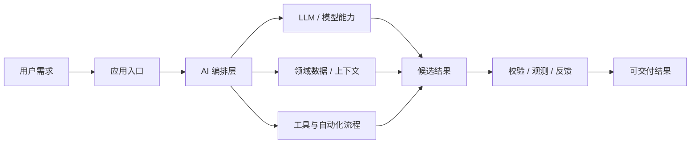
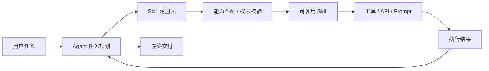
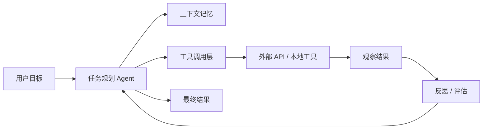

# GitHub AI Daily Trending Top 5

更新时间：2026-08-14T01:29:36Z

筛选范围：仓库名称或描述包含 AI 相关关键词。关键词：ai, agent, agents, agentic, llm, llms, skill, skills, mcp, model context protocol, chatgpt, openai, claude, gemini, copilot, deepseek, rag, embedding, embeddings, transformer, diffusion, machine learning, ml, deep learning, neural, inference, prompt, prompts。

网页版本：由 GitHub Pages 自动发布。

## 1. [cathrynlavery/diagram-design](https://github.com/cathrynlavery/diagram-design)

- 语言：HTML
- Stars：14,630
- 主题：未在 GitHub API 中公开 topics
- Star 趋势：

- 作用 / 解决的问题：29 editorial diagram types for Claude Code. Self-contained HTML + SVG. No shadows, no Mermaid-slop.
- 适用场景：
  - 适合快速评估 GitHub AI 热榜中新出现或重新升温的技术方向，因为该仓库已获得短期社区关注。
  - 适合围绕 未在 GitHub API 中公开 topics 做技术调研、竞品分析或原型验证，因为仓库主题与当前 AI 热点高度相关。
- 架构思想：
  - 它成为热榜的核心原因通常不是单点功能，而是把模型能力、工具、数据和工作流组织成更容易落地的工程结构。
  - 当前 Stars 为 14,630，说明它不只是概念验证，还积累了可观的社区验证和传播势能。
  - 使用 HTML 作为主要实现语言，降低了对应生态开发者集成、扩展和二次开发的成本。
  - 它的稀缺性在于把热门 AI 能力包装成可运行、可组合、可观察的工程入口，而不是停留在论文、提示词或孤立 Demo。
- 原理 / 实现思路：
  - New in 2.0 — the Loop: flywheels with a shared-memory hub. The dashed lines are the write-backs.*
  - New in 2.3: semantic system patterns and optional accessible motion, while static output stays the default.*
  - No Figma. No generic rounded boxes. No 30-minute color-picking sessions.
  - 以上内容由 GitHub 公开 README 自动摘取和归纳，适合作为快速了解入口，深入实现仍以仓库源码和文档为准。

```mermaid
flowchart LR
    User[用户需求] --> Interface[应用入口]
    Interface --> Orchestrator[AI 编排层]
    Orchestrator --> Model[LLM / 模型能力]
    Orchestrator --> Data[领域数据 / 上下文]
    Orchestrator --> Tools[工具与自动化流程]
    Model --> Result[候选结果]
    Data --> Result
    Tools --> Result
    Result --> Review[校验 / 观测 / 反馈]
    Review --> Output[可交付结果]
```

## 2. [semantica-agi/semantica](https://github.com/semantica-agi/semantica)

- 语言：Python
- Stars：6,694
- 主题：agent-memory, ai, ai-governance, ai-infrastructure, artificial-intelligence, context-engineering, context-graphs, data-engineering, decision-intelligence, developer-tools, explainable-ai, generative-ai, graph-rag, knowledge-graph, llm, ontology, provenance, python, reasoning, semantic-search
- Star 趋势：

- 作用 / 解决的问题：Graph-Native Infrastructure for Context and Accountable AI Systems
- 适用场景：
  - 适合快速评估 GitHub AI 热榜中新出现或重新升温的技术方向，因为该仓库已获得短期社区关注。
  - 适合围绕 agent-memory, ai, ai-governance, ai-infrastructure, artificial-intelligence, context-engineering, context-graphs, data-engineering, decision-intelligence, developer-tools, explainable-ai, generative-ai, graph-rag, knowledge-graph, llm, ontology, provenance, python, reasoning, semantic-search 做技术调研、竞品分析或原型验证，因为仓库主题与当前 AI 热点高度相关。
- 架构思想：
  - 它成为热榜的核心原因通常不是单点功能，而是把模型能力、工具、数据和工作流组织成更容易落地的工程结构。
  - 当前 Stars 为 6,694，说明它不只是概念验证，还积累了可观的社区验证和传播势能。
  - 相比只提供单一脚本的仓库，它用 agent-memory, ai, ai-governance, ai-infrastructure, artificial-intelligence, context-engineering, context-graphs, data-engineering, decision-intelligence, developer-tools, explainable-ai, generative-ai, graph-rag, knowledge-graph, llm, ontology, provenance, python, reasoning, semantic-search 等 topics 明确了能力边界，更容易被目标用户检索和采用。
  - 使用 Python 作为主要实现语言，降低了对应生态开发者集成、扩展和二次开发的成本。
  - 它的稀缺性在于把热门 AI 能力包装成可运行、可组合、可观察的工程入口，而不是停留在论文、提示词或孤立 Demo。
- 原理 / 实现思路：
  - Graph-Native Infrastructure for Context and Accountable AI Systems
  - Ingest your enterprise data, extract what matters, build a Context Graph and knowledge graph (KG), and run graph analytics and causal reasoning over all of it, with full decision provenance baked in. Explainable, traceable, and trustworthy by design.
  - alt="Semantica Knowledge Explorer: live graph, decisions, entity resolution, ontology hub"
  - 以上内容由 GitHub 公开 README 自动摘取和归纳，适合作为快速了解入口，深入实现仍以仓库源码和文档为准。

```mermaid
flowchart LR
    User[用户需求] --> Interface[应用入口]
    Interface --> Orchestrator[AI 编排层]
    Orchestrator --> Model[LLM / 模型能力]
    Orchestrator --> Data[领域数据 / 上下文]
    Orchestrator --> Tools[工具与自动化流程]
    Model --> Result[候选结果]
    Data --> Result
    Tools --> Result
    Result --> Review[校验 / 观测 / 反馈]
    Review --> Output[可交付结果]
```

## 3. [anthropics/skills](https://github.com/anthropics/skills)

- 语言：Python
- Stars：169,046
- 主题：agent-skills
- Star 趋势：

- 作用 / 解决的问题：Public repository for Agent Skills
- 适用场景：
  - 适合快速评估 GitHub AI 热榜中新出现或重新升温的技术方向，因为该仓库已获得短期社区关注。
  - 适合多步骤自动化、工具调用和复杂任务编排场景，因为 Agent 模式能把规划、执行、观察和修正串起来。
  - 适合团队沉淀可复用 AI 能力的场景，因为 Skill 把提示词、工具和流程封装成可发现、可组合的单元。
- 架构思想：
  - 它成为热榜的核心原因通常不是单点功能，而是把模型能力、工具、数据和工作流组织成更容易落地的工程结构。
  - 当前 Stars 为 169,046，说明它不只是概念验证，还积累了可观的社区验证和传播势能。
  - 相比只提供单一脚本的仓库，它用 agent-skills 等 topics 明确了能力边界，更容易被目标用户检索和采用。
  - 使用 Python 作为主要实现语言，降低了对应生态开发者集成、扩展和二次开发的成本。
  - 它的稀缺性在于把热门 AI 能力包装成可运行、可组合、可观察的工程入口，而不是停留在论文、提示词或孤立 Demo。
- 原理 / 实现思路：
  - Skills are folders of instructions, scripts, and resources that Claude loads dynamically to improve performance on specialized tasks. Skills teach Claude how to complete specific tasks in a repeatable way, whether that's creating documents with your company's ...
  - This repository contains skills that demonstrate what's possible with Claude's skills system. These skills range from creative applications (art, music, design) to technical tasks (testing web apps, MCP server generation) to enterprise workflows (communication...
  - Each skill is self-contained in its own folder with a SKILL.md file containing the instructions and metadata that Claude uses. Browse through these skills to get inspiration for your own skills or to understand different patterns and approaches.
  - 以上内容由 GitHub 公开 README 自动摘取和归纳，适合作为快速了解入口，深入实现仍以仓库源码和文档为准。

```mermaid
flowchart LR
    User[用户任务] --> Planner[Agent 任务规划]
    Planner --> Registry[Skill 注册表]
    Registry --> Select[能力匹配 / 权限校验]
    Select --> Skill[可复用 Skill]
    Skill --> Tool[工具 / API / Prompt]
    Tool --> Observation[执行结果]
    Observation --> Planner
    Planner --> Output[最终交付]
```

## 4. [altic-dev/FluidVoice](https://github.com/altic-dev/FluidVoice)

- 语言：Swift
- Stars：9,864
- 主题：ai, dictation, ios, llama-cpp, macos, swift
- Star 趋势：

- 作用 / 解决的问题：Fastest and only macOS Dictation app with on-device STT and custom trained AI enhancement model. A local Wispr Flow alternative. ⭐ helps a ton :) Windows & iOS waitlist open. Linux soon.
- 适用场景：
  - 适合快速评估 GitHub AI 热榜中新出现或重新升温的技术方向，因为该仓库已获得短期社区关注。
  - 适合围绕 ai, dictation, ios, llama-cpp, macos, swift 做技术调研、竞品分析或原型验证，因为仓库主题与当前 AI 热点高度相关。
- 架构思想：
  - 它成为热榜的核心原因通常不是单点功能，而是把模型能力、工具、数据和工作流组织成更容易落地的工程结构。
  - 当前 Stars 为 9,864，说明它不只是概念验证，还积累了可观的社区验证和传播势能。
  - 相比只提供单一脚本的仓库，它用 ai, dictation, ios, llama-cpp, macos, swift 等 topics 明确了能力边界，更容易被目标用户检索和采用。
  - 使用 Swift 作为主要实现语言，降低了对应生态开发者集成、扩展和二次开发的成本。
  - 它的稀缺性在于把热门 AI 能力包装成可运行、可组合、可观察的工程入口，而不是停留在论文、提示词或孤立 Demo。
- 原理 / 实现思路：
  - Open source voice-to-text dictation app for macOS with on-device AI enhancement.
  - This project is free and open source under GPLv3. If FluidVoice is useful to you, please star the repository — it helps visibility and keeps development going.
  - Insanely fast Parakeet — rebuilt Parakeet implementation with pretty much zero delay between speaking and seeing words on screen
  - 以上内容由 GitHub 公开 README 自动摘取和归纳，适合作为快速了解入口，深入实现仍以仓库源码和文档为准。

```mermaid
flowchart LR
    User[用户需求] --> Interface[应用入口]
    Interface --> Orchestrator[AI 编排层]
    Orchestrator --> Model[LLM / 模型能力]
    Orchestrator --> Data[领域数据 / 上下文]
    Orchestrator --> Tools[工具与自动化流程]
    Model --> Result[候选结果]
    Data --> Result
    Tools --> Result
    Result --> Review[校验 / 观测 / 反馈]
    Review --> Output[可交付结果]
```

## 5. [unslothai/unsloth](https://github.com/unslothai/unsloth)

- 语言：Python
- Stars：71,071
- 主题：agent, chatgpt, deepseek, fine-tuning, gemma, gemma3, gpt-oss, image-generation, llama, llm, llms, openai, qwen, reinforcement-learning, self-hosted, stable-diffusion, text-to-speech, tts, ui, unsloth
- Star 趋势：

- 作用 / 解决的问题：Local UI to run and train LLMs and diffusion models, including Qwen3.8, Kimi K3, MiniMax-H3, Gemma 4, DeepSeek-V4, FLUX and more.
- 适用场景：
  - 适合快速评估 GitHub AI 热榜中新出现或重新升温的技术方向，因为该仓库已获得短期社区关注。
  - 适合多步骤自动化、工具调用和复杂任务编排场景，因为 Agent 模式能把规划、执行、观察和修正串起来。
- 架构思想：
  - 它成为热榜的核心原因通常不是单点功能，而是把模型能力、工具、数据和工作流组织成更容易落地的工程结构。
  - 当前 Stars 为 71,071，说明它不只是概念验证，还积累了可观的社区验证和传播势能。
  - 相比只提供单一脚本的仓库，它用 agent, chatgpt, deepseek, fine-tuning, gemma, gemma3, gpt-oss, image-generation, llama, llm, llms, openai, qwen, reinforcement-learning, self-hosted, stable-diffusion, text-to-speech, tts, ui, unsloth 等 topics 明确了能力边界，更容易被目标用户检索和采用。
  - 使用 Python 作为主要实现语言，降低了对应生态开发者集成、扩展和二次开发的成本。
  - 它的稀缺性在于把热门 AI 能力包装成可运行、可组合、可观察的工程入口，而不是停留在论文、提示词或孤立 Demo。
- 原理 / 实现思路：
  - Unsloth is the first desktop app to run and train models.
  - Download the native Unsloth Desktop app for your operating system:
  - Unsloth lets you run, train, and deploy AI models locally, with support for all types of models.
  - 以上内容由 GitHub 公开 README 自动摘取和归纳，适合作为快速了解入口，深入实现仍以仓库源码和文档为准。

```mermaid
flowchart LR
    User[用户目标] --> Planner[任务规划 Agent]
    Planner --> Memory[上下文记忆]
    Planner --> Tools[工具调用层]
    Tools --> APIs[外部 API / 本地工具]
    APIs --> Observation[观察结果]
    Observation --> Critic[反思 / 评估]
    Critic --> Planner
    Planner --> Deliverable[最终结果]
```

