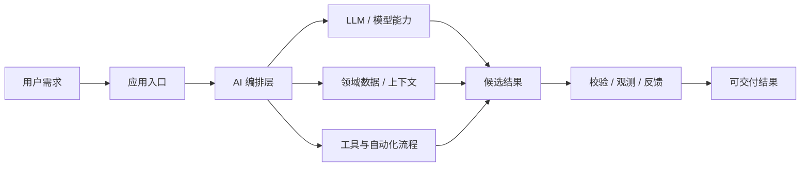
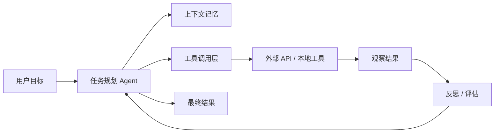

# GitHub AI Daily Trending Top 5

更新时间：2026-08-25T01:00:41Z

筛选范围：仓库名称或描述包含 AI 相关关键词。关键词：ai, agent, agents, agentic, llm, llms, skill, skills, mcp, model context protocol, chatgpt, openai, claude, gemini, copilot, deepseek, rag, embedding, embeddings, transformer, diffusion, machine learning, ml, deep learning, neural, inference, prompt, prompts。

网页版本：由 GitHub Pages 自动发布。

## 1. [Alishahryar1/free-claude-code](https://github.com/Alishahryar1/free-claude-code)

- 语言：Python
- Stars：48,979
- 主题：未在 GitHub API 中公开 topics
- Star 趋势：

- 作用 / 解决的问题：Use Claude Code, Codex, Pi, and OpenCode for free (1.3B+ free tokens) from your terminal, app, IDE, or phone like OpenClaw (voice supported + ToS friendly)
- 适用场景：
  - 适合快速评估 GitHub AI 热榜中新出现或重新升温的技术方向，因为该仓库已获得短期社区关注。
  - 适合围绕 未在 GitHub API 中公开 topics 做技术调研、竞品分析或原型验证，因为仓库主题与当前 AI 热点高度相关。
- 架构思想：
  - 它成为热榜的核心原因通常不是单点功能，而是把模型能力、工具、数据和工作流组织成更容易落地的工程结构。
  - 当前 Stars 为 48,979，说明它不只是概念验证，还积累了可观的社区验证和传播势能。
  - 使用 Python 作为主要实现语言，降低了对应生态开发者集成、扩展和二次开发的成本。
  - 它的稀缺性在于把热门 AI 能力包装成可运行、可组合、可观察的工程入口，而不是停留在论文、提示词或孤立 Demo。
- 原理 / 实现思路：
  - [Quick Start](#quick-start) · [Providers](#choose-a-provider) · [Clients](#connect-your-client) · [Integrations](#optional-integrations) · [Manage](#manage-your-installation)
  - 50 ToS-friendly providers. 1.3B+ free tokens every month. Use free, paid, subscription, and local models from one searchable UI without putting your account at risk. FCC follows provider terms and removes integrations if they stop being allowed.
  - Keep coding through provider outages. After retries are exhausted, FCC automatically tries your next configured model without making you restart the turn—across every client.
  - 以上内容由 GitHub 公开 README 自动摘取和归纳，适合作为快速了解入口，深入实现仍以仓库源码和文档为准。

```mermaid
flowchart LR
    User[用户需求] --> Interface[应用入口]
    Interface --> Orchestrator[AI 编排层]
    Orchestrator --> Model[LLM / 模型能力]
    Orchestrator --> Data[领域数据 / 上下文]
    Orchestrator --> Tools[工具与自动化流程]
    Model --> Result[候选结果]
    Data --> Result
    Tools --> Result
    Result --> Review[校验 / 观测 / 反馈]
    Review --> Output[可交付结果]
```

## 2. [openai/codex](https://github.com/openai/codex)

- 语言：Rust
- Stars：117,048
- 主题：未在 GitHub API 中公开 topics
- Star 趋势：

- 作用 / 解决的问题：Lightweight coding agent that runs in your terminal
- 适用场景：
  - 适合快速评估 GitHub AI 热榜中新出现或重新升温的技术方向，因为该仓库已获得短期社区关注。
  - 适合多步骤自动化、工具调用和复杂任务编排场景，因为 Agent 模式能把规划、执行、观察和修正串起来。
- 架构思想：
  - 它成为热榜的核心原因通常不是单点功能，而是把模型能力、工具、数据和工作流组织成更容易落地的工程结构。
  - 当前 Stars 为 117,048，说明它不只是概念验证，还积累了可观的社区验证和传播势能。
  - 使用 Rust 作为主要实现语言，降低了对应生态开发者集成、扩展和二次开发的成本。
  - 它的稀缺性在于把热门 AI 能力包装成可运行、可组合、可观察的工程入口，而不是停留在论文、提示词或孤立 Demo。
- 原理 / 实现思路：
  - Run the following on Mac or Linux to install Codex CLI:
  - Run the following on Windows to install Codex CLI:
  - Codex CLI can also be installed via the following package managers:
  - 以上内容由 GitHub 公开 README 自动摘取和归纳，适合作为快速了解入口，深入实现仍以仓库源码和文档为准。

```mermaid
flowchart LR
    User[用户目标] --> Planner[任务规划 Agent]
    Planner --> Memory[上下文记忆]
    Planner --> Tools[工具调用层]
    Tools --> APIs[外部 API / 本地工具]
    APIs --> Observation[观察结果]
    Observation --> Critic[反思 / 评估]
    Critic --> Planner
    Planner --> Deliverable[最终结果]
```

## 3. [MadsLorentzen/ai-job-search](https://github.com/MadsLorentzen/ai-job-search)

- 语言：Python
- Stars：34,074
- 主题：ai, ai-agents, career, claude-code, cover-letter, cv, interview-preparation, job-application, job-hunting, job-search, latex, resume
- Star 趋势：

- 作用 / 解决的问题：The job search that runs on your machine. AI job application framework built on Claude Code: evaluate postings, tailor CVs, write cover letters, prep interviews. Fork it and own it.
- 适用场景：
  - 适合快速评估 GitHub AI 热榜中新出现或重新升温的技术方向，因为该仓库已获得短期社区关注。
  - 适合围绕 ai, ai-agents, career, claude-code, cover-letter, cv, interview-preparation, job-application, job-hunting, job-search, latex, resume 做技术调研、竞品分析或原型验证，因为仓库主题与当前 AI 热点高度相关。
- 架构思想：
  - 它成为热榜的核心原因通常不是单点功能，而是把模型能力、工具、数据和工作流组织成更容易落地的工程结构。
  - 当前 Stars 为 34,074，说明它不只是概念验证，还积累了可观的社区验证和传播势能。
  - 相比只提供单一脚本的仓库，它用 ai, ai-agents, career, claude-code, cover-letter, cv, interview-preparation, job-application, job-hunting, job-search, latex, resume 等 topics 明确了能力边界，更容易被目标用户检索和采用。
  - 使用 Python 作为主要实现语言，降低了对应生态开发者集成、扩展和二次开发的成本。
  - 它的稀缺性在于把热门 AI 能力包装成可运行、可组合、可观察的工程入口，而不是停留在论文、提示词或孤立 Demo。
- 原理 / 实现思路：
  - Note: This is an independent open-source project and is not affiliated with, endorsed by, sponsored by, or maintained by Anthropic. Anthropic and Claude Code are referenced only to describe the toolchain this workflow uses.
  - This project has no affiliated cryptocurrency, token, or paid sponsorship program. Anything claiming otherwise is unauthorized and should be treated as a scam. The only ways to support the project are the Ko-fi link below and contributing on GitHub.
  - I'm a geophysicist by training. When my position was cut in late 2025, I built this framework to run my own job search - the same /scrape, /apply, and /interview workflow in this repo, used weekly, on my own career. I was upfront about it with every employer I...
  - 以上内容由 GitHub 公开 README 自动摘取和归纳，适合作为快速了解入口，深入实现仍以仓库源码和文档为准。

```mermaid
flowchart LR
    User[用户需求] --> Interface[应用入口]
    Interface --> Orchestrator[AI 编排层]
    Orchestrator --> Model[LLM / 模型能力]
    Orchestrator --> Data[领域数据 / 上下文]
    Orchestrator --> Tools[工具与自动化流程]
    Model --> Result[候选结果]
    Data --> Result
    Tools --> Result
    Result --> Review[校验 / 观测 / 反馈]
    Review --> Output[可交付结果]
```

## 4. [multica-ai/andrej-karpathy-skills](https://github.com/multica-ai/andrej-karpathy-skills)

- 语言：-
- Stars：206,515
- 主题：未在 GitHub API 中公开 topics
- Star 趋势：

- 作用 / 解决的问题：A single CLAUDE.md file to improve Claude Code behavior, derived from Andrej Karpathy's observations on LLM coding pitfalls.
- 适用场景：
  - 适合快速评估 GitHub AI 热榜中新出现或重新升温的技术方向，因为该仓库已获得短期社区关注。
  - 适合围绕 未在 GitHub API 中公开 topics 做技术调研、竞品分析或原型验证，因为仓库主题与当前 AI 热点高度相关。
- 架构思想：
  - 它成为热榜的核心原因通常不是单点功能，而是把模型能力、工具、数据和工作流组织成更容易落地的工程结构。
  - 当前 Stars 为 206,515，说明它不只是概念验证，还积累了可观的社区验证和传播势能。
  - 它的稀缺性在于把热门 AI 能力包装成可运行、可组合、可观察的工程入口，而不是停留在论文、提示词或孤立 Demo。
- 原理 / 实现思路：
  - "The models make wrong assumptions on your behalf and just run along with them without checking. They don't manage their confusion, don't seek clarifications, don't surface inconsistencies, don't present tradeoffs, don't push back when they should."
  - "They really like to overcomplicate code and APIs, bloat abstractions, don't clean up dead code... implement a bloated construction over 1000 lines when 100 would do."
  - "They still sometimes change/remove comments and code they don't sufficiently understand as side effects, even if orthogonal to the task."
  - 以上内容由 GitHub 公开 README 自动摘取和归纳，适合作为快速了解入口，深入实现仍以仓库源码和文档为准。

```mermaid
flowchart LR
    User[用户需求] --> Interface[应用入口]
    Interface --> Orchestrator[AI 编排层]
    Orchestrator --> Model[LLM / 模型能力]
    Orchestrator --> Data[领域数据 / 上下文]
    Orchestrator --> Tools[工具与自动化流程]
    Model --> Result[候选结果]
    Data --> Result
    Tools --> Result
    Result --> Review[校验 / 观测 / 反馈]
    Review --> Output[可交付结果]
```

## 5. [NousResearch/hermes-agent](https://github.com/NousResearch/hermes-agent)

- 语言：Python
- Stars：235,806
- 主题：ai, ai-agent, ai-agents, anthropic, chatgpt, claude, claude-code, codex, hermes, hermes-agent, llm, nous-research, openai
- Star 趋势：

- 作用 / 解决的问题：The agent that grows with you
- 适用场景：
  - 适合快速评估 GitHub AI 热榜中新出现或重新升温的技术方向，因为该仓库已获得短期社区关注。
  - 适合多步骤自动化、工具调用和复杂任务编排场景，因为 Agent 模式能把规划、执行、观察和修正串起来。
- 架构思想：
  - 它成为热榜的核心原因通常不是单点功能，而是把模型能力、工具、数据和工作流组织成更容易落地的工程结构。
  - 当前 Stars 为 235,806，说明它不只是概念验证，还积累了可观的社区验证和传播势能。
  - 相比只提供单一脚本的仓库，它用 ai, ai-agent, ai-agents, anthropic, chatgpt, claude, claude-code, codex, hermes, hermes-agent, llm, nous-research, openai 等 topics 明确了能力边界，更容易被目标用户检索和采用。
  - 使用 Python 作为主要实现语言，降低了对应生态开发者集成、扩展和二次开发的成本。
  - 它的稀缺性在于把热门 AI 能力包装成可运行、可组合、可观察的工程入口，而不是停留在论文、提示词或孤立 Demo。
- 原理 / 实现思路：
  - The installer handles everything: uv, Python 3.11, Node.js, ripgrep, ffmpeg, and a portable Git Bash (MinGit, unpacked to %LOCALAPPDATA%\hermes\git — no admin required, completely isolated from any system Git install). Hermes uses this bundled Git Bash to run ...
  - If you already have Git installed, the installer detects it and uses that instead. Otherwise a ~45MB MinGit download is all you need — it won't touch or interfere with any system Git.
  - source ~/.bashrc    # reload shell (or: source ~/.zshrc)
  - 以上内容由 GitHub 公开 README 自动摘取和归纳，适合作为快速了解入口，深入实现仍以仓库源码和文档为准。

```mermaid
flowchart LR
    User[用户目标] --> Planner[任务规划 Agent]
    Planner --> Memory[上下文记忆]
    Planner --> Tools[工具调用层]
    Tools --> APIs[外部 API / 本地工具]
    APIs --> Observation[观察结果]
    Observation --> Critic[反思 / 评估]
    Critic --> Planner
    Planner --> Deliverable[最终结果]
```

