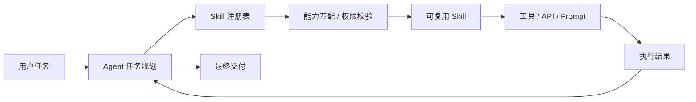
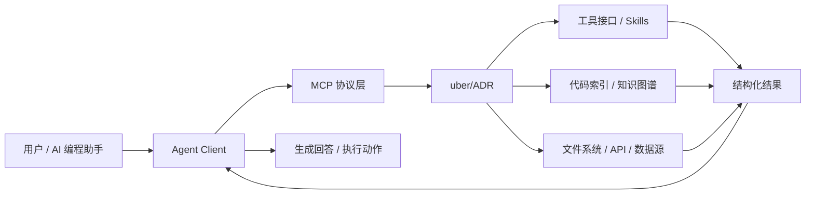
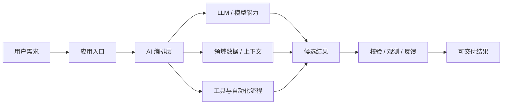

# GitHub AI Daily Trending Top 5

更新时间：2026-08-05T02:04:58Z

筛选范围：仓库名称或描述包含 AI 相关关键词。关键词：ai, agent, agents, agentic, llm, llms, skill, skills, mcp, model context protocol, chatgpt, openai, claude, gemini, copilot, deepseek, rag, embedding, embeddings, transformer, diffusion, machine learning, ml, deep learning, neural, inference, prompt, prompts。

网页版本：由 GitHub Pages 自动发布。

## 1. [TencentCloud/TencentDB-Agent-Memory](https://github.com/TencentCloud/TencentDB-Agent-Memory)

- 语言：TypeScript
- Stars：13,734
- 主题：agent, ai-agent, embedding, llm, local-first, long-term-memory, memory, openclaw-plugin, vector-search
- Star 趋势：

- 作用 / 解决的问题：TencentDB Agent Memory is a team-level memory hub for AI Agents — turning conversations, docs, and code into four reusable memory assets (Chat Memory, Skill, LLM-Wiki, Code-Graph) that are governed, shared, and equipped across agents and frameworks.
- 适用场景：
  - 适合快速评估 GitHub AI 热榜中新出现或重新升温的技术方向，因为该仓库已获得短期社区关注。
  - 适合多步骤自动化、工具调用和复杂任务编排场景，因为 Agent 模式能把规划、执行、观察和修正串起来。
  - 适合团队沉淀可复用 AI 能力的场景，因为 Skill 把提示词、工具和流程封装成可发现、可组合的单元。
- 架构思想：
  - 它成为热榜的核心原因通常不是单点功能，而是把模型能力、工具、数据和工作流组织成更容易落地的工程结构。
  - 当前 Stars 为 13,734，说明它不只是概念验证，还积累了可观的社区验证和传播势能。
  - 相比只提供单一脚本的仓库，它用 agent, ai-agent, embedding, llm, local-first, long-term-memory, memory, openclaw-plugin, vector-search 等 topics 明确了能力边界，更容易被目标用户检索和采用。
  - 使用 TypeScript 作为主要实现语言，降低了对应生态开发者集成、扩展和二次开发的成本。
  - 它的稀缺性在于把热门 AI 能力包装成可运行、可组合、可观察的工程入口，而不是停留在论文、提示词或孤立 Demo。
- 原理 / 实现思路：
  - [Installation](#installation) · [What is it?](#what-is-tencentdb-agent-memory) · [Team Play](#one-play-style-build-a-growing-agent-team-for-a-one-person-company) · [Technical Implementation](#technical-implementation) · [Benchmark](#benchmark)
  - [English](./README.md) · [简体中文](./README_CN.md)
  - Latest: Team Memory Beta is evolving quickly — install it and start exploring in minutes.
  - 以上内容由 GitHub 公开 README 自动摘取和归纳，适合作为快速了解入口，深入实现仍以仓库源码和文档为准。

```mermaid
flowchart LR
    User[用户任务] --> Planner[Agent 任务规划]
    Planner --> Registry[Skill 注册表]
    Registry --> Select[能力匹配 / 权限校验]
    Select --> Skill[可复用 Skill]
    Skill --> Tool[工具 / API / Prompt]
    Tool --> Observation[执行结果]
    Observation --> Planner
    Planner --> Output[最终交付]
```

## 2. [zhaoxuya520/reverse-skill](https://github.com/zhaoxuya520/reverse-skill)

- 语言：PowerShell
- Stars：17,985
- 主题：未在 GitHub API 中公开 topics
- Star 趋势：

- 作用 / 解决的问题：Reverse Engineering / Authorized Penetration Testing / Security Research Skill Router Pack AI-powered routing + On-demand toolchain bootstrapping + Self-evolving knowledge base Supports Claude Code, Kiro, Cursor, Cline, and other AI coding clients 逆向/渗透/安全技能路由包 - AI 自动路由 + 按需自举工具链 + 自动进化经验库 \| 支持 Claude Code / Kiro / Cursor / Cline 等代码 AI 客户端
- 适用场景：
  - 适合快速评估 GitHub AI 热榜中新出现或重新升温的技术方向，因为该仓库已获得短期社区关注。
  - 适合团队沉淀可复用 AI 能力的场景，因为 Skill 把提示词、工具和流程封装成可发现、可组合的单元。
- 架构思想：
  - 它成为热榜的核心原因通常不是单点功能，而是把模型能力、工具、数据和工作流组织成更容易落地的工程结构。
  - 当前 Stars 为 17,985，说明它不只是概念验证，还积累了可观的社区验证和传播势能。
  - 使用 PowerShell 作为主要实现语言，降低了对应生态开发者集成、扩展和二次开发的成本。
  - 它的稀缺性在于把热门 AI 能力包装成可运行、可组合、可观察的工程入口，而不是停留在论文、提示词或孤立 Demo。
- 原理 / 实现思路：
  - If you are an AI Agent, jump to [README_AI.md](README_AI.md) and follow the instructions strictly.
  - When an AI agent (Claude Code, Codex CLI, Cursor, etc.) encounters an APK, a binary, frontend JS encryption, a CTF challenge, or a pentesting target, this package routes it to the right methodology, checks available tools, and executes a repeatable workflow in...
  - → timeline + Evidence→Finding→Path → report + field-journal
  - 以上内容由 GitHub 公开 README 自动摘取和归纳，适合作为快速了解入口，深入实现仍以仓库源码和文档为准。

```mermaid
flowchart LR
    User[用户任务] --> Planner[Agent 任务规划]
    Planner --> Registry[Skill 注册表]
    Registry --> Select[能力匹配 / 权限校验]
    Select --> Skill[可复用 Skill]
    Skill --> Tool[工具 / API / Prompt]
    Tool --> Observation[执行结果]
    Observation --> Planner
    Planner --> Output[最终交付]
```

## 3. [uber/ADR](https://github.com/uber/ADR)

- 语言：Python
- Stars：701
- 主题：agent-security, ai-agents, ai-security, benchmark, claude, claude-code, codex, cursor, llm-security, mcp, model-context-protocol, prompt-injection, threat-detection
- Star 趋势：

- 作用 / 解决的问题：ADR secures enterprise AI agents through observability, security benchmarking, and threat detection. Deployed at Uber.
- 适用场景：
  - 适合快速评估 GitHub AI 热榜中新出现或重新升温的技术方向，因为该仓库已获得短期社区关注。
  - 适合需要把外部工具、代码库、数据源接入 AI Agent 的场景，因为 MCP 能把能力封装成标准工具接口。
  - 适合多步骤自动化、工具调用和复杂任务编排场景，因为 Agent 模式能把规划、执行、观察和修正串起来。
- 架构思想：
  - 它成为热榜的核心原因通常不是单点功能，而是把模型能力、工具、数据和工作流组织成更容易落地的工程结构。
  - 当前 Stars 为 701，说明它不只是概念验证，还积累了可观的社区验证和传播势能。
  - 相比只提供单一脚本的仓库，它用 agent-security, ai-agents, ai-security, benchmark, claude, claude-code, codex, cursor, llm-security, mcp, model-context-protocol, prompt-injection, threat-detection 等 topics 明确了能力边界，更容易被目标用户检索和采用。
  - 使用 Python 作为主要实现语言，降低了对应生态开发者集成、扩展和二次开发的成本。
  - 它的稀缺性在于把热门 AI 能力包装成可运行、可组合、可观察的工程入口，而不是停留在论文、提示词或孤立 Demo。
- 原理 / 实现思路：
  - ADR (Agentic AI Detection and Response) is an enterprise security system for AI agents. It helps organizations secure employee-facing agents such as Cursor, Claude Code, and Codex, as well as customer-facing agents such as AI support agents.
  - ADR is deployed in production at Uber, and the accompanying paper was accepted to MLSys 2026: [Paper PDF](docs/adr-paper.pdf) · [Slides PDF](docs/adr-mlsys-2026-slides.pdf)
  - ADR secures enterprise AI agents through four complementary capabilities: observing agent activity, evaluating defenses, detecting threats, and preventing unsafe actions.
  - 以上内容由 GitHub 公开 README 自动摘取和归纳，适合作为快速了解入口，深入实现仍以仓库源码和文档为准。

```mermaid
flowchart LR
    User[用户 / AI 编程助手] --> Client[Agent Client]
    Client --> Protocol[MCP 协议层]
    Protocol --> Server[uber/ADR]
    Server --> Tools[工具接口 / Skills]
    Server --> Index[代码索引 / 知识图谱]
    Server --> Data[文件系统 / API / 数据源]
    Tools --> Result[结构化结果]
    Index --> Result
    Data --> Result
    Result --> Client
    Client --> Answer[生成回答 / 执行动作]
```

## 4. [obra/superpowers](https://github.com/obra/superpowers)

- 语言：Shell
- Stars：266,524
- 主题：ai, brainstorming, coding, obra, sdlc, skills, subagent-driven-development, superpowers
- Star 趋势：

- 作用 / 解决的问题：An agentic skills framework & software development methodology that works.
- 适用场景：
  - 适合快速评估 GitHub AI 热榜中新出现或重新升温的技术方向，因为该仓库已获得短期社区关注。
  - 适合多步骤自动化、工具调用和复杂任务编排场景，因为 Agent 模式能把规划、执行、观察和修正串起来。
  - 适合团队沉淀可复用 AI 能力的场景，因为 Skill 把提示词、工具和流程封装成可发现、可组合的单元。
- 架构思想：
  - 它成为热榜的核心原因通常不是单点功能，而是把模型能力、工具、数据和工作流组织成更容易落地的工程结构。
  - 当前 Stars 为 266,524，说明它不只是概念验证，还积累了可观的社区验证和传播势能。
  - 相比只提供单一脚本的仓库，它用 ai, brainstorming, coding, obra, sdlc, skills, subagent-driven-development, superpowers 等 topics 明确了能力边界，更容易被目标用户检索和采用。
  - 使用 Shell 作为主要实现语言，降低了对应生态开发者集成、扩展和二次开发的成本。
  - 它的稀缺性在于把热门 AI 能力包装成可运行、可组合、可观察的工程入口，而不是停留在论文、提示词或孤立 Demo。
- 原理 / 实现思路：
  - Superpowers is a complete software development methodology for your coding agents, built on top of a set of composable skills and some initial instructions that make sure your agent uses them.
  - Give your agent Superpowers: [Claude Code](#claude-code), [Antigravity](#antigravity), [Codex App](#codex-app), [Codex CLI](#codex-cli), [Cursor](#cursor), [Factory Droid](#factory-droid), [Gemini CLI](#gemini-cli), [GitHub Copilot CLI](#github-copilot-cli), [...
  - It starts from the moment you fire up your coding agent. As soon as it sees that you're building something, it *doesn't* just jump into trying to write code. Instead, it steps back and asks you what you're really trying to do.
  - 以上内容由 GitHub 公开 README 自动摘取和归纳，适合作为快速了解入口，深入实现仍以仓库源码和文档为准。

```mermaid
flowchart LR
    User[用户任务] --> Planner[Agent 任务规划]
    Planner --> Registry[Skill 注册表]
    Registry --> Select[能力匹配 / 权限校验]
    Select --> Skill[可复用 Skill]
    Skill --> Tool[工具 / API / Prompt]
    Tool --> Observation[执行结果]
    Observation --> Planner
    Planner --> Output[最终交付]
```

## 5. [microsoft/generative-ai-for-beginners](https://github.com/microsoft/generative-ai-for-beginners)

- 语言：Jupyter Notebook
- Stars：116,299
- 主题：ai, azure, chatgpt, dall-e, generative-ai, generativeai, gpt, language-model, llms, microsoft-for-beginners, openai, prompt-engineering, semantic-search, transformers
- Star 趋势：

- 作用 / 解决的问题：21 Lessons, Get Started Building with Generative AI
- 适用场景：
  - 适合快速评估 GitHub AI 热榜中新出现或重新升温的技术方向，因为该仓库已获得短期社区关注。
  - 适合围绕 ai, azure, chatgpt, dall-e, generative-ai, generativeai, gpt, language-model, llms, microsoft-for-beginners, openai, prompt-engineering, semantic-search, transformers 做技术调研、竞品分析或原型验证，因为仓库主题与当前 AI 热点高度相关。
- 架构思想：
  - 它成为热榜的核心原因通常不是单点功能，而是把模型能力、工具、数据和工作流组织成更容易落地的工程结构。
  - 当前 Stars 为 116,299，说明它不只是概念验证，还积累了可观的社区验证和传播势能。
  - 相比只提供单一脚本的仓库，它用 ai, azure, chatgpt, dall-e, generative-ai, generativeai, gpt, language-model, llms, microsoft-for-beginners, openai, prompt-engineering, semantic-search, transformers 等 topics 明确了能力边界，更容易被目标用户检索和采用。
  - 使用 Jupyter Notebook 作为主要实现语言，降低了对应生态开发者集成、扩展和二次开发的成本。
  - 它的稀缺性在于把热门 AI 能力包装成可运行、可组合、可观察的工程入口，而不是停留在论文、提示词或孤立 Demo。
- 原理 / 实现思路：
  - 21 Lessons teaching everything you need to know to start building Generative AI applications
  - Supported via GitHub Action (Automated & Always Up-to-Date)
  - [Arabic](./translations/ar/README.md) \| [Bengali](./translations/bn/README.md) \| [Bulgarian](./translations/bg/README.md) \| [Burmese (Myanmar)](./translations/my/README.md) \| [Chinese (Simplified)](./translations/zh-CN/README.md) \| [Chinese (Traditional, Hong ...
  - 以上内容由 GitHub 公开 README 自动摘取和归纳，适合作为快速了解入口，深入实现仍以仓库源码和文档为准。

```mermaid
flowchart LR
    User[用户需求] --> Interface[应用入口]
    Interface --> Orchestrator[AI 编排层]
    Orchestrator --> Model[LLM / 模型能力]
    Orchestrator --> Data[领域数据 / 上下文]
    Orchestrator --> Tools[工具与自动化流程]
    Model --> Result[候选结果]
    Data --> Result
    Tools --> Result
    Result --> Review[校验 / 观测 / 反馈]
    Review --> Output[可交付结果]
```

