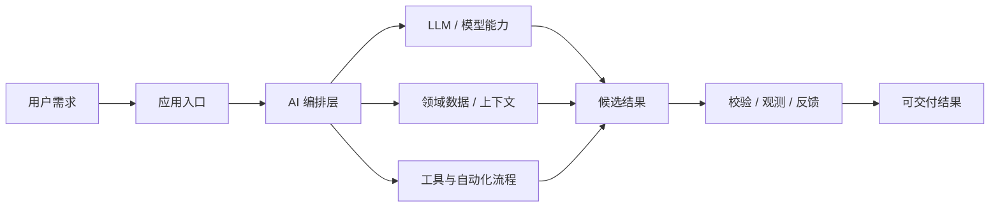
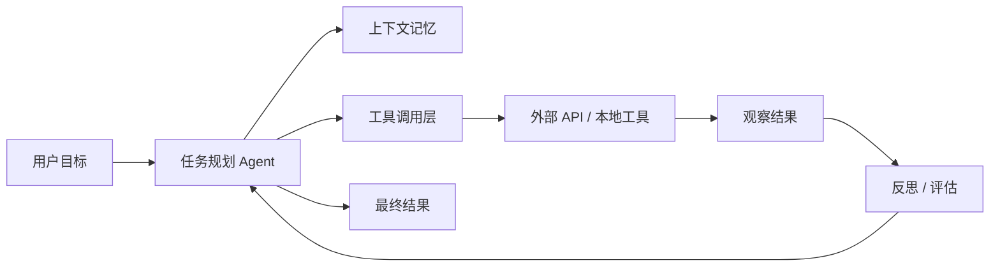
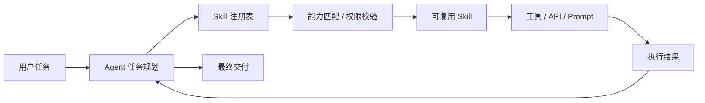

# GitHub AI Daily Trending Top 5

更新时间：2026-07-28T02:07:29Z

筛选范围：仓库名称或描述包含 AI 相关关键词。关键词：ai, agent, agents, agentic, llm, llms, skill, skills, mcp, model context protocol, chatgpt, openai, claude, gemini, copilot, deepseek, rag, embedding, embeddings, transformer, diffusion, machine learning, ml, deep learning, neural, inference, prompt, prompts。

网页版本：由 GitHub Pages 自动发布。

## 1. [moeru-ai/airi](https://github.com/moeru-ai/airi)

- 语言：TypeScript
- Stars：44,087
- 主题：ai-companion, ai-vtuber, airi, digital-life, grok-companion, live2d, neuro-sama, neurosama, openclaw, vrm, vtuber
- Star 趋势：

- 作用 / 解决的问题：💖🧸 Self hosted, you-owned Grok Companion, a container of souls of waifu, cyber livings to bring them into our worlds, wishing to achieve Neuro-sama's altitude. Capable of realtime voice chat, Minecraft, Factorio playing. Web / macOS / Windows supported.
- 适用场景：
  - 适合快速评估 GitHub AI 热榜中新出现或重新升温的技术方向，因为该仓库已获得短期社区关注。
  - 适合围绕 ai-companion, ai-vtuber, airi, digital-life, grok-companion, live2d, neuro-sama, neurosama, openclaw, vrm, vtuber 做技术调研、竞品分析或原型验证，因为仓库主题与当前 AI 热点高度相关。
- 架构思想：
  - 它成为热榜的核心原因通常不是单点功能，而是把模型能力、工具、数据和工作流组织成更容易落地的工程结构。
  - 当前 Stars 为 44,087，说明它不只是概念验证，还积累了可观的社区验证和传播势能。
  - 相比只提供单一脚本的仓库，它用 ai-companion, ai-vtuber, airi, digital-life, grok-companion, live2d, neuro-sama, neurosama, openclaw, vrm, vtuber 等 topics 明确了能力边界，更容易被目标用户检索和采用。
  - 使用 TypeScript 作为主要实现语言，降低了对应生态开发者集成、扩展和二次开发的成本。
  - 它的稀缺性在于把热门 AI 能力包装成可运行、可组合、可观察的工程入口，而不是停留在论文、提示词或孤立 Demo。
- 原理 / 实现思路：
  - media="(prefers-color-scheme: light), (prefers-color-scheme: no-preference)"
  - media="(prefers-color-scheme: light), (prefers-color-scheme: no-preference)"
  - media="(prefers-color-scheme: light), (prefers-color-scheme: no-preference)"
  - 以上内容由 GitHub 公开 README 自动摘取和归纳，适合作为快速了解入口，深入实现仍以仓库源码和文档为准。

```mermaid
flowchart LR
    User[用户需求] --> Interface[应用入口]
    Interface --> Orchestrator[AI 编排层]
    Orchestrator --> Model[LLM / 模型能力]
    Orchestrator --> Data[领域数据 / 上下文]
    Orchestrator --> Tools[工具与自动化流程]
    Model --> Result[候选结果]
    Data --> Result
    Tools --> Result
    Result --> Review[校验 / 观测 / 反馈]
    Review --> Output[可交付结果]
```

## 2. [pbakaus/impeccable](https://github.com/pbakaus/impeccable)

- 语言：JavaScript
- Stars：51,598
- 主题：未在 GitHub API 中公开 topics
- Star 趋势：

- 作用 / 解决的问题：The design language that makes your AI harness better at design.
- 适用场景：
  - 适合快速评估 GitHub AI 热榜中新出现或重新升温的技术方向，因为该仓库已获得短期社区关注。
  - 适合围绕 未在 GitHub API 中公开 topics 做技术调研、竞品分析或原型验证，因为仓库主题与当前 AI 热点高度相关。
- 架构思想：
  - 它成为热榜的核心原因通常不是单点功能，而是把模型能力、工具、数据和工作流组织成更容易落地的工程结构。
  - 当前 Stars 为 51,598，说明它不只是概念验证，还积累了可观的社区验证和传播势能。
  - 使用 JavaScript 作为主要实现语言，降低了对应生态开发者集成、扩展和二次开发的成本。
  - 它的稀缺性在于把热门 AI 能力包装成可运行、可组合、可观察的工程入口，而不是停留在论文、提示词或孤立 Demo。
- 原理 / 实现思路：
  - Design guidance for AI coding agents. 1 skill, 23 commands, live browser iteration, and 60 deterministic detector rules for AI-generated frontend design.
  - Every model trained on the same SaaS templates. Skip the guidance and you get the same handful of tells on every project: Inter for everything, purple-to-blue gradients, cards nested in cards, gray text on colored backgrounds, the rounded-square icon tile abov...
  - One setup flow. /impeccable init writes PRODUCT.md and offers DESIGN.md, so later commands know the audience, brand/product lane, voice, anti-references, colors, type, and components.
  - 以上内容由 GitHub 公开 README 自动摘取和归纳，适合作为快速了解入口，深入实现仍以仓库源码和文档为准。

```mermaid
flowchart LR
    User[用户需求] --> Interface[应用入口]
    Interface --> Orchestrator[AI 编排层]
    Orchestrator --> Model[LLM / 模型能力]
    Orchestrator --> Data[领域数据 / 上下文]
    Orchestrator --> Tools[工具与自动化流程]
    Model --> Result[候选结果]
    Data --> Result
    Tools --> Result
    Result --> Review[校验 / 观测 / 反馈]
    Review --> Output[可交付结果]
```

## 3. [alibaba/open-code-review](https://github.com/alibaba/open-code-review)

- 语言：Go
- Stars：14,886
- 主题：agent, agent-skills, code-review, code-review-assistant, harness, repository-level-context
- Star 趋势：

- 作用 / 解决的问题：Open-source & free — Battle-tested at Alibaba's scale. Hybrid architecture code review tool: deterministic pipelines + LLM Agent, precise line-level comments, built-in fine-tuned ruleset (NPE, thread-safety, XSS, SQL injection), OpenAI & Anthropic compatible.
- 适用场景：
  - 适合快速评估 GitHub AI 热榜中新出现或重新升温的技术方向，因为该仓库已获得短期社区关注。
  - 适合多步骤自动化、工具调用和复杂任务编排场景，因为 Agent 模式能把规划、执行、观察和修正串起来。
- 架构思想：
  - 它成为热榜的核心原因通常不是单点功能，而是把模型能力、工具、数据和工作流组织成更容易落地的工程结构。
  - 当前 Stars 为 14,886，说明它不只是概念验证，还积累了可观的社区验证和传播势能。
  - 相比只提供单一脚本的仓库，它用 agent, agent-skills, code-review, code-review-assistant, harness, repository-level-context 等 topics 明确了能力边界，更容易被目标用户检索和采用。
  - 使用 Go 作为主要实现语言，降低了对应生态开发者集成、扩展和二次开发的成本。
  - 它的稀缺性在于把热门 AI 能力包装成可运行、可组合、可观察的工程入口，而不是停留在论文、提示词或孤立 Demo。
- 原理 / 实现思路：
  - English \| <a href="README.zh-CN.md">简体中文</a> \| <a href="README.ja-JP.md">日本語</a> \| <a href="README.ko-KR.md">한국어</a> \| <a href="README.ru-RU.md">Русский</a>
  - Open Code Review is an AI-powered code review CLI tool. It originated as Alibaba Group's internal official AI code review assistant — over the past two years, it has served tens of thousands of developers and identified millions of code defects. After thorough...
  - It reads Git diffs, sends changed files to a configurable LLM via an agent with tool-use capabilities, and generates structured review comments with line-level precision. The agent can read full file contents, search the codebase, inspect other changed files f...
  - 以上内容由 GitHub 公开 README 自动摘取和归纳，适合作为快速了解入口，深入实现仍以仓库源码和文档为准。

```mermaid
flowchart LR
    User[用户目标] --> Planner[任务规划 Agent]
    Planner --> Memory[上下文记忆]
    Planner --> Tools[工具调用层]
    Tools --> APIs[外部 API / 本地工具]
    APIs --> Observation[观察结果]
    Observation --> Critic[反思 / 评估]
    Critic --> Planner
    Planner --> Deliverable[最终结果]
```

## 4. [bradautomates/claude-video](https://github.com/bradautomates/claude-video)

- 语言：Python
- Stars：11,145
- 主题：未在 GitHub API 中公开 topics
- Star 趋势：

- 作用 / 解决的问题：Give Claude the ability to watch any video. /watch downloads, extracts frames, transcribes, hands it all to Claude.
- 适用场景：
  - 适合快速评估 GitHub AI 热榜中新出现或重新升温的技术方向，因为该仓库已获得短期社区关注。
  - 适合围绕 未在 GitHub API 中公开 topics 做技术调研、竞品分析或原型验证，因为仓库主题与当前 AI 热点高度相关。
- 架构思想：
  - 它成为热榜的核心原因通常不是单点功能，而是把模型能力、工具、数据和工作流组织成更容易落地的工程结构。
  - 当前 Stars 为 11,145，说明它不只是概念验证，还积累了可观的社区验证和传播势能。
  - 使用 Python 作为主要实现语言，降低了对应生态开发者集成、扩展和二次开发的成本。
  - 它的稀缺性在于把热门 AI 能力包装成可运行、可组合、可观察的工程入口，而不是停留在论文、提示词或孤立 Demo。
- 原理 / 实现思路：
  - Claude Code (recommended — auto-updates via marketplace):
  - /plugin marketplace add bradautomates/claude-video
  - (-g installs globally for your user, available across all projects. Drop it to scope per-project.)
  - 以上内容由 GitHub 公开 README 自动摘取和归纳，适合作为快速了解入口，深入实现仍以仓库源码和文档为准。

```mermaid
flowchart LR
    User[用户需求] --> Interface[应用入口]
    Interface --> Orchestrator[AI 编排层]
    Orchestrator --> Model[LLM / 模型能力]
    Orchestrator --> Data[领域数据 / 上下文]
    Orchestrator --> Tools[工具与自动化流程]
    Model --> Result[候选结果]
    Data --> Result
    Tools --> Result
    Result --> Review[校验 / 观测 / 反馈]
    Review --> Output[可交付结果]
```

## 5. [mvanhorn/last30days-skill](https://github.com/mvanhorn/last30days-skill)

- 语言：Python
- Stars：54,202
- 主题：ai-prompts, ai-skill, bluesky, claude, claude-code, clawhub, deep-research, hackernews, instagram, openclaw, polymarket, recency, reddit, research, social-media, tiktok, trends, twitter, web-search, youtube
- Star 趋势：

- 作用 / 解决的问题：AI agent skill that researches any topic across Reddit, X, YouTube, HN, Polymarket, and the web - then synthesizes a grounded summary
- 适用场景：
  - 适合快速评估 GitHub AI 热榜中新出现或重新升温的技术方向，因为该仓库已获得短期社区关注。
  - 适合多步骤自动化、工具调用和复杂任务编排场景，因为 Agent 模式能把规划、执行、观察和修正串起来。
  - 适合团队沉淀可复用 AI 能力的场景，因为 Skill 把提示词、工具和流程封装成可发现、可组合的单元。
- 架构思想：
  - 它成为热榜的核心原因通常不是单点功能，而是把模型能力、工具、数据和工作流组织成更容易落地的工程结构。
  - 当前 Stars 为 54,202，说明它不只是概念验证，还积累了可观的社区验证和传播势能。
  - 相比只提供单一脚本的仓库，它用 ai-prompts, ai-skill, bluesky, claude, claude-code, clawhub, deep-research, hackernews, instagram, openclaw, polymarket, recency, reddit, research, social-media, tiktok, trends, twitter, web-search, youtube 等 topics 明确了能力边界，更容易被目标用户检索和采用。
  - 使用 Python 作为主要实现语言，降低了对应生态开发者集成、扩展和二次开发的成本。
  - 它的稀缺性在于把热门 AI 能力包装成可运行、可组合、可观察的工程入口，而不是停留在论文、提示词或孤立 Demo。
- 原理 / 实现思路：
  - An AI agent-led search engine scored by upvotes, likes, and real money - not editors.
  - This README tracks the current v3 pipeline. The runtime skill spec lives in [skills/last30days/SKILL.md](skills/last30days/SKILL.md), which is the source of truth for the latest command and setup behavior.
  - Claude Code (recommended — auto-updates via marketplace):
  - 以上内容由 GitHub 公开 README 自动摘取和归纳，适合作为快速了解入口，深入实现仍以仓库源码和文档为准。

```mermaid
flowchart LR
    User[用户任务] --> Planner[Agent 任务规划]
    Planner --> Registry[Skill 注册表]
    Registry --> Select[能力匹配 / 权限校验]
    Select --> Skill[可复用 Skill]
    Skill --> Tool[工具 / API / Prompt]
    Tool --> Observation[执行结果]
    Observation --> Planner
    Planner --> Output[最终交付]
```

