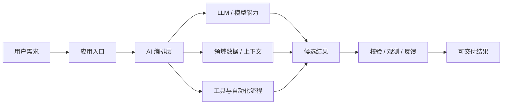
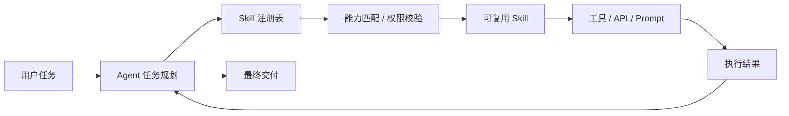
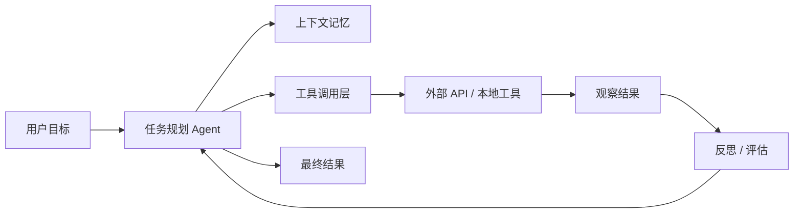

# GitHub AI Daily Trending Top 5

更新时间：2026-08-02T02:23:37Z

筛选范围：仓库名称或描述包含 AI 相关关键词。关键词：ai, agent, agents, agentic, llm, llms, skill, skills, mcp, model context protocol, chatgpt, openai, claude, gemini, copilot, deepseek, rag, embedding, embeddings, transformer, diffusion, machine learning, ml, deep learning, neural, inference, prompt, prompts。

网页版本：由 GitHub Pages 自动发布。

## 1. [microsoft/AI-For-Beginners](https://github.com/microsoft/AI-For-Beginners)

- 语言：Jupyter Notebook
- Stars：57,333
- 主题：ai, artificial-intelligence, cnn, computer-vision, deep-learning, gan, machine-learning, microsoft-for-beginners, nlp, rnn
- Star 趋势：

- 作用 / 解决的问题：12 Weeks, 24 Lessons, AI for All!
- 适用场景：
  - 适合快速评估 GitHub AI 热榜中新出现或重新升温的技术方向，因为该仓库已获得短期社区关注。
  - 适合围绕 ai, artificial-intelligence, cnn, computer-vision, deep-learning, gan, machine-learning, microsoft-for-beginners, nlp, rnn 做技术调研、竞品分析或原型验证，因为仓库主题与当前 AI 热点高度相关。
- 架构思想：
  - 它成为热榜的核心原因通常不是单点功能，而是把模型能力、工具、数据和工作流组织成更容易落地的工程结构。
  - 当前 Stars 为 57,333，说明它不只是概念验证，还积累了可观的社区验证和传播势能。
  - 相比只提供单一脚本的仓库，它用 ai, artificial-intelligence, cnn, computer-vision, deep-learning, gan, machine-learning, microsoft-for-beginners, nlp, rnn 等 topics 明确了能力边界，更容易被目标用户检索和采用。
  - 使用 Jupyter Notebook 作为主要实现语言，降低了对应生态开发者集成、扩展和二次开发的成本。
  - 它的稀缺性在于把热门 AI 能力包装成可运行、可组合、可观察的工程入口，而不是停留在论文、提示词或孤立 Demo。
- 原理 / 实现思路：
  - Artificial Intelligence for Beginners - A Curriculum
  - Explore the world of Artificial Intelligence (AI) with our 12-week, 24-lesson curriculum!  It includes practical lessons, quizzes, and labs. The curriculum is beginner-friendly and covers tools like TensorFlow and PyTorch, as well as ethics in AI
  - Supported via GitHub Action (Automated & Always Up-to-Date)
  - 以上内容由 GitHub 公开 README 自动摘取和归纳，适合作为快速了解入口，深入实现仍以仓库源码和文档为准。

```mermaid
flowchart LR
    User[用户需求] --> Interface[应用入口]
    Interface --> Orchestrator[AI 编排层]
    Orchestrator --> Model[LLM / 模型能力]
    Orchestrator --> Data[领域数据 / 上下文]
    Orchestrator --> Tools[工具与自动化流程]
    Model --> Result[候选结果]
    Data --> Result
    Tools --> Result
    Result --> Review[校验 / 观测 / 反馈]
    Review --> Output[可交付结果]
```

## 2. [zhaoxuya520/reverse-skill](https://github.com/zhaoxuya520/reverse-skill)

- 语言：PowerShell
- Stars：11,961
- 主题：未在 GitHub API 中公开 topics
- Star 趋势：

- 作用 / 解决的问题：Reverse Engineering / Authorized Penetration Testing / Security Research Skill Router Pack AI-powered routing + On-demand toolchain bootstrapping + Self-evolving knowledge base Supports Claude Code, Kiro, Cursor, Cline, and other AI coding clients 逆向/渗透/安全技能路由包 - AI 自动路由 + 按需自举工具链 + 自动进化经验库 \| 支持 Claude Code / Kiro / Cursor / Cline 等代码 AI 客户端
- 适用场景：
  - 适合快速评估 GitHub AI 热榜中新出现或重新升温的技术方向，因为该仓库已获得短期社区关注。
  - 适合团队沉淀可复用 AI 能力的场景，因为 Skill 把提示词、工具和流程封装成可发现、可组合的单元。
- 架构思想：
  - 它成为热榜的核心原因通常不是单点功能，而是把模型能力、工具、数据和工作流组织成更容易落地的工程结构。
  - 当前 Stars 为 11,961，说明它不只是概念验证，还积累了可观的社区验证和传播势能。
  - 使用 PowerShell 作为主要实现语言，降低了对应生态开发者集成、扩展和二次开发的成本。
  - 它的稀缺性在于把热门 AI 能力包装成可运行、可组合、可观察的工程入口，而不是停留在论文、提示词或孤立 Demo。
- 原理 / 实现思路：
  - If you are an AI Agent, jump to [README_AI.md](README_AI.md) and follow the instructions strictly.
  - When an AI agent (Claude Code, Codex CLI, Cursor, etc.) encounters an APK, a binary, frontend JS encryption, a CTF challenge, or a pentesting target, this package routes it to the right methodology, checks available tools, and executes a repeatable workflow in...
  - → timeline + Evidence→Finding→Path → report + field-journal
  - 以上内容由 GitHub 公开 README 自动摘取和归纳，适合作为快速了解入口，深入实现仍以仓库源码和文档为准。

```mermaid
flowchart LR
    User[用户任务] --> Planner[Agent 任务规划]
    Planner --> Registry[Skill 注册表]
    Registry --> Select[能力匹配 / 权限校验]
    Select --> Skill[可复用 Skill]
    Skill --> Tool[工具 / API / Prompt]
    Tool --> Observation[执行结果]
    Observation --> Planner
    Planner --> Output[最终交付]
```

## 3. [microsoft/generative-ai-for-beginners](https://github.com/microsoft/generative-ai-for-beginners)

- 语言：Jupyter Notebook
- Stars：114,246
- 主题：ai, azure, chatgpt, dall-e, generative-ai, generativeai, gpt, language-model, llms, microsoft-for-beginners, openai, prompt-engineering, semantic-search, transformers
- Star 趋势：

- 作用 / 解决的问题：21 Lessons, Get Started Building with Generative AI
- 适用场景：
  - 适合快速评估 GitHub AI 热榜中新出现或重新升温的技术方向，因为该仓库已获得短期社区关注。
  - 适合围绕 ai, azure, chatgpt, dall-e, generative-ai, generativeai, gpt, language-model, llms, microsoft-for-beginners, openai, prompt-engineering, semantic-search, transformers 做技术调研、竞品分析或原型验证，因为仓库主题与当前 AI 热点高度相关。
- 架构思想：
  - 它成为热榜的核心原因通常不是单点功能，而是把模型能力、工具、数据和工作流组织成更容易落地的工程结构。
  - 当前 Stars 为 114,246，说明它不只是概念验证，还积累了可观的社区验证和传播势能。
  - 相比只提供单一脚本的仓库，它用 ai, azure, chatgpt, dall-e, generative-ai, generativeai, gpt, language-model, llms, microsoft-for-beginners, openai, prompt-engineering, semantic-search, transformers 等 topics 明确了能力边界，更容易被目标用户检索和采用。
  - 使用 Jupyter Notebook 作为主要实现语言，降低了对应生态开发者集成、扩展和二次开发的成本。
  - 它的稀缺性在于把热门 AI 能力包装成可运行、可组合、可观察的工程入口，而不是停留在论文、提示词或孤立 Demo。
- 原理 / 实现思路：
  - 21 Lessons teaching everything you need to know to start building Generative AI applications
  - Supported via GitHub Action (Automated & Always Up-to-Date)
  - [Arabic](./translations/ar/README.md) \| [Bengali](./translations/bn/README.md) \| [Bulgarian](./translations/bg/README.md) \| [Burmese (Myanmar)](./translations/my/README.md) \| [Chinese (Simplified)](./translations/zh-CN/README.md) \| [Chinese (Traditional, Hong ...
  - 以上内容由 GitHub 公开 README 自动摘取和归纳，适合作为快速了解入口，深入实现仍以仓库源码和文档为准。

```mermaid
flowchart LR
    User[用户需求] --> Interface[应用入口]
    Interface --> Orchestrator[AI 编排层]
    Orchestrator --> Model[LLM / 模型能力]
    Orchestrator --> Data[领域数据 / 上下文]
    Orchestrator --> Tools[工具与自动化流程]
    Model --> Result[候选结果]
    Data --> Result
    Tools --> Result
    Result --> Review[校验 / 观测 / 反馈]
    Review --> Output[可交付结果]
```

## 4. [github/copilot-sdk](https://github.com/github/copilot-sdk)

- 语言：Java
- Stars：10,286
- 主题：未在 GitHub API 中公开 topics
- Star 趋势：

- 作用 / 解决的问题：Multi-platform SDK for integrating GitHub Copilot Agent into apps and services
- 适用场景：
  - 适合快速评估 GitHub AI 热榜中新出现或重新升温的技术方向，因为该仓库已获得短期社区关注。
  - 适合多步骤自动化、工具调用和复杂任务编排场景，因为 Agent 模式能把规划、执行、观察和修正串起来。
- 架构思想：
  - 它成为热榜的核心原因通常不是单点功能，而是把模型能力、工具、数据和工作流组织成更容易落地的工程结构。
  - 当前 Stars 为 10,286，说明它不只是概念验证，还积累了可观的社区验证和传播势能。
  - 使用 Java 作为主要实现语言，降低了对应生态开发者集成、扩展和二次开发的成本。
  - 它的稀缺性在于把热门 AI 能力包装成可运行、可组合、可观察的工程入口，而不是停留在论文、提示词或孤立 Demo。
- 原理 / 实现思路：
  - Embed Copilot's agentic workflows in your application with the GitHub Copilot SDK for Python, TypeScript, Go, .NET, Java, and Rust.
  - The GitHub Copilot SDK exposes the same engine behind Copilot CLI: a production-tested agent runtime you can invoke programmatically. No need to build your own orchestration—you define agent behavior, Copilot handles planning, tool invocation, file edits, and ...
  - \| SDK                      \| Location                                                                \| Cookbook                                                                                              \| Installation                                         ...
  - 以上内容由 GitHub 公开 README 自动摘取和归纳，适合作为快速了解入口，深入实现仍以仓库源码和文档为准。

```mermaid
flowchart LR
    User[用户目标] --> Planner[任务规划 Agent]
    Planner --> Memory[上下文记忆]
    Planner --> Tools[工具调用层]
    Tools --> APIs[外部 API / 本地工具]
    APIs --> Observation[观察结果]
    Observation --> Critic[反思 / 评估]
    Critic --> Planner
    Planner --> Deliverable[最终结果]
```

## 5. [huggingface/speech-to-speech](https://github.com/huggingface/speech-to-speech)

- 语言：Python
- Stars：10,233
- 主题：ai, assistant, language-model, machine-learning, python, speech, speech-synthesis, speech-to-text, speech-translation
- Star 趋势：

- 作用 / 解决的问题：Build local voice agents with open-source models
- 适用场景：
  - 适合快速评估 GitHub AI 热榜中新出现或重新升温的技术方向，因为该仓库已获得短期社区关注。
  - 适合多步骤自动化、工具调用和复杂任务编排场景，因为 Agent 模式能把规划、执行、观察和修正串起来。
- 架构思想：
  - 它成为热榜的核心原因通常不是单点功能，而是把模型能力、工具、数据和工作流组织成更容易落地的工程结构。
  - 当前 Stars 为 10,233，说明它不只是概念验证，还积累了可观的社区验证和传播势能。
  - 相比只提供单一脚本的仓库，它用 ai, assistant, language-model, machine-learning, python, speech, speech-synthesis, speech-to-text, speech-translation 等 topics 明确了能力边界，更容易被目标用户检索和采用。
  - 使用 Python 作为主要实现语言，降低了对应生态开发者集成、扩展和二次开发的成本。
  - 它的稀缺性在于把热门 AI 能力包装成可运行、可组合、可观察的工程入口，而不是停留在论文、提示词或孤立 Demo。
- 原理 / 实现思路：
  - Speech To Speech: Build voice agents with open-source models
  - This starts an OpenAI Realtime-compatible server at ws://localhost:8765/v1/realtime using Parakeet TDT for local STT, an OpenAI-compatible LLM, and Qwen3-TTS for local speech output.
  - From a source checkout, talk to it from a second terminal:
  - 以上内容由 GitHub 公开 README 自动摘取和归纳，适合作为快速了解入口，深入实现仍以仓库源码和文档为准。

```mermaid
flowchart LR
    User[用户目标] --> Planner[任务规划 Agent]
    Planner --> Memory[上下文记忆]
    Planner --> Tools[工具调用层]
    Tools --> APIs[外部 API / 本地工具]
    APIs --> Observation[观察结果]
    Observation --> Critic[反思 / 评估]
    Critic --> Planner
    Planner --> Deliverable[最终结果]
```

