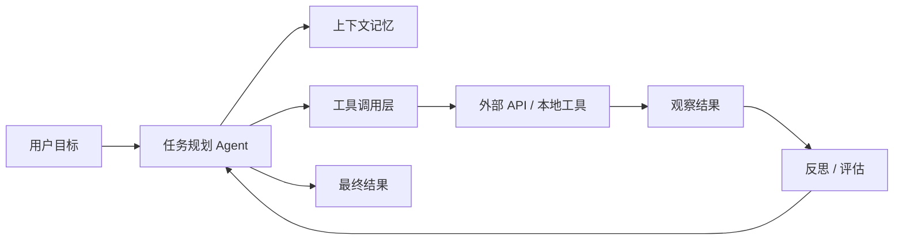
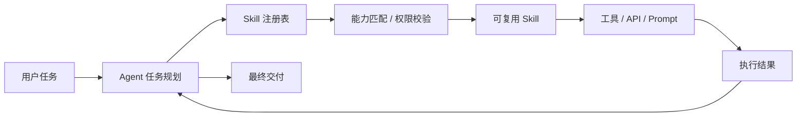
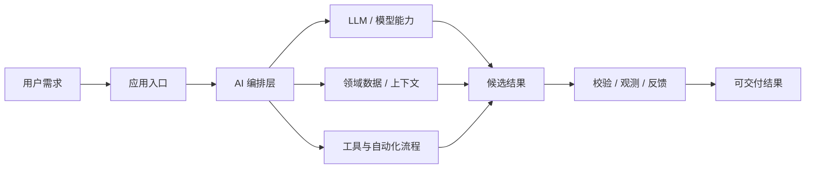

# GitHub AI Daily Trending Top 5

更新时间：2026-09-17T03:09:18Z

筛选范围：仓库名称或描述包含 AI 相关关键词。关键词：ai, agent, agents, agentic, llm, llms, skill, skills, mcp, model context protocol, chatgpt, openai, claude, gemini, copilot, deepseek, rag, embedding, embeddings, transformer, diffusion, machine learning, ml, deep learning, neural, inference, prompt, prompts。

网页版本：由 GitHub Pages 自动发布。

## 1. [alibaba/open-code-review](https://github.com/alibaba/open-code-review)

- 语言：Go
- Stars：32,266
- 主题：agent, agent-skills, code-review, code-review-assistant, harness, repository-level-context
- Star 趋势：

- 作用 / 解决的问题：Fast, efficient, battle-tested at Alibaba's scale. Hybrid architecture code review tool: deterministic pipelines + LLM Agent, precise line-level comments, built-in multi-language ruleset (NPE, thread-safety, XSS, SQL injection), OpenAI & Anthropic compatible.
- 适用场景：
  - 适合快速评估 GitHub AI 热榜中新出现或重新升温的技术方向，因为该仓库已获得短期社区关注。
  - 适合多步骤自动化、工具调用和复杂任务编排场景，因为 Agent 模式能把规划、执行、观察和修正串起来。
- 架构思想：
  - 它成为热榜的核心原因通常不是单点功能，而是把模型能力、工具、数据和工作流组织成更容易落地的工程结构。
  - 当前 Stars 为 32,266，说明它不只是概念验证，还积累了可观的社区验证和传播势能。
  - 相比只提供单一脚本的仓库，它用 agent, agent-skills, code-review, code-review-assistant, harness, repository-level-context 等 topics 明确了能力边界，更容易被目标用户检索和采用。
  - 使用 Go 作为主要实现语言，降低了对应生态开发者集成、扩展和二次开发的成本。
  - 它的稀缺性在于把热门 AI 能力包装成可运行、可组合、可观察的工程入口，而不是停留在论文、提示词或孤立 Demo。
- 原理 / 实现思路：
  - English \| <a href="docs/i18n/README.zh-CN.md">简体中文</a> \| <a href="docs/i18n/README.ja-JP.md">日本語</a> \| <a href="docs/i18n/README.ko-KR.md">한국어</a> \| <a href="docs/i18n/README.ru-RU.md">Русский</a>
  - Open Code Review is an AI-powered code review CLI tool. It originated as Alibaba Group's internal official AI code review assistant — over the past two years, it has served tens of thousands of developers and identified millions of code defects. After thorough...
  - It reads Git diffs, sends changed files to a configurable LLM via an agent with tool-use capabilities, and generates structured review comments with line-level precision. The agent can read full file contents, search the codebase, inspect other changed files f...
  - 以上内容由 GitHub 公开 README 自动摘取和归纳，适合作为快速了解入口，深入实现仍以仓库源码和文档为准。

```mermaid
flowchart LR
    User[用户目标] --> Planner[任务规划 Agent]
    Planner --> Memory[上下文记忆]
    Planner --> Tools[工具调用层]
    Tools --> APIs[外部 API / 本地工具]
    APIs --> Observation[观察结果]
    Observation --> Critic[反思 / 评估]
    Critic --> Planner
    Planner --> Deliverable[最终结果]
```

## 2. [cloudflare/security-audit-skill](https://github.com/cloudflare/security-audit-skill)

- 语言：JavaScript
- Stars：7,536
- 主题：未在 GitHub API 中公开 topics
- Star 趋势：

- 作用 / 解决的问题：A coding-agent skill for multi-phase security audits with independently verified, machine-readable findings
- 适用场景：
  - 适合快速评估 GitHub AI 热榜中新出现或重新升温的技术方向，因为该仓库已获得短期社区关注。
  - 适合多步骤自动化、工具调用和复杂任务编排场景，因为 Agent 模式能把规划、执行、观察和修正串起来。
  - 适合团队沉淀可复用 AI 能力的场景，因为 Skill 把提示词、工具和流程封装成可发现、可组合的单元。
- 架构思想：
  - 它成为热榜的核心原因通常不是单点功能，而是把模型能力、工具、数据和工作流组织成更容易落地的工程结构。
  - 当前 Stars 为 7,536，说明它不只是概念验证，还积累了可观的社区验证和传播势能。
  - 使用 JavaScript 作为主要实现语言，降低了对应生态开发者集成、扩展和二次开发的成本。
  - 它的稀缺性在于把热门 AI 能力包装成可运行、可组合、可观察的工程入口，而不是停留在论文、提示词或孤立 Demo。
- 原理 / 实现思路：
  - A coding-agent skill that turns your agent into a security auditor. It orchestrates isolated agents through reconnaissance, coverage-led hunting, candidate validation, structured output, independent record verification, and target-neutral reporting.
  - 1. Reconnaissance -- map architecture, trust boundaries, input surfaces, prior evidence, and deterministic coverage in architecture.md and coverage-ledger.json.
  - 2. Coverage-led hunting -- assign isolated hunters from ledger units, record their checks, and use coverage critics to find gaps.
  - 以上内容由 GitHub 公开 README 自动摘取和归纳，适合作为快速了解入口，深入实现仍以仓库源码和文档为准。

```mermaid
flowchart LR
    User[用户任务] --> Planner[Agent 任务规划]
    Planner --> Registry[Skill 注册表]
    Registry --> Select[能力匹配 / 权限校验]
    Select --> Skill[可复用 Skill]
    Skill --> Tool[工具 / API / Prompt]
    Tool --> Observation[执行结果]
    Observation --> Planner
    Planner --> Output[最终交付]
```

## 3. [jamiepine/voicebox](https://github.com/jamiepine/voicebox)

- 语言：TypeScript
- Stars：54,453
- 主题：ai, cuda, mlx, qwen3-tts, qwen3-tts-ui, voice-ai, voice-clone, whisper
- Star 趋势：

- 作用 / 解决的问题：The open-source AI voice studio. Clone, dictate, create.
- 适用场景：
  - 适合快速评估 GitHub AI 热榜中新出现或重新升温的技术方向，因为该仓库已获得短期社区关注。
  - 适合围绕 ai, cuda, mlx, qwen3-tts, qwen3-tts-ui, voice-ai, voice-clone, whisper 做技术调研、竞品分析或原型验证，因为仓库主题与当前 AI 热点高度相关。
- 架构思想：
  - 它成为热榜的核心原因通常不是单点功能，而是把模型能力、工具、数据和工作流组织成更容易落地的工程结构。
  - 当前 Stars 为 54,453，说明它不只是概念验证，还积累了可观的社区验证和传播势能。
  - 相比只提供单一脚本的仓库，它用 ai, cuda, mlx, qwen3-tts, qwen3-tts-ui, voice-ai, voice-clone, whisper 等 topics 明确了能力边界，更容易被目标用户检索和采用。
  - 使用 TypeScript 作为主要实现语言，降低了对应生态开发者集成、扩展和二次开发的成本。
  - 它的稀缺性在于把热门 AI 能力包装成可运行、可组合、可观察的工程入口，而不是停留在论文、提示词或孤立 Demo。
- 原理 / 实现思路：
  - Clone any voice. Generate speech. Dictate into any app. Talk to agents in voices you own. 
  - The full voice I/O stack, running locally on your machine.
  - Voicebox is a local-first AI voice studio — a free and open-source alternative to ElevenLabs and WisprFlow in one app. Clone voices from a few seconds of audio, generate speech in 23 languages across 7 TTS engines, dictate into any text field with a global hot...
  - 以上内容由 GitHub 公开 README 自动摘取和归纳，适合作为快速了解入口，深入实现仍以仓库源码和文档为准。

```mermaid
flowchart LR
    User[用户需求] --> Interface[应用入口]
    Interface --> Orchestrator[AI 编排层]
    Orchestrator --> Model[LLM / 模型能力]
    Orchestrator --> Data[领域数据 / 上下文]
    Orchestrator --> Tools[工具与自动化流程]
    Model --> Result[候选结果]
    Data --> Result
    Tools --> Result
    Result --> Review[校验 / 观测 / 反馈]
    Review --> Output[可交付结果]
```

## 4. [anthropics/knowledge-work-plugins](https://github.com/anthropics/knowledge-work-plugins)

- 语言：Python
- Stars：24,319
- 主题：未在 GitHub API 中公开 topics
- Star 趋势：

- 作用 / 解决的问题：Open source repository of plugins primarily intended for knowledge workers to use in Claude Cowork
- 适用场景：
  - 适合快速评估 GitHub AI 热榜中新出现或重新升温的技术方向，因为该仓库已获得短期社区关注。
  - 适合围绕 未在 GitHub API 中公开 topics 做技术调研、竞品分析或原型验证，因为仓库主题与当前 AI 热点高度相关。
- 架构思想：
  - 它成为热榜的核心原因通常不是单点功能，而是把模型能力、工具、数据和工作流组织成更容易落地的工程结构。
  - 当前 Stars 为 24,319，说明它不只是概念验证，还积累了可观的社区验证和传播势能。
  - 使用 Python 作为主要实现语言，降低了对应生态开发者集成、扩展和二次开发的成本。
  - 它的稀缺性在于把热门 AI 能力包装成可运行、可组合、可观察的工程入口，而不是停留在论文、提示词或孤立 Demo。
- 原理 / 实现思路：
  - Cowork lets you set the goal and Claude delivers finished, professional work. Plugins let you go further: tell Claude how you like work done, which tools and data to pull from, how to handle critical workflows, and what slash commands to expose — so your team ...
  - Each plugin bundles the skills, connectors, slash commands, and sub-agents for a specific job function. Out of the box, they give Claude a strong starting point for helping anyone in that role. The real power comes when you customize them for your company — yo...
  - We're open-sourcing 11 plugins built and inspired by our own work:
  - 以上内容由 GitHub 公开 README 自动摘取和归纳，适合作为快速了解入口，深入实现仍以仓库源码和文档为准。

```mermaid
flowchart LR
    User[用户需求] --> Interface[应用入口]
    Interface --> Orchestrator[AI 编排层]
    Orchestrator --> Model[LLM / 模型能力]
    Orchestrator --> Data[领域数据 / 上下文]
    Orchestrator --> Tools[工具与自动化流程]
    Model --> Result[候选结果]
    Data --> Result
    Tools --> Result
    Result --> Review[校验 / 观测 / 反馈]
    Review --> Output[可交付结果]
```

## 5. [anthropics/claude-code](https://github.com/anthropics/claude-code)

- 语言：TypeScript
- Stars：145,572
- 主题：未在 GitHub API 中公开 topics
- Star 趋势：

- 作用 / 解决的问题：Claude Code is an agentic coding tool that lives in your terminal, understands your codebase, and helps you code faster by executing routine tasks, explaining complex code, and handling git workflows - all through natural language commands.
- 适用场景：
  - 适合快速评估 GitHub AI 热榜中新出现或重新升温的技术方向，因为该仓库已获得短期社区关注。
  - 适合多步骤自动化、工具调用和复杂任务编排场景，因为 Agent 模式能把规划、执行、观察和修正串起来。
- 架构思想：
  - 它成为热榜的核心原因通常不是单点功能，而是把模型能力、工具、数据和工作流组织成更容易落地的工程结构。
  - 当前 Stars 为 145,572，说明它不只是概念验证，还积累了可观的社区验证和传播势能。
  - 使用 TypeScript 作为主要实现语言，降低了对应生态开发者集成、扩展和二次开发的成本。
  - 它的稀缺性在于把热门 AI 能力包装成可运行、可组合、可观察的工程入口，而不是停留在论文、提示词或孤立 Demo。
- 原理 / 实现思路：
  - Claude Code is an agentic coding tool that lives in your terminal, understands your codebase, and helps you code faster by executing routine tasks, explaining complex code, and handling git workflows -- all through natural language commands. Use it in your ter...
  - 2. Navigate to your project directory and run claude.
  - This repository includes several Claude Code plugins that extend functionality with custom commands and agents. See the [plugins directory](./plugins/README.md) for detailed documentation on available plugins.
  - 以上内容由 GitHub 公开 README 自动摘取和归纳，适合作为快速了解入口，深入实现仍以仓库源码和文档为准。

```mermaid
flowchart LR
    User[用户目标] --> Planner[任务规划 Agent]
    Planner --> Memory[上下文记忆]
    Planner --> Tools[工具调用层]
    Tools --> APIs[外部 API / 本地工具]
    APIs --> Observation[观察结果]
    Observation --> Critic[反思 / 评估]
    Critic --> Planner
    Planner --> Deliverable[最终结果]
```

