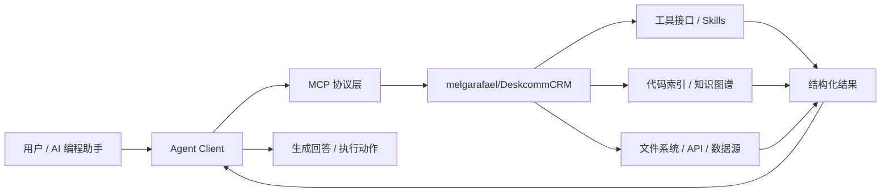
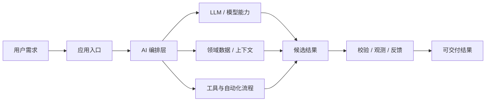
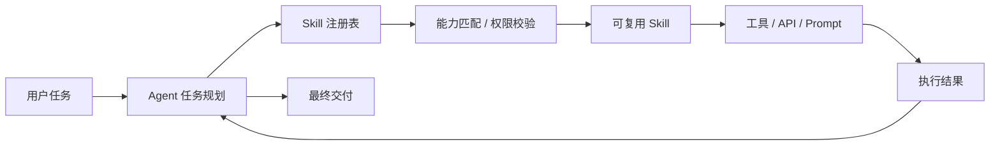
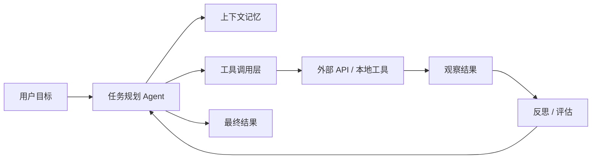
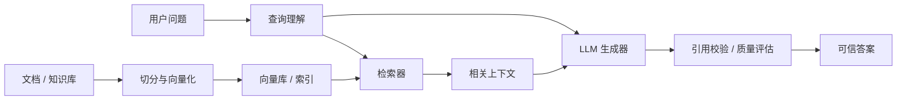

# GitHub AI Daily Trending Top 5

更新时间：2026-09-13T02:52:28Z

筛选范围：仓库名称或描述包含 AI 相关关键词。关键词：ai, agent, agents, agentic, llm, llms, skill, skills, mcp, model context protocol, chatgpt, openai, claude, gemini, copilot, deepseek, rag, embedding, embeddings, transformer, diffusion, machine learning, ml, deep learning, neural, inference, prompt, prompts。

网页版本：由 GitHub Pages 自动发布。

## 1. [melgarafael/DeskcommCRM](https://github.com/melgarafael/DeskcommCRM)

- 语言：TypeScript
- Stars：1,837
- 主题：ai, ai-agents, chatbot, crm, customer-support, ecommerce, lgpd, mcp, multi-tenant, nextjs, nuvemshop, open-source, rag, sales-automation, self-hosted, supabase, typescript, waha, whatsapp, whatsapp-api
- Star 趋势：

- 作用 / 解决的问题：Open-source AI sales OS — self-hosted CRM with native AI agents + WhatsApp (WAHA). Open alternative to Kommo, Octadesk & Intercom for any business that sells by chat. MCP-ready, multi-tenant, LGPD.
- 适用场景：
  - 适合快速评估 GitHub AI 热榜中新出现或重新升温的技术方向，因为该仓库已获得短期社区关注。
  - 适合需要把外部工具、代码库、数据源接入 AI Agent 的场景，因为 MCP 能把能力封装成标准工具接口。
  - 适合知识库问答、文档检索和企业内部搜索场景，因为 RAG 能把私有数据补充进 LLM 上下文。
  - 适合多步骤自动化、工具调用和复杂任务编排场景，因为 Agent 模式能把规划、执行、观察和修正串起来。
- 架构思想：
  - 它成为热榜的核心原因通常不是单点功能，而是把模型能力、工具、数据和工作流组织成更容易落地的工程结构。
  - 当前 Stars 为 1,837，说明它不只是概念验证，还积累了可观的社区验证和传播势能。
  - 相比只提供单一脚本的仓库，它用 ai, ai-agents, chatbot, crm, customer-support, ecommerce, lgpd, mcp, multi-tenant, nextjs, nuvemshop, open-source, rag, sales-automation, self-hosted, supabase, typescript, waha, whatsapp, whatsapp-api 等 topics 明确了能力边界，更容易被目标用户检索和采用。
  - 使用 TypeScript 作为主要实现语言，降低了对应生态开发者集成、扩展和二次开发的成本。
  - 它的稀缺性在于把热门 AI 能力包装成可运行、可组合、可观察的工程入口，而不是停留在论文、提示词或孤立 Demo。
- 原理 / 实现思路：
  - 🇧🇷 Português · [🇺🇸 English](README.en.md) · [🇪🇸 Español](README.es.md)
  - 🛠️ DeskcommCRM — o Sistema Operacional de Vendas com IA, open source, pro WhatsApp
  - Agentes de IA que atendem, qualificam e vendem no WhatsApp — dentro de um CRM open source rodando no seu servidor.
  - 以上内容由 GitHub 公开 README 自动摘取和归纳，适合作为快速了解入口，深入实现仍以仓库源码和文档为准。

```mermaid
flowchart LR
    User[用户 / AI 编程助手] --> Client[Agent Client]
    Client --> Protocol[MCP 协议层]
    Protocol --> Server[melgarafael/DeskcommCRM]
    Server --> Tools[工具接口 / Skills]
    Server --> Index[代码索引 / 知识图谱]
    Server --> Data[文件系统 / API / 数据源]
    Tools --> Result[结构化结果]
    Index --> Result
    Data --> Result
    Result --> Client
    Client --> Answer[生成回答 / 执行动作]
```

## 2. [asgeirtj/system_prompts_leaks](https://github.com/asgeirtj/system_prompts_leaks)

- 语言：JavaScript
- Stars：65,467
- 主题：ai, ai-agents, ai-prompts, anthropic, chatbot, chatgpt, claude, claude-code, codex, cursor, gemini, generative-ai, google, grok, llm, openai, prompt, prompt-engineering, system-prompt, system-prompts
- Star 趋势：

- 作用 / 解决的问题：Extracted system prompts from Anthropic - Claude Fable 5.1, Opus 5, Claude Design, Claude Code. OpenAI - ChatGPT GPT-6-Astra, Codex. Google - Gemini 3.8 Flash, 3.1 Pro, Antigravity. xAI - Grok, Grok Bot, Cursor, Kimi and more! Updated regularly.
- 适用场景：
  - 适合快速评估 GitHub AI 热榜中新出现或重新升温的技术方向，因为该仓库已获得短期社区关注。
  - 适合围绕 ai, ai-agents, ai-prompts, anthropic, chatbot, chatgpt, claude, claude-code, codex, cursor, gemini, generative-ai, google, grok, llm, openai, prompt, prompt-engineering, system-prompt, system-prompts 做技术调研、竞品分析或原型验证，因为仓库主题与当前 AI 热点高度相关。
- 架构思想：
  - 它成为热榜的核心原因通常不是单点功能，而是把模型能力、工具、数据和工作流组织成更容易落地的工程结构。
  - 当前 Stars 为 65,467，说明它不只是概念验证，还积累了可观的社区验证和传播势能。
  - 相比只提供单一脚本的仓库，它用 ai, ai-agents, ai-prompts, anthropic, chatbot, chatgpt, claude, claude-code, codex, cursor, gemini, generative-ai, google, grok, llm, openai, prompt, prompt-engineering, system-prompt, system-prompts 等 topics 明确了能力边界，更容易被目标用户检索和采用。
  - 使用 JavaScript 作为主要实现语言，降低了对应生态开发者集成、扩展和二次开发的成本。
  - 它的稀缺性在于把热门 AI 能力包装成可运行、可组合、可观察的工程入口，而不是停留在论文、提示词或孤立 Demo。
- 原理 / 实现思路：
  - Leaked system prompts, captured verbatim — the hidden instructions and rules that ChatGPT, Claude, Gemini, Grok and every other AI chatbot receives before your first message.
  - \| Claude Code headless (Fable 5.1) \| September 5, 2026 \| [Claude Code headless system prompt (Fable 5.1)](Anthropic/claude-code/claude-code-headless-fable-5.1.md) \|
  - \| Codex GPT-6-Astra \| September 4, 2026 \| [Codex GPT-6-Astra system prompt](OpenAI/Codex/gpt-6-astra.md) \|
  - 以上内容由 GitHub 公开 README 自动摘取和归纳，适合作为快速了解入口，深入实现仍以仓库源码和文档为准。

```mermaid
flowchart LR
    User[用户需求] --> Interface[应用入口]
    Interface --> Orchestrator[AI 编排层]
    Orchestrator --> Model[LLM / 模型能力]
    Orchestrator --> Data[领域数据 / 上下文]
    Orchestrator --> Tools[工具与自动化流程]
    Model --> Result[候选结果]
    Data --> Result
    Tools --> Result
    Result --> Review[校验 / 观测 / 反馈]
    Review --> Output[可交付结果]
```

## 3. [jihe520/MathModelAgent](https://github.com/jihe520/MathModelAgent)

- 语言：Python
- Stars：5,148
- 主题：agent, llm, mathmodel, skills
- Star 趋势：

- 作用 / 解决的问题：🤖📐专为数学建模设计的 Agent & skills ,自动完成数学建模，生成一份完整的可以直接提交的论文。 An Agent Designed for Mathematical Modeling ,Automatically complete mathmodel and generate a complete paper ready for submission.
- 适用场景：
  - 适合快速评估 GitHub AI 热榜中新出现或重新升温的技术方向，因为该仓库已获得短期社区关注。
  - 适合多步骤自动化、工具调用和复杂任务编排场景，因为 Agent 模式能把规划、执行、观察和修正串起来。
  - 适合团队沉淀可复用 AI 能力的场景，因为 Skill 把提示词、工具和流程封装成可发现、可组合的单元。
- 架构思想：
  - 它成为热榜的核心原因通常不是单点功能，而是把模型能力、工具、数据和工作流组织成更容易落地的工程结构。
  - 当前 Stars 为 5,148，说明它不只是概念验证，还积累了可观的社区验证和传播势能。
  - 相比只提供单一脚本的仓库，它用 agent, llm, mathmodel, skills 等 topics 明确了能力边界，更容易被目标用户检索和采用。
  - 使用 Python 作为主要实现语言，降低了对应生态开发者集成、扩展和二次开发的成本。
  - 它的稀缺性在于把热门 AI 能力包装成可运行、可组合、可观察的工程入口，而不是停留在论文、提示词或孤立 Demo。
- 原理 / 实现思路：
  - 桌面版已内置 Claude Code 与全套 MathModelAgent SKILLS，无需安装 Python / Node.js / Redis，也无需手动配置 SKILL，装好填一个模型 API Key 即可开始建模。
  - \| macOS（Apple 芯片 M 系列） \| mathmodel-<version>-arm64.dmg \|
  - \| macOS（Intel 芯片） \| mathmodel-<version>-x64.dmg \|
  - 以上内容由 GitHub 公开 README 自动摘取和归纳，适合作为快速了解入口，深入实现仍以仓库源码和文档为准。

```mermaid
flowchart LR
    User[用户任务] --> Planner[Agent 任务规划]
    Planner --> Registry[Skill 注册表]
    Registry --> Select[能力匹配 / 权限校验]
    Select --> Skill[可复用 Skill]
    Skill --> Tool[工具 / API / Prompt]
    Tool --> Observation[执行结果]
    Observation --> Planner
    Planner --> Output[最终交付]
```

## 4. [alsk1992/CloddsBot](https://github.com/alsk1992/CloddsBot)

- 语言：TypeScript
- Stars：2,527
- 主题：agi, ai, arbitrage, claude, crypto, defi, ethereum, futures, hft, hyperliquid, kalshi, polymarket, prediction-markets, pumpswap, solana, telegram-bot, trading, trading-bot, typescript, x402
- Star 趋势：

- 作用 / 解决的问题：Open Source AI trading agent that operates autonomously across 1000+ markets - Polymarket, Kalshi, Binance, Hyperliquid, Solana DEXs, 5 EVM chains. Scans for edge, executes instantly, manages risk while you sleep. Agent commerce protocol for machine-to-machine payments. Self-hosted. Built on Claude.
- 适用场景：
  - 适合快速评估 GitHub AI 热榜中新出现或重新升温的技术方向，因为该仓库已获得短期社区关注。
  - 适合多步骤自动化、工具调用和复杂任务编排场景，因为 Agent 模式能把规划、执行、观察和修正串起来。
- 架构思想：
  - 它成为热榜的核心原因通常不是单点功能，而是把模型能力、工具、数据和工作流组织成更容易落地的工程结构。
  - 当前 Stars 为 2,527，说明它不只是概念验证，还积累了可观的社区验证和传播势能。
  - 相比只提供单一脚本的仓库，它用 agi, ai, arbitrage, claude, crypto, defi, ethereum, futures, hft, hyperliquid, kalshi, polymarket, prediction-markets, pumpswap, solana, telegram-bot, trading, trading-bot, typescript, x402 等 topics 明确了能力边界，更容易被目标用户检索和采用。
  - 使用 TypeScript 作为主要实现语言，降低了对应生态开发者集成、扩展和二次开发的成本。
  - 它的稀缺性在于把热门 AI 能力包装成可运行、可组合、可观察的工程入口，而不是停留在论文、提示词或孤立 Demo。
- 原理 / 实现思路：
  - Clodds is a personal AI trading terminal for prediction markets, crypto spot, perpetual futures with leverage, token launches, and Bittensor subnet mining. Run it on your own machine, chat via any of 21 messaging platforms, trade across 10 prediction markets +...
  - Powered by Claude with 118+ trading strategies, whale tracking, arbitrage detection, copy trading, and DCA bots.
  - Requirement: Node.js 22 or newer. Node.js 20 is not supported and dependency installation may fail.
  - 以上内容由 GitHub 公开 README 自动摘取和归纳，适合作为快速了解入口，深入实现仍以仓库源码和文档为准。

```mermaid
flowchart LR
    User[用户目标] --> Planner[任务规划 Agent]
    Planner --> Memory[上下文记忆]
    Planner --> Tools[工具调用层]
    Tools --> APIs[外部 API / 本地工具]
    APIs --> Observation[观察结果]
    Observation --> Critic[反思 / 评估]
    Critic --> Planner
    Planner --> Deliverable[最终结果]
```

## 5. [Shubhamsaboo/awesome-llm-apps](https://github.com/Shubhamsaboo/awesome-llm-apps)

- 语言：Python
- Stars：137,661
- 主题：agents, llms, python, rag
- Star 趋势：

- 作用 / 解决的问题：100+ AI Agents, Agent Skills and RAG Apps - Free and Open Source.
- 适用场景：
  - 适合快速评估 GitHub AI 热榜中新出现或重新升温的技术方向，因为该仓库已获得短期社区关注。
  - 适合知识库问答、文档检索和企业内部搜索场景，因为 RAG 能把私有数据补充进 LLM 上下文。
  - 适合多步骤自动化、工具调用和复杂任务编排场景，因为 Agent 模式能把规划、执行、观察和修正串起来。
  - 适合团队沉淀可复用 AI 能力的场景，因为 Skill 把提示词、工具和流程封装成可发现、可组合的单元。
- 架构思想：
  - 它成为热榜的核心原因通常不是单点功能，而是把模型能力、工具、数据和工作流组织成更容易落地的工程结构。
  - 当前 Stars 为 137,661，说明它不只是概念验证，还积累了可观的社区验证和传播势能。
  - 相比只提供单一脚本的仓库，它用 agents, llms, python, rag 等 topics 明确了能力边界，更容易被目标用户检索和采用。
  - 使用 Python 作为主要实现语言，降低了对应生态开发者集成、扩展和二次开发的成本。
  - 它的稀缺性在于把热门 AI 能力包装成可运行、可组合、可观察的工程入口，而不是停留在论文、提示词或孤立 Demo。
- 原理 / 实现思路：
  - 100+ open-source AI agents, agent skills, and RAG apps. Hand-built, tested end-to-end, Apache-2.0.
  - Clone it, ship it, sell it - 100% free and open-source
  - Works with Claude, Gemini, GPT, DeepSeek, Llama, Qwen and other open-source models.
  - 以上内容由 GitHub 公开 README 自动摘取和归纳，适合作为快速了解入口，深入实现仍以仓库源码和文档为准。

```mermaid
flowchart LR
    User[用户问题] --> Query[查询理解]
    Query --> Retriever[检索器]
    Docs[文档 / 知识库] --> Chunk[切分与向量化]
    Chunk --> Store[向量库 / 索引]
    Store --> Retriever
    Retriever --> Context[相关上下文]
    Context --> LLM[LLM 生成器]
    Query --> LLM
    LLM --> Eval[引用校验 / 质量评估]
    Eval --> Answer[可信答案]
```

