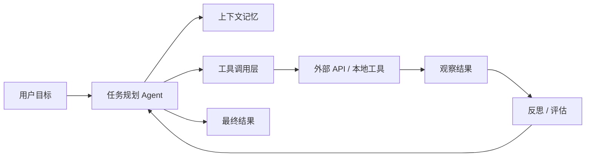
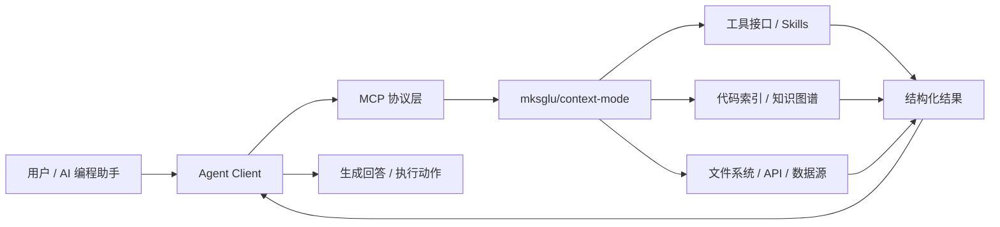
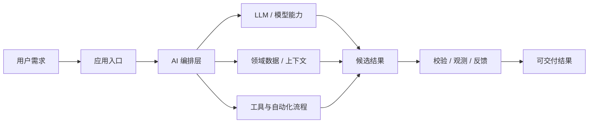

# GitHub AI Daily Trending Top 5

更新时间：2026-10-01T03:51:37Z

筛选范围：仓库名称或描述包含 AI 相关关键词。关键词：ai, agent, agents, agentic, llm, llms, skill, skills, mcp, model context protocol, chatgpt, openai, claude, gemini, copilot, deepseek, rag, embedding, embeddings, transformer, diffusion, machine learning, ml, deep learning, neural, inference, prompt, prompts。

网页版本：由 GitHub Pages 自动发布。

## 1. [NVIDIA/OpenShell](https://github.com/NVIDIA/OpenShell)

- 语言：Rust
- Stars：12,931
- 主题：未在 GitHub API 中公开 topics
- Star 趋势：

- 作用 / 解决的问题：OpenShell is the safe, private runtime for autonomous AI agents.
- 适用场景：
  - 适合快速评估 GitHub AI 热榜中新出现或重新升温的技术方向，因为该仓库已获得短期社区关注。
  - 适合多步骤自动化、工具调用和复杂任务编排场景，因为 Agent 模式能把规划、执行、观察和修正串起来。
- 架构思想：
  - 它成为热榜的核心原因通常不是单点功能，而是把模型能力、工具、数据和工作流组织成更容易落地的工程结构。
  - 当前 Stars 为 12,931，说明它不只是概念验证，还积累了可观的社区验证和传播势能。
  - 使用 Rust 作为主要实现语言，降低了对应生态开发者集成、扩展和二次开发的成本。
  - 它的稀缺性在于把热门 AI 能力包装成可运行、可组合、可观察的工程入口，而不是停留在论文、提示词或孤立 Demo。
- 原理 / 实现思路：
  - OpenShell is the safe, private runtime for fleets of autonomous AI agents. Agents are most useful when they can read files, install packages, call APIs, and use credentials. OpenShell gives them that capability without giving them unrestricted access to your d...
  - OpenShell governs what agents can do in two ways: it instruments the kernel to enforce policy on every file access, system call, and network connection at runtime, and it uses formal verification to check what a policy change would allow before it is applied.
  - Formally verified policy changes. Before a policy change is approved, OpenShell uses formal verification to flag risky new access it would grant, such as reaching a new host with credentials or calling a new API method, so those changes wait for human review.
  - 以上内容由 GitHub 公开 README 自动摘取和归纳，适合作为快速了解入口，深入实现仍以仓库源码和文档为准。

```mermaid
flowchart LR
    User[用户目标] --> Planner[任务规划 Agent]
    Planner --> Memory[上下文记忆]
    Planner --> Tools[工具调用层]
    Tools --> APIs[外部 API / 本地工具]
    APIs --> Observation[观察结果]
    Observation --> Critic[反思 / 评估]
    Critic --> Planner
    Planner --> Deliverable[最终结果]
```

## 2. [mvschwarz/openrig](https://github.com/mvschwarz/openrig)

- 语言：TypeScript
- Stars：3,101
- 主题：agent-harness, agent-orchestration, agent-skills, ai-coding, claude-code, cli, codex-cli, multi-agent, multi-agent-systems, tmux, typescript
- Star 趋势：

- 作用 / 解决的问题：Multi-agent harness that runs Claude Code and Codex together as one system
- 适用场景：
  - 适合快速评估 GitHub AI 热榜中新出现或重新升温的技术方向，因为该仓库已获得短期社区关注。
  - 适合多步骤自动化、工具调用和复杂任务编排场景，因为 Agent 模式能把规划、执行、观察和修正串起来。
- 架构思想：
  - 它成为热榜的核心原因通常不是单点功能，而是把模型能力、工具、数据和工作流组织成更容易落地的工程结构。
  - 当前 Stars 为 3,101，说明它不只是概念验证，还积累了可观的社区验证和传播势能。
  - 相比只提供单一脚本的仓库，它用 agent-harness, agent-orchestration, agent-skills, ai-coding, claude-code, cli, codex-cli, multi-agent, multi-agent-systems, tmux, typescript 等 topics 明确了能力边界，更容易被目标用户检索和采用。
  - 使用 TypeScript 作为主要实现语言，降低了对应生态开发者集成、扩展和二次开发的成本。
  - 它的稀缺性在于把热门 AI 能力包装成可运行、可组合、可观察的工程入口，而不是停留在论文、提示词或孤立 Demo。
- 原理 / 实现思路：
  - A harness wraps a model. A rig wraps your harnesses. Define your agent team in YAML, boot it with one command. Claude Code and Codex in the same rig, managed as one system.
  - Start here: [the guided first-use path](docs/reference/getting-started.md): install, launch a two-agent team in your repository, and get one reviewed change.
  - Requires Node.js 22 or 24 and tmux, on macOS or Linux. On a Mac with Apple silicon, use Node.js 22 ([compatibility history](docs/releases/v0.5.15.md#known-compatibility-limitation)). Native Windows is not supported yet, and WSL2 has not been tested. Launching ...
  - 以上内容由 GitHub 公开 README 自动摘取和归纳，适合作为快速了解入口，深入实现仍以仓库源码和文档为准。

```mermaid
flowchart LR
    User[用户目标] --> Planner[任务规划 Agent]
    Planner --> Memory[上下文记忆]
    Planner --> Tools[工具调用层]
    Tools --> APIs[外部 API / 本地工具]
    APIs --> Observation[观察结果]
    Observation --> Critic[反思 / 评估]
    Critic --> Planner
    Planner --> Deliverable[最终结果]
```

## 3. [mksglu/context-mode](https://github.com/mksglu/context-mode)

- 语言：TypeScript
- Stars：24,528
- 主题：antigravity, claude, claude-code, claude-code-hooks, claude-code-plugins, claude-code-skill, codex, codex-cli, context-mode, copilot, cursor-plugin, kiro, mcp, mcp-server, mcp-tools, openclaw, opencode, pi-agent, skills, zed-extension
- Star 趋势：

- 作用 / 解决的问题：Context window optimization for AI coding agents. Sandboxes tool output (98% reduction), persists session memory, and enforces routing across 17 platforms via MCP + hooks.
- 适用场景：
  - 适合快速评估 GitHub AI 热榜中新出现或重新升温的技术方向，因为该仓库已获得短期社区关注。
  - 适合需要把外部工具、代码库、数据源接入 AI Agent 的场景，因为 MCP 能把能力封装成标准工具接口。
  - 适合多步骤自动化、工具调用和复杂任务编排场景，因为 Agent 模式能把规划、执行、观察和修正串起来。
  - 适合团队沉淀可复用 AI 能力的场景，因为 Skill 把提示词、工具和流程封装成可发现、可组合的单元。
- 架构思想：
  - 它成为热榜的核心原因通常不是单点功能，而是把模型能力、工具、数据和工作流组织成更容易落地的工程结构。
  - 当前 Stars 为 24,528，说明它不只是概念验证，还积累了可观的社区验证和传播势能。
  - 相比只提供单一脚本的仓库，它用 antigravity, claude, claude-code, claude-code-hooks, claude-code-plugins, claude-code-skill, codex, codex-cli, context-mode, copilot, cursor-plugin, kiro, mcp, mcp-server, mcp-tools, openclaw, opencode, pi-agent, skills, zed-extension 等 topics 明确了能力边界，更容易被目标用户检索和采用。
  - 使用 TypeScript 作为主要实现语言，降低了对应生态开发者集成、扩展和二次开发的成本。
  - 它的稀缺性在于把热门 AI 能力包装成可运行、可组合、可观察的工程入口，而不是停留在论文、提示词或孤立 Demo。
- 原理 / 实现思路：
  - Every MCP tool call dumps raw data into your context window. A Playwright snapshot costs 56 KB. Twenty GitHub issues cost 59 KB. One access log — 45 KB. After 30 minutes, 40% of your context is gone. And when the agent compacts the conversation to free space, ...
  - Context Mode is an MCP server that solves all four sides of this problem:
  - 1. Context Saving — Sandbox tools keep raw data out of the context window. 315 KB becomes 5.4 KB. 98% reduction.
  - 以上内容由 GitHub 公开 README 自动摘取和归纳，适合作为快速了解入口，深入实现仍以仓库源码和文档为准。

```mermaid
flowchart LR
    User[用户 / AI 编程助手] --> Client[Agent Client]
    Client --> Protocol[MCP 协议层]
    Protocol --> Server[mksglu/context-mode]
    Server --> Tools[工具接口 / Skills]
    Server --> Index[代码索引 / 知识图谱]
    Server --> Data[文件系统 / API / 数据源]
    Tools --> Result[结构化结果]
    Index --> Result
    Data --> Result
    Result --> Client
    Client --> Answer[生成回答 / 执行动作]
```

## 4. [DietrichGebert/ponytail](https://github.com/DietrichGebert/ponytail)

- 语言：JavaScript
- Stars：149,303
- 主题：agent-skills, ai-agents, claude, claude-code, claude-code-plugin, cursor-rules, developer-tools, llm, prompt-engineering, yagni
- Star 趋势：

- 作用 / 解决的问题：Makes your AI agent think like the laziest senior dev in the room. The best code is the code you never wrote.
- 适用场景：
  - 适合快速评估 GitHub AI 热榜中新出现或重新升温的技术方向，因为该仓库已获得短期社区关注。
  - 适合多步骤自动化、工具调用和复杂任务编排场景，因为 Agent 模式能把规划、执行、观察和修正串起来。
- 架构思想：
  - 它成为热榜的核心原因通常不是单点功能，而是把模型能力、工具、数据和工作流组织成更容易落地的工程结构。
  - 当前 Stars 为 149,303，说明它不只是概念验证，还积累了可观的社区验证和传播势能。
  - 相比只提供单一脚本的仓库，它用 agent-skills, ai-agents, claude, claude-code, claude-code-plugin, cursor-rules, developer-tools, llm, prompt-engineering, yagni 等 topics 明确了能力边界，更容易被目标用户检索和采用。
  - 使用 JavaScript 作为主要实现语言，降低了对应生态开发者集成、扩展和二次开发的成本。
  - 它的稀缺性在于把热门 AI 能力包装成可运行、可组合、可观察的工程入口，而不是停留在论文、提示词或孤立 Demo。
- 原理 / 实现思路：
  - You ask for a date picker. Your agent installs flatpickr, writes a wrapper component, adds a stylesheet, and starts a discussion about timezones.
  - \| vs no-skill baseline \| LOC \| tokens \| cost \| time \| safe \|
  - \| caveman (terse-prose control) \| -20% \| +7% \| +3% \| +2% \| 100% \|
  - 以上内容由 GitHub 公开 README 自动摘取和归纳，适合作为快速了解入口，深入实现仍以仓库源码和文档为准。

```mermaid
flowchart LR
    User[用户目标] --> Planner[任务规划 Agent]
    Planner --> Memory[上下文记忆]
    Planner --> Tools[工具调用层]
    Tools --> APIs[外部 API / 本地工具]
    APIs --> Observation[观察结果]
    Observation --> Critic[反思 / 评估]
    Critic --> Planner
    Planner --> Deliverable[最终结果]
```

## 5. [harry0703/MoneyPrinterTurbo](https://github.com/harry0703/MoneyPrinterTurbo)

- 语言：Python
- Stars：127,624
- 主题：ai-video-generator, content-creation, ffmpeg, instagram-reels, llm, python, short-video, subtitles, text-to-speech, tiktok, video-automation, video-workflow, workflow-automation, youtube-shorts
- Star 趋势：

- 作用 / 解决的问题：利用 AI 大模型和自动化工作流，根据主题或关键词一键生成高清短视频。Generate HD short videos from a topic or keyword with an automated AI workflow.
- 适用场景：
  - 适合快速评估 GitHub AI 热榜中新出现或重新升温的技术方向，因为该仓库已获得短期社区关注。
  - 适合围绕 ai-video-generator, content-creation, ffmpeg, instagram-reels, llm, python, short-video, subtitles, text-to-speech, tiktok, video-automation, video-workflow, workflow-automation, youtube-shorts 做技术调研、竞品分析或原型验证，因为仓库主题与当前 AI 热点高度相关。
- 架构思想：
  - 它成为热榜的核心原因通常不是单点功能，而是把模型能力、工具、数据和工作流组织成更容易落地的工程结构。
  - 当前 Stars 为 127,624，说明它不只是概念验证，还积累了可观的社区验证和传播势能。
  - 相比只提供单一脚本的仓库，它用 ai-video-generator, content-creation, ffmpeg, instagram-reels, llm, python, short-video, subtitles, text-to-speech, tiktok, video-automation, video-workflow, workflow-automation, youtube-shorts 等 topics 明确了能力边界，更容易被目标用户检索和采用。
  - 使用 Python 作为主要实现语言，降低了对应生态开发者集成、扩展和二次开发的成本。
  - 它的稀缺性在于把热门 AI 能力包装成可运行、可组合、可观察的工程入口，而不是停留在论文、提示词或孤立 Demo。
- 原理 / 实现思路：
  - 秘塔科技提供高性价比的 MiniMax H3 视频生成服务：<strong>768P 仅 0.09 元/秒，2K 仅 0.15 元/秒</strong>。支持原生 2K、音画同步，API 兼容 <strong>OpenAI 协议</strong>，同时支持 <strong>ComfyUI</strong>，无需自行部署 GPU。 
  - 平台坚持合规 API 服务，杜绝逆向工程和资源稀释。此外平台提供企业级定制网关，包括团队成本与权限管理、智能路由、安全防护及 BYOK 密钥托管，并提供发票服务。 
  - 🎬 <strong>视频模型一站式调用</strong>：聚合 MiniMax-H3，Seedance-2.5 等主流视频生成模型，文案生成 + 视频生成一个平台全搞定，无需多端注册、多处对接 
  - 以上内容由 GitHub 公开 README 自动摘取和归纳，适合作为快速了解入口，深入实现仍以仓库源码和文档为准。

```mermaid
flowchart LR
    User[用户需求] --> Interface[应用入口]
    Interface --> Orchestrator[AI 编排层]
    Orchestrator --> Model[LLM / 模型能力]
    Orchestrator --> Data[领域数据 / 上下文]
    Orchestrator --> Tools[工具与自动化流程]
    Model --> Result[候选结果]
    Data --> Result
    Tools --> Result
    Result --> Review[校验 / 观测 / 反馈]
    Review --> Output[可交付结果]
```

