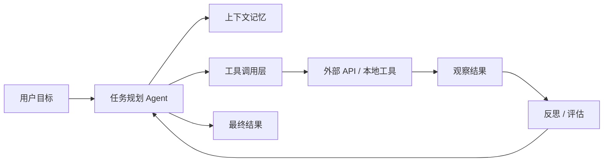
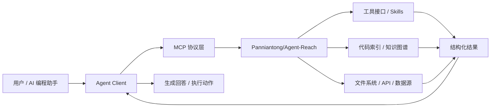
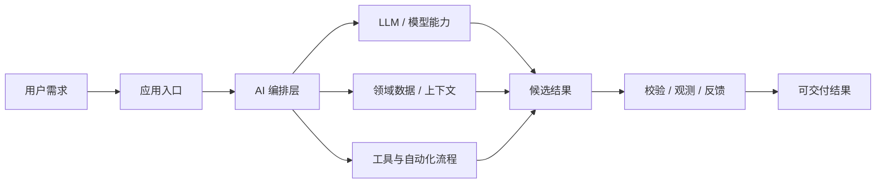
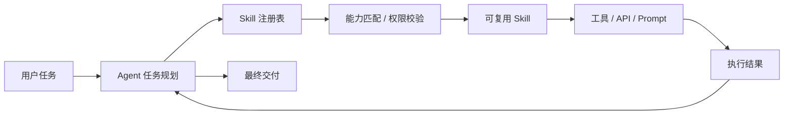

# GitHub AI Daily Trending Top 5

更新时间：2026-09-15T03:08:28Z

筛选范围：仓库名称或描述包含 AI 相关关键词。关键词：ai, agent, agents, agentic, llm, llms, skill, skills, mcp, model context protocol, chatgpt, openai, claude, gemini, copilot, deepseek, rag, embedding, embeddings, transformer, diffusion, machine learning, ml, deep learning, neural, inference, prompt, prompts。

网页版本：由 GitHub Pages 自动发布。

## 1. [alibaba/open-code-review](https://github.com/alibaba/open-code-review)

- 语言：Go
- Stars：26,048
- 主题：agent, agent-skills, code-review, code-review-assistant, harness, repository-level-context
- Star 趋势：

- 作用 / 解决的问题：Fast, efficient, battle-tested at Alibaba's scale. Hybrid architecture code review tool: deterministic pipelines + LLM Agent, precise line-level comments, built-in multi-language ruleset (NPE, thread-safety, XSS, SQL injection), OpenAI & Anthropic compatible.
- 适用场景：
  - 适合快速评估 GitHub AI 热榜中新出现或重新升温的技术方向，因为该仓库已获得短期社区关注。
  - 适合多步骤自动化、工具调用和复杂任务编排场景，因为 Agent 模式能把规划、执行、观察和修正串起来。
- 架构思想：
  - 它成为热榜的核心原因通常不是单点功能，而是把模型能力、工具、数据和工作流组织成更容易落地的工程结构。
  - 当前 Stars 为 26,048，说明它不只是概念验证，还积累了可观的社区验证和传播势能。
  - 相比只提供单一脚本的仓库，它用 agent, agent-skills, code-review, code-review-assistant, harness, repository-level-context 等 topics 明确了能力边界，更容易被目标用户检索和采用。
  - 使用 Go 作为主要实现语言，降低了对应生态开发者集成、扩展和二次开发的成本。
  - 它的稀缺性在于把热门 AI 能力包装成可运行、可组合、可观察的工程入口，而不是停留在论文、提示词或孤立 Demo。
- 原理 / 实现思路：
  - English \| <a href="README.zh-CN.md">简体中文</a> \| <a href="README.ja-JP.md">日本語</a> \| <a href="README.ko-KR.md">한국어</a> \| <a href="README.ru-RU.md">Русский</a>
  - Open Code Review is an AI-powered code review CLI tool. It originated as Alibaba Group's internal official AI code review assistant — over the past two years, it has served tens of thousands of developers and identified millions of code defects. After thorough...
  - It reads Git diffs, sends changed files to a configurable LLM via an agent with tool-use capabilities, and generates structured review comments with line-level precision. The agent can read full file contents, search the codebase, inspect other changed files f...
  - 以上内容由 GitHub 公开 README 自动摘取和归纳，适合作为快速了解入口，深入实现仍以仓库源码和文档为准。

```mermaid
flowchart LR
    User[用户目标] --> Planner[任务规划 Agent]
    Planner --> Memory[上下文记忆]
    Planner --> Tools[工具调用层]
    Tools --> APIs[外部 API / 本地工具]
    APIs --> Observation[观察结果]
    Observation --> Critic[反思 / 评估]
    Critic --> Planner
    Planner --> Deliverable[最终结果]
```

## 2. [multimodal-art-projection/YuE](https://github.com/multimodal-art-projection/YuE)

- 语言：Python
- Stars：8,455
- 主题：ai, audio-generation, deep-learning, foundation-models, gpt, huggingface, llama, llms, music-generation, style-transfers, voice-cloning
- Star 趋势：

- 作用 / 解决的问题：YuE2: frontier music generation with symbolic planning, zero-shot covers, and agentic music editing.
- 适用场景：
  - 适合快速评估 GitHub AI 热榜中新出现或重新升温的技术方向，因为该仓库已获得短期社区关注。
  - 适合多步骤自动化、工具调用和复杂任务编排场景，因为 Agent 模式能把规划、执行、观察和修正串起来。
- 架构思想：
  - 它成为热榜的核心原因通常不是单点功能，而是把模型能力、工具、数据和工作流组织成更容易落地的工程结构。
  - 当前 Stars 为 8,455，说明它不只是概念验证，还积累了可观的社区验证和传播势能。
  - 相比只提供单一脚本的仓库，它用 ai, audio-generation, deep-learning, foundation-models, gpt, huggingface, llama, llms, music-generation, style-transfers, voice-cloning 等 topics 明确了能力边界，更容易被目标用户检索和采用。
  - 使用 Python 作为主要实现语言，降低了对应生态开发者集成、扩展和二次开发的成本。
  - 它的稀缺性在于把热门 AI 能力包装成可运行、可组合、可观察的工程入口，而不是停留在论文、提示词或孤立 Demo。
- 原理 / 实现思路：
  - YuE2 brings frontier song quality to music generation with an editable composition. Give it lyrics and a style prompt: it writes a melody-and-chord plan, then realizes that plan as a complete song with vocals and accompaniment.
  - Frontier quality. YuE2 is competitive with Suno v5/v6 on WildSongBench. YuE2 (best-of-8) achieves 6.9632 SongBench Avg, the highest observed mean among all evaluated settings.
  - White-box music generation through symbolic planning. Read, play, and change the composition before rendering it. Melody and chords become explicit controls that a person or an agent can inspect and edit.
  - 以上内容由 GitHub 公开 README 自动摘取和归纳，适合作为快速了解入口，深入实现仍以仓库源码和文档为准。

```mermaid
flowchart LR
    User[用户目标] --> Planner[任务规划 Agent]
    Planner --> Memory[上下文记忆]
    Planner --> Tools[工具调用层]
    Tools --> APIs[外部 API / 本地工具]
    APIs --> Observation[观察结果]
    Observation --> Critic[反思 / 评估]
    Critic --> Planner
    Planner --> Deliverable[最终结果]
```

## 3. [Panniantong/Agent-Reach](https://github.com/Panniantong/Agent-Reach)

- 语言：Python
- Stars：81,412
- 主题：agent-infrastructure, ai-agent, ai-search, automation, bilibili, claude-code, cli, cursor, free-api, llm-tools, mcp, python, reddit-scraper, twitter-scraper, web-scraper, xiaohongshu, youtube-transcript
- Star 趋势：

- 作用 / 解决的问题：Give your AI agent eyes to see the entire internet. Read & search Twitter, Reddit, YouTube, GitHub, Bilibili, XiaoHongShu — one CLI, zero API fees.
- 适用场景：
  - 适合快速评估 GitHub AI 热榜中新出现或重新升温的技术方向，因为该仓库已获得短期社区关注。
  - 适合需要把外部工具、代码库、数据源接入 AI Agent 的场景，因为 MCP 能把能力封装成标准工具接口。
  - 适合多步骤自动化、工具调用和复杂任务编排场景，因为 Agent 模式能把规划、执行、观察和修正串起来。
- 架构思想：
  - 它成为热榜的核心原因通常不是单点功能，而是把模型能力、工具、数据和工作流组织成更容易落地的工程结构。
  - 当前 Stars 为 81,412，说明它不只是概念验证，还积累了可观的社区验证和传播势能。
  - 相比只提供单一脚本的仓库，它用 agent-infrastructure, ai-agent, ai-search, automation, bilibili, claude-code, cli, cursor, free-api, llm-tools, mcp, python, reddit-scraper, twitter-scraper, web-scraper, xiaohongshu, youtube-transcript 等 topics 明确了能力边界，更容易被目标用户检索和采用。
  - 使用 Python 作为主要实现语言，降低了对应生态开发者集成、扩展和二次开发的成本。
  - 它的稀缺性在于把热门 AI 能力包装成可运行、可组合、可观察的工程入口，而不是停留在论文、提示词或孤立 Demo。
- 原理 / 实现思路：
  - AI Agent 已经能帮你写代码、改文档、管项目——但你让它去网上找点东西，它就抓瞎了：
  - 📺 "帮我看看这个 YouTube 教程讲了什么" → 看不了，拿不到字幕
  - 🐦 "帮我搜一下推特上大家怎么评价这个产品" → 搜不了，Twitter API 要付费
  - 以上内容由 GitHub 公开 README 自动摘取和归纳，适合作为快速了解入口，深入实现仍以仓库源码和文档为准。

```mermaid
flowchart LR
    User[用户 / AI 编程助手] --> Client[Agent Client]
    Client --> Protocol[MCP 协议层]
    Protocol --> Server[Panniantong/Agent-Reach]
    Server --> Tools[工具接口 / Skills]
    Server --> Index[代码索引 / 知识图谱]
    Server --> Data[文件系统 / API / 数据源]
    Tools --> Result[结构化结果]
    Index --> Result
    Data --> Result
    Result --> Client
    Client --> Answer[生成回答 / 执行动作]
```

## 4. [asgeirtj/system_prompts_leaks](https://github.com/asgeirtj/system_prompts_leaks)

- 语言：JavaScript
- Stars：66,848
- 主题：ai, ai-agents, ai-prompts, anthropic, chatbot, chatgpt, claude, claude-code, codex, cursor, gemini, generative-ai, google, grok, llm, openai, prompt, prompt-engineering, system-prompt, system-prompts
- Star 趋势：

- 作用 / 解决的问题：Extracted system prompts from Anthropic - Claude Fable 5.1, Opus 5, Claude Design, Claude Code. OpenAI - ChatGPT GPT-6-Astra, Codex. Google - Gemini 3.8 Flash, 3.1 Pro, Antigravity. xAI - Grok, Grok Bot, Cursor, Kimi and more! Updated regularly.
- 适用场景：
  - 适合快速评估 GitHub AI 热榜中新出现或重新升温的技术方向，因为该仓库已获得短期社区关注。
  - 适合围绕 ai, ai-agents, ai-prompts, anthropic, chatbot, chatgpt, claude, claude-code, codex, cursor, gemini, generative-ai, google, grok, llm, openai, prompt, prompt-engineering, system-prompt, system-prompts 做技术调研、竞品分析或原型验证，因为仓库主题与当前 AI 热点高度相关。
- 架构思想：
  - 它成为热榜的核心原因通常不是单点功能，而是把模型能力、工具、数据和工作流组织成更容易落地的工程结构。
  - 当前 Stars 为 66,848，说明它不只是概念验证，还积累了可观的社区验证和传播势能。
  - 相比只提供单一脚本的仓库，它用 ai, ai-agents, ai-prompts, anthropic, chatbot, chatgpt, claude, claude-code, codex, cursor, gemini, generative-ai, google, grok, llm, openai, prompt, prompt-engineering, system-prompt, system-prompts 等 topics 明确了能力边界，更容易被目标用户检索和采用。
  - 使用 JavaScript 作为主要实现语言，降低了对应生态开发者集成、扩展和二次开发的成本。
  - 它的稀缺性在于把热门 AI 能力包装成可运行、可组合、可观察的工程入口，而不是停留在论文、提示词或孤立 Demo。
- 原理 / 实现思路：
  - Leaked system prompts, captured verbatim — the hidden instructions and rules that ChatGPT, Claude, Gemini, Grok and every other AI chatbot receives before your first message.
  - \| ChatGPT Work Codex (local) \| September 13, 2026 \| [ChatGPT Work Codex local system prompt](OpenAI/Codex/gpt-6-astra-chatgpt-work-local.md) \|
  - \| Gemini 3.8 Flash \| September 13, 2026 \| [Gemini 3.8 Flash System Prompt](Google/gemini-3.8-flash.md) \|
  - 以上内容由 GitHub 公开 README 自动摘取和归纳，适合作为快速了解入口，深入实现仍以仓库源码和文档为准。

```mermaid
flowchart LR
    User[用户需求] --> Interface[应用入口]
    Interface --> Orchestrator[AI 编排层]
    Orchestrator --> Model[LLM / 模型能力]
    Orchestrator --> Data[领域数据 / 上下文]
    Orchestrator --> Tools[工具与自动化流程]
    Model --> Result[候选结果]
    Data --> Result
    Tools --> Result
    Result --> Review[校验 / 观测 / 反馈]
    Review --> Output[可交付结果]
```

## 5. [rlaope/oh-my-hermes](https://github.com/rlaope/oh-my-hermes)

- 语言：Python
- Stars：2,120
- 主题：agent, ai, ai-agent, ai-tools, claude-code, codex, hermes-agent, hermes-skill, skills
- Star 趋势：

- 作用 / 解决的问题：All in one plugin for Hermes Agent ⚚ the coding intelligence, a long-term memory system and model optimized workflow packages
- 适用场景：
  - 适合快速评估 GitHub AI 热榜中新出现或重新升温的技术方向，因为该仓库已获得短期社区关注。
  - 适合多步骤自动化、工具调用和复杂任务编排场景，因为 Agent 模式能把规划、执行、观察和修正串起来。
  - 适合团队沉淀可复用 AI 能力的场景，因为 Skill 把提示词、工具和流程封装成可发现、可组合的单元。
- 架构思想：
  - 它成为热榜的核心原因通常不是单点功能，而是把模型能力、工具、数据和工作流组织成更容易落地的工程结构。
  - 当前 Stars 为 2,120，说明它不只是概念验证，还积累了可观的社区验证和传播势能。
  - 相比只提供单一脚本的仓库，它用 agent, ai, ai-agent, ai-tools, claude-code, codex, hermes-agent, hermes-skill, skills 等 topics 明确了能力边界，更容易被目标用户检索和采用。
  - 使用 Python 作为主要实现语言，降低了对应生态开发者集成、扩展和二次开发的成本。
  - 它的稀缺性在于把热门 AI 能力包装成可运行、可组合、可观察的工程入口，而不是停留在论文、提示词或孤立 Demo。
- 原理 / 实现思路：
  - request into a clear capability, a useful next step, and an honest record
  - of what actually happened — strengthening the workflow you already use,
  - never replacing Hermes or hiding a coding executor behind it.
  - 以上内容由 GitHub 公开 README 自动摘取和归纳，适合作为快速了解入口，深入实现仍以仓库源码和文档为准。

```mermaid
flowchart LR
    User[用户任务] --> Planner[Agent 任务规划]
    Planner --> Registry[Skill 注册表]
    Registry --> Select[能力匹配 / 权限校验]
    Select --> Skill[可复用 Skill]
    Skill --> Tool[工具 / API / Prompt]
    Tool --> Observation[执行结果]
    Observation --> Planner
    Planner --> Output[最终交付]
```

