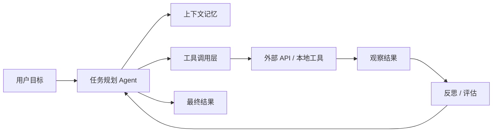
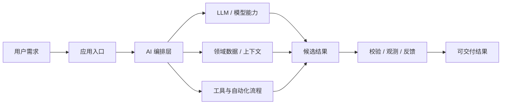

# GitHub AI Daily Trending Top 5

更新时间：2026-09-29T03:57:20Z

筛选范围：仓库名称或描述包含 AI 相关关键词。关键词：ai, agent, agents, agentic, llm, llms, skill, skills, mcp, model context protocol, chatgpt, openai, claude, gemini, copilot, deepseek, rag, embedding, embeddings, transformer, diffusion, machine learning, ml, deep learning, neural, inference, prompt, prompts。

网页版本：由 GitHub Pages 自动发布。

## 1. [paperclipai/paperclip](https://github.com/paperclipai/paperclip)

- 语言：TypeScript
- Stars：93,132
- 主题：未在 GitHub API 中公开 topics
- Star 趋势：

- 作用 / 解决的问题：The open-source app everyone uses to manage agents at work
- 适用场景：
  - 适合快速评估 GitHub AI 热榜中新出现或重新升温的技术方向，因为该仓库已获得短期社区关注。
  - 适合多步骤自动化、工具调用和复杂任务编排场景，因为 Agent 模式能把规划、执行、观察和修正串起来。
- 架构思想：
  - 它成为热榜的核心原因通常不是单点功能，而是把模型能力、工具、数据和工作流组织成更容易落地的工程结构。
  - 当前 Stars 为 93,132，说明它不只是概念验证，还积累了可观的社区验证和传播势能。
  - 使用 TypeScript 作为主要实现语言，降低了对应生态开发者集成、扩展和二次开发的成本。
  - 它的稀缺性在于把热门 AI 能力包装成可运行、可组合、可观察的工程入口，而不是停留在论文、提示词或孤立 Demo。
- 原理 / 实现思路：
  - Paperclip is the app people use to manage AI agents for work.
  - If OpenClaw is an _employee_, Paperclip is the _company_.
  - Paperclip is a Node.js server and React UI that orchestrates a team of AI agents to run a business. Bring your own agents, assign goals, and track work and costs from one dashboard.
  - 以上内容由 GitHub 公开 README 自动摘取和归纳，适合作为快速了解入口，深入实现仍以仓库源码和文档为准。

```mermaid
flowchart LR
    User[用户目标] --> Planner[任务规划 Agent]
    Planner --> Memory[上下文记忆]
    Planner --> Tools[工具调用层]
    Tools --> APIs[外部 API / 本地工具]
    APIs --> Observation[观察结果]
    Observation --> Critic[反思 / 评估]
    Critic --> Planner
    Planner --> Deliverable[最终结果]
```

## 2. [vectorize-io/hindsight](https://github.com/vectorize-io/hindsight)

- 语言：Python
- Stars：41,267
- 主题：agentic-ai, agents, ai-memory, memory
- Star 趋势：

- 作用 / 解决的问题：Hindsight: Agent Memory That Learns
- 适用场景：
  - 适合快速评估 GitHub AI 热榜中新出现或重新升温的技术方向，因为该仓库已获得短期社区关注。
  - 适合多步骤自动化、工具调用和复杂任务编排场景，因为 Agent 模式能把规划、执行、观察和修正串起来。
- 架构思想：
  - 它成为热榜的核心原因通常不是单点功能，而是把模型能力、工具、数据和工作流组织成更容易落地的工程结构。
  - 当前 Stars 为 41,267，说明它不只是概念验证，还积累了可观的社区验证和传播势能。
  - 相比只提供单一脚本的仓库，它用 agentic-ai, agents, ai-memory, memory 等 topics 明确了能力边界，更容易被目标用户检索和采用。
  - 使用 Python 作为主要实现语言，降低了对应生态开发者集成、扩展和二次开发的成本。
  - 它的稀缺性在于把热门 AI 能力包装成可运行、可组合、可观察的工程入口，而不是停留在论文、提示词或孤立 Demo。
- 原理 / 实现思路：
  - Hindsight™ is an agent memory system built to create smarter agents that learn over time. Most agent memory systems focus on recalling conversation history. Hindsight is focused on making agents that learn, not just remember.
  - It eliminates the shortcomings of alternative techniques such as RAG and knowledge graph and delivers state-of-the-art performance on long term memory tasks.
  - [Memory Performance & Accuracy](#memory-performance--accuracy)
  - 以上内容由 GitHub 公开 README 自动摘取和归纳，适合作为快速了解入口，深入实现仍以仓库源码和文档为准。

```mermaid
flowchart LR
    User[用户目标] --> Planner[任务规划 Agent]
    Planner --> Memory[上下文记忆]
    Planner --> Tools[工具调用层]
    Tools --> APIs[外部 API / 本地工具]
    APIs --> Observation[观察结果]
    Observation --> Critic[反思 / 评估]
    Critic --> Planner
    Planner --> Deliverable[最终结果]
```

## 3. [byoungd/up](https://github.com/byoungd/up)

- 语言：JavaScript
- Stars：64,885
- 主题：chinese, english-learning, tutorial
- Star 趋势：

- 作用 / 解决的问题：An advanced guide which might benefit you a lot 🎉 . 韩先凯的人生进阶指南 人生进阶指南 离谱的人生 人生进阶 AI学习 AI指南 韩先凯的AI学习指南 英语学习指南/英语学习教程/英语学习/学英语
- 适用场景：
  - 适合快速评估 GitHub AI 热榜中新出现或重新升温的技术方向，因为该仓库已获得短期社区关注。
  - 适合围绕 chinese, english-learning, tutorial 做技术调研、竞品分析或原型验证，因为仓库主题与当前 AI 热点高度相关。
- 架构思想：
  - 它成为热榜的核心原因通常不是单点功能，而是把模型能力、工具、数据和工作流组织成更容易落地的工程结构。
  - 当前 Stars 为 64,885，说明它不只是概念验证，还积累了可观的社区验证和传播势能。
  - 相比只提供单一脚本的仓库，它用 chinese, english-learning, tutorial 等 topics 明确了能力边界，更容易被目标用户检索和采用。
  - 使用 JavaScript 作为主要实现语言，降低了对应生态开发者集成、扩展和二次开发的成本。
  - 它的稀缺性在于把热门 AI 能力包装成可运行、可组合、可观察的工程入口，而不是停留在论文、提示词或孤立 Demo。
- 原理 / 实现思路：
  - description: 《人生进阶指南》帮助普通人在 AI 时代持续学习、完成真实项目、穿越人生低谷并留下成长证据。
  - 副标题：AI 时代终身学习指南。这是一份持续更新的书稿，从英语这扇具体的门出发，写到 AI 学习、真实项目、创业失败、身体恢复，以及一个普通人怎样把生活一点点交还给自己。
  - AI 正在让答案变得前所未有地廉价。几秒钟里，我们可以得到一份解释、一段代码、一张计划表，甚至一个看似笃定的人生建议。可真正稀缺的东西并没有因此消失：知道什么问题值得追问，辨别什么证据可以相信，把建议变成真实作品，并为最后的判断承担责任。
  - 以上内容由 GitHub 公开 README 自动摘取和归纳，适合作为快速了解入口，深入实现仍以仓库源码和文档为准。

```mermaid
flowchart LR
    User[用户需求] --> Interface[应用入口]
    Interface --> Orchestrator[AI 编排层]
    Orchestrator --> Model[LLM / 模型能力]
    Orchestrator --> Data[领域数据 / 上下文]
    Orchestrator --> Tools[工具与自动化流程]
    Model --> Result[候选结果]
    Data --> Result
    Tools --> Result
    Result --> Review[校验 / 观测 / 反馈]
    Review --> Output[可交付结果]
```

## 4. [mvschwarz/openrig](https://github.com/mvschwarz/openrig)

- 语言：TypeScript
- Stars：1,833
- 主题：agent-harness, agent-orchestration, agent-skills, ai-coding, claude-code, cli, codex-cli, multi-agent, multi-agent-systems, tmux, typescript
- Star 趋势：

- 作用 / 解决的问题：Multi-agent harness that runs Claude Code and Codex together as one system
- 适用场景：
  - 适合快速评估 GitHub AI 热榜中新出现或重新升温的技术方向，因为该仓库已获得短期社区关注。
  - 适合多步骤自动化、工具调用和复杂任务编排场景，因为 Agent 模式能把规划、执行、观察和修正串起来。
- 架构思想：
  - 它成为热榜的核心原因通常不是单点功能，而是把模型能力、工具、数据和工作流组织成更容易落地的工程结构。
  - 当前 Stars 为 1,833，说明它不只是概念验证，还积累了可观的社区验证和传播势能。
  - 相比只提供单一脚本的仓库，它用 agent-harness, agent-orchestration, agent-skills, ai-coding, claude-code, cli, codex-cli, multi-agent, multi-agent-systems, tmux, typescript 等 topics 明确了能力边界，更容易被目标用户检索和采用。
  - 使用 TypeScript 作为主要实现语言，降低了对应生态开发者集成、扩展和二次开发的成本。
  - 它的稀缺性在于把热门 AI 能力包装成可运行、可组合、可观察的工程入口，而不是停留在论文、提示词或孤立 Demo。
- 原理 / 实现思路：
  - A harness wraps a model. A rig wraps your harnesses. Define your agent team in YAML, boot it with one command. Claude Code and Codex in the same rig, managed as one system.
  - Requires Node.js 22 or 24 and tmux, on macOS or Linux. On a Mac with Apple silicon, use Node.js 22 ([compatibility history](docs/releases/v0.5.15.md#known-compatibility-limitation)). Native Windows is not supported yet, and WSL2 has not been tested. Launching ...
  - To install with Bun instead, run bun add -g @openrig/cli. OpenRig still runs on Node.js, so install Node.js 22 as well. Bun may block this package's postinstall script, in which case the Node.js and SQLite check described under [what OpenRig changes on your ma...
  - 以上内容由 GitHub 公开 README 自动摘取和归纳，适合作为快速了解入口，深入实现仍以仓库源码和文档为准。

```mermaid
flowchart LR
    User[用户目标] --> Planner[任务规划 Agent]
    Planner --> Memory[上下文记忆]
    Planner --> Tools[工具调用层]
    Tools --> APIs[外部 API / 本地工具]
    APIs --> Observation[观察结果]
    Observation --> Critic[反思 / 评估]
    Critic --> Planner
    Planner --> Deliverable[最终结果]
```

## 5. [dream-num/univer](https://github.com/dream-num/univer)

- 语言：TypeScript
- Stars：21,366
- 主题：board, collaboration, data-table, doc, docx, excel, grid, pdf, ppt, pptx, presentation, sdk, sheet, slides, spreadsheet, table, word, wordprocessor, xlsx
- Star 趋势：

- 作用 / 解决的问题：The Office Harness for AI Agents — Spreadsheets, Docs, Slides, Canvas, Relational Tables, and PDF in one runtime.
- 适用场景：
  - 适合快速评估 GitHub AI 热榜中新出现或重新升温的技术方向，因为该仓库已获得短期社区关注。
  - 适合多步骤自动化、工具调用和复杂任务编排场景，因为 Agent 模式能把规划、执行、观察和修正串起来。
- 架构思想：
  - 它成为热榜的核心原因通常不是单点功能，而是把模型能力、工具、数据和工作流组织成更容易落地的工程结构。
  - 当前 Stars 为 21,366，说明它不只是概念验证，还积累了可观的社区验证和传播势能。
  - 相比只提供单一脚本的仓库，它用 board, collaboration, data-table, doc, docx, excel, grid, pdf, ppt, pptx, presentation, sdk, sheet, slides, spreadsheet, table, word, wordprocessor, xlsx 等 topics 明确了能力边界，更容易被目标用户检索和采用。
  - 使用 TypeScript 作为主要实现语言，降低了对应生态开发者集成、扩展和二次开发的成本。
  - 它的稀缺性在于把热门 AI 能力包装成可运行、可组合、可观察的工程入口，而不是停留在论文、提示词或孤立 Demo。
- 原理 / 实现思路：
  - Spreadsheets · Documents · Presentations · Bases · Boards · PDFs
  - Build embeddable productivity experiences with a plugin architecture, Canvas-based rendering,
  - a formula engine, and one Facade API that works in the browser and on Node.js.
  - 以上内容由 GitHub 公开 README 自动摘取和归纳，适合作为快速了解入口，深入实现仍以仓库源码和文档为准。

```mermaid
flowchart LR
    User[用户目标] --> Planner[任务规划 Agent]
    Planner --> Memory[上下文记忆]
    Planner --> Tools[工具调用层]
    Tools --> APIs[外部 API / 本地工具]
    APIs --> Observation[观察结果]
    Observation --> Critic[反思 / 评估]
    Critic --> Planner
    Planner --> Deliverable[最终结果]
```

