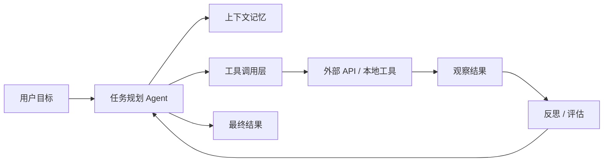
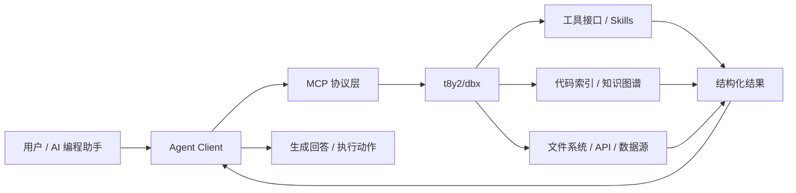

# GitHub AI Daily Trending Top 5

更新时间：2026-09-30T03:44:56Z

筛选范围：仓库名称或描述包含 AI 相关关键词。关键词：ai, agent, agents, agentic, llm, llms, skill, skills, mcp, model context protocol, chatgpt, openai, claude, gemini, copilot, deepseek, rag, embedding, embeddings, transformer, diffusion, machine learning, ml, deep learning, neural, inference, prompt, prompts。

网页版本：由 GitHub Pages 自动发布。

## 1. [NVIDIA/OpenShell](https://github.com/NVIDIA/OpenShell)

- 语言：Rust
- Stars：10,772
- 主题：未在 GitHub API 中公开 topics
- Star 趋势：

- 作用 / 解决的问题：OpenShell is the safe, private runtime for autonomous AI agents.
- 适用场景：
  - 适合快速评估 GitHub AI 热榜中新出现或重新升温的技术方向，因为该仓库已获得短期社区关注。
  - 适合多步骤自动化、工具调用和复杂任务编排场景，因为 Agent 模式能把规划、执行、观察和修正串起来。
- 架构思想：
  - 它成为热榜的核心原因通常不是单点功能，而是把模型能力、工具、数据和工作流组织成更容易落地的工程结构。
  - 当前 Stars 为 10,772，说明它不只是概念验证，还积累了可观的社区验证和传播势能。
  - 使用 Rust 作为主要实现语言，降低了对应生态开发者集成、扩展和二次开发的成本。
  - 它的稀缺性在于把热门 AI 能力包装成可运行、可组合、可观察的工程入口，而不是停留在论文、提示词或孤立 Demo。
- 原理 / 实现思路：
  - OpenShell is the safe, private runtime for fleets of autonomous AI agents. Agents are most useful when they can read files, install packages, call APIs, and use credentials. OpenShell gives them that capability without giving them unrestricted access to your d...
  - OpenShell governs what agents can do in two ways: it instruments the kernel to enforce policy on every file access, system call, and network connection at runtime, and it uses formal verification to check what a policy change would allow before it is applied.
  - Formally verified policy changes. Before a policy change is approved, OpenShell uses formal verification to flag risky new access it would grant, such as reaching a new host with credentials or calling a new API method, so those changes wait for human review.
  - 以上内容由 GitHub 公开 README 自动摘取和归纳，适合作为快速了解入口，深入实现仍以仓库源码和文档为准。

```mermaid
flowchart LR
    User[用户目标] --> Planner[任务规划 Agent]
    Planner --> Memory[上下文记忆]
    Planner --> Tools[工具调用层]
    Tools --> APIs[外部 API / 本地工具]
    APIs --> Observation[观察结果]
    Observation --> Critic[反思 / 评估]
    Critic --> Planner
    Planner --> Deliverable[最终结果]
```

## 2. [vectorize-io/hindsight](https://github.com/vectorize-io/hindsight)

- 语言：Python
- Stars：43,035
- 主题：agentic-ai, agents, ai-memory, memory
- Star 趋势：

- 作用 / 解决的问题：Hindsight: Agent Memory That Learns
- 适用场景：
  - 适合快速评估 GitHub AI 热榜中新出现或重新升温的技术方向，因为该仓库已获得短期社区关注。
  - 适合多步骤自动化、工具调用和复杂任务编排场景，因为 Agent 模式能把规划、执行、观察和修正串起来。
- 架构思想：
  - 它成为热榜的核心原因通常不是单点功能，而是把模型能力、工具、数据和工作流组织成更容易落地的工程结构。
  - 当前 Stars 为 43,035，说明它不只是概念验证，还积累了可观的社区验证和传播势能。
  - 相比只提供单一脚本的仓库，它用 agentic-ai, agents, ai-memory, memory 等 topics 明确了能力边界，更容易被目标用户检索和采用。
  - 使用 Python 作为主要实现语言，降低了对应生态开发者集成、扩展和二次开发的成本。
  - 它的稀缺性在于把热门 AI 能力包装成可运行、可组合、可观察的工程入口，而不是停留在论文、提示词或孤立 Demo。
- 原理 / 实现思路：
  - Hindsight™ is an agent memory system built to create smarter agents that learn over time. Most agent memory systems focus on recalling conversation history. Hindsight is focused on making agents that learn, not just remember.
  - It eliminates the shortcomings of alternative techniques such as RAG and knowledge graph and delivers state-of-the-art performance on long term memory tasks.
  - [Memory Performance & Accuracy](#memory-performance--accuracy)
  - 以上内容由 GitHub 公开 README 自动摘取和归纳，适合作为快速了解入口，深入实现仍以仓库源码和文档为准。

```mermaid
flowchart LR
    User[用户目标] --> Planner[任务规划 Agent]
    Planner --> Memory[上下文记忆]
    Planner --> Tools[工具调用层]
    Tools --> APIs[外部 API / 本地工具]
    APIs --> Observation[观察结果]
    Observation --> Critic[反思 / 评估]
    Critic --> Planner
    Planner --> Deliverable[最终结果]
```

## 3. [paperclipai/paperclip](https://github.com/paperclipai/paperclip)

- 语言：TypeScript
- Stars：94,618
- 主题：未在 GitHub API 中公开 topics
- Star 趋势：

- 作用 / 解决的问题：The open-source app everyone uses to manage agents at work
- 适用场景：
  - 适合快速评估 GitHub AI 热榜中新出现或重新升温的技术方向，因为该仓库已获得短期社区关注。
  - 适合多步骤自动化、工具调用和复杂任务编排场景，因为 Agent 模式能把规划、执行、观察和修正串起来。
- 架构思想：
  - 它成为热榜的核心原因通常不是单点功能，而是把模型能力、工具、数据和工作流组织成更容易落地的工程结构。
  - 当前 Stars 为 94,618，说明它不只是概念验证，还积累了可观的社区验证和传播势能。
  - 使用 TypeScript 作为主要实现语言，降低了对应生态开发者集成、扩展和二次开发的成本。
  - 它的稀缺性在于把热门 AI 能力包装成可运行、可组合、可观察的工程入口，而不是停留在论文、提示词或孤立 Demo。
- 原理 / 实现思路：
  - Paperclip is the app people use to manage AI agents for work.
  - If OpenClaw is an _employee_, Paperclip is the _company_.
  - Paperclip is a Node.js server and React UI that orchestrates a team of AI agents to run a business. Bring your own agents, assign goals, and track work and costs from one dashboard.
  - 以上内容由 GitHub 公开 README 自动摘取和归纳，适合作为快速了解入口，深入实现仍以仓库源码和文档为准。

```mermaid
flowchart LR
    User[用户目标] --> Planner[任务规划 Agent]
    Planner --> Memory[上下文记忆]
    Planner --> Tools[工具调用层]
    Tools --> APIs[外部 API / 本地工具]
    APIs --> Observation[观察结果]
    Observation --> Critic[反思 / 评估]
    Critic --> Planner
    Planner --> Deliverable[最终结果]
```

## 4. [t8y2/dbx](https://github.com/t8y2/dbx)

- 语言：Rust
- Stars：22,267
- 主题：ai, cli, clickhouse, database, database-client, database-management, docker, gui, mcp, mongodb, mysql, postgresql, redis, rust, sql-server, sqlite, tauri, vue
- Star 趋势：

- 作用 / 解决的问题：25 MB lightweight cross-platform database client for 100+ databases, including MySQL, PostgreSQL, SQLite, Redis, MongoDB, DuckDB, SQL Server, and Dameng. Built-in AI, MCP Server, CLI, desktop and Docker. \| 轻量级跨平台数据库管理工具，支持 MySQL、PostgreSQL、SQLite、Redis、MongoDB、达梦等 100+ 数据库，提供桌面端、Docker、CLI、内置 AI 助手和 MCP。
- 适用场景：
  - 适合快速评估 GitHub AI 热榜中新出现或重新升温的技术方向，因为该仓库已获得短期社区关注。
  - 适合需要把外部工具、代码库、数据源接入 AI Agent 的场景，因为 MCP 能把能力封装成标准工具接口。
- 架构思想：
  - 它成为热榜的核心原因通常不是单点功能，而是把模型能力、工具、数据和工作流组织成更容易落地的工程结构。
  - 当前 Stars 为 22,267，说明它不只是概念验证，还积累了可观的社区验证和传播势能。
  - 相比只提供单一脚本的仓库，它用 ai, cli, clickhouse, database, database-client, database-management, docker, gui, mcp, mongodb, mysql, postgresql, redis, rust, sql-server, sqlite, tauri, vue 等 topics 明确了能力边界，更容易被目标用户检索和采用。
  - 使用 Rust 作为主要实现语言，降低了对应生态开发者集成、扩展和二次开发的成本。
  - 它的稀缺性在于把热门 AI 能力包装成可运行、可组合、可观察的工程入口，而不是停留在论文、提示词或孤立 Demo。
- 原理 / 实现思路：
  - English \| <a href="README.zh-CN.md">前往中文版本</a>
  - RainYun is a cloud service provider offering cloud servers, physical servers, game hosting, and developer-friendly infrastructure services.
  - TrustAsia provides cloud-based code signing service for DBX, enabling trusted software through automated CI/CD builds.
  - 以上内容由 GitHub 公开 README 自动摘取和归纳，适合作为快速了解入口，深入实现仍以仓库源码和文档为准。

```mermaid
flowchart LR
    User[用户 / AI 编程助手] --> Client[Agent Client]
    Client --> Protocol[MCP 协议层]
    Protocol --> Server[t8y2/dbx]
    Server --> Tools[工具接口 / Skills]
    Server --> Index[代码索引 / 知识图谱]
    Server --> Data[文件系统 / API / 数据源]
    Tools --> Result[结构化结果]
    Index --> Result
    Data --> Result
    Result --> Client
    Client --> Answer[生成回答 / 执行动作]
```

## 5. [mvschwarz/openrig](https://github.com/mvschwarz/openrig)

- 语言：TypeScript
- Stars：2,509
- 主题：agent-harness, agent-orchestration, agent-skills, ai-coding, claude-code, cli, codex-cli, multi-agent, multi-agent-systems, tmux, typescript
- Star 趋势：

- 作用 / 解决的问题：Multi-agent harness that runs Claude Code and Codex together as one system
- 适用场景：
  - 适合快速评估 GitHub AI 热榜中新出现或重新升温的技术方向，因为该仓库已获得短期社区关注。
  - 适合多步骤自动化、工具调用和复杂任务编排场景，因为 Agent 模式能把规划、执行、观察和修正串起来。
- 架构思想：
  - 它成为热榜的核心原因通常不是单点功能，而是把模型能力、工具、数据和工作流组织成更容易落地的工程结构。
  - 当前 Stars 为 2,509，说明它不只是概念验证，还积累了可观的社区验证和传播势能。
  - 相比只提供单一脚本的仓库，它用 agent-harness, agent-orchestration, agent-skills, ai-coding, claude-code, cli, codex-cli, multi-agent, multi-agent-systems, tmux, typescript 等 topics 明确了能力边界，更容易被目标用户检索和采用。
  - 使用 TypeScript 作为主要实现语言，降低了对应生态开发者集成、扩展和二次开发的成本。
  - 它的稀缺性在于把热门 AI 能力包装成可运行、可组合、可观察的工程入口，而不是停留在论文、提示词或孤立 Demo。
- 原理 / 实现思路：
  - A harness wraps a model. A rig wraps your harnesses. Define your agent team in YAML, boot it with one command. Claude Code and Codex in the same rig, managed as one system.
  - Start here: [the guided first-use path](docs/reference/getting-started.md): install, launch a two-agent team in your repository, and get one reviewed change.
  - Requires Node.js 22 or 24 and tmux, on macOS or Linux. On a Mac with Apple silicon, use Node.js 22 ([compatibility history](docs/releases/v0.5.15.md#known-compatibility-limitation)). Native Windows is not supported yet, and WSL2 has not been tested. Launching ...
  - 以上内容由 GitHub 公开 README 自动摘取和归纳，适合作为快速了解入口，深入实现仍以仓库源码和文档为准。

```mermaid
flowchart LR
    User[用户目标] --> Planner[任务规划 Agent]
    Planner --> Memory[上下文记忆]
    Planner --> Tools[工具调用层]
    Tools --> APIs[外部 API / 本地工具]
    APIs --> Observation[观察结果]
    Observation --> Critic[反思 / 评估]
    Critic --> Planner
    Planner --> Deliverable[最终结果]
```

