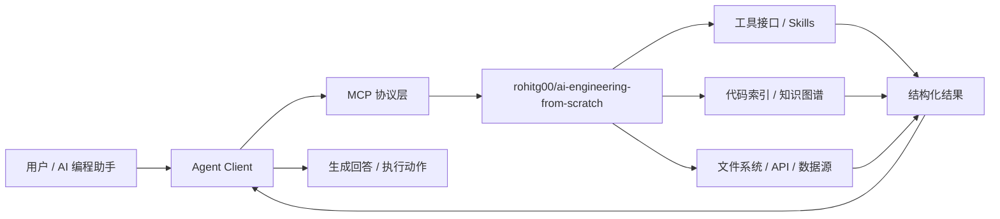
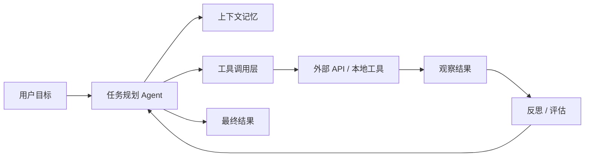
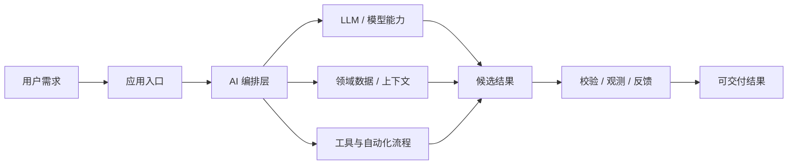

# GitHub AI Daily Trending Top 5

更新时间：2026-09-25T03:11:07Z

筛选范围：仓库名称或描述包含 AI 相关关键词。关键词：ai, agent, agents, agentic, llm, llms, skill, skills, mcp, model context protocol, chatgpt, openai, claude, gemini, copilot, deepseek, rag, embedding, embeddings, transformer, diffusion, machine learning, ml, deep learning, neural, inference, prompt, prompts。

网页版本：由 GitHub Pages 自动发布。

## 1. [rohitg00/ai-engineering-from-scratch](https://github.com/rohitg00/ai-engineering-from-scratch)

- 语言：Python
- Stars：56,659
- 主题：agents, ai, ai-agents, ai-engineering, computer-vision, course, deep-learning, from-scratch, generative-ai, llm, machine-learning, mcp, nlp, python, reinforcement-learning, rust, swarm-intelligence, transformers, tutorial, typescript
- Star 趋势：

- 作用 / 解决的问题：Learn it. Build it. Ship it for others.
- 适用场景：
  - 适合快速评估 GitHub AI 热榜中新出现或重新升温的技术方向，因为该仓库已获得短期社区关注。
  - 适合需要把外部工具、代码库、数据源接入 AI Agent 的场景，因为 MCP 能把能力封装成标准工具接口。
  - 适合多步骤自动化、工具调用和复杂任务编排场景，因为 Agent 模式能把规划、执行、观察和修正串起来。
- 架构思想：
  - 它成为热榜的核心原因通常不是单点功能，而是把模型能力、工具、数据和工作流组织成更容易落地的工程结构。
  - 当前 Stars 为 56,659，说明它不只是概念验证，还积累了可观的社区验证和传播势能。
  - 相比只提供单一脚本的仓库，它用 agents, ai, ai-agents, ai-engineering, computer-vision, course, deep-learning, from-scratch, generative-ai, llm, machine-learning, mcp, nlp, python, reinforcement-learning, rust, swarm-intelligence, transformers, tutorial, typescript 等 topics 明确了能力边界，更容易被目标用户检索和采用。
  - 使用 Python 作为主要实现语言，降低了对应生态开发者集成、扩展和二次开发的成本。
  - 它的稀缺性在于把热门 AI 能力包装成可运行、可组合、可观察的工程入口，而不是停留在论文、提示词或孤立 Demo。
- 原理 / 实现思路：
  - 84% of students already use AI tools. Only 18% feel prepared to use them
  - 523 lessons. 20 phases. ~342 hours. Python, TypeScript, Rust, Julia. Every lesson ships
  - a reusable artifact: a prompt, a skill, an agent, an MCP server. Free, open source, MIT.
  - 以上内容由 GitHub 公开 README 自动摘取和归纳，适合作为快速了解入口，深入实现仍以仓库源码和文档为准。

```mermaid
flowchart LR
    User[用户 / AI 编程助手] --> Client[Agent Client]
    Client --> Protocol[MCP 协议层]
    Protocol --> Server[rohitg00/ai-engineering-from-scratch]
    Server --> Tools[工具接口 / Skills]
    Server --> Index[代码索引 / 知识图谱]
    Server --> Data[文件系统 / API / 数据源]
    Tools --> Result[结构化结果]
    Index --> Result
    Data --> Result
    Result --> Client
    Client --> Answer[生成回答 / 执行动作]
```

## 2. [vectorize-io/hindsight](https://github.com/vectorize-io/hindsight)

- 语言：Python
- Stars：27,882
- 主题：agentic-ai, agents, ai-memory, memory
- Star 趋势：

- 作用 / 解决的问题：Hindsight: Agent Memory That Learns
- 适用场景：
  - 适合快速评估 GitHub AI 热榜中新出现或重新升温的技术方向，因为该仓库已获得短期社区关注。
  - 适合多步骤自动化、工具调用和复杂任务编排场景，因为 Agent 模式能把规划、执行、观察和修正串起来。
- 架构思想：
  - 它成为热榜的核心原因通常不是单点功能，而是把模型能力、工具、数据和工作流组织成更容易落地的工程结构。
  - 当前 Stars 为 27,882，说明它不只是概念验证，还积累了可观的社区验证和传播势能。
  - 相比只提供单一脚本的仓库，它用 agentic-ai, agents, ai-memory, memory 等 topics 明确了能力边界，更容易被目标用户检索和采用。
  - 使用 Python 作为主要实现语言，降低了对应生态开发者集成、扩展和二次开发的成本。
  - 它的稀缺性在于把热门 AI 能力包装成可运行、可组合、可观察的工程入口，而不是停留在论文、提示词或孤立 Demo。
- 原理 / 实现思路：
  - Hindsight™ is an agent memory system built to create smarter agents that learn over time. Most agent memory systems focus on recalling conversation history. Hindsight is focused on making agents that learn, not just remember.
  - It eliminates the shortcomings of alternative techniques such as RAG and knowledge graph and delivers state-of-the-art performance on long term memory tasks.
  - [Memory Performance & Accuracy](#memory-performance--accuracy)
  - 以上内容由 GitHub 公开 README 自动摘取和归纳，适合作为快速了解入口，深入实现仍以仓库源码和文档为准。

```mermaid
flowchart LR
    User[用户目标] --> Planner[任务规划 Agent]
    Planner --> Memory[上下文记忆]
    Planner --> Tools[工具调用层]
    Tools --> APIs[外部 API / 本地工具]
    APIs --> Observation[观察结果]
    Observation --> Critic[反思 / 评估]
    Critic --> Planner
    Planner --> Deliverable[最终结果]
```

## 3. [dream-num/univer](https://github.com/dream-num/univer)

- 语言：TypeScript
- Stars：17,863
- 主题：board, collaboration, data-table, doc, docx, excel, grid, pdf, ppt, pptx, presentation, sdk, sheet, slides, spreadsheet, table, word, wordprocessor, xlsx
- Star 趋势：

- 作用 / 解决的问题：The Office Harness for AI Agents — Spreadsheets, Docs, Slides, Canvas, Relational Tables, and PDF in one runtime.
- 适用场景：
  - 适合快速评估 GitHub AI 热榜中新出现或重新升温的技术方向，因为该仓库已获得短期社区关注。
  - 适合多步骤自动化、工具调用和复杂任务编排场景，因为 Agent 模式能把规划、执行、观察和修正串起来。
- 架构思想：
  - 它成为热榜的核心原因通常不是单点功能，而是把模型能力、工具、数据和工作流组织成更容易落地的工程结构。
  - 当前 Stars 为 17,863，说明它不只是概念验证，还积累了可观的社区验证和传播势能。
  - 相比只提供单一脚本的仓库，它用 board, collaboration, data-table, doc, docx, excel, grid, pdf, ppt, pptx, presentation, sdk, sheet, slides, spreadsheet, table, word, wordprocessor, xlsx 等 topics 明确了能力边界，更容易被目标用户检索和采用。
  - 使用 TypeScript 作为主要实现语言，降低了对应生态开发者集成、扩展和二次开发的成本。
  - 它的稀缺性在于把热门 AI 能力包装成可运行、可组合、可观察的工程入口，而不是停留在论文、提示词或孤立 Demo。
- 原理 / 实现思路：
  - Spreadsheets · Documents · Presentations · Bases · Boards · PDFs (coming soon)
  - Build embeddable productivity experiences with a plugin architecture, Canvas-based rendering,
  - a formula engine, and one Facade API that works in the browser and on Node.js.
  - 以上内容由 GitHub 公开 README 自动摘取和归纳，适合作为快速了解入口，深入实现仍以仓库源码和文档为准。

```mermaid
flowchart LR
    User[用户目标] --> Planner[任务规划 Agent]
    Planner --> Memory[上下文记忆]
    Planner --> Tools[工具调用层]
    Tools --> APIs[外部 API / 本地工具]
    APIs --> Observation[观察结果]
    Observation --> Critic[反思 / 评估]
    Critic --> Planner
    Planner --> Deliverable[最终结果]
```

## 4. [google/ax](https://github.com/google/ax)

- 语言：Go
- Stars：10,558
- 主题：未在 GitHub API 中公开 topics
- Star 趋势：

- 作用 / 解决的问题：Google's open agentic orchestration runtime
- 适用场景：
  - 适合快速评估 GitHub AI 热榜中新出现或重新升温的技术方向，因为该仓库已获得短期社区关注。
  - 适合多步骤自动化、工具调用和复杂任务编排场景，因为 Agent 模式能把规划、执行、观察和修正串起来。
- 架构思想：
  - 它成为热榜的核心原因通常不是单点功能，而是把模型能力、工具、数据和工作流组织成更容易落地的工程结构。
  - 当前 Stars 为 10,558，说明它不只是概念验证，还积累了可观的社区验证和传播势能。
  - 使用 Go 作为主要实现语言，降低了对应生态开发者集成、扩展和二次开发的成本。
  - 它的稀缺性在于把热门 AI 能力包装成可运行、可组合、可观察的工程入口，而不是停留在论文、提示词或孤立 Demo。
- 原理 / 实现思路：
  - We are still actively refining our core concepts, protocols,
  - and specifications. We will likely to introduce major breaking
  - Declare an agentic task with workspaces and model specifications. AX sandboxes it, wires up its workspace, and helps running it at scale.
  - 以上内容由 GitHub 公开 README 自动摘取和归纳，适合作为快速了解入口，深入实现仍以仓库源码和文档为准。

```mermaid
flowchart LR
    User[用户目标] --> Planner[任务规划 Agent]
    Planner --> Memory[上下文记忆]
    Planner --> Tools[工具调用层]
    Tools --> APIs[外部 API / 本地工具]
    APIs --> Observation[观察结果]
    Observation --> Critic[反思 / 评估]
    Critic --> Planner
    Planner --> Deliverable[最终结果]
```

## 5. [NVIDIA/Model-Optimizer](https://github.com/NVIDIA/Model-Optimizer)

- 语言：Python
- Stars：4,114
- 主题：未在 GitHub API 中公开 topics
- Star 趋势：

- 作用 / 解决的问题：A unified library of SOTA model optimization techniques like quantization, distillation, pruning, neural architecture search, speculative decoding, etc. It compresses deep learning models for downstream deployment frameworks like TensorRT-LLM, TensorRT, vLLM, etc. to optimize inference speed.
- 适用场景：
  - 适合快速评估 GitHub AI 热榜中新出现或重新升温的技术方向，因为该仓库已获得短期社区关注。
  - 适合围绕 未在 GitHub API 中公开 topics 做技术调研、竞品分析或原型验证，因为仓库主题与当前 AI 热点高度相关。
- 架构思想：
  - 它成为热榜的核心原因通常不是单点功能，而是把模型能力、工具、数据和工作流组织成更容易落地的工程结构。
  - 当前 Stars 为 4,114，说明它不只是概念验证，还积累了可观的社区验证和传播势能。
  - 使用 Python 作为主要实现语言，降低了对应生态开发者集成、扩展和二次开发的成本。
  - 它的稀缺性在于把热门 AI 能力包装成可运行、可组合、可观察的工程入口，而不是停留在论文、提示词或孤立 Demo。
- 原理 / 实现思路：
  - NVIDIA Model Optimizer (referred to as Model Optimizer, or ModelOpt) is a library comprising state-of-the-art model optimization [techniques](#techniques) including quantization, pruning, Neural Architecture Search (NAS), distillation, speculative decoding and...
  - [Optimize] Model Optimizer provides Python APIs for users to easily compose the above model optimization techniques and export an optimized quantized checkpoint.
  - [2026/09/16] [End-to-end W4A4 NVFP4 + QAD tutorial for Qwen3.6-35B-A3B](./examples/megatron_bridge/tutorials/Qwen3.6-35B-A3B): NVFP4 W4A4 PTQ plus quantization-aware distillation, reaching up to 1.30x vLLM throughput over BF16 and 3.1x smaller checkpoints whil...
  - 以上内容由 GitHub 公开 README 自动摘取和归纳，适合作为快速了解入口，深入实现仍以仓库源码和文档为准。

```mermaid
flowchart LR
    User[用户需求] --> Interface[应用入口]
    Interface --> Orchestrator[AI 编排层]
    Orchestrator --> Model[LLM / 模型能力]
    Orchestrator --> Data[领域数据 / 上下文]
    Orchestrator --> Tools[工具与自动化流程]
    Model --> Result[候选结果]
    Data --> Result
    Tools --> Result
    Result --> Review[校验 / 观测 / 反馈]
    Review --> Output[可交付结果]
```

