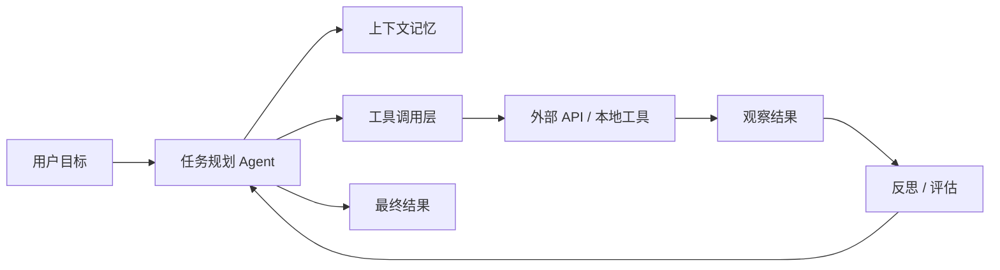
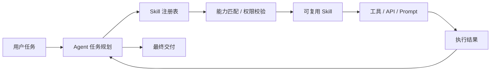

# GitHub AI Daily Trending Top 5

更新时间：2026-11-17T06:17:07Z

筛选范围：仓库名称或描述包含 AI 相关关键词。关键词：ai, agent, agents, agentic, llm, llms, skill, skills, mcp, model context protocol, chatgpt, openai, claude, gemini, copilot, deepseek, rag, embedding, embeddings, transformer, diffusion, machine learning, ml, deep learning, neural, inference, prompt, prompts。

网页版本：由 GitHub Pages 自动发布。

## 1. [ag-ui-protocol/ag-ui](https://github.com/ag-ui-protocol/ag-ui)

- 语言：TypeScript
- Stars：19,383
- 主题：ag-ui-protocol, agent-frontend, agent-ui, agentic-workflow, ai-agents
- Star 趋势：

- 作用 / 解决的问题：AG-UI: the Agent-User Interaction Protocol. Bring Agents into Frontend Applications.
- 适用场景：
  - 适合快速评估 GitHub AI 热榜中新出现或重新升温的技术方向，因为该仓库已获得短期社区关注。
  - 适合多步骤自动化、工具调用和复杂任务编排场景，因为 Agent 模式能把规划、执行、观察和修正串起来。
- 架构思想：
  - 它成为热榜的核心原因通常不是单点功能，而是把模型能力、工具、数据和工作流组织成更容易落地的工程结构。
  - 当前 Stars 为 19,383，说明它不只是概念验证，还积累了可观的社区验证和传播势能。
  - 相比只提供单一脚本的仓库，它用 ag-ui-protocol, agent-frontend, agent-ui, agentic-workflow, ai-agents 等 topics 明确了能力边界，更容易被目标用户检索和采用。
  - 使用 TypeScript 作为主要实现语言，降低了对应生态开发者集成、扩展和二次开发的成本。
  - 它的稀缺性在于把热门 AI 能力包装成可运行、可组合、可观察的工程入口，而不是停留在论文、提示词或孤立 Demo。
- 原理 / 实现思路：
  - The open protocol that connects any agent to any app.
  - AG-UI is an open, lightweight, event-based protocol that standardizes how AI agents connect to user-facing applications.
  - Agents don't fit the request/response model. They stream tokens, call tools mid-response, update shared state, pause for a human, and spawn subagents, and every framework does it differently. AG-UI replaces that custom wiring with one bi-directional event stre...
  - 以上内容由 GitHub 公开 README 自动摘取和归纳，适合作为快速了解入口，深入实现仍以仓库源码和文档为准。

```mermaid
flowchart LR
    User[用户目标] --> Planner[任务规划 Agent]
    Planner --> Memory[上下文记忆]
    Planner --> Tools[工具调用层]
    Tools --> APIs[外部 API / 本地工具]
    APIs --> Observation[观察结果]
    Observation --> Critic[反思 / 评估]
    Critic --> Planner
    Planner --> Deliverable[最终结果]
```

## 2. [backnotprop/plannotator](https://github.com/backnotprop/plannotator)

- 语言：TypeScript
- Stars：12,745
- 主题：agents, claude-code, code-review, codex, obsidian, opencode, pi-mono, plan-mode, skills
- Star 趋势：

- 作用 / 解决的问题：The workspace to stay in the loop and on top of agents - shape, decide, plan, annotate, review code, share with team, and send all feedback to agents with one click.
- 适用场景：
  - 适合快速评估 GitHub AI 热榜中新出现或重新升温的技术方向，因为该仓库已获得短期社区关注。
  - 适合多步骤自动化、工具调用和复杂任务编排场景，因为 Agent 模式能把规划、执行、观察和修正串起来。
  - 适合团队沉淀可复用 AI 能力的场景，因为 Skill 把提示词、工具和流程封装成可发现、可组合的单元。
- 架构思想：
  - 它成为热榜的核心原因通常不是单点功能，而是把模型能力、工具、数据和工作流组织成更容易落地的工程结构。
  - 当前 Stars 为 12,745，说明它不只是概念验证，还积累了可观的社区验证和传播势能。
  - 相比只提供单一脚本的仓库，它用 agents, claude-code, code-review, codex, obsidian, opencode, pi-mono, plan-mode, skills 等 topics 明确了能力边界，更容易被目标用户检索和采用。
  - 使用 TypeScript 作为主要实现语言，降低了对应生态开发者集成、扩展和二次开发的成本。
  - 它的稀缺性在于把热门 AI 能力包装成可运行、可组合、可观察的工程入口，而不是停留在论文、提示词或孤立 Demo。
- 原理 / 实现思路：
  - Plannotator is a local, browser-based review surface for AI coding agents: Claude Code, Codex, Copilot CLI, Gemini CLI, OpenCode, Kiro, Droid, Amp, DeepSeek Harness, and Pi. Plannotator Inbox also works with personal assistants (Grok Bot, Muse, Hermes, OpenCla...
  - It plugs directly into your agent through plugins, hooks and commands. When the agent proposes a decision, plan, html, or finishes working, the app opens in your browser and you mark it up, comment, and send feedback directly to the agent for it to act on it.
  - Annotate plans, specs, messages, html, then send the feedback to your agent.
  - 以上内容由 GitHub 公开 README 自动摘取和归纳，适合作为快速了解入口，深入实现仍以仓库源码和文档为准。

```mermaid
flowchart LR
    User[用户任务] --> Planner[Agent 任务规划]
    Planner --> Registry[Skill 注册表]
    Registry --> Select[能力匹配 / 权限校验]
    Select --> Skill[可复用 Skill]
    Skill --> Tool[工具 / API / Prompt]
    Tool --> Observation[执行结果]
    Observation --> Planner
    Planner --> Output[最终交付]
```

## 3. [dream-num/univer](https://github.com/dream-num/univer)

- 语言：TypeScript
- Stars：28,001
- 主题：board, collaboration, doc, docx, excel, offce365, office, pdf, ppt, pptx, presentation, sdk, sheet, slides, spreadsheet, univer, word, wordprocessor, workspace, xlsx
- Star 趋势：

- 作用 / 解决的问题：Build your own AI office with Univer Office SDK. Bring editing, calculation, collaboration, and file processing into your product for people and AI agents. Built on an extensible open-source core.
- 适用场景：
  - 适合快速评估 GitHub AI 热榜中新出现或重新升温的技术方向，因为该仓库已获得短期社区关注。
  - 适合多步骤自动化、工具调用和复杂任务编排场景，因为 Agent 模式能把规划、执行、观察和修正串起来。
- 架构思想：
  - 它成为热榜的核心原因通常不是单点功能，而是把模型能力、工具、数据和工作流组织成更容易落地的工程结构。
  - 当前 Stars 为 28,001，说明它不只是概念验证，还积累了可观的社区验证和传播势能。
  - 相比只提供单一脚本的仓库，它用 board, collaboration, doc, docx, excel, offce365, office, pdf, ppt, pptx, presentation, sdk, sheet, slides, spreadsheet, univer, word, wordprocessor, workspace, xlsx 等 topics 明确了能力边界，更容易被目标用户检索和采用。
  - 使用 TypeScript 作为主要实现语言，降低了对应生态开发者集成、扩展和二次开发的成本。
  - 它的稀缺性在于把热门 AI 能力包装成可运行、可组合、可观察的工程入口，而不是停留在论文、提示词或孤立 Demo。
- 原理 / 实现思路：
  - [Open-source capabilities](#open-source-capabilities)
  - [🚀 Build on the open-source foundation](#what-you-can-build)
  - [Quick start: an open-source spreadsheet editor](#quick-start)
  - 以上内容由 GitHub 公开 README 自动摘取和归纳，适合作为快速了解入口，深入实现仍以仓库源码和文档为准。

```mermaid
flowchart LR
    User[用户目标] --> Planner[任务规划 Agent]
    Planner --> Memory[上下文记忆]
    Planner --> Tools[工具调用层]
    Tools --> APIs[外部 API / 本地工具]
    APIs --> Observation[观察结果]
    Observation --> Critic[反思 / 评估]
    Critic --> Planner
    Planner --> Deliverable[最终结果]
```

## 4. [tradermonty/claude-trading-skills](https://github.com/tradermonty/claude-trading-skills)

- 语言：Python
- Stars：6,513
- 主题：未在 GitHub API 中公开 topics
- Star 趋势：

- 作用 / 解决的问题：Claude Code skills for equity investors and traders — market analysis, technical charting, economic calendars, screeners, and trading strategy development.
- 适用场景：
  - 适合快速评估 GitHub AI 热榜中新出现或重新升温的技术方向，因为该仓库已获得短期社区关注。
  - 适合团队沉淀可复用 AI 能力的场景，因为 Skill 把提示词、工具和流程封装成可发现、可组合的单元。
- 架构思想：
  - 它成为热榜的核心原因通常不是单点功能，而是把模型能力、工具、数据和工作流组织成更容易落地的工程结构。
  - 当前 Stars 为 6,513，说明它不只是概念验证，还积累了可观的社区验证和传播势能。
  - 使用 Python 作为主要实现语言，降低了对应生态开发者集成、扩展和二次开发的成本。
  - 它的稀缺性在于把热门 AI 能力包装成可运行、可组合、可观察的工程入口，而不是停留在论文、提示词或孤立 Demo。
- 原理 / 实现思路：
  - Data handling: [Privacy policy](docs/en/privacy.md) · [Security policy](SECURITY.md)
  - Claude Trading Skills started as a personal project to use AI to improve my own trading process.
  - Claude Trading Skills is a Claude Skills-based trading workflow toolkit for time-constrained individual investors.
  - 以上内容由 GitHub 公开 README 自动摘取和归纳，适合作为快速了解入口，深入实现仍以仓库源码和文档为准。

```mermaid
flowchart LR
    User[用户任务] --> Planner[Agent 任务规划]
    Planner --> Registry[Skill 注册表]
    Registry --> Select[能力匹配 / 权限校验]
    Select --> Skill[可复用 Skill]
    Skill --> Tool[工具 / API / Prompt]
    Tool --> Observation[执行结果]
    Observation --> Planner
    Planner --> Output[最终交付]
```

## 5. [elementalsouls/Claude-BugHunter](https://github.com/elementalsouls/Claude-BugHunter)

- 语言：Python
- Stars：7,689
- 主题：ai-security, anthropic, application-security, bug-bounty, bugbounty, bugcrowd, claude, claude-code, claude-skills, ethical-hacking, hackerone, offensive-security, pentesting, red-team, security-tools, web-security
- Star 趋势：

- 作用 / 解决的问题：A Claude Code skill bundle for bug hunting and external red-team work - 82 skills, 15 slash commands, 681 disclosed-report patterns curated across 24 core vulnerability classes, plus enterprise identity + infrastructure attack matrices.
- 适用场景：
  - 适合快速评估 GitHub AI 热榜中新出现或重新升温的技术方向，因为该仓库已获得短期社区关注。
  - 适合团队沉淀可复用 AI 能力的场景，因为 Skill 把提示词、工具和流程封装成可发现、可组合的单元。
- 架构思想：
  - 它成为热榜的核心原因通常不是单点功能，而是把模型能力、工具、数据和工作流组织成更容易落地的工程结构。
  - 当前 Stars 为 7,689，说明它不只是概念验证，还积累了可观的社区验证和传播势能。
  - 相比只提供单一脚本的仓库，它用 ai-security, anthropic, application-security, bug-bounty, bugbounty, bugcrowd, claude, claude-code, claude-skills, ethical-hacking, hackerone, offensive-security, pentesting, red-team, security-tools, web-security 等 topics 明确了能力边界，更容易被目标用户检索和采用。
  - 使用 Python 作为主要实现语言，降低了对应生态开发者集成、扩展和二次开发的成本。
  - 它的稀缺性在于把热门 AI 能力包装成可运行、可组合、可观察的工程入口，而不是停留在论文、提示词或孤立 Demo。
- 原理 / 实现思路：
  - A self-contained Claude skill bundle for bug hunting and external red-team work · 83 skills · 15 slash commands · 681 disclosed-report patterns (433 now individually cited & auditable) across 24 core vulnerability classes · enterprise identity + infrastructure...
  - Think — bb-methodology + redteam-mindset: the 5-phase non-linear workflow, critical-thinking framework, and red-team operator discipline.
  - Hunt webapps — 58 hunt-* skills curated from 681 disclosed HackerOne reports: per-class detection patterns, payloads, bypass tables, and chain templates.
  - 以上内容由 GitHub 公开 README 自动摘取和归纳，适合作为快速了解入口，深入实现仍以仓库源码和文档为准。

```mermaid
flowchart LR
    User[用户任务] --> Planner[Agent 任务规划]
    Planner --> Registry[Skill 注册表]
    Registry --> Select[能力匹配 / 权限校验]
    Select --> Skill[可复用 Skill]
    Skill --> Tool[工具 / API / Prompt]
    Tool --> Observation[执行结果]
    Observation --> Planner
    Planner --> Output[最终交付]
```

